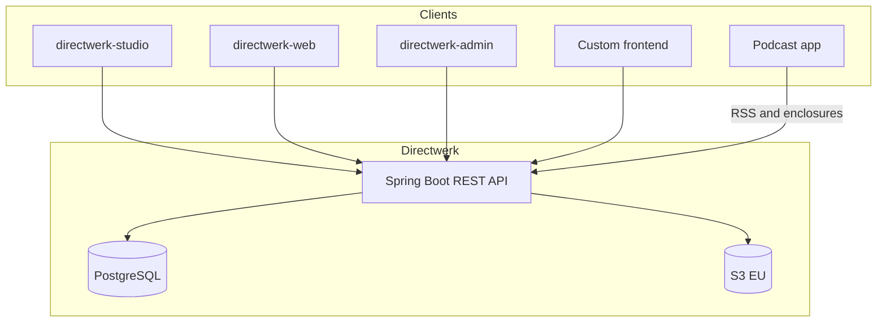

I like listening to the audio Let's Plays from Stay Forever and Down to the Detail. They ship as
single episodes -- fine for the first listen, awkward when you want to re-hear a whole season.
So after each season ends I cut supercuts (no per-episode intro/outro) and put them on a private feed.

<!-- truncate -->

That used to run on my own "Podcasthub" build. It worked, but multi-tenancy was missing and private
feeds were rudimentary. I wanted one place to host content, grant access, and emit feeds -- for more
than just me, with several projects side by side.

That product is [Directwerk](https://directwerk.org/). This post is an English expansion of the
[German write-up on M10Z](https://m10z.de/artikel/directwerk) (11 Sept 2026), with more of the
architecture that lives in the [public monorepo](https://github.com/LucaNerlich/directwerk).

## What Directwerk is

Directwerk is a multi-tenant platform for digital publishing. Creators can publish podcasts,
articles, newsletters, and bonus files -- public or private -- including per-subscriber RSS feeds.

Features are modular. Per tenant you enable what you need. Podcasts only? Fine. Paywall, newsletter,
and member management on top? Flip those modules on.

The pitch is simple: instead of spreading content, assets, feeds, subscriptions, and the website
across five to seven tools (often outside the EU), the whole chain sits in one platform -- from the
editorial desk to the podcatcher. Hosting and delivery go through bunny.net in the EU / a global CDN,
with a hard split between public and private files.

Primary audience: non-technical creators who work in the studio UI on their own domain. Agencies and
custom frontends use the same public REST API and OpenAPI contract -- no private shortcuts.

## The ten-minute migration

My own use case was the stress test. Moving from Podcasthub to Directwerk took -- honestly -- under
ten minutes:

1. Create a tenant
2. Create podcast series (Stay Forever and friends)
3. Import audio RSS feeds (server-to-server asset stream -- no re-upload of every file)
4. Register an end-user account and build private feeds in the feed builder
5. Drop the new RSS URLs into the podcatcher app

I ran the same path for Simon's Liedermacherleben podcast:
[liedermacherleben.directwerk.org](https://liedermacherleben.directwerk.org/).

That is the creator loop I want: import existing material, set rights, subscribe to feeds -- done.
No re-uploading every episode. No copy-pasting metadata by hand.

## How the platform is shaped

Three product apps plus marketing and docs:

| App | Role |
|-----|------|
| **Creator Studio** (`directwerk-studio`) | Editorial: articles, podcasts, media, newsletter, formats/tags, subscription products |
| **API** (Spring Boot) | Core: data, permissions, jobs -- one instance, many tenants |
| **Platform Admin** (`directwerk-admin`) | Ops: create tenants, unlock modules, invite admins, watch jobs |
| **Whitelabel web** (`directwerk-web`) | Public site + subscriber portal (optional per tenant) |

Onboarding: a platform admin creates a tenant (name/slug) and invites the first tenant admin by
email. The end-customer site defaults to `https://{slug}.directwerk.org` and can CNAME to a custom
domain once DNS verification succeeds.

Need a different look or product logic? Call the API and put your own frontend in front. Directwerk
owns data and business rules; design stays with the integrator.

### Studio desks

The studio splits into two desks on purpose:

- **Digital** -- written articles and newsletters
- **Podcast** -- audio episodes and series structure

Directwerk does not replace recording or editing. It hosts, manages, and distributes. Analytics can
point at a self-hosted Umami site ID (article views and podcast downloads).

> Stripe is wired in the backend (EU alternatives are thin on the ground) but still needs a full
> dry-run with a real customer onboarding path.

### Stack (current alpha)

| Layer | Choice |
|-------|--------|
| API | Java 21, Spring Boot 4.1, Gradle 9, Flyway, PostgreSQL |
| Storage | S3-compatible object storage (Hetzner / Bunny, EU), public vs private prefixes |
| Frontends | Next.js apps for studio, web, admin; shared UI package |
| Deploy | Docker via Coolify on Hetzner Cloud |
| Docs | Public VitePress site at [docs.directwerk.org](https://docs.directwerk.org/) |

## Multi-tenancy and modules

Isolation is shared-schema SaaS, not a database per customer:

- Verified `Host` header resolves the tenant; JWT `tenant_id` must match or the request dies with
  `TENANT_MISMATCH`
- Hibernate `tenantFilter` plus write guards keep rows from leaking across tenants
- S3 keys are always `{tenantSlug}/…` before any signed URL is issued

Capabilities are feature modules (`PODCAST`, `PODCAST_RSS`, `FEED_BUILDER`, `SUBSCRIPTION`,
`ARTICLES`, …) gated with `@RequiresModule`. A free-podcast tenant can stay lean; a Patreon-style
setup turns on subscriptions and private feeds without a fork of the deployment.

Roles climb from `SUBSCRIBER` → `EDITOR` → `TENANT_ADMIN` → `PLATFORM_ADMIN`. A user can belong to
several tenants; switching means logging in (or refreshing) under the target host.

## Feeds, paywall, entitlements

Each series gets automatic public and private RSS surfaces. Public feeds carry Level-0 / `FREE`
content. Private feeds need an account and a matching entitlement. Logged-in subscribers can also
compose custom feeds in the feed builder -- formats, series, categories -- which is exactly the Stay
Forever supercut case that started this.

Access is two gates:

1. Episode (or article) `accessPolicy`: `FREE` or `PAID`
2. For `PAID` only: the union of the user's active subscriptions

Products come in two shapes:

- **LEVEL** -- a tier ladder (`sortOrder`); unlock when the user's max active level clears the
  episode's required floor
- **PACKAGE** -- a named bundle; unlock when any `ProductAccessRule` matches series / format /
  category / all podcasts

Metadata for a paid episode can stay public; the audio enclosure and private RSS only appear when
entitled. That keeps discovery open without leaking the bytes.

Optional whitelabel site: public posts without login, private content after sign-in, podcasts with a
web audio player. My demo tenant:
[lucanerlich.directwerk.org](https://lucanerlich.directwerk.org/).

## What is still open

Backend-first, one-person hobby: the hard work went into multi-tenancy, private content, and a clean
API. Still rough around the edges:

- Frontend / marketing polish (some homepage copy still shows its AI first draft)
- End-to-end Stripe Connect with a real paying customer
- Migration helpers for Patreon / Steady beyond the designed sync modules

## Links

- Platform: [directwerk.org](https://directwerk.org/)
- Public docs: [docs.directwerk.org](https://docs.directwerk.org/)
- Source: [github.com/LucaNerlich/directwerk](https://github.com/LucaNerlich/directwerk)
- Demo tenant: [lucanerlich.directwerk.org](https://lucanerlich.directwerk.org/)
- Live podcast tenant: [liedermacherleben.directwerk.org](https://liedermacherleben.directwerk.org/)
- Original German article: [m10z.de/artikel/directwerk](https://m10z.de/artikel/directwerk)

Feedback and curiosity welcome -- especially if you publish podcasts or newsletters and are tired of
gluing six SaaS tools together.
