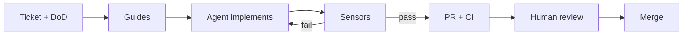

Coding agents write faster than most review queues can absorb. The useful response is not more
supervision of every token -- it is an **outer quality harness**: instructions that steer the agent
before it acts, and checks that let it self-correct before a human has to look.

<!-- truncate -->

This is a walkthrough of that harness along a normal delivery path -- ticket, alignment, implement,
local checks, pull request, CI, human review, merge. The long-form methodology lives in
[AI-Assisted Software Development](/ai/ai-assisted-development/). The mental model here follows
Birgitta Böckeler's [Harness engineering for coding agent users](https://martinfowler.com/articles/harness-engineering.html)
(April 2026): feedforward *guides* plus feedback *sensors*, each either computational or inferential.

## Two harnesses, one word

"Harness" already means two different things on this site, and mixing them up makes the rest of the
conversation mushy.

| Layer | What it is | Where it lives here |
|-------|------------|---------------------|
| **Inner / runtime** | The program around the model: agent loop, tools, sessions, TUI | [AI Agent Harnesses](/ai/agent-harnesses/) -- opencode, pi, herdr |
| **Outer / quality** | Repo-specific guides and sensors that raise the odds of a good change | This post -- plus [project memory](/ai/project-memory-and-rules/), [skills](/ai/skills/), tests, CI |

Agent = model + inner harness. Trust at merge time comes from the outer one. The inner harness
gives the model a shell and a file editor. The outer harness tells it how *this* repo is allowed
to change, and proves whether the change is still healthy.

[Harness engineering](/ai/evaluation-and-llmops/#harness-engineering) in the LLMOps sense is the
sibling idea for *product* LLM apps (datasets, judges, traces). Same word, different bounded
context. Here the system under test is the codebase the agent is editing.

## Guides and sensors

A quality harness does two jobs, and you need both:

- **Guides (feedforward)** -- anticipate failure and steer *before* the agent writes. `AGENTS.md`,
  Cursor rules, skills, a ticket with a real definition of done.
- **Sensors (feedback)** -- observe *after* the agent acts and feed a signal it can use to
  self-correct. Typecheck, tests, linters, `pnpm build`, an LLM reviewer with a cleared context.

Run only guides and the agent never finds out the rule did not stick. Run only sensors and it
repeats the same mistake until the loop burns tokens. Böckeler's useful extra split is *how* those
controls run:

| | Computational (CPU, deterministic) | Inferential (model, semantic) |
|---|---|---|
| **Guide** | Codemods, OpenRewrite, typed APIs, service templates | `AGENTS.md`, skills, review rituals |
| **Sensor** | Lint, tests, types, ArchUnit, broken-link build | LLM-as-judge review, "does this match the ticket?" |

Computational sensors are cheap enough to run on every edit. Inferential sensors are slower and
non-deterministic -- use them where structure cannot see meaning, and do not pretend they replace
a test suite.



Shift the cheap checks as far left as they still run in seconds. Keep the expensive ones for the
pipeline and for the human, who still owns intent.

## Ticket

The ticket is the first guide. If it is a vibe ("make search better"), the agent will invent
behaviour, then invent tests that agree with the invention. That is a green build of the wrong
product.

Write the ticket the way you would brief a capable new teammate:

- Problem and non-goals
- Definition of done (observable, not "looks good")
- Surfaces that must keep working (other routes, APIs, docs)
- Constraints the agent cannot see: security, performance, "we do not touch X"
- How to verify -- commands, not adjectives

This is the Requirements / Safeguards pair from [SPDD](/ai/ai-assisted-development/#spdd-and-the-reasons-canvas)
without forcing a seven-box canvas onto every chore. For a one-line typo fix, a sentence is enough.
For a behaviour change, the ticket *is* the spec. When reality diverges later, fix the ticket (or
the skill) first, then the code.

## Alignment, before generation

The [architect-as-orchestrator](/ai/ai-assisted-development/#architect-as-orchestrator) split still
holds: humans do the day shift (intent, design, boundaries), agents do the night shift inside a
sandbox. Two cheap rituals before any file edit:

1. **Grill the ticket.** Ask the agent to interview *you* about edge cases, existing modules, and
   what "done" looks like. Misunderstandings are cheaper in dialogue than in a 400-line diff.
2. **Load the standing guides.** [Project memory](/ai/project-memory-and-rules/) (`AGENTS.md`) for
   always-on facts; [skills](/ai/skills/) for multi-step rituals (review, release, "add a blog
   post"). Keep memory short. Long procedures belong in a skill so they do not rot in every
   session's context window.

This site is a small worked example. `AGENTS.md` tells every agent: pnpm not npm, Node 22, four-space
indent, `pnpm build` is the test, trailing slashes on links, edit `sidebar-order.ts` to reorder
docs. Security rules in `.cursor/rules/` stay always-on. That is feedforward you only write once.

If the change cannot be explained in a compact, high-signal brief, that is often a design smell --
the module is too shallow, the slice too wide, or the ticket is still a wish. See
[context engineering](/ai/context-engineering/) for why stuffing more files into context does not
fix that.

## Implementation

Let the agent work in a branch, with the repo's normal tools, not a parallel universe of "AI
commits." Vertical slices beat layer-by-layer generation: one path through UI, API, and data that
actually runs is worth more than three incomplete layers.

Give the agent the computational sensors as tools it is expected to run, not as a surprise at
review:

```bash
pnpm build          # this repo: broken links, anchors, and markdown images throw
vale docs/path.md   # prose, when the change is a doc or blog post
```

In an application repo the equivalent is `lint`, `typecheck`, and the fast test suite -- the same
commands a human would run. Put those commands in `AGENTS.md` so the agent does not guess `npm test`
in a pnpm house.

[Git hooks](/git/beginners-guide/hooks-and-automation/) are sensors that fire even when the agent
(or a tired human) skips the script: format and unit tests on pre-commit, the slower suite on
pre-push. Agents will retry a failing hook if the error message is written for them -- include the
fix hint in the linter output, not only "error on line 12."

## Pull request

Open the PR when local sensors are green, not as a request for the reviewer to become the test
runner. The PR description should restate the ticket's definition of done and the commands that
already passed. That is another guide: the next model (or human) should not have to reconstruct
intent from the diff alone.

Then run an **inferential sensor with a cleared context**. One model implements; a different model
(or a fresh session) reviews against the ticket, the standing rules, and the diff. Shared context
pollutes review -- the implementer already "knows" why the shortcut was fine. This is the
maker-checker split from [Human-in-the-Loop](/ai/human-in-the-loop/#maker-checker). The checker
can be a second agent, a ruleset, or a person. Agreement is not a merge button; disagreement is a
signal.

Keep computational checks in the PR too. GitHub Actions on this repo runs `pnpm install --frozen-lockfile`
and `pnpm build` on every pull request to `main`. That is the same sensor the agent already ran,
repeated where it cannot be skipped. Application repos add coverage thresholds, dependency audit,
and architecture tests here -- see [test coverage as a CI gate](/testing/beginners-guide/test-coverage/).

## Merge

Merge stays a human decision for anything that changes behaviour. The harness's job is to make that
decision small: style, types, broken links, and "the tests the agent wrote are green" should already
be settled. What is left is the residue sensors still miss:

- **Misdiagnosis** -- the agent fixed a symptom the ticket never named
- **Overengineering** -- extra modules, flags, and helpers nobody asked for
- **Wrong product** -- tests encode the implementation, not the intended behaviour
- **Organisational fit** -- the technically correct change is not what this team is doing this week

Böckeler is blunt about this: maintainability harnesses (lint, structure, duplication) are the easy
layer. Architecture fitness functions are doable when you already have module boundaries.
**Behaviour** -- does the system do what we meant? -- still needs a specification plus tests you
trust, plus a human who can tell those tests from a hall of mirrors. Approved fixtures help where
the domain has golden inputs. They are not a wholesale replacement for reading the diff.

Workflow-wise this is still [GitHub Flow](/git/beginners-guide/workflows/): short-lived branch,
review, merge to a deployable `main`. The harness does not need a new branching model. It needs
the existing model to refuse work that has not passed the left-shifted sensors.

## The steering loop

The harness is not a one-time config file. When the same failure shows up twice -- wrong package
manager, missed trailing slash, a security rule the agent walked around -- encode it:

1. Computational sensor if you can (build, lint, test, ArchUnit)
2. Guide if the check is semantic or procedural (skill, rule, ticket template)
3. Human checkpoint only if the action is irreversible or the signal is still too weak

Agents are good at drafting those controls. Use them to write the ArchUnit test or the skill, then
keep the control in git so the next session inherits it. That is how `AGENTS.md` on this site grew:
each repeated agent mistake became a sentence, then a check.

Two failure modes to watch as the harness grows:

- **Contradictory guides** -- a skill says "always add tests," a rule says "this folder has no test
  framework." The agent will pick one at random and spend your tokens.
- **Silent sensors** -- a check that never fires may mean high quality, or it may mean the check
  cannot see the bug. Treat a quiet sensor as something to probe, not as proof.

## A starter kit

You do not need a platform. You need a small, coherent set:

| Stage | Put this in place |
|-------|-------------------|
| Standing guides | `AGENTS.md` with install/build/test commands and hard boundaries |
| On-demand guides | One or two [skills](/ai/skills/) for review and "how we add a page" |
| Cheap sensors | Format, types, unit tests, or this site's `pnpm build` |
| Shared sensors | [Hooks](/git/beginners-guide/hooks-and-automation/) + CI repeating the cheap set |
| Semantic sensors | Fresh-context review agent against the ticket |
| Human | Merge authority, plus anything destructive or unspecified |

Not every codebase is equally harnessable. Typed languages, clear modules, and boring frameworks
give you sensors for free. A tangled legacy app is where you need the harness most and can build
it least -- start with the slice you are actually changing, not a fantasy of full architecture
fitness on day one.

## See also

- [AI-Assisted Software Development](/ai/ai-assisted-development/) -- SPDD, architect-as-orchestrator, evidence
- [AI Agent Harnesses](/ai/agent-harnesses/) -- the inner runtime (opencode, pi, herdr)
- [Project Memory & Rules](/ai/project-memory-and-rules/) -- `AGENTS.md`, Cursor rules, Copilot instructions
- [Agent Skills](/ai/skills/) -- on-demand workflows
- [Evaluation & LLMOps](/ai/evaluation-and-llmops/) -- eval harnesses for product LLM apps
- [Human-in-the-Loop](/ai/human-in-the-loop/) -- maker-checker and merge authority
- [Birgitta Böckeler, Harness engineering for coding agent users](https://martinfowler.com/articles/harness-engineering.html)
