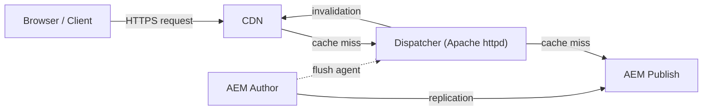
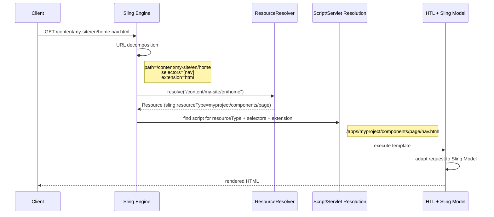
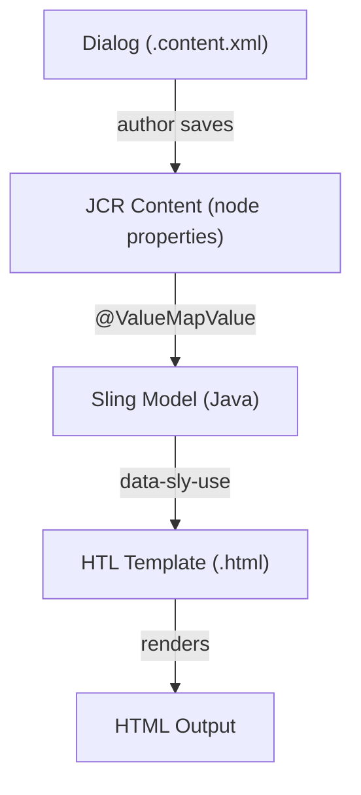

# AEM Architecture

Adobe Experience Manager is built on three open-source foundations:

- **Apache Sling** -- a REST-based web framework that maps URLs to content resources and resolves rendering scripts
- **Apache Jackrabbit Oak** -- the JCR (Java Content Repository) implementation that stores all content as a tree of nodes and properties
- **OSGi (Apache Felix)** -- a modular runtime where every piece of functionality is deployed as a bundle with explicit dependencies

The core philosophy is **everything is content**. Pages, components, templates, configurations, code-resolved scripts --
they all live as nodes in the JCR. This single content tree drives URL resolution, rendering, and access control.

## High-Level Architecture

A typical AEM deployment consists of three tiers:



| Tier | Role |
|------|------|
| **Author** | Content authoring, workflows, approvals, previews. Runs the Touch UI editor. Typically not internet-facing |
| **Publish** | Serves content to end users. Receives replicated content from Author. Can be scaled horizontally |
| **Dispatcher** | Apache httpd module (or CDN edge) that caches rendered pages. Invalidated via flush agents when content is published |

### Content flow

1. An author creates or edits content on the **Author** instance.
2. When the content is approved, the author **activates** (replicates) it.
3. The replication agent serialises the content and pushes it to one or more **Publish** instances.
4. A flush agent invalidates the **Dispatcher** cache for the affected paths.
5. The next request from a browser triggers a cache miss, Dispatcher fetches the fresh page from Publish, caches it, and serves it.

## The Sling Request Processing Pipeline

This is the heart of AEM. Every HTTP request -- whether it renders a page, returns JSON, or serves an asset -- follows
the same pipeline.



### Step 1: URL decomposition

Sling breaks every URL into structured parts:

```text
/content/my-site/en/home.nav.html/suffix?param=value
|__________________________|  |    |      |       |
         resource path     selectors ext  suffix  query
```

| Part | Example | Purpose |
|------|---------|---------|
| Resource path | `/content/my-site/en/home` | Identifies the JCR node (content resource) |
| Selector(s) | `nav` | Chooses a rendering variant (e.g. `nav.html` instead of default `page.html`) |
| Extension | `html` | Determines the output format (`html`, `json`, `xml`) |
| Suffix | `/suffix` | Additional path info passed to the script |
| Query string | `param=value` | Standard HTTP parameters |

### Step 2: Resource resolution

The `ResourceResolver` maps the URL path to a JCR node. Resolution respects several mapping layers:

1. **`/etc/map` mappings** -- rewrite rules stored in the repository (e.g. strip `/content/my-site` from external URLs)
2. **`sling:alias`** -- a property on a node that provides an alternative URL segment (e.g. `sling:alias=home` on a node named `home-page`)
3. **Vanity URLs** -- a `sling:vanityPath` property that creates a shortcut (e.g. `/promo` maps to `/content/my-site/en/campaigns/summer`)
4. **Direct path** -- if no mapping matches, the path is resolved directly against the JCR tree

The result is a `Resource` object that wraps the JCR node and exposes its properties.

:::tip
Use `/etc/map` for environment-specific URL shortening (e.g. stripping `/content/my-site/en` on publish) rather than
hardcoding shortened URLs in your code. This keeps author and publish configurations independent.
:::

### Step 3: Script and servlet resolution

Once the resource is found, Sling reads its `sling:resourceType` property to locate the rendering script or servlet.
The resolution follows a well-defined search order:

```text
Resource: sling:resourceType = "myproject/components/page"
Selectors: [nav]
Extension: html

Search order (first match wins):
1. /apps/myproject/components/page/nav.html
2. /apps/myproject/components/page/nav/nav.html (selector-named folder)
3. /apps/myproject/components/page/page.html    (fallback to component name)
4. /libs/myproject/components/page/nav.html      (/libs as fallback)
5. sling:resourceSuperType chain (parent component scripts)
```

Key rules:
- `/apps` is always searched before `/libs` -- this is how overlays and customisations work
- Selectors narrow the script selection: `nav.html` is preferred over `page.html` when the `.nav` selector is present
- The `sling:resourceSuperType` chain enables component inheritance -- if no script is found on the current resource type, Sling walks up the super-type chain

### Step 4: Rendering

The located HTL template is executed:

1. `data-sly-use` statements instantiate Sling Models (or other Use-objects)
2. Sling Models are adapted from the request or resource, injecting properties via annotations
3. The HTL expression language renders the model data into HTML
4. `data-sly-resource` includes trigger nested resource resolution for child components
5. The final HTML response is returned to the client

## Content Model (JCR Repository)

All content in AEM is stored as a tree of **nodes** and **properties** in the JCR.

### Common node types

| Node type | Used for |
|-----------|----------|
| `cq:Page` | Content pages -- has a mandatory `jcr:content` child |
| `nt:unstructured` | Generic node type for component data, dialog values, configurations |
| `dam:Asset` | DAM assets (images, PDFs, videos) |
| `cq:Component` | Component definitions (under `/apps`) |
| `cq:Template` | Static templates (legacy) |
| `rep:User` / `rep:Group` | Users and groups |

### Page anatomy

Every `cq:Page` node has the same structure:

```text
/content/my-site/en/home              (cq:Page)
  └── jcr:content                     (cq:PageContent / nt:unstructured)
        ├── jcr:title = "Home"
        ├── cq:template = "/conf/my-site/settings/wcm/templates/page"
        ├── sling:resourceType = "myproject/components/page"
        └── root                      (nt:unstructured -- responsivegrid)
              └── container           (nt:unstructured)
                    ├── text          (nt:unstructured, sling:resourceType=myproject/components/text)
                    │     └── text = "<p>Hello World</p>"
                    └── image         (nt:unstructured, sling:resourceType=myproject/components/image)
                          └── fileReference = "/content/dam/my-site/hero.jpg"
```

- The `cq:Page` node itself holds very little data -- just the page structure
- All authored content lives on the `jcr:content` child and its descendants
- Each component instance is a child node under the layout container, with its own `sling:resourceType` and authored properties

### Property value types

| JCR Type | Java Type | Example |
|----------|-----------|---------|
| `String` | `String` | `jcr:title = "My Page"` |
| `Long` | `Long` | `maxItems = 5` |
| `Double` | `Double` | `price = 19.99` |
| `Boolean` | `Boolean` | `hideInNav = true` |
| `Date` | `Calendar` | `cq:lastModified = 2025-03-15T14:30:00.000Z` |
| `Binary` | `InputStream` | File content (renditions, binaries) |
| Multi-value | `String[]`, `Long[]` | `cq:tags = ["topic:news", "topic:tech"]` |

### Content hierarchy as URL structure

The JCR tree directly maps to URLs:

```text
/content/my-site/en/about/team  →  https://www.my-site.com/en/about/team.html
```

This means content architecture decisions (site structure, language copies, page hierarchy) directly impact your URL
scheme. Plan your content tree carefully -- restructuring later requires redirects and can break SEO.

## Component Architecture

AEM components follow an MVC-like pattern where the roles are split across four artifacts:



| Artifact | Role | Location |
|----------|------|----------|
| **Dialog** | Defines the authoring UI (form fields, tabs, validation) | `_cq_dialog/.content.xml` |
| **JCR content** | Stores the authored data as node properties | `/content/.../jcr:content/component-node` |
| **Sling Model** | Business logic, data transformation, service calls | `core/src/main/java/.../MyModel.java` |
| **HTL template** | Presentation -- renders the model data into HTML | `components/mycomponent/mycomponent.html` |

### A minimal component example

**Dialog** (defines what the author can configure):

```xml title="components/greeting/_cq_dialog/.content.xml (simplified)"
<textfield
    jcr:primaryType="nt:unstructured"
    sling:resourceType="granite/ui/components/coral/foundation/form/textfield"
    fieldLabel="Greeting Text"
    name="./greetingText"/>
```

**Sling Model** (reads the data, applies logic):

```java title="core/src/main/java/com/example/core/models/GreetingModel.java"
@Model(adaptables = SlingHttpServletRequest.class,
       adapters = GreetingModel.class,
       resourceType = "myproject/components/greeting",
       defaultInjectionStrategy = DefaultInjectionStrategy.OPTIONAL)
public class GreetingModel {

    @ValueMapValue
    private String greetingText;

    public String getGreetingText() {
        return StringUtils.defaultIfBlank(greetingText, "Hello, World!");
    }

    public boolean isEmpty() {
        return StringUtils.isBlank(greetingText);
    }
}
```

**HTL template** (renders the output):

```html title="components/greeting/greeting.html"
<sly data-sly-use.model="com.example.core.models.GreetingModel"/>

<div data-sly-test="${!model.empty}" class="greeting">
    <p>${model.greetingText}</p>
</div>

<div data-sly-test="${model.empty && wcmmode.edit}" class="cq-placeholder">
    Click to configure greeting
</div>
```

### When to use which Use-object

| Approach | When to use | Trade-offs |
|----------|-------------|------------|
| **Sling Model** | Default choice for all components | Testable, fast, full AEM/Sling API access |
| **WCMUsePojo** | Legacy -- avoid in new code | Slower, harder to test, no DI |
| **JS Use-API** | Quick prototyping only | Server-side Rhino (ES5), slowest, no unit tests |

:::tip
Always prefer Sling Models. They are the recommended approach by Adobe and the community. See the
[Sling Models page](./backend/sling-models.mdx) for detailed annotation reference and patterns.
:::

## Data Input

Content enters AEM through several channels:

### Author UI (primary)

- **Page Editor** -- drag-and-drop components, inline editing, Touch UI dialogs
- **Content Fragment Editor** -- structured content authoring with predefined models
- **Experience Fragment Editor** -- reusable experience building blocks (header, footer, promo)
- **DAM** -- asset upload, metadata editing, processing profiles, Smart Tags

### Programmatic input

- **`SlingPostServlet`** -- AEM's built-in POST handler. A simple form POST to a resource path creates or updates properties:

```bash
# Create or update a property on a node
curl -u admin:admin -d "title=Updated Title" \
  http://localhost:4502/content/my-site/en/home/jcr:content
```

- **Assets HTTP API** -- REST API for CRUD operations on DAM assets
- **Content Fragment API** -- create, update, and manage Content Fragments programmatically
- **Package Manager** -- import `.zip` content packages (useful for migrations)
- **Groovy Console** -- run scripts for bulk content operations (see [Groovy Console](./groovy-console.mdx))

:::warning
The `SlingPostServlet` is powerful but dangerous if exposed on Publish. Ensure it is
[restricted via OSGi configuration](https://experienceleague.adobe.com/en/docs/experience-manager-65/content/security/security-checklist)
and blocked by the Dispatcher on all public-facing instances.
:::

## Data Retrieval

### Sling Resource API (recommended)

The highest-level API. Works with `Resource` objects and `ValueMap` for type-safe property access.

```java
// Get a resource
Resource pageContent = resourceResolver.getResource("/content/my-site/en/home/jcr:content");

// Read properties via ValueMap
ValueMap props = pageContent.getValueMap();
String title = props.get("jcr:title", "Untitled");
String[] tags = props.get("cq:tags", String[].class);

// Navigate children
Resource root = pageContent.getChild("root");
if (root != null) {
    for (Resource child : root.getChildren()) {
        String resourceType = child.getValueMap().get("sling:resourceType", "");
        // process each component...
    }
}

// Adapt to higher-level APIs
Page page = pageContent.getParent().adaptTo(Page.class);
Asset asset = damResource.adaptTo(Asset.class);
```

### JCR API (lower level)

Direct JCR node and property access. Use when you need transactions, observation, or node-type-specific operations.

```java
Session session = resourceResolver.adaptTo(Session.class);
Node node = session.getNode("/content/my-site/en/home/jcr:content");
String title = node.getProperty("jcr:title").getString();

// Modify
node.setProperty("jcr:title", "New Title");
session.save();
```

### QueryBuilder API

AEM's predicate-based query API. Returns `Resource`-based results and supports pagination.

```java
Map<String, String> params = new HashMap<>();
params.put("path", "/content/my-site");
params.put("type", "cq:Page");
params.put("property", "jcr:content/cq:template");
params.put("property.value", "/conf/my-site/settings/wcm/templates/article");
params.put("orderby", "@jcr:content/cq:lastModified");
params.put("orderby.sort", "desc");
params.put("p.limit", "10");
params.put("p.offset", "0");

Query query = queryBuilder.createQuery(PredicateGroup.create(params), session);
SearchResult result = query.getResult();

for (Hit hit : result.getHits()) {
    Resource resource = hit.getResource();
    // process...
}
```

Common predicates:

| Predicate | Example | Purpose |
|-----------|---------|---------|
| `path` | `/content/my-site` | Restrict search to a subtree |
| `type` | `cq:Page` | Filter by node type |
| `property` | `jcr:content/cq:tags` | Match a property value |
| `fulltext` | `"search term"` | Full-text search |
| `daterange` | `daterange.property=cq:lastModified` | Filter by date range |
| `orderby` | `@jcr:content/jcr:title` | Sort results |
| `p.limit` / `p.offset` | `10` / `0` | Pagination |

### JCR-SQL2

SQL-like query language for complex queries, especially joins. Prefer QueryBuilder for simple lookups and
SQL2 for advanced scenarios.

```sql
SELECT page.[jcr:path], content.[jcr:title]
FROM [cq:Page] AS page
INNER JOIN [nt:unstructured] AS content ON ISCHILDNODE(content, page)
WHERE ISDESCENDANTNODE(page, '/content/my-site')
  AND content.[cq:template] = '/conf/my-site/settings/wcm/templates/article'
  AND content.[jcr:title] IS NOT NULL
ORDER BY content.[cq:lastModified] DESC
```

:::warning
Every query must be backed by an Oak index. Queries that trigger an index traversal are extremely slow and
will log `WARN` messages like `Traversed 10000 nodes`. Check the query plan with `EXPLAIN` and create
[custom Oak indexes](https://experienceleague.adobe.com/en/docs/experience-manager-65/content/implementing/deploying/practices/best-practices-for-queries-and-indexing)
where needed.
:::

### GraphQL (headless)

AEM's Content Fragment GraphQL API enables headless delivery:

```graphql
{
  articleList(
    filter: { _path: { _expressions: [{ value: "/content/dam/my-site/articles", _operator: STARTS_WITH }] } }
    _sort: [{ publishDate: DESC }]
  ) {
    items {
      _path
      title
      summary
      publishDate
      author {
        name
      }
    }
  }
}
```

Use **persisted queries** for production to enable CDN caching and avoid exposing arbitrary queries.

### Sling Model Exporter

Export component data as JSON without writing a custom servlet:

```java
@Model(adaptables = SlingHttpServletRequest.class,
       adapters = {ArticleModel.class, ComponentExporter.class},
       resourceType = "myproject/components/article",
       defaultInjectionStrategy = DefaultInjectionStrategy.OPTIONAL)
@Exporter(name = "jackson", extensions = "json")
public class ArticleModel implements ComponentExporter {

    @ValueMapValue
    private String title;

    @ValueMapValue
    private String summary;

    public String getTitle() { return title; }
    public String getSummary() { return summary; }

    @Override
    public String getExportedType() {
        return "myproject/components/article";
    }
}
```

Now requesting `/content/my-site/en/home.model.json` returns the page's component data as JSON.

## OSGi Services and Dependency Injection

Business logic that is shared across components, servlets, or workflows should live in OSGi services.

### Service basics

```java
import org.osgi.service.component.annotations.Component;
import org.osgi.service.component.annotations.Reference;

// Define a service interface
public interface PricingService {
    String formatPrice(double amount, String locale);
}

// Implement it as an OSGi component
@Component(service = PricingService.class)
public class PricingServiceImpl implements PricingService {

    @Reference
    private ExchangeRateService exchangeRateService;

    @Override
    public String formatPrice(double amount, String locale) {
        // business logic...
        return formatted;
    }
}
```

Inject into a Sling Model:

```java
@Model(adaptables = SlingHttpServletRequest.class)
public class ProductModel {

    @OSGiService
    private PricingService pricingService;

    @ValueMapValue
    private double price;

    public String getFormattedPrice() {
        return pricingService.formatPrice(price, "en_US");
    }
}
```

### OSGi configuration and run modes

Configuration files live in `ui.config` and are scoped by **run mode**:

```text
ui.config/src/main/content/jcr_root/apps/myproject/osgiconfig/
  ├── config/                          <-- all environments
  ├── config.author/                   <-- author only
  ├── config.publish/                  <-- publish only
  ├── config.author.dev/               <-- author + dev run mode
  └── config.publish.prod/             <-- publish + prod run mode
```

```json title="config.author/com.example.core.services.PricingServiceImpl.cfg.json"
{
  "defaultCurrency": "EUR",
  "cacheTtlSeconds": 3600
}
```

### Service users (avoid admin sessions)

Never use `loginAdministrative()`. Define a **service user** with minimal permissions:

```json title="org.apache.sling.serviceusermapping.impl.ServiceUserMapperImpl.amended-myproject.cfg.json"
{
  "user.mapping": [
    "myproject.core:data-reader=[myproject-data-reader]"
  ]
}
```

```java
@Reference
private ResourceResolverFactory resolverFactory;

public void readContent() {
    Map<String, Object> params = Map.of(
        ResourceResolverFactory.SUBSERVICE, "data-reader"
    );
    try (ResourceResolver resolver = resolverFactory.getServiceResourceResolver(params)) {
        Resource resource = resolver.getResource("/content/my-site/data");
        // read...
    } catch (LoginException e) {
        log.error("Failed to obtain service resolver", e);
    }
}
```

:::tip
Always use try-with-resources for service resource resolvers. A leaked resolver means a leaked JCR session,
which eventually exhausts the session pool and brings down the instance.
:::

## Caching and Delivery

### Dispatcher caching

The Dispatcher caches rendered HTML pages as static files on the Apache httpd filesystem. Key configuration areas:

| Concept | Description |
|---------|-------------|
| **Cache rules** | Define which URL patterns are cached (`/content/**/*.html`) and which are never cached (`/bin/*`, `/etc/*`) |
| **`.stat` file invalidation** | When content is activated, the Dispatcher receives a flush request and touches a `.stat` file. Cached files older than the `.stat` file are re-fetched on next request |
| **TTL / grace period** | Time-based expiry as a supplement to invalidation-based caching |
| **Headers** | `Dispatcher` sets `X-Dispatcher` and respects `Cache-Control` / `max-age` headers |

### Sling Dynamic Include (SDI)

For pages with a mix of static and dynamic content (e.g. personalised header on an otherwise static page),
SDI replaces component output with an SSI (Server Side Include) or ESI tag at the Dispatcher level:

```text
Static page (cached by Dispatcher)
  ├── Header: <ssi:include src="/content/.../header.nocache.html"/>  (not cached)
  ├── Hero: static (cached)
  └── Footer: static (cached)
```

This lets you cache 90% of the page while keeping dynamic fragments fresh.

### CDN integration

For AEM as a Cloud Service, Adobe provides a built-in CDN (Fastly). For AMS or on-premise, place a CDN
(CloudFront, Akamai, Fastly) in front of the Dispatcher and configure:
- **Cache-Control headers** from AEM/Dispatcher
- **Cache invalidation API** triggered by replication events
- **Origin shielding** to reduce load on Publish

## Common Pitfalls

A practical reference of issues that regularly trip up AEM developers:

### Dialog and authoring

- **Missing `./` prefix in field names** -- properties won't be persisted to the JCR. Always use `name="./myProperty"`
- **Mixing Coral 2 and Coral 3** -- components from `/components/foundation` (Coral 2) and `/components/coral/foundation` (Coral 3) can cause visual and functional inconsistencies
- **Not handling `null` in Sling Models** -- always use `defaultInjectionStrategy = OPTIONAL` or null-safe getters. Missing dialog fields return `null`, not empty strings

### Resource resolvers and sessions

- **Using a request-scoped resolver in async threads** -- the resolver is closed when the request ends, so background threads will get `IllegalStateException`. Open a dedicated service resolver for async work
- **Not closing manually opened resolvers** -- always use try-with-resources. A leaked resolver means a leaked JCR session

```java
// WRONG -- resolver leaks if an exception occurs
ResourceResolver resolver = resolverFactory.getServiceResourceResolver(params);
Resource r = resolver.getResource("/content/data");
resolver.close();

// CORRECT -- guaranteed cleanup
try (ResourceResolver resolver = resolverFactory.getServiceResourceResolver(params)) {
    Resource r = resolver.getResource("/content/data");
}
```

### Queries and performance

- **Queries without Oak indexes** -- triggers traversal (full scan). Always check with `EXPLAIN SELECT ...` and create indexes for production queries
- **Using deprecated `xpath` queries** -- use JCR-SQL2 or QueryBuilder instead
- **`p.limit=-1` in QueryBuilder** -- returns all results without pagination. Fine for small datasets, dangerous for large ones. Always paginate in production code

### Content and URLs

- **Hardcoding `/content/dam/...` paths** -- use authored references (pathfield dialogs) instead. Hardcoded paths break when content is moved
- **Relying on JCR node ordering** -- not all Oak persistence stores guarantee child node order. Use explicit sort properties if order matters
- **Ignoring `/etc/map` on publish** -- URLs that work on author (with `/content/my-site/en/...`) will 404 on publish if URL mappings are not configured

### Dispatcher and caching

- **"Works on author, broken on publish"** -- the Dispatcher strips query parameters, blocks certain paths, and caches aggressively. Always test with Dispatcher enabled during development
- **Not invalidating on publish** -- ensure flush agents are correctly configured for every Publish instance
- **Caching personalised content** -- if the page varies by user, either use SDI for the dynamic fragments or set `Dispatcher: no-cache` headers on that path

## See also

- [Sling Models](./backend/sling-models.mdx)
- [HTL Templates](./htl-templates.mdx)
- [Servlets](./backend/servlets.mdx)
- [Modify and Query the JCR](./content/jcr.md)
- [Component Dialogs](./component-dialogs.mdx)
- [OSGi Configuration](./backend/osgi-configuration.mdx)
- [Dispatcher Configuration](./infrastructure/dispatcher-configuration.mdx)
- [Performance](./infrastructure/performance.mdx)
- [Groovy Console](./groovy-console.mdx)
- [Apache Sling Documentation](https://sling.apache.org/documentation.html)
- [Apache Jackrabbit Oak Documentation](https://jackrabbit.apache.org/oak/docs/)
- [AEM Developer Resources](https://experienceleague.adobe.com/en/docs/experience-manager-65/content/implementing/developing/introduction/the-basics)
