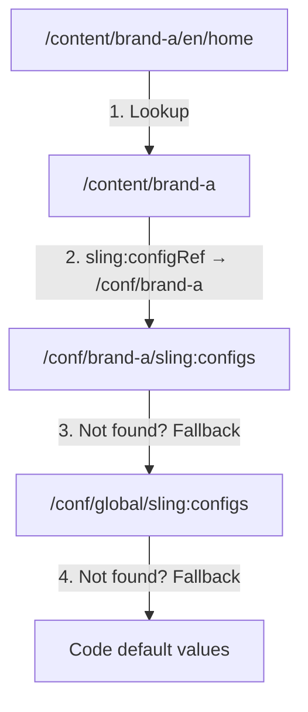

# Context-Aware Configuration (Sling CA Config)

**Sling Context-Aware Configuration** (CA Config) lets you store configuration values
in the content tree so they resolve differently depending on the content context. Unlike
OSGi configurations (which are global or per-run-mode), CA Config values are
**site-specific, tenant-specific, or even page-specific** -- without any code branching.

Use cases:
- Different analytics tracking IDs per site
- API keys that vary between tenants
- Feature flags scoped to a specific brand
- Social media URLs per regional site



---

## How It Works

### The lookup chain

When code requests a CA Config value for a given resource, Sling walks up the content
tree looking for a `sling:configRef` property. This property points to a `/conf/...`
path where the configuration is stored.

1. Start at the resource (e.g., `/content/brand-a/en/products/shoe`)
2. Walk up: `/content/brand-a/en/products` → `/content/brand-a/en` → `/content/brand-a`
3. Find `sling:configRef = /conf/brand-a` on `/content/brand-a`
4. Look for the configuration under `/conf/brand-a/sling:configs/`
5. If not found, check `/conf/global/sling:configs/` (if configured)
6. If still not found, use the default values from the annotation

### JCR structure

```
/conf/
├── brand-a/
│   └── sling:configs/
│       └── com.myproject.core.config.SiteConfig/
│           ├── analyticsId = "UA-12345-A"
│           ├── socialFacebookUrl = "https://facebook.com/brand-a"
│           └── enableNewHeader = true
├── brand-b/
│   └── sling:configs/
│       └── com.myproject.core.config.SiteConfig/
│           ├── analyticsId = "UA-12345-B"
│           └── enableNewHeader = false
└── global/
    └── sling:configs/
        └── com.myproject.core.config.SiteConfig/
            ├── analyticsId = "UA-00000"
            ├── socialFacebookUrl = ""
            └── enableNewHeader = false

/content/
├── brand-a/
│   ├── sling:configRef = "/conf/brand-a"     ← links to /conf/brand-a
│   └── en/
│       └── home/
├── brand-b/
│   ├── sling:configRef = "/conf/brand-b"
│   └── en/
```

---

## Defining a Configuration Class

Use Sling CA Config annotations to define a typed configuration:

```java title="core/.../config/SiteConfig.java"
package com.myproject.core.config;

import org.apache.sling.caconfig.annotation.Configuration;
import org.apache.sling.caconfig.annotation.Property;

@Configuration(
    label = "Site Configuration",
    description = "Site-specific settings like analytics, social, and feature flags"
)
public @interface SiteConfig {

    @Property(label = "Analytics Tracking ID",
              description = "Google Analytics or Adobe Analytics tracking ID")
    String analyticsId() default "";

    @Property(label = "Facebook URL")
    String socialFacebookUrl() default "";

    @Property(label = "Twitter URL")
    String socialTwitterUrl() default "";

    @Property(label = "Enable new header",
              description = "Feature flag for the redesigned header")
    boolean enableNewHeader() default false;

    @Property(label = "Max items per page")
    int maxItemsPerPage() default 10;
}
```

### Supported property types

| Type | Example | Notes |
|------|---------|-------|
| `String` | `"UA-12345"` | Default: `""` |
| `boolean` | `true` / `false` | Default: `false` |
| `int` | `10` | Default: `0` |
| `long` | `1000L` | Default: `0L` |
| `double` | `3.14` | Default: `0.0` |
| `String[]` | `{"a", "b"}` | Arrays of any primitive type |

---

## Reading CA Config in Sling Models

### Using ConfigurationResolver

```java
import org.apache.sling.caconfig.ConfigurationResolver;
import org.apache.sling.api.resource.Resource;
import org.apache.sling.models.annotations.Model;
import org.apache.sling.models.annotations.injectorspecific.OSGiService;
import org.apache.sling.models.annotations.injectorspecific.Self;

import com.myproject.core.config.SiteConfig;

@Model(adaptables = Resource.class)
public class HeaderModel {

    @Self
    private Resource resource;

    @OSGiService
    private ConfigurationResolver configResolver;

    public boolean isNewHeaderEnabled() {
        SiteConfig config = configResolver.get(resource).as(SiteConfig.class);
        return config.enableNewHeader();
    }

    public String getAnalyticsId() {
        SiteConfig config = configResolver.get(resource).as(SiteConfig.class);
        return config.analyticsId();
    }
}
```

### Using the CA Config injector (shorter)

With the `@ContextAwareConfiguration` injector (provided by wcm.io or a custom injector):

```java
import io.wcm.caconfig.extensions.contextpath.impl.AbsoluteParentContextPathStrategy;

// If using wcm.io CA Config extensions
@Model(adaptables = Resource.class)
public class HeaderModel {

    // Direct injection -- resolves from the resource's context
    private SiteConfig siteConfig;

    @PostConstruct
    protected void init() {
        ConfigurationResolver resolver = resource.adaptTo(ConfigurationResolver.class);
        // ...
    }
}
```

### Accessing from HTL

Expose the config values through your Sling Model and use them in HTL:

```html
<sly data-sly-use.header="com.myproject.core.models.HeaderModel"/>

<div data-sly-test="${header.newHeaderEnabled}" class="header-v2">
    <!-- New header markup -->
</div>
<div data-sly-test="${!header.newHeaderEnabled}" class="header-v1">
    <!-- Legacy header markup -->
</div>

<!-- Analytics snippet -->
<script data-sly-test="${header.analyticsId}">
    gtag('config', '${header.analyticsId}');
</script>
```

---

## Nested Configurations

CA Config supports **nested configurations** for complex structures:

```java
@Configuration(label = "Navigation Config")
public @interface NavigationConfig {

    @Property(label = "Max depth")
    int maxDepth() default 3;

    @Property(label = "Navigation items")
    NavigationItem[] items() default {};
}

@Configuration(label = "Navigation Item")
public @interface NavigationItem {

    @Property(label = "Label")
    String label() default "";

    @Property(label = "Path")
    String path() default "";

    @Property(label = "Open in new window")
    boolean newWindow() default false;
}
```

JCR structure for nested configs:

```
/conf/brand-a/sling:configs/
└── com.myproject.core.config.NavigationConfig/
    ├── maxDepth = 3
    └── items/
        ├── item0/
        │   ├── label = "Products"
        │   ├── path = "/content/brand-a/en/products"
        │   └── newWindow = false
        └── item1/
            ├── label = "Support"
            ├── path = "https://support.brand-a.com"
            └── newWindow = true
```

---

## Configuration Collections

For lists of configuration items where each item has the same structure, use
**configuration collections**:

```java
@Model(adaptables = Resource.class)
public class SocialLinksModel {

    @Self
    private Resource resource;

    @OSGiService
    private ConfigurationResolver configResolver;

    public Collection<SocialLink> getSocialLinks() {
        return configResolver.get(resource)
            .asCollection(SocialLink.class);
    }
}

@Configuration(label = "Social Link", collection = true)
public @interface SocialLink {

    @Property(label = "Platform")
    String platform() default "";

    @Property(label = "URL")
    String url() default "";

    @Property(label = "Icon")
    String icon() default "";
}
```

---

## OSGi Config vs CA Config

| Aspect | OSGi Configuration | CA Config |
|--------|-------------------|-----------|
| **Scope** | Global or per-run-mode | Per-site, per-tenant, per-page |
| **Storage** | `/apps/*/osgiconfig/` (code) | `/conf/*/sling:configs/` (content) |
| **Managed by** | Developers (code deployment) | Authors or admins (content authoring) |
| **Typical use** | Service endpoints, feature toggles, system settings | Site-specific branding, analytics IDs, feature flags |
| **Lookup** | Direct PID lookup | Context-aware tree walk |
| **AEMaaCS** | Deployed via Cloud Manager | Stored in content, replicated |

**Rule of thumb:** If the value is the same across all sites, use OSGi. If it varies per
site or tenant, use CA Config.

---

## wcm.io Context-Aware Configuration Extensions

Most enterprise AEM projects use the [wcm.io CA Config extensions](https://wcm.io/caconfig/),
which add:

- **Context path strategies** -- more flexible lookup (absolute parent level, root template)
- **Persistence strategies** -- storing configs in `/conf` with AEM-compatible structure
- **Editor UI** -- a page-level configuration editor for authors
- **Override support** -- system-wide overrides via OSGi

### Installation

Add the wcm.io CA Config dependencies to your project:

```xml title="pom.xml (core module)"
<dependency>
    <groupId>io.wcm</groupId>
    <artifactId>io.wcm.caconfig.extensions</artifactId>
    <scope>provided</scope>
</dependency>
<dependency>
    <groupId>io.wcm</groupId>
    <artifactId>io.wcm.caconfig.editor</artifactId>
    <scope>provided</scope>
</dependency>
```

### Context path strategy

Configure how CA Config finds the "site root" for a given resource:

```json title="ui.config/.../config/io.wcm.caconfig.extensions.contextpath.impl.AbsoluteParentContextPathStrategy~site.cfg.json"
{
    "levels": [3],
    "contextPathRegex": "^/content/[^/]+/[^/]+$",
    "configPathPatterns": ["/conf/$1"],
    "templatePaths": ["/conf/myproject/settings/wcm/templates/.*"]
}
```

This tells CA Config: "The site root is always at depth 3 (e.g., `/content/brand/language`),
and its config lives under `/conf/brand/`."

---

## Practical Examples

### Analytics tracking per site

```java
@Configuration(label = "Analytics Configuration")
public @interface AnalyticsConfig {

    @Property(label = "Adobe Analytics Report Suite ID")
    String reportSuiteId() default "";

    @Property(label = "Google Tag Manager Container ID")
    String gtmContainerId() default "";

    @Property(label = "Enable tracking")
    boolean enabled() default true;
}
```

### Feature flags per tenant

```java
@Configuration(label = "Feature Flags")
public @interface FeatureFlags {

    @Property(label = "Enable dark mode")
    boolean darkMode() default false;

    @Property(label = "Enable chat widget")
    boolean chatWidget() default false;

    @Property(label = "Enable A/B testing")
    boolean abTesting() default false;

    @Property(label = "Max search results")
    int maxSearchResults() default 20;
}
```

### API keys per environment and site

```java
@Configuration(label = "Integration Settings")
public @interface IntegrationConfig {

    @Property(label = "Maps API Key")
    String mapsApiKey() default "";

    @Property(label = "Search API endpoint")
    String searchEndpoint() default "";

    @Property(label = "Recommendation engine URL")
    String recommendationUrl() default "";
}
```

---

## Best Practices

### Use meaningful configuration class names

The fully qualified class name becomes the JCR node name under `sling:configs`. Keep
packages short and names descriptive.

### Provide sensible defaults

Always set default values in the annotation. Code should work without any configuration
being authored.

### Keep configurations flat

Avoid deeply nested configurations. Flat structures are easier for authors to manage and
for developers to read.

### Version-control initial configurations

Include default `/conf` content in your `ui.content` package so environments start with
reasonable defaults.

### Use CA Config for author-manageable values only

Don't put developer-only settings (thread pool sizes, cache TTLs) in CA Config. Those
belong in OSGi configurations.

---

## Common Pitfalls

| Pitfall | Solution |
|---------|----------|
| Config values are always defaults | Check that `sling:configRef` is set on the site root node |
| `ConfigurationResolver` returns null | Ensure the CA Config bundles are installed and active; check OSGi console |
| Config works on author but not publish | Replicate the `/conf/` content to publish instances |
| Nested config items are empty | Verify the JCR structure matches the annotation hierarchy (child nodes under `items/`) |
| wcm.io editor not showing | Check that the context path strategy is configured correctly for your site structure |
| Wrong site config resolved | Verify the `sling:configRef` points to the correct `/conf/` path; check for overlapping context path strategies |
| Config changes not picked up | CA Config caching may delay updates; clear the Sling CA Config cache |

## See also

- [OSGi Configuration](./osgi-configuration.mdx) -- global/run-mode configuration
- [Sling Models and Services](./sling-models.mdx) -- injecting CA Config into models
- [Multi-Tenancy UI Frontend](../ui/multi-tenancy-support-ui-frontend.mdx) -- multi-tenant patterns
- [Architecture](../architecture.mdx) -- how configuration fits into AEM's layers
- [Templates and Policies](../components/templates-policies.md) -- template-level configuration
