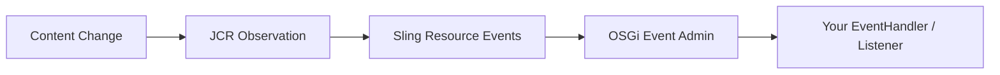
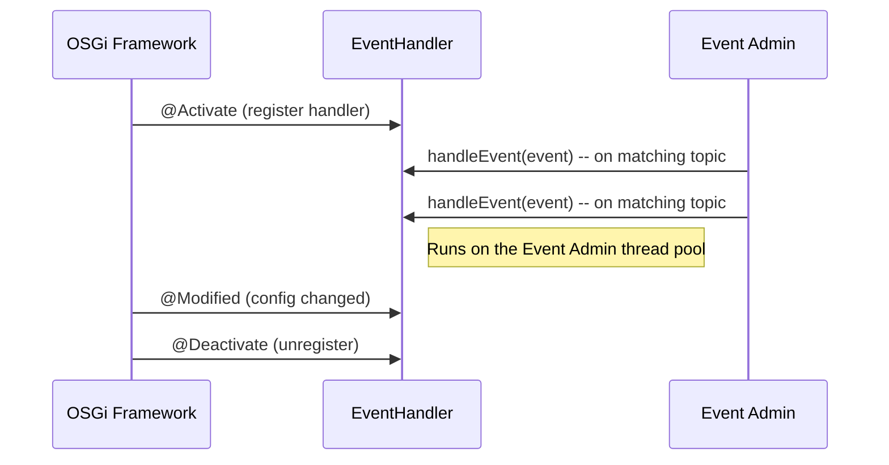

# Event Listeners and Handlers

AEM provides two event systems for reacting to changes in the repository and the platform. Understanding
when to use which is critical for building robust, performant integrations.

| System | Interface | When to use |
|--------|-----------|-------------|
| **OSGi EventHandler** | `org.osgi.service.event.EventHandler` | Lightweight, fire-and-forget notifications (replication events, resource changes, custom topics) |
| **JCR ObservationManager** | `javax.jcr.observation.EventListener` | Low-level JCR node/property change events with fine-grained filtering |
| **Sling Resource Change Listener** | `org.apache.sling.api.resource.observation.ResourceChangeListener` | Modern, Sling-level resource change events (preferred over JCR observation) |



All three approaches ultimately receive their events from JCR observation, but the abstraction level
and API differ. For most AEM projects, **OSGi EventHandler** and **Sling ResourceChangeListener** are
the right choices.

---

## OSGi EventHandler

The OSGi Event Admin service delivers events on **topics** (string identifiers). You register an
`EventHandler` that listens to one or more topics, and the framework calls your `handleEvent()` method
whenever an event matching those topics is published.

### Event topics reference

| Topic constant | Fires when | Package |
|---------------|------------|---------|
| `SlingConstants.TOPIC_RESOURCE_ADDED` | A resource is created | `org.apache.sling.api` |
| `SlingConstants.TOPIC_RESOURCE_CHANGED` | A resource is modified | `org.apache.sling.api` |
| `SlingConstants.TOPIC_RESOURCE_REMOVED` | A resource is deleted | `org.apache.sling.api` |
| `ReplicationAction.EVENT_TOPIC` | A replication (activation/deactivation) occurs | `com.day.cq.replication` |
| `PageEvent.EVENT_TOPIC` | A page is created, modified, moved, or deleted | `com.day.cq.wcm.api` |
| `NotificationConstants.TOPIC_JOB_FINISHED` | A Sling Job finishes | `org.apache.sling.event.jobs` |
| `NotificationConstants.TOPIC_JOB_FAILED` | A Sling Job fails | `org.apache.sling.event.jobs` |
| `DamEvent.EVENT_TOPIC` | A DAM asset event occurs | `com.day.cq.dam.api` |

### Minimal example: Resource change handler

```java title="core/.../listeners/ResourceChangeHandler.java"
package com.myproject.core.listeners;

import org.apache.sling.api.SlingConstants;
import org.osgi.service.component.annotations.Component;
import org.osgi.service.event.Event;
import org.osgi.service.event.EventConstants;
import org.osgi.service.event.EventHandler;
import org.slf4j.Logger;
import org.slf4j.LoggerFactory;

@Component(
    service = EventHandler.class,
    immediate = true,
    property = {
        EventConstants.EVENT_TOPIC + "=" + SlingConstants.TOPIC_RESOURCE_CHANGED
    }
)
public class ResourceChangeHandler implements EventHandler {

    private static final Logger LOG = LoggerFactory.getLogger(ResourceChangeHandler.class);

    @Override
    public void handleEvent(Event event) {
        String path = (String) event.getProperty(SlingConstants.PROPERTY_PATH);
        LOG.debug("Resource changed: {}", path);
    }
}
```

### Filtering events by path

Use the `EventConstants.EVENT_FILTER` property to apply an LDAP-style filter so your handler only
fires for specific paths:

```java
@Component(
    service = EventHandler.class,
    immediate = true,
    property = {
        EventConstants.EVENT_TOPIC + "=" + SlingConstants.TOPIC_RESOURCE_CHANGED,
        EventConstants.EVENT_FILTER + "=(path=/content/myproject/*)"
    }
)
public class FilteredChangeHandler implements EventHandler {

    @Override
    public void handleEvent(Event event) {
        String path = (String) event.getProperty(SlingConstants.PROPERTY_PATH);
        // Only fires for paths under /content/myproject/
    }
}
```

The filter syntax is LDAP, supporting `&` (AND), `|` (OR), and `!` (NOT):

```java
// Multiple conditions
EventConstants.EVENT_FILTER + "=(&(path=/content/myproject/*)(resourceType=myproject/*))"

// Exclude paths
EventConstants.EVENT_FILTER + "=(&(path=/content/*)(!(path=/content/dam/*)))"
```

### Event properties

Each event carries properties that describe what happened. Access them via `event.getProperty()`:

| Property | Type | Description |
|----------|------|-------------|
| `SlingConstants.PROPERTY_PATH` | `String` | Path of the affected resource |
| `SlingConstants.PROPERTY_RESOURCE_TYPE` | `String` | `sling:resourceType` of the resource |
| `SlingConstants.PROPERTY_ADDED_ATTRIBUTES` | `String[]` | Properties that were added |
| `SlingConstants.PROPERTY_CHANGED_ATTRIBUTES` | `String[]` | Properties that changed |
| `SlingConstants.PROPERTY_REMOVED_ATTRIBUTES` | `String[]` | Properties that were removed |
| `SlingConstants.PROPERTY_USERID` | `String` | User who made the change |

```java title="Inspecting event properties"
@Override
public void handleEvent(Event event) {
    String path = (String) event.getProperty(SlingConstants.PROPERTY_PATH);
    String userId = (String) event.getProperty(SlingConstants.PROPERTY_USERID);
    String[] changedProps = (String[]) event.getProperty(
        SlingConstants.PROPERTY_CHANGED_ATTRIBUTES);

    LOG.info("User {} modified {} (changed: {})",
        userId, path, Arrays.toString(changedProps));
}
```

---

## Sling ResourceChangeListener

The `ResourceChangeListener` is the **modern, recommended** way to observe resource changes in Sling.
It replaces the older OSGi `SlingConstants.TOPIC_RESOURCE_*` event topics and provides a cleaner API
with explicit change types and path restrictions.

```java title="core/.../listeners/ContentChangeListener.java"
package com.myproject.core.listeners;

import org.apache.sling.api.resource.observation.ResourceChange;
import org.apache.sling.api.resource.observation.ResourceChangeListener;
import org.osgi.service.component.annotations.Component;
import org.slf4j.Logger;
import org.slf4j.LoggerFactory;

import java.util.List;

@Component(
    service = ResourceChangeListener.class,
    immediate = true,
    property = {
        // Only listen to paths under /content/myproject
        ResourceChangeListener.PATHS + "=/content/myproject",
        // Change types to listen for (ADDED, REMOVED, CHANGED, PROVIDER_ADDED, PROVIDER_REMOVED)
        ResourceChangeListener.CHANGES + "=ADDED",
        ResourceChangeListener.CHANGES + "=CHANGED",
        ResourceChangeListener.CHANGES + "=REMOVED"
    }
)
public class ContentChangeListener implements ResourceChangeListener {

    private static final Logger LOG = LoggerFactory.getLogger(ContentChangeListener.class);

    @Override
    public void onChange(List<ResourceChange> changes) {
        for (ResourceChange change : changes) {
            LOG.info("Resource {} was {} by {}",
                change.getPath(),
                change.getType(),
                change.getUserId());
        }
    }
}
```

### ResourceChange properties

Each `ResourceChange` object provides:

| Method | Returns | Description |
|--------|---------|-------------|
| `getPath()` | `String` | Path of the changed resource |
| `getType()` | `ChangeType` | `ADDED`, `REMOVED`, `CHANGED`, `PROVIDER_ADDED`, `PROVIDER_REMOVED` |
| `getUserId()` | `String` | User who performed the change |
| `isExternal()` | `boolean` | Whether the change originated from a different cluster node |
| `getAddedPropertyNames()` | `Set<String>` | Properties that were added |
| `getChangedPropertyNames()` | `Set<String>` | Properties that changed |
| `getRemovedPropertyNames()` | `Set<String>` | Properties that were removed |

:::tip
Prefer `ResourceChangeListener` over the older `SlingConstants.TOPIC_RESOURCE_*` OSGi events for
resource observation. It provides a richer API, better performance, and clearer semantics.
:::

---

## JCR ObservationManager

The lowest-level approach. Use this only when you need fine-grained control over JCR events that
the Sling APIs don't expose (e.g., filtering by node type, or listening for property-level changes
on specific node types).

```java title="core/.../listeners/JcrNodeListener.java"
package com.myproject.core.listeners;

import org.apache.sling.jcr.api.SlingRepository;
import org.osgi.service.component.annotations.*;
import org.slf4j.Logger;
import org.slf4j.LoggerFactory;

import javax.jcr.*;
import javax.jcr.observation.*;

@Component(service = {}, immediate = true)
public class JcrNodeListener implements EventListener {

    private static final Logger LOG = LoggerFactory.getLogger(JcrNodeListener.class);

    @Reference
    private SlingRepository repository;

    private Session session;

    @Activate
    protected void activate() throws RepositoryException {
        session = repository.loginService("my-service-user", null);

        session.getWorkspace().getObservationManager().addEventListener(
            this,                              // listener
            Event.NODE_ADDED | Event.NODE_REMOVED | Event.PROPERTY_CHANGED, // event types
            "/content/myproject",              // absolute path
            true,                              // isDeep (include descendants)
            null,                              // uuid filter
            new String[]{"cq:PageContent"},    // node type filter
            false                              // noLocal
        );

        LOG.info("JCR observation listener registered");
    }

    @Deactivate
    protected void deactivate() throws RepositoryException {
        if (session != null) {
            session.getWorkspace().getObservationManager().removeEventListener(this);
            session.logout();
        }
    }

    @Override
    public void onEvent(EventIterator events) {
        while (events.hasNext()) {
            try {
                Event event = events.nextEvent();
                LOG.info("JCR event: type={}, path={}", event.getType(), event.getPath());
            } catch (RepositoryException e) {
                LOG.error("Error processing JCR event", e);
            }
        }
    }
}
```

### JCR event types

| Constant | Value | Description |
|----------|-------|-------------|
| `Event.NODE_ADDED` | `0x1` | A node was added |
| `Event.NODE_REMOVED` | `0x2` | A node was removed |
| `Event.PROPERTY_ADDED` | `0x4` | A property was added |
| `Event.PROPERTY_REMOVED` | `0x8` | A property was removed |
| `Event.PROPERTY_CHANGED` | `0x10` | A property value changed |
| `Event.NODE_MOVED` | `0x20` | A node was moved (ORDER_BEFORE) |
| `Event.PERSIST` | `0x40` | Changes were persisted (session.save()) |

Combine multiple types using bitwise OR: `Event.NODE_ADDED | Event.PROPERTY_CHANGED`

:::warning
JCR observation requires an **open JCR session** for the lifetime of the listener. You must manage
this session carefully -- open it in `@Activate` and close it in `@Deactivate`. Use a **service user**
for this session, never an admin session.
:::

---

## Practical Examples

### Replication event handler (with OSGi config)

A production-quality example that triggers an external endpoint (e.g., a CI/CD pipeline) when
content is replicated. Uses OSGi configuration for the endpoint URL and path filtering:

```java title="core/.../listeners/ReplicationWebhookHandler.java"
package com.myproject.core.listeners;

import com.day.cq.replication.ReplicationAction;
import com.day.cq.replication.ReplicationActionType;
import org.apache.http.client.config.RequestConfig;
import org.apache.http.client.methods.CloseableHttpResponse;
import org.apache.http.client.methods.HttpPost;
import org.apache.http.entity.StringEntity;
import org.apache.http.impl.client.CloseableHttpClient;
import org.apache.http.impl.client.HttpClientBuilder;
import org.osgi.service.component.annotations.*;
import org.osgi.service.component.propertytypes.ServiceDescription;
import org.osgi.service.event.Event;
import org.osgi.service.event.EventConstants;
import org.osgi.service.event.EventHandler;
import org.osgi.service.metatype.annotations.*;
import org.slf4j.Logger;
import org.slf4j.LoggerFactory;

import java.io.IOException;
import java.nio.charset.StandardCharsets;
import java.util.Arrays;

@Component(
    service = EventHandler.class,
    immediate = true,
    property = {
        EventConstants.EVENT_TOPIC + "=" + ReplicationAction.EVENT_TOPIC
    }
)
@ServiceDescription("Triggers a webhook when content is replicated to publish")
@Designate(ocd = ReplicationWebhookHandler.Config.class, factory = true)
public class ReplicationWebhookHandler implements EventHandler {

    private static final Logger LOG = LoggerFactory.getLogger(ReplicationWebhookHandler.class);

    @ObjectClassDefinition(
        name = "Replication Webhook Handler",
        description = "Triggers an external webhook on content replication events"
    )
    @interface Config {

        @AttributeDefinition(
            name = "Enabled",
            description = "Enable or disable this handler",
            type = AttributeType.BOOLEAN
        )
        boolean enabled() default false;

        @AttributeDefinition(
            name = "Webhook URL",
            description = "The external endpoint to call on replication"
        )
        String webhookUrl() default "";

        @AttributeDefinition(
            name = "Monitored paths",
            description = "Only trigger for replication events under these paths"
        )
        String[] monitoredPaths() default {"/content/myproject"};

        @AttributeDefinition(
            name = "Connection timeout (ms)",
            description = "HTTP connection timeout in milliseconds",
            type = AttributeType.INTEGER
        )
        int connectionTimeout() default 5000;

        @AttributeDefinition(
            name = "Socket timeout (ms)",
            description = "HTTP socket/read timeout in milliseconds",
            type = AttributeType.INTEGER
        )
        int socketTimeout() default 10000;
    }

    private boolean enabled;
    private String webhookUrl;
    private String[] monitoredPaths;
    private CloseableHttpClient httpClient;

    @Activate
    @Modified
    protected void activate(Config config) {
        enabled = config.enabled();
        webhookUrl = config.webhookUrl();
        monitoredPaths = config.monitoredPaths();

        RequestConfig requestConfig = RequestConfig.custom()
            .setConnectTimeout(config.connectionTimeout())
            .setSocketTimeout(config.socketTimeout())
            .build();

        httpClient = HttpClientBuilder.create()
            .setDefaultRequestConfig(requestConfig)
            .build();

        LOG.info("ReplicationWebhookHandler {} (url={}, paths={})",
            enabled ? "enabled" : "disabled", webhookUrl, Arrays.toString(monitoredPaths));
    }

    @Deactivate
    protected void deactivate() {
        if (httpClient != null) {
            try {
                httpClient.close();
            } catch (IOException e) {
                LOG.warn("Error closing HTTP client", e);
            }
        }
    }

    @Override
    public void handleEvent(Event event) {
        if (!enabled) {
            return;
        }

        ReplicationAction action = ReplicationAction.fromEvent(event);
        if (action == null) {
            return;
        }

        String path = action.getPath();
        ReplicationActionType type = action.getType();

        // Only trigger for Activate/Deactivate on monitored paths
        if ((type == ReplicationActionType.ACTIVATE || type == ReplicationActionType.DEACTIVATE)
                && isMonitoredPath(path)) {
            triggerWebhook(path, type.getName(), action.getUserId());
        }
    }

    private boolean isMonitoredPath(String path) {
        if (monitoredPaths == null || path == null) {
            return false;
        }
        return Arrays.stream(monitoredPaths).anyMatch(path::startsWith);
    }

    private void triggerWebhook(String path, String action, String userId) {
        String payload = String.format(
            "{\"path\":\"%s\",\"action\":\"%s\",\"user\":\"%s\"}",
            path, action, userId
        );

        HttpPost post = new HttpPost(webhookUrl);
        post.setHeader("Content-Type", "application/json");
        post.setEntity(new StringEntity(payload, StandardCharsets.UTF_8));

        try (CloseableHttpResponse response = httpClient.execute(post)) {
            int status = response.getStatusLine().getStatusCode();
            if (status >= 200 && status < 300) {
                LOG.info("Webhook triggered successfully for {} ({})", path, action);
            } else {
                LOG.warn("Webhook returned status {} for {} ({})", status, path, action);
            }
        } catch (IOException e) {
            LOG.error("Failed to trigger webhook for {} ({})", path, action, e);
        }
    }
}
```

### Page event handler

Listen to page lifecycle events (create, modify, delete, move):

```java title="core/.../listeners/PageEventHandler.java"
package com.myproject.core.listeners;

import com.day.cq.wcm.api.PageEvent;
import com.day.cq.wcm.api.PageModification;
import org.osgi.service.component.annotations.Component;
import org.osgi.service.event.Event;
import org.osgi.service.event.EventConstants;
import org.osgi.service.event.EventHandler;
import org.slf4j.Logger;
import org.slf4j.LoggerFactory;

import java.util.Iterator;

@Component(
    service = EventHandler.class,
    immediate = true,
    property = {
        EventConstants.EVENT_TOPIC + "=" + PageEvent.EVENT_TOPIC
    }
)
public class PageEventHandler implements EventHandler {

    private static final Logger LOG = LoggerFactory.getLogger(PageEventHandler.class);

    @Override
    public void handleEvent(Event event) {
        PageEvent pageEvent = PageEvent.fromEvent(event);
        if (pageEvent == null) {
            return;
        }

        Iterator<PageModification> modifications = pageEvent.getModifications();
        while (modifications.hasNext()) {
            PageModification mod = modifications.next();
            String path = mod.getPath();
            PageModification.ModificationType type = mod.getType();

            switch (type) {
                case CREATED:
                    LOG.info("Page created: {}", path);
                    onPageCreated(path, mod.getUserId());
                    break;
                case MODIFIED:
                    LOG.debug("Page modified: {}", path);
                    break;
                case DELETED:
                    LOG.info("Page deleted: {}", path);
                    onPageDeleted(path, mod.getUserId());
                    break;
                case MOVED:
                    LOG.info("Page moved: {} -> {}", path, mod.getDestination());
                    break;
                case VERSION_CREATED:
                    LOG.debug("Page version created: {}", path);
                    break;
                default:
                    LOG.trace("Page event {}: {}", type, path);
            }
        }
    }

    private void onPageCreated(String path, String userId) {
        // Custom logic: set default properties, notify a team, etc.
    }

    private void onPageDeleted(String path, String userId) {
        // Custom logic: clean up references, update search index, etc.
    }
}
```

### DAM asset event handler

React to asset upload, modification, and processing events:

```java title="core/.../listeners/AssetEventHandler.java"
package com.myproject.core.listeners;

import com.day.cq.dam.api.DamEvent;
import org.osgi.service.component.annotations.Component;
import org.osgi.service.event.Event;
import org.osgi.service.event.EventConstants;
import org.osgi.service.event.EventHandler;
import org.slf4j.Logger;
import org.slf4j.LoggerFactory;

@Component(
    service = EventHandler.class,
    immediate = true,
    property = {
        EventConstants.EVENT_TOPIC + "=" + DamEvent.EVENT_TOPIC,
        // Filter to a specific DAM folder
        EventConstants.EVENT_FILTER + "=(path=/content/dam/myproject/*)"
    }
)
public class AssetEventHandler implements EventHandler {

    private static final Logger LOG = LoggerFactory.getLogger(AssetEventHandler.class);

    @Override
    public void handleEvent(Event event) {
        DamEvent damEvent = DamEvent.fromEvent(event);
        if (damEvent == null) {
            return;
        }

        String assetPath = damEvent.getAssetPath();
        DamEvent.Type type = damEvent.getType();

        switch (type) {
            case ACCEPTED:
                LOG.info("Asset accepted: {}", assetPath);
                break;
            case ASSET_CREATED:
                LOG.info("Asset created: {}", assetPath);
                break;
            case ASSET_MOVED:
                LOG.info("Asset moved: {}", assetPath);
                break;
            case METADATA_UPDATED:
                LOG.info("Asset metadata updated: {}", assetPath);
                break;
            case RENDITION_UPDATED:
                LOG.debug("Rendition updated: {}", assetPath);
                break;
            case RENDITION_REMOVED:
                LOG.debug("Rendition removed: {}", assetPath);
                break;
            case RESTORED:
                LOG.info("Asset restored from version: {}", assetPath);
                break;
            default:
                LOG.trace("DAM event {}: {}", type, assetPath);
        }
    }
}
```

### Custom events: Publishing and consuming

You can publish your own events to decouple components:

**Publishing a custom event:**

```java title="core/.../services/impl/OrderServiceImpl.java"
package com.myproject.core.services.impl;

import org.osgi.service.component.annotations.Component;
import org.osgi.service.component.annotations.Reference;
import org.osgi.service.event.Event;
import org.osgi.service.event.EventAdmin;

import java.util.HashMap;
import java.util.Map;

@Component(service = OrderService.class)
public class OrderServiceImpl implements OrderService {

    public static final String TOPIC_ORDER_PLACED = "com/myproject/order/PLACED";
    public static final String TOPIC_ORDER_SHIPPED = "com/myproject/order/SHIPPED";

    @Reference
    private EventAdmin eventAdmin;

    @Override
    public void placeOrder(String orderId, String userId) {
        // ... business logic ...

        // Publish event for other components to react to
        Map<String, Object> properties = new HashMap<>();
        properties.put("orderId", orderId);
        properties.put("userId", userId);
        properties.put("timestamp", System.currentTimeMillis());

        // sendEvent() is synchronous, postEvent() is asynchronous
        eventAdmin.postEvent(new Event(TOPIC_ORDER_PLACED, properties));
    }
}
```

**Consuming the custom event:**

```java title="core/.../listeners/OrderNotificationHandler.java"
@Component(
    service = EventHandler.class,
    immediate = true,
    property = {
        EventConstants.EVENT_TOPIC + "=com/myproject/order/PLACED",
        EventConstants.EVENT_TOPIC + "=com/myproject/order/SHIPPED"
    }
)
public class OrderNotificationHandler implements EventHandler {

    @Reference
    private EmailService emailService;

    @Override
    public void handleEvent(Event event) {
        String orderId = (String) event.getProperty("orderId");
        String userId = (String) event.getProperty("userId");
        String topic = event.getTopic();

        if (topic.endsWith("PLACED")) {
            emailService.sendOrderConfirmation(orderId, userId);
        } else if (topic.endsWith("SHIPPED")) {
            emailService.sendShipmentNotification(orderId, userId);
        }
    }
}
```

### Sling ResourceChangeListener with external change detection

Detect changes that originate from other cluster nodes (e.g., replication from Author to Publish):

```java title="core/.../listeners/ExternalChangeListener.java"
package com.myproject.core.listeners;

import org.apache.sling.api.resource.observation.ExternalResourceChangeListener;
import org.apache.sling.api.resource.observation.ResourceChange;
import org.apache.sling.api.resource.observation.ResourceChangeListener;
import org.osgi.service.component.annotations.Component;
import org.slf4j.Logger;
import org.slf4j.LoggerFactory;

import java.util.List;

@Component(
    service = ResourceChangeListener.class,
    immediate = true,
    property = {
        ResourceChangeListener.PATHS + "=/content/myproject",
        ResourceChangeListener.CHANGES + "=CHANGED"
    }
)
public class ExternalChangeListener
        implements ResourceChangeListener, ExternalResourceChangeListener {

    private static final Logger LOG = LoggerFactory.getLogger(ExternalChangeListener.class);

    @Override
    public void onChange(List<ResourceChange> changes) {
        for (ResourceChange change : changes) {
            if (change.isExternal()) {
                LOG.info("External change detected: {} (from another cluster node)",
                    change.getPath());
                // Invalidate local caches, update search index, etc.
            } else {
                LOG.debug("Local change: {}", change.getPath());
            }
        }
    }
}
```

:::info
Implement `ExternalResourceChangeListener` in addition to `ResourceChangeListener` to also receive
events originating from other cluster nodes. Without it, you only see local changes.
:::

---

## EventHandler vs Sling Jobs

OSGi events are **fire-and-forget** -- if the instance crashes or the handler throws an exception,
the event is lost. For operations that **must** complete (sending an email, updating an external
system, writing to the JCR), use **Sling Jobs** instead.

| Feature | OSGi EventHandler | Sling Job |
|---------|------------------|-----------|
| Delivery guarantee | **None** -- events can be lost | **At least once** -- jobs are persisted and retried |
| Retry on failure | No | Yes (configurable retries, backoff) |
| Cluster awareness | Fires on every node | Executes on **one** node only |
| Persistence | In-memory only | Persisted to JCR |
| Use case | Logging, cache invalidation, notifications | Email sending, external API calls, JCR writes |

### Creating a Sling Job

**Producer:**

```java title="Enqueuing a job"
@Reference
private JobManager jobManager;

public void enqueueIndexUpdate(String path) {
    Map<String, Object> jobProps = new HashMap<>();
    jobProps.put("path", path);
    jobProps.put("timestamp", System.currentTimeMillis());

    jobManager.addJob("com/myproject/job/INDEX_UPDATE", jobProps);
}
```

**Consumer:**

```java title="core/.../jobs/IndexUpdateJobConsumer.java"
package com.myproject.core.jobs;

import org.apache.sling.event.jobs.Job;
import org.apache.sling.event.jobs.consumer.JobConsumer;
import org.apache.sling.api.resource.ResourceResolver;
import org.apache.sling.api.resource.ResourceResolverFactory;
import org.osgi.service.component.annotations.Component;
import org.osgi.service.component.annotations.Reference;
import org.slf4j.Logger;
import org.slf4j.LoggerFactory;

import java.util.Map;

@Component(
    service = JobConsumer.class,
    property = {
        JobConsumer.PROPERTY_TOPICS + "=com/myproject/job/INDEX_UPDATE"
    }
)
public class IndexUpdateJobConsumer implements JobConsumer {

    private static final Logger LOG = LoggerFactory.getLogger(IndexUpdateJobConsumer.class);

    @Reference
    private ResourceResolverFactory resolverFactory;

    @Override
    public JobResult process(Job job) {
        String path = job.getProperty("path", String.class);
        LOG.info("Processing index update for: {}", path);

        try (ResourceResolver resolver = resolverFactory.getServiceResourceResolver(
                Map.of(ResourceResolverFactory.SUBSERVICE, "index-service"))) {

            // ... perform the index update ...

            return JobResult.OK;

        } catch (Exception e) {
            LOG.error("Index update failed for {}", path, e);
            // Return FAILED to retry, or CANCEL to give up
            return job.getRetryCount() < 3 ? JobResult.FAILED : JobResult.CANCEL;
        }
    }
}
```

### Job configuration

Configure retry behaviour via OSGi properties:

```java
@Component(
    service = JobConsumer.class,
    property = {
        JobConsumer.PROPERTY_TOPICS + "=com/myproject/job/INDEX_UPDATE",
        "job.retries=5",
        "job.retryDelay=30"  // seconds between retries
    }
)
```

---

## EventHandler Lifecycle



Key points about the lifecycle:
- `@Activate` is called when the component is registered
- `@Modified` fires when OSGi configuration changes (no restart needed)
- `@Deactivate` is called when the component is unregistered -- clean up resources here
- `handleEvent()` runs on the **Event Admin thread pool** -- avoid blocking operations

---

## Best Practices

### Keep handlers fast

`handleEvent()` runs on the OSGi Event Admin thread pool. Blocking it delays all other event
processing in the system:

```java
// ❌ Bad -- blocking HTTP call in the event handler thread
@Override
public void handleEvent(Event event) {
    httpClient.execute(new HttpGet(url)); // blocks the thread
}

// ✅ Good -- delegate heavy work to a Sling Job
@Override
public void handleEvent(Event event) {
    Map<String, Object> props = new HashMap<>();
    props.put("path", event.getProperty(SlingConstants.PROPERTY_PATH));
    jobManager.addJob("com/myproject/job/HEAVY_WORK", props);
}
```

### Never swallow exceptions

Always log errors. Silent `catch` blocks make debugging nearly impossible:

```java
// ❌ Bad
try { ... } catch (IOException e) { }

// ✅ Good
try { ... } catch (IOException e) {
    LOG.error("Failed to process event for path {}", path, e);
}
```

### Use `postEvent()` over `sendEvent()`

The `EventAdmin` service provides two methods:

| Method | Behaviour |
|--------|-----------|
| `eventAdmin.sendEvent(event)` | **Synchronous** -- blocks until all handlers finish |
| `eventAdmin.postEvent(event)` | **Asynchronous** -- returns immediately, handlers run in background |

Prefer `postEvent()` unless you specifically need synchronous processing.

### Guard against rapid-fire events

JCR changes can generate many events in quick succession (e.g., saving a dialog writes multiple
properties). Debounce or batch your processing:

```java title="Simple debounce with a delay"
private final ScheduledExecutorService scheduler = Executors.newSingleThreadScheduledExecutor();
private final Map<String, ScheduledFuture<?>> pendingTasks = new ConcurrentHashMap<>();

@Override
public void handleEvent(Event event) {
    String path = (String) event.getProperty(SlingConstants.PROPERTY_PATH);

    // Cancel any pending task for this path
    ScheduledFuture<?> existing = pendingTasks.get(path);
    if (existing != null) {
        existing.cancel(false);
    }

    // Schedule processing with a 2-second delay (debounce)
    ScheduledFuture<?> task = scheduler.schedule(
        () -> processChange(path),
        2, TimeUnit.SECONDS
    );
    pendingTasks.put(path, task);
}
```

### Clean up resources in `@Deactivate`

If your handler opens HTTP clients, JCR sessions, thread pools, or other resources, close them:

```java
@Deactivate
protected void deactivate() {
    if (httpClient != null) {
        try { httpClient.close(); } catch (IOException e) { LOG.warn("Error closing client", e); }
    }
    if (scheduler != null) {
        scheduler.shutdownNow();
    }
}
```

### Use factory configurations for multi-tenant setups

Mark your handler with `factory = true` in `@Designate` to allow multiple instances with different
configurations (e.g., different webhook URLs for different sites):

```java
@Designate(ocd = MyHandler.Config.class, factory = true)
public class MyHandler implements EventHandler { ... }
```

This creates separate OSGi configuration entries in the Felix console, each spawning its own handler
instance.

---

## Common Pitfalls

| Pitfall | Solution |
|---------|----------|
| Handler fires too often (event storm) | Add path filtering, debounce, or move to Sling Jobs |
| Missing events after restart | OSGi events are not persisted -- use Sling Jobs for guaranteed delivery |
| Handler modifies content and triggers itself | Check `event.getProperty(PROPERTY_USERID)` or use a flag path to prevent recursion |
| Slow handler blocks all event processing | Keep `handleEvent()` fast; delegate heavy work to Sling Jobs |
| JCR session leak in observation listener | Always close the session in `@Deactivate` |
| Handler works on Author but not Publish | Check that the OSGi config is deployed to the Publish run mode |
| Cluster: handler fires on every node | Use Sling Jobs (cluster-aware) or check `ResourceChange.isExternal()` |
| AEMaaCS: Sling Jobs restricted | On AEMaaCS, some job topics are reserved; test thoroughly in the cloud environment |

---

## Debugging Event Handlers

### Felix Web Console

Navigate to `http://localhost:4502/system/console/events` to see:
- All registered event topics and their handlers
- Recent event history
- Event delivery statistics

### Logging

Enable debug logging for event processing:

```json title="org.apache.sling.commons.log.LogManager.factory.config~events.cfg.json"
{
    "org.apache.sling.commons.log.names": [
        "com.myproject.core.listeners",
        "org.apache.sling.event",
        "org.osgi.service.event"
    ],
    "org.apache.sling.commons.log.level": "DEBUG",
    "org.apache.sling.commons.log.file": "logs/events.log"
}
```

### Groovy Console quick test

Fire a test event from the Groovy Console to verify your handler is working:

```groovy
import org.osgi.service.event.Event
import org.osgi.service.event.EventAdmin

def eventAdmin = getService(EventAdmin.class)

def props = [
    "path": "/content/myproject/en/test-page",
    "resourceType": "myproject/components/page"
] as Map<String, Object>

eventAdmin.postEvent(new Event("org/apache/sling/api/resource/Resource/CHANGED", props))

println "Event posted"
```

## See also

- [Replication and Activation](../content/replication-activation.mdx) -- replication events
- [Workflows](./workflows.mdx) -- process-driven automation
- [Servlets](./servlets.mdx) -- handling HTTP requests
- [Filters](./filter.mdx) -- request/response interceptors
- [Sling Models](./sling-models.mdx)
- [OSGi Configuration](./osgi-configuration.mdx) -- configuring handlers via run modes
- [Java Best Practices](./java-best-practices.mdx)
- [Security](../infrastructure/security.mdx)
- [Groovy Console](../groovy-console.mdx) -- testing event handlers
