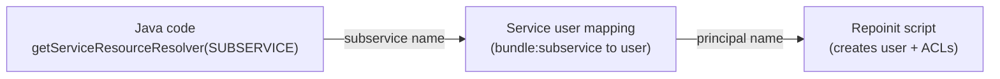

# Service Users and Repoinit

Any code that accesses the repository **without a user request** - Sling Jobs, schedulers,
event handlers, workflow steps, or services that need elevated rights - must use a
**service user**. A service user is a system user without a password. You grant it exactly
the permissions a piece of code needs and map it to your bundle.

`loginAdministrative()` and `getAdministrativeResourceResolver()` are deprecated and must not be
used; on AEM as a Cloud Service they are not an option at all.

Three pieces always belong together:



If any of the three names does not match, the login fails or the resolver silently sees
nothing.

## 1. Create the user and its ACLs with repoinit

**Repository initialization (repoinit)** is a small DSL that Sling runs at startup to create
paths, users, groups, and ACLs. It is the supported way to create service users on AEM as a
Cloud Service, and a good practice on AEM 6.5 too. The script lives in a factory OSGi
configuration:

```json title="ui.config/src/main/content/jcr_root/apps/myproject/osgiconfig/config/org.apache.sling.jcr.repoinit.RepositoryInitializer~myproject.cfg.json"
{
    "scripts": [
        "create path (sling:Folder) /var/myproject",
        "create service user myproject-reader with path system/cq:services/myproject",
        "create service user myproject-writer with path system/cq:services/myproject",
        "set ACL for myproject-reader\n    allow jcr:read on /content/myproject\n    allow jcr:read on /content/dam/myproject\nend",
        "set ACL for myproject-writer\n    allow jcr:read,rep:write on /var/myproject\nend"
    ]
}
```

The `scripts` property is an array of strings. Each entry can hold one statement or a whole
multi-line block (use `\n` for line breaks in JSON). Written out, the script reads:

```text
create path (sling:Folder) /var/myproject

create service user myproject-reader with path system/cq:services/myproject
create service user myproject-writer with path system/cq:services/myproject

set ACL for myproject-reader
    allow jcr:read on /content/myproject
    allow jcr:read on /content/dam/myproject
end

set ACL for myproject-writer
    allow jcr:read,rep:write on /var/myproject
end
```

Notes:

- `with path system/cq:services/myproject` is relative to the users root, so the user ends up
  under `/home/users/system/cq:services/myproject`.
- `set ACL for <principal>` lists ACEs per principal; `set ACL on <path>` lists them per path.
  Both are equivalent - pick the one that reads better.
- The paths you grant access to must exist when the script runs. Create them with
  `create path` or make sure the content package that creates them is installed first.
- Put the config in `config.author` or `config.publish` if the user is only needed on one tier.

### Common privileges

| Privilege | Grants |
|-----------|--------|
| `jcr:read` | Read nodes and properties |
| `jcr:modifyProperties` | Change properties on existing nodes |
| `jcr:addChildNodes` / `jcr:removeChildNodes` | Create / delete child nodes |
| `rep:write` | `jcr:write` plus `jcr:nodeTypeManagement` - the usual "can edit this tree" privilege |
| `jcr:versionManagement` | Create versions (e.g. when writing pages) |
| `crx:replicate` | Replicate / publish content (AEM-specific) |

Grant the smallest set that works. A reader should never get `rep:write` "just in case".

### Repoinit is additive

Repoinit statements are applied on every startup, but **removing a line does not revoke
anything** - the user or ACE stays in the repository. To take away a permission or remove a
user, add an explicit statement for it (for example a `deny`, or `delete service user`).
See the [Sling repoinit documentation](https://sling.apache.org/documentation/bundles/repository-initialization.html)
for the full grammar.

A syntax error or a statement that fails (for example an ACL on a missing path) makes the
repoinit step fail. On AEM as a Cloud Service that fails the deployment, which is what you want -
but it means you should test repoinit changes on the local SDK first.

## 2. Map the bundle to the service user

The mapping tells Sling which service user a given bundle may use for a given
**subservice name**. Add an amendment rather than editing the main mapper configuration:

```json title="ui.config/src/main/content/jcr_root/apps/myproject/osgiconfig/config/org.apache.sling.serviceusermapping.impl.ServiceUserMapperImpl.amended~myproject.cfg.json"
{
    "user.mapping": [
        "com.myproject.core:reader=[myproject-reader]",
        "com.myproject.core:writer=[myproject-writer]"
    ]
}
```

The format is `<bundle symbolic name>:<subservice name>=[<principal names>]`:

- **Bundle symbolic name** - the `Bundle-SymbolicName` of the bundle that calls
  `getServiceResourceResolver()`, not the Maven artifact ID. Check it in the Felix console
  (`/system/console/bundles`) if unsure.
- **Subservice name** - a free-form name you choose; the code passes it in. Omit it
  (`com.myproject.core=[...]`) to define a default mapping for the whole bundle.
- **`[principal names]`** - the square brackets map to principal names, the recommended
  form. Without brackets the value is interpreted as a single user ID (the older format).

## 3. Obtain a service resource resolver

```java title="core/src/main/java/com/myproject/core/services/impl/ReportServiceImpl.java"
package com.myproject.core.services.impl;

import java.util.Map;

import org.apache.sling.api.resource.LoginException;
import org.apache.sling.api.resource.Resource;
import org.apache.sling.api.resource.ResourceResolver;
import org.apache.sling.api.resource.ResourceResolverFactory;
import org.osgi.service.component.annotations.Component;
import org.osgi.service.component.annotations.Reference;
import org.slf4j.Logger;
import org.slf4j.LoggerFactory;

import com.myproject.core.services.ReportService;

@Component(service = ReportService.class)
public class ReportServiceImpl implements ReportService {

    private static final Logger LOG = LoggerFactory.getLogger(ReportServiceImpl.class);

    private static final Map<String, Object> READER =
            Map.of(ResourceResolverFactory.SUBSERVICE, "reader");

    @Reference
    private ResourceResolverFactory resolverFactory;

    @Override
    public int countChildPages(String path) {
        try (ResourceResolver resolver = resolverFactory.getServiceResourceResolver(READER)) {
            Resource root = resolver.getResource(path);
            if (root == null) {
                // Missing OR not readable by the service user - both look the same
                LOG.warn("Resource {} not found or not readable", path);
                return 0;
            }
            int count = 0;
            for (Resource child : root.getChildren()) {
                if ("cq:Page".equals(child.getResourceType())) {
                    count++;
                }
            }
            return count;
        } catch (LoginException e) {
            LOG.error("Cannot log in as service user for subservice 'reader'", e);
            return 0;
        }
    }
}
```

Rules:

- **Always close** the resolver - try-with-resources is the simplest way. A leaked service
  resolver is a leaked JCR session.
- **Do not cache** a service resolver in a field and share it across threads. Open one per unit
  of work.
- **Call `resolver.commit()`** after writes; changes are discarded on close otherwise.
- If you need a JCR `Session` instead, use `SlingRepository.loginService("reader", null)` and
  call `logout()` in a `finally` block.

## Debugging

| Symptom | Likely cause | Check |
|---------|--------------|-------|
| `LoginException: Cannot derive user name for bundle ...` | No mapping for this bundle + subservice | Bundle symbolic name and subservice name in the `amended` config; is the config deployed for this run mode? |
| `LoginException` mentioning the user does not exist | Repoinit did not create the user | Look for the user under `/home/users/system/...`; check the startup log for repoinit errors |
| `getResource()` returns `null` for an existing path | Service user lacks `jcr:read` | Inspect the ACLs on the path (CRXDE Lite, or the Developer Console on AEMaaCS) |
| `PersistenceException` / `AccessDeniedException` on commit | Missing write privilege | Add the specific privilege (`rep:write`, `jcr:versionManagement`, ...) |
| Works locally, fails on AEMaaCS | Config only in a run mode folder that does not apply | Check `config.author` vs `config.publish` vs `config` |

Permission problems rarely throw - most of the time the service user simply cannot see a node.
Log the path you tried to read and verify the ACL rather than assuming the content is missing.

## Anti-patterns

- **One "god" service user** with `jcr:all` on `/`. Create one user per concern (reader,
  writer, replicator) so a bug in one feature cannot touch everything.
- **Mapping to `admin`** or to a regular user account. Service users must be system users.
- **Reusing another bundle's subservice.** Mappings are per bundle; define your own.
- **Using the request's resolver for background work.** It is closed when the request ends.

## See also

- [ACLs and Permissions](../infrastructure/acl-permissions.md) - privileges, groups, and the Netcentric ACL Tool
- [Security](../infrastructure/security.mdx) - wider security guidance
- [OSGi Configuration](./osgi-configuration.mdx) - run mode folders and factory configs
- [Sling Jobs and Schedulers](./sling-jobs.md) - the most common consumer of service users
- [Sling repoinit documentation](https://sling.apache.org/documentation/bundles/repository-initialization.html)
- [Sling service authentication](https://sling.apache.org/documentation/the-sling-engine/service-authentication.html)
