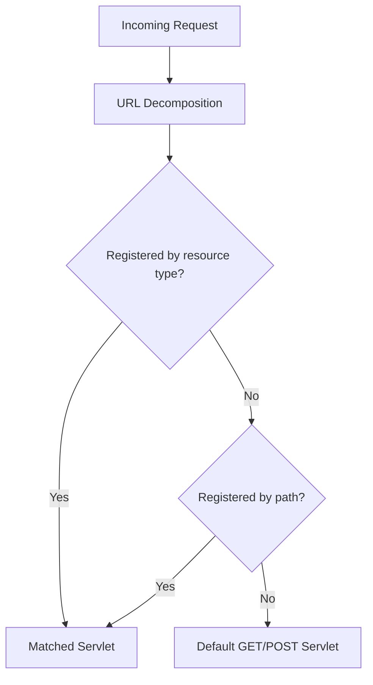

# Servlets

Sling Servlets are Java classes that handle HTTP requests in AEM. They are the standard way to build
custom endpoints -- REST APIs, form handlers, AJAX callbacks, data sources for dialog dropdowns, and
more. Sling's servlet resolution mechanism routes requests to servlets based on **resource type** or
**path**, making them a natural extension of the content-driven architecture.

## How Sling Servlet Resolution Works

When a request arrives, Sling determines which servlet to invoke based on the request's resource type,
selectors, extension, and method:



```text
Request URL:
/content/myproject/en/contact/jcr:content/root/container/form.submit.json

Decomposed:
  Resource path:  /content/myproject/en/contact/jcr:content/root/container/form
  Resource type:  myproject/components/contactform (from the node's sling:resourceType)
  Selector:       submit
  Extension:      json
  Method:         POST
```

Sling matches this against registered servlets using:
1. `sling.servlet.resourceTypes` + `sling.servlet.selectors` + `sling.servlet.extensions` + `sling.servlet.methods`
2. Or `sling.servlet.paths` for path-based servlets

## Registration: Resource Type vs Path

There are two ways to register a servlet. **Resource-type registration is always preferred.**

| Approach | Pros | Cons |
|----------|------|------|
| **Resource type** | Respects Sling security, ACLs apply, follows AEM patterns | Requires a resource with the matching type to exist |
| **Path** | Works without a resource, simple URL | Bypasses Sling ACLs, must be explicitly allowed in the Sling Servlet Resolver config |

:::warning
Path-based servlets bypass JCR access controls. On AEMaaCS, only specific path prefixes are
allowed (`/bin/`). Always prefer resource-type registration unless you have a specific reason
to use paths.
:::

## Servlet Registration Annotations

### Modern approach (recommended)

Use `@SlingServletResourceTypes` or `@SlingServletPaths` from the `org.apache.sling.servlets.annotations`
package. These are type-safe and self-documenting:

```java title="Resource-type registration (recommended)"
@Component(service = Servlet.class)
@SlingServletResourceTypes(
    resourceTypes = "myproject/components/contactform",
    methods = HttpConstants.METHOD_POST,
    selectors = "submit",
    extensions = "json"
)
public class ContactFormServlet extends SlingAllMethodsServlet { ... }
```

```java title="Path-based registration (use sparingly)"
@Component(service = Servlet.class)
@SlingServletPaths("/bin/myproject/api/search")
public class SearchApiServlet extends SlingSafeMethodsServlet { ... }
```

### Legacy approach (avoid)

The older `@SlingServlet` annotation is deprecated. The even older `@Component` + `@Property`
pattern should never be used:

```java title="Deprecated -- don't use"
// ❌ Old @SlingServlet annotation (deprecated since Sling 2.5)
@SlingServlet(resourceTypes = "...", methods = "GET")
public class OldServlet extends SlingSafeMethodsServlet { ... }

// ❌ Even older @Property pattern (Sling SCR annotations, fully deprecated)
@Component
@Service(value = Servlet.class)
@Properties({
    @Property(name = "sling.servlet.resourceTypes", value = "..."),
    @Property(name = "sling.servlet.methods", value = "GET")
})
public class VeryOldServlet extends SlingSafeMethodsServlet { ... }
```

### Registration properties reference

| Property | Purpose | Example |
|----------|---------|---------|
| `resourceTypes` | Sling resource type(s) the servlet handles | `"myproject/components/form"` |
| `methods` | HTTP methods (GET, POST, PUT, DELETE) | `HttpConstants.METHOD_POST` |
| `selectors` | URL selector(s) that must be present | `"submit"`, `"action"` |
| `extensions` | URL extension(s) | `"json"`, `"html"` |
| `resourceSuperType` | Parent resource type for inheritance | `"sling/servlet/default"` |

## Base Classes

Sling provides two servlet base classes:

| Class | Methods | Use when |
|-------|---------|---------|
| `SlingSafeMethodsServlet` | `doGet()`, `doHead()`, `doOptions()` | Read-only operations (GET endpoints, data sources) |
| `SlingAllMethodsServlet` | All of the above + `doPost()`, `doPut()`, `doDelete()` | Write operations (form submissions, API mutations) |

:::tip
Always extend `SlingSafeMethodsServlet` if your servlet only handles GET requests. This makes the
read-only intent explicit and prevents accidental POST handling.
:::

---

## Practical Examples

### GET Servlet: JSON API endpoint

A servlet that returns JSON data for a search API:

```java title="core/.../servlets/SearchServlet.java"
package com.myproject.core.servlets;

import com.google.gson.Gson;
import com.google.gson.JsonArray;
import com.google.gson.JsonObject;
import org.apache.sling.api.SlingHttpServletRequest;
import org.apache.sling.api.SlingHttpServletResponse;
import org.apache.sling.api.resource.Resource;
import org.apache.sling.api.servlets.HttpConstants;
import org.apache.sling.api.servlets.SlingSafeMethodsServlet;
import org.apache.sling.servlets.annotations.SlingServletResourceTypes;
import org.osgi.service.component.annotations.Component;

import javax.servlet.Servlet;
import javax.servlet.ServletException;
import java.io.IOException;
import java.util.Iterator;

@Component(service = Servlet.class)
@SlingServletResourceTypes(
    resourceTypes = "myproject/components/page",
    methods = HttpConstants.METHOD_GET,
    selectors = "search",
    extensions = "json"
)
public class SearchServlet extends SlingSafeMethodsServlet {

    private static final Gson GSON = new Gson();

    @Override
    protected void doGet(SlingHttpServletRequest request,
                         SlingHttpServletResponse response)
            throws ServletException, IOException {

        response.setContentType("application/json");
        response.setCharacterEncoding("UTF-8");

        String query = request.getParameter("q");
        int limit = getIntParam(request, "limit", 10);

        JsonObject result = new JsonObject();
        JsonArray items = new JsonArray();

        if (query != null && !query.trim().isEmpty()) {
            // Use QueryBuilder or JCR-SQL2 to search content
            Resource root = request.getResource();
            Iterator<Resource> children = root.listChildren();

            int count = 0;
            while (children.hasNext() && count < limit) {
                Resource child = children.next();
                String title = child.getValueMap().get("jcr:title", "");
                if (title.toLowerCase().contains(query.toLowerCase())) {
                    JsonObject item = new JsonObject();
                    item.addProperty("path", child.getPath());
                    item.addProperty("title", title);
                    items.add(item);
                    count++;
                }
            }
        }

        result.add("results", items);
        result.addProperty("total", items.size());

        response.getWriter().write(GSON.toJson(result));
    }

    private int getIntParam(SlingHttpServletRequest request, String name, int defaultValue) {
        String value = request.getParameter(name);
        if (value != null) {
            try {
                return Integer.parseInt(value);
            } catch (NumberFormatException e) {
                // fall through to default
            }
        }
        return defaultValue;
    }
}
```

**Request:**
```text
GET /content/myproject/en.search.json?q=news&limit=5
```

**Response:**
```json
{
    "results": [
        { "path": "/content/myproject/en/news", "title": "Latest News" },
        { "path": "/content/myproject/en/newsletter", "title": "Newsletter Signup" }
    ],
    "total": 2
}
```

### POST Servlet: Form submission

A servlet that handles contact form submissions with CSRF protection:

```java title="core/.../servlets/ContactFormServlet.java"
package com.myproject.core.servlets;

import com.google.gson.Gson;
import com.google.gson.JsonObject;
import com.myproject.core.services.EmailService;
import org.apache.commons.lang3.StringUtils;
import org.apache.sling.api.SlingHttpServletRequest;
import org.apache.sling.api.SlingHttpServletResponse;
import org.apache.sling.api.servlets.SlingAllMethodsServlet;
import org.apache.sling.servlets.annotations.SlingServletResourceTypes;
import org.osgi.service.component.annotations.Component;
import org.osgi.service.component.annotations.Reference;
import org.slf4j.Logger;
import org.slf4j.LoggerFactory;

import javax.servlet.Servlet;
import javax.servlet.ServletException;
import java.io.IOException;

import static org.apache.sling.api.servlets.HttpConstants.METHOD_POST;

@Component(service = Servlet.class)
@SlingServletResourceTypes(
    resourceTypes = "myproject/components/contactform",
    methods = METHOD_POST,
    selectors = "submit",
    extensions = "json"
)
public class ContactFormServlet extends SlingAllMethodsServlet {

    private static final Logger LOG = LoggerFactory.getLogger(ContactFormServlet.class);
    private static final Gson GSON = new Gson();

    @Reference
    private EmailService emailService;

    @Override
    protected void doPost(SlingHttpServletRequest request,
                          SlingHttpServletResponse response)
            throws ServletException, IOException {

        response.setContentType("application/json");
        response.setCharacterEncoding("UTF-8");

        JsonObject result = new JsonObject();

        try {
            // Read form parameters
            String name = request.getParameter("name");
            String email = request.getParameter("email");
            String message = request.getParameter("message");

            // Validate input
            if (StringUtils.isAnyBlank(name, email, message)) {
                response.setStatus(SlingHttpServletResponse.SC_BAD_REQUEST);
                result.addProperty("success", false);
                result.addProperty("error", "All fields are required.");
                response.getWriter().write(GSON.toJson(result));
                return;
            }

            // Process the form (e.g. send email)
            emailService.sendContactEmail(name, email, message);

            response.setStatus(SlingHttpServletResponse.SC_OK);
            result.addProperty("success", true);
            result.addProperty("message", "Thank you for your message.");

        } catch (Exception e) {
            LOG.error("Error processing contact form", e);
            response.setStatus(SlingHttpServletResponse.SC_INTERNAL_SERVER_ERROR);
            result.addProperty("success", false);
            result.addProperty("error", "An internal error occurred.");
        }

        response.getWriter().write(GSON.toJson(result));
    }
}
```

**Request URL:**
```text
POST /content/myproject/en/contact/jcr:content/root/container/form.submit.json
```

The URL is derived from the page path + the component's position in the parsys + the selector and extension.

### DataSource Servlet: Dynamic dialog dropdowns

DataSource servlets populate dialog dropdowns, selects, and autocomplete fields dynamically from
backend data. The result is set as a **request attribute** (not written to the response).

**Dialog field:**

```xml title="ui.apps/.../mycomponent/_cq_dialog/.content.xml (excerpt)"
<category
    jcr:primaryType="nt:unstructured"
    sling:resourceType="granite/ui/components/coral/foundation/form/select"
    fieldLabel="Category"
    name="./category">
    <datasource
        jcr:primaryType="nt:unstructured"
        sling:resourceType="/apps/myproject/datasource/categories"/>
</category>
```

**Servlet:**

```java title="core/.../servlets/CategoryDataSourceServlet.java"
package com.myproject.core.servlets;

import com.adobe.granite.ui.components.ds.DataSource;
import com.adobe.granite.ui.components.ds.SimpleDataSource;
import com.adobe.granite.ui.components.ds.ValueMapResource;
import com.day.cq.commons.jcr.JcrConstants;
import org.apache.commons.collections4.iterators.TransformIterator;
import org.apache.sling.api.SlingHttpServletRequest;
import org.apache.sling.api.SlingHttpServletResponse;
import org.apache.sling.api.resource.ResourceMetadata;
import org.apache.sling.api.resource.ResourceResolver;
import org.apache.sling.api.resource.ValueMap;
import org.apache.sling.api.servlets.HttpConstants;
import org.apache.sling.api.servlets.SlingSafeMethodsServlet;
import org.apache.sling.api.wrappers.ValueMapDecorator;
import org.apache.sling.servlets.annotations.SlingServletResourceTypes;
import org.osgi.service.component.annotations.Component;

import javax.servlet.Servlet;
import java.util.*;

@Component(service = Servlet.class)
@SlingServletResourceTypes(
    methods = HttpConstants.METHOD_GET,
    resourceTypes = "/apps/myproject/datasource/categories"
)
public class CategoryDataSourceServlet extends SlingSafeMethodsServlet {

    @Override
    protected void doGet(SlingHttpServletRequest request,
                         SlingHttpServletResponse response) {

        ResourceResolver resolver = request.getResourceResolver();

        // Build the list of options (could come from JCR, an API, OSGi config, etc.)
        List<Map.Entry<String, String>> options = new ArrayList<>();
        options.add(Map.entry("news", "News"));
        options.add(Map.entry("blog", "Blog"));
        options.add(Map.entry("product", "Product"));
        options.add(Map.entry("event", "Event"));

        // Convert to a DataSource
        DataSource dataSource = new SimpleDataSource(
            new TransformIterator<>(options.iterator(), entry -> {
                ValueMap vm = new ValueMapDecorator(new HashMap<>());
                vm.put("value", entry.getKey());
                vm.put("text", entry.getValue());
                return new ValueMapResource(
                    resolver,
                    new ResourceMetadata(),
                    JcrConstants.NT_UNSTRUCTURED,
                    vm
                );
            })
        );

        // Set on the request -- NOT the response
        request.setAttribute(DataSource.class.getName(), dataSource);
    }
}
```

:::info
The DataSource is set as a **request attribute**, not written to the response body. The Granite UI
framework reads the attribute and renders the dropdown options automatically.
:::

### DataSource with JCR-based values

A more realistic example that reads tag nodes from the JCR to populate a dropdown:

```java title="Reading options from the JCR"
@Override
protected void doGet(SlingHttpServletRequest request,
                     SlingHttpServletResponse response) {

    ResourceResolver resolver = request.getResourceResolver();
    List<Map.Entry<String, String>> options = new ArrayList<>();

    // Read tags from the JCR
    Resource tagRoot = resolver.getResource("/content/cq:tags/myproject/categories");
    if (tagRoot != null) {
        for (Resource child : tagRoot.getChildren()) {
            String value = child.getName();
            String text = child.getValueMap().get("jcr:title", child.getName());
            options.add(Map.entry(value, text));
        }
    }

    // ... convert to DataSource as above ...
}
```

---

## Testing POST Servlets

POST requests to AEM require authentication. When testing with tools like curl or Postman, you
need to provide AEM's login cookie.

### Using curl

```bash
# 1. Authenticate and capture the cookie
curl -u admin:admin -c cookies.txt http://localhost:4502/libs/granite/core/content/login.html

# 2. Use the cookie for the POST request
curl -b cookies.txt \
  -X POST \
  -d "name=John&email=john@example.com&message=Hello" \
  http://localhost:4502/content/myproject/en/contact/jcr:content/root/container/form.submit.json
```

### Using Postman

1. Open your browser's DevTools and find the `login-token` cookie for `localhost:4502`
2. In Postman, add the cookie manually via **Cookies** (below the Send button)
3. Set the cookie domain to `localhost` and copy the `login-token` key/value
4. Set the `Expires` timestamp to several hours in the future
5. Send the POST request


### CSRF Protection

AEM protects POST endpoints with CSRF tokens. If your POST request returns a `403 Forbidden`,
you need to include the CSRF token:

```bash
# 1. Fetch the CSRF token
TOKEN=$(curl -s -b cookies.txt \
  http://localhost:4502/libs/granite/csrf/token.json | jq -r '.token')

# 2. Include it in your POST request
curl -b cookies.txt \
  -X POST \
  -H "CSRF-Token: $TOKEN" \
  -d "name=John&email=john@example.com" \
  http://localhost:4502/content/myproject/en/contact/jcr:content/root/container/form.submit.json
```

In frontend JavaScript, fetch the token before submitting:

```javascript
async function submitForm(formData) {
    // Fetch CSRF token
    const tokenResponse = await fetch('/libs/granite/csrf/token.json');
    const { token } = await tokenResponse.json();

    // Submit with token
    const response = await fetch(formEndpoint, {
        method: 'POST',
        headers: { 'CSRF-Token': token },
        body: formData,
    });

    return response.json();
}
```

---

## Servlet Response Helpers

### JSON responses

A reusable pattern for consistent JSON responses:

```java title="Utility method"
private void writeJsonResponse(SlingHttpServletResponse response,
        int status, boolean success, String message) throws IOException {
    response.setStatus(status);
    response.setContentType("application/json");
    response.setCharacterEncoding("UTF-8");

    JsonObject json = new JsonObject();
    json.addProperty("success", success);
    json.addProperty("message", message);
    response.getWriter().write(new Gson().toJson(json));
}
```

### Streaming binary content

Serve files or generated PDFs:

```java
@Override
protected void doGet(SlingHttpServletRequest request,
                     SlingHttpServletResponse response) throws IOException {

    response.setContentType("application/pdf");
    response.setHeader("Content-Disposition", "attachment; filename=\"report.pdf\"");

    try (InputStream inputStream = generatePdf();
         OutputStream outputStream = response.getOutputStream()) {
        IOUtils.copy(inputStream, outputStream);
    }
}
```

### Redirects

```java
@Override
protected void doGet(SlingHttpServletRequest request,
                     SlingHttpServletResponse response) throws IOException {

    String targetPath = request.getParameter("target");
    if (StringUtils.isNotBlank(targetPath)) {
        // Use ResourceResolver.map() for proper URL mapping
        String mappedUrl = request.getResourceResolver().map(request, targetPath);
        response.sendRedirect(mappedUrl);
    } else {
        response.sendError(SlingHttpServletResponse.SC_BAD_REQUEST, "Missing target parameter");
    }
}
```

---

## Dispatcher and Servlet Caching

By default, Dispatcher caches GET responses. For servlets that return dynamic data, you need to
either disable caching or configure appropriate cache rules.

### Preventing caching on dynamic endpoints

```java
@Override
protected void doGet(SlingHttpServletRequest request,
                     SlingHttpServletResponse response) throws IOException {

    // Prevent Dispatcher and browser caching
    response.setHeader("Cache-Control", "no-cache, no-store, must-revalidate");
    response.setHeader("Pragma", "no-cache");
    response.setDateHeader("Expires", 0);
    response.setHeader("Dispatcher", "no-cache");

    // ... write response ...
}
```

### Allowing Dispatcher caching for stable data

For servlets that return relatively stable data (e.g. site navigation, tag lists), allow Dispatcher
caching with a TTL:

```java
response.setHeader("Cache-Control", "public, max-age=300"); // 5 minutes
```

Configure a matching Dispatcher rule:

```text title="/cache/rules"
/0100 { /glob "*.json" /type "allow" }
```

---

## Servlet vs Sling Model vs Filter

| Feature | Servlet | Sling Model | Filter |
|---------|---------|------------|--------|
| Purpose | Handle HTTP requests directly | Provide data to HTL templates | Intercept/modify request/response pipeline |
| Triggered by | HTTP request to matching URL | `data-sly-use` in HTL | Every request matching filter scope |
| Returns | Full HTTP response (JSON, HTML, binary) | Java object consumed by HTL | Passes through (modifies request/response) |
| Use case | API endpoints, form handlers, data sources | Component rendering logic | Security headers, logging, response wrapping |

### When to use a servlet

- You need a **custom HTTP endpoint** (API, webhook, data feed)
- You return **non-HTML** content (JSON, XML, PDF, CSV)
- You handle **POST/PUT/DELETE** operations
- You provide **DataSource** values for dialog dropdowns
- You need **full control** over the HTTP response

### When NOT to use a servlet

- You just need data for a component -> use a **Sling Model**
- You need to add headers or log requests -> use a **Filter**
- You need to transform responses -> use a **Filter** or **Transformer**

---

## Best Practices and Common Pitfalls

### Always set content type and encoding

```java
response.setContentType("application/json");
response.setCharacterEncoding("UTF-8");
```

Omitting these causes encoding issues and incorrect MIME types in browser developer tools.

### Validate and sanitize all input

Servlet parameters come directly from the HTTP request. Never trust them:

```java
String path = request.getParameter("path");

// Validate: must start with /content/
if (path == null || !path.startsWith("/content/")) {
    response.sendError(SC_BAD_REQUEST, "Invalid path");
    return;
}

// Sanitize: prevent path traversal
path = ResourceUtil.normalize(path);
if (path == null) {
    response.sendError(SC_BAD_REQUEST, "Invalid path");
    return;
}
```

### Don't close the request's ResourceResolver

The request's `ResourceResolver` is managed by the Sling engine. Closing it in a servlet will
break the rest of the request processing chain.

### Use `SlingSafeMethodsServlet` for GET-only servlets

It prevents accidental POST handling and signals intent. Only extend `SlingAllMethodsServlet` when
you actually need to handle POST/PUT/DELETE.

### Handle errors gracefully

Never let exceptions bubble up unhandled. Always catch, log, and return a meaningful HTTP status:

```java
try {
    // ... business logic ...
} catch (Exception e) {
    LOG.error("Error in servlet", e);
    response.setStatus(SC_INTERNAL_SERVER_ERROR);
    // Write a JSON error body (don't expose internal details)
    writeJsonResponse(response, SC_INTERNAL_SERVER_ERROR, false, "An error occurred.");
}
```

### Limit path-based servlets

On AEMaaCS, path-based servlets are restricted to specific prefixes (`/bin/`). Even on AEM 6.5,
prefer resource-type registration. If you must use a path, configure the Sling Servlet Resolver
to allow it:

```json title="org.apache.sling.servlets.resolver.SlingServletResolver.cfg.json"
{
    "servletresolver.servletRoot": "/bin",
    "servletresolver.paths": ["/bin/myproject"]
}
```

## See also

- [Architecture](../architecture.mdx) -- Sling request processing pipeline
- [Filters](./filter.mdx)
- [Event Listener](./event-listener.mdx)
- [Sling Models](./sling-models.mdx)
- [OSGi Configuration](./osgi-configuration.mdx)
- [Java Best Practices](./java-best-practices.mdx)
- [Security](../infrastructure/security.mdx) -- CSRF, referrer filter, ACLs
- [Dispatcher Configuration](../infrastructure/dispatcher-configuration.mdx)
- [Component Dialogs](../component-dialogs.mdx) -- DataSource usage in dialogs
