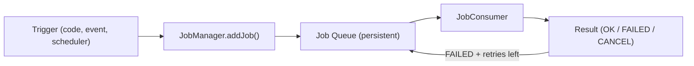
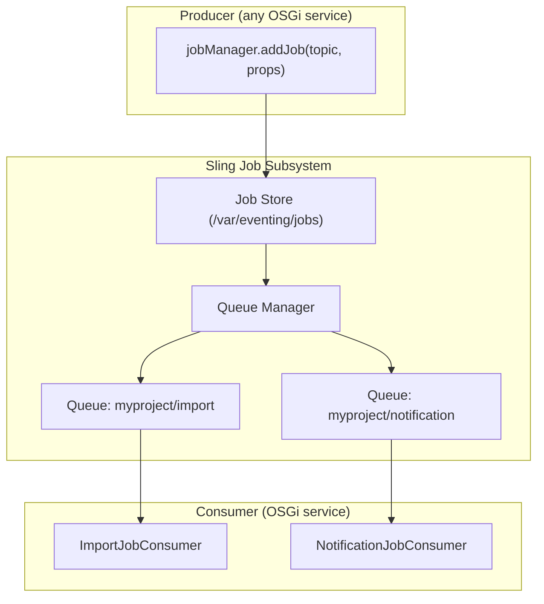

# Sling Jobs and Schedulers

AEM's background processing is built on two complementary mechanisms:

- **Sling Jobs** -- guaranteed, persistent, cluster-aware task execution with automatic retries
- **Schedulers** -- time-based triggers (cron, periodic) that execute code on a schedule

Together they handle everything from cache warming and report generation to integration
syncs and content cleanup.



---

## Sling Jobs

### Why Sling Jobs?

| Feature                  | Sling Jobs             | Direct execution | EventHandler              |
|--------------------------|------------------------|------------------|---------------------------|
| **Guaranteed execution** | Yes (persisted to JCR) | No               | No                        |
| **Survives restart**     | Yes                    | No               | No                        |
| **Automatic retries**    | Yes (configurable)     | No               | No                        |
| **Cluster-aware**        | Yes (runs on one node) | No               | All nodes                 |
| **Monitoring**           | Felix console, JMX     | None             | None                      |
| **Async**                | Always                 | Depends          | Async but fire-and-forget |

Use Sling Jobs whenever failure of the operation would mean **data loss** or an
**inconsistent state** -- e.g., sending emails, replication, third-party API calls,
report generation.

### Architecture



Jobs are stored in the JCR under `/var/eventing/jobs/` and survive restarts. The
Queue Manager assigns jobs to consumers based on the **job topic**.

---

### Creating Jobs

Inject `JobManager` and call `addJob()`:

```java
import org.apache.sling.event.jobs.Job;
import org.apache.sling.event.jobs.JobManager;
import org.osgi.service.component.annotations.Component;
import org.osgi.service.component.annotations.Reference;

import java.util.HashMap;
import java.util.Map;

@Component(service = AssetImportService.class)
public class AssetImportService {

    // Job topics follow a reverse-domain naming convention
    public static final String JOB_TOPIC = "com/myproject/jobs/asset-import";

    @Reference
    private JobManager jobManager;

    public void scheduleImport(String sourceUrl, String targetPath) {
        Map<String, Object> properties = new HashMap<>();
        properties.put("sourceUrl", sourceUrl);
        properties.put("targetPath", targetPath);
        properties.put("requestedBy", "admin");
        properties.put("timestamp", System.currentTimeMillis());

        Job job = jobManager.addJob(JOB_TOPIC, properties);

        if (job != null) {
            // Job was accepted and queued
            log.info("Import job created: {}", job.getId());
        }
    }
}
```

#### Job properties

Job properties are stored as a `Map<String, Object>`. Supported value types:
`String`, `Boolean`, `Integer`, `Long`, `Double`, `String[]`, `Calendar`.

> Do **not** store large objects (binary data, entire documents) in job properties.
> Store a reference path or ID instead.

---

### Consuming Jobs

Implement `JobConsumer` and register it for a topic:

```java
import org.apache.sling.event.jobs.Job;
import org.apache.sling.event.jobs.consumer.JobConsumer;
import org.osgi.service.component.annotations.Component;
import org.osgi.service.component.annotations.Reference;
import org.slf4j.Logger;
import org.slf4j.LoggerFactory;

@Component(
    service = JobConsumer.class,
    property = {
        JobConsumer.PROPERTY_TOPICS + "=" + AssetImportService.JOB_TOPIC
    }
)
public class AssetImportJobConsumer implements JobConsumer {

    private static final Logger LOG = LoggerFactory.getLogger(AssetImportJobConsumer.class);

    @Reference
    private ResourceResolverFactory resolverFactory;

    @Override
    public JobResult process(Job job) {
        String sourceUrl = job.getProperty("sourceUrl", String.class);
        String targetPath = job.getProperty("targetPath", String.class);

        LOG.info("Processing asset import: {} → {}", sourceUrl, targetPath);

        try {
            // Perform the actual work
            importAsset(sourceUrl, targetPath);

            LOG.info("Import completed successfully");
            return JobResult.OK;

        } catch (TransientException e) {
            // Temporary failure (network issue, timeout) -- retry
            LOG.warn("Transient failure, will retry: {}", e.getMessage());
            return JobResult.FAILED;

        } catch (Exception e) {
            // Permanent failure -- do not retry
            LOG.error("Permanent failure, cancelling job: {}", e.getMessage(), e);
            return JobResult.CANCEL;
        }
    }

    private void importAsset(String sourceUrl, String targetPath) throws Exception {
        // Implementation here
    }
}
```

### JobResult values

| Result             | Behaviour                                                        |
|--------------------|------------------------------------------------------------------|
| `JobResult.OK`     | Job completed successfully; removed from queue                   |
| `JobResult.FAILED` | Job failed; will be retried if retries remain                    |
| `JobResult.CANCEL` | Job failed permanently; removed from queue, no retry             |
| `JobResult.ASYNC`  | Job is processing asynchronously; call `job.acknowledge()` later |

---

### JobExecutor (alternative)

`JobExecutor` is a more modern alternative to `JobConsumer` that provides an
`JobExecutionContext` for progress reporting and cancellation:

```java
import org.apache.sling.event.jobs.Job;
import org.apache.sling.event.jobs.consumer.JobExecutor;
import org.apache.sling.event.jobs.consumer.JobExecutionContext;
import org.apache.sling.event.jobs.consumer.JobExecutionResult;

@Component(
    service = JobExecutor.class,
    property = {
        JobExecutor.PROPERTY_TOPICS + "=" + "com/myproject/jobs/bulk-update"
    }
)
public class BulkUpdateJobExecutor implements JobExecutor {

    @Override
    public JobExecutionResult process(Job job, JobExecutionContext context) {
        int totalItems = job.getProperty("totalItems", 100);

        context.initProgress(totalItems, -1);

        for (int i = 0; i < totalItems; i++) {
            // Check if the job was cancelled
            if (context.isStopped()) {
                return context.result().message("Job was stopped").cancelled();
            }

            // Process item
            processItem(i);
            context.incrementProgressCount(1);
            context.log("Processed item {0} of {1}", i + 1, totalItems);
        }

        return context.result().message("All items processed").succeeded();
    }
}
```

---

### Queue Configuration

Job queues control concurrency, ordering, and retry behaviour. Configure them via
OSGi:

```json title="ui.config/.../config/org.apache.sling.event.jobs.QueueConfiguration~import.cfg.json"
{
    "queue.name": "Asset Import Queue",
    "queue.topics": ["com/myproject/jobs/asset-import"],
    "queue.type": "ORDERED",
    "queue.maxparallel": 1,
    "queue.retries": 5,
    "queue.retrydelay": 30000,
    "queue.priority": "NORM",
    "queue.keepJobs": false
}
```

#### Queue types

| Type                | Behaviour                                                                         |
|---------------------|-----------------------------------------------------------------------------------|
| `ORDERED`           | Jobs processed one at a time, in order; if one fails, the queue pauses            |
| `UNORDERED`         | Jobs processed in parallel (up to `maxparallel`); failures don't block other jobs |
| `TOPIC_ROUND_ROBIN` | Distributes jobs across cluster nodes in round-robin fashion                      |

#### Key properties

| Property                            | Default | Description                                        |
|-------------------------------------|---------|----------------------------------------------------|
| `queue.retries`                     | 10      | Max retry attempts before giving up                |
| `queue.retrydelay`                  | 2000    | Delay between retries (ms)                         |
| `queue.maxparallel`                 | 15      | Max concurrent job processing threads              |
| `queue.keepJobs`                    | false   | Keep finished jobs in the JCR (for auditing)       |
| `queue.preferRunOnCreationInstance` | false   | Prefer running the job on the node that created it |

---

## Schedulers

Schedulers execute code at specific times or intervals. AEM supports two patterns.

### Pattern 1: OSGi Scheduler service (recommended)

Register a `Runnable` as an OSGi service with scheduler properties:

```java
import org.osgi.service.component.annotations.Activate;
import org.osgi.service.component.annotations.Component;
import org.osgi.service.component.annotations.Modified;
import org.osgi.service.metatype.annotations.AttributeDefinition;
import org.osgi.service.metatype.annotations.Designate;
import org.osgi.service.metatype.annotations.ObjectClassDefinition;
import org.slf4j.Logger;
import org.slf4j.LoggerFactory;

@Component(
    service = Runnable.class,
    immediate = true
)
@Designate(ocd = CacheWarmerScheduler.Config.class)
public class CacheWarmerScheduler implements Runnable {

    private static final Logger LOG = LoggerFactory.getLogger(CacheWarmerScheduler.class);

    @ObjectClassDefinition(name = "Cache Warmer Scheduler")
    @interface Config {

        @AttributeDefinition(name = "Cron expression",
            description = "Quartz cron expression. Default: every hour")
        String scheduler_expression() default "0 0 * * * ?";

        @AttributeDefinition(name = "Concurrent",
            description = "Allow concurrent execution")
        boolean scheduler_concurrent() default false;

        @AttributeDefinition(name = "Enabled")
        boolean enabled() default true;

        @AttributeDefinition(name = "Paths to warm")
        String[] paths() default {"/content/mysite/en"};
    }

    private Config config;

    @Activate
    @Modified
    protected void activate(Config config) {
        this.config = config;
    }

    @Override
    public void run() {
        if (!config.enabled()) {
            return;
        }

        LOG.info("Cache warmer running for {} paths", config.paths().length);

        for (String path : config.paths()) {
            warmCache(path);
        }
    }

    private void warmCache(String path) {
        // Fetch pages to warm the Dispatcher cache
        LOG.debug("Warming cache for: {}", path);
    }
}
```

OSGi config to deploy:

```json title="ui.config/.../config.publish/com.myproject.core.schedulers.CacheWarmerScheduler.cfg.json"
{
    "scheduler.expression": "0 0 */2 * * ?",
    "scheduler.concurrent": false,
    "enabled": true,
    "paths": ["/content/mysite/en", "/content/mysite/de"]
}
```

### Cron expression reference

| Expression          | Meaning                                      |
|---------------------|----------------------------------------------|
| `0 0 * * * ?`       | Every hour at :00                            |
| `0 0/15 * * * ?`    | Every 15 minutes                             |
| `0 0 2 * * ?`       | Daily at 2:00 AM                             |
| `0 0 2 ? * MON-FRI` | Weekdays at 2:00 AM                          |
| `0 0 0 1 * ?`       | First day of each month at midnight          |
| `0 0/5 8-17 * * ?`  | Every 5 minutes during business hours (8-17) |

### Pattern 2: Sling Scheduler API (programmatic)

For dynamic scheduling (e.g., scheduling a task from a servlet or workflow):

```java
import org.apache.sling.commons.scheduler.Scheduler;
import org.apache.sling.commons.scheduler.ScheduleOptions;

@Reference
private Scheduler scheduler;

public void scheduleOneTimeTask(String taskId, long delayMs) {
    ScheduleOptions options = scheduler.AT(
        new Date(System.currentTimeMillis() + delayMs)
    );
    options.name(taskId);
    options.canRunConcurrently(false);

    scheduler.schedule(this::executeTask, options);
}

public void schedulePeriodic(String taskId, int intervalSeconds) {
    ScheduleOptions options = scheduler.EXPR("0 0/" + (intervalSeconds / 60) + " * * * ?");
    options.name(taskId);
    options.canRunConcurrently(false);

    scheduler.schedule(this::executeTask, options);
}

public void cancelSchedule(String taskId) {
    scheduler.unschedule(taskId);
}

private void executeTask() {
    // Task logic here
}
```

---

## Practical Examples

### Integration sync scheduler

Sync product data from a PIM every 30 minutes:

```java
@Component(service = Runnable.class, immediate = true)
@Designate(ocd = PimSyncScheduler.Config.class)
public class PimSyncScheduler implements Runnable {

    @ObjectClassDefinition(name = "PIM Sync Scheduler")
    @interface Config {
        @AttributeDefinition(name = "Cron expression")
        String scheduler_expression() default "0 0/30 * * * ?";

        @AttributeDefinition(name = "Concurrent")
        boolean scheduler_concurrent() default false;

        @AttributeDefinition(name = "PIM API endpoint")
        String pimEndpoint() default "";
    }

    @Reference
    private JobManager jobManager;

    private Config config;

    @Activate
    protected void activate(Config config) {
        this.config = config;
    }

    @Override
    public void run() {
        // The scheduler creates a Sling Job for the actual work
        // This ensures guaranteed execution with retries
        Map<String, Object> props = new HashMap<>();
        props.put("pimEndpoint", config.pimEndpoint());
        props.put("triggeredAt", System.currentTimeMillis());

        jobManager.addJob("com/myproject/jobs/pim-sync", props);
    }
}
```

> **Pattern:** The scheduler creates the job; the `JobConsumer` does the work. This
> separates scheduling concerns from execution and ensures retries on failure.

### Content cleanup job

Remove temporary content older than 30 days:

```java
@Component(
    service = JobConsumer.class,
    property = {
        JobConsumer.PROPERTY_TOPICS + "=com/myproject/jobs/content-cleanup"
    }
)
public class ContentCleanupJobConsumer implements JobConsumer {

    @Reference
    private ResourceResolverFactory resolverFactory;

    @Override
    public JobResult process(Job job) {
        int maxAgeDays = job.getProperty("maxAgeDays", 30);

        Map<String, Object> authInfo = Map.of(
            ResourceResolverFactory.SUBSERVICE, "cleanup-service"
        );

        try (ResourceResolver resolver = resolverFactory.getServiceResourceResolver(authInfo)) {
            Calendar cutoff = Calendar.getInstance();
            cutoff.add(Calendar.DAY_OF_MONTH, -maxAgeDays);

            // Find and delete old temporary content
            String query = String.format(
                "SELECT * FROM [nt:unstructured] WHERE ISDESCENDANTNODE('/tmp/myproject') " +
                "AND [jcr:created] < CAST('%s' AS DATE)",
                cutoff.toInstant().toString()
            );

            Iterator<Resource> results = resolver.findResources(query, "JCR-SQL2");
            int deleted = 0;

            while (results.hasNext()) {
                Resource resource = results.next();
                resolver.delete(resource);
                deleted++;

                // Batch commit every 100 deletes
                if (deleted % 100 == 0) {
                    resolver.commit();
                }
            }

            resolver.commit();
            log.info("Cleanup complete: deleted {} resources", deleted);
            return JobResult.OK;

        } catch (Exception e) {
            log.error("Cleanup failed", e);
            return JobResult.FAILED;
        }
    }
}
```

---

## Monitoring Jobs

### Felix Web Console

Navigate to `/system/console/slingevent` to see:

- Active queues and their configuration
- Queued, active, and finished jobs
- Failed jobs and retry counts
- Job statistics

### Groovy Console

```groovy
import org.apache.sling.event.jobs.JobManager

def jobManager = getService(JobManager.class)

// List all active jobs
def jobs = jobManager.findJobs(JobManager.QueryType.ACTIVE, null, 0, null)
jobs.each { job ->
    println "Topic: ${job.topic}, ID: ${job.id}, Created: ${job.created.time}"
}

// Count queued jobs for a specific topic
def count = jobManager.findJobs(
    JobManager.QueryType.QUEUED,
    "com/myproject/jobs/asset-import",
    0, null
).size()
println "Queued import jobs: $count"
```

### JMX

Sling Jobs expose JMX MBeans under `org.apache.sling:type=queues`. Monitor:

- Queue depth
- Processing times
- Failure rates
- Average wait times

---

## Sling Jobs vs EventHandler vs Workflow

| Aspect                   | Sling Jobs                  | EventHandler          | Workflow                       |
|--------------------------|-----------------------------|-----------------------|--------------------------------|
| **Guaranteed execution** | Yes                         | No                    | Yes                            |
| **Retries**              | Automatic (configurable)    | None                  | Manual (retry step)            |
| **Persistence**          | JCR (`/var/eventing/jobs`)  | None                  | JCR (`/var/workflow`)          |
| **Visual modelling**     | No                          | No                    | Yes (workflow editor)          |
| **User tasks**           | No                          | No                    | Yes (inbox, participant steps) |
| **Cluster**              | Runs on one node            | Runs on all nodes     | Runs on one node               |
| **Best for**             | Backend tasks, integrations | Lightweight reactions | Multi-step business processes  |

---

## Cluster Behaviour

In a clustered AEM setup (multiple author instances), Sling Jobs ensure each job
runs on **exactly one node**:

- The Job Queue Manager distributes jobs across the cluster
- By default, any node can pick up any job
- Set `queue.preferRunOnCreationInstance = true` to prefer the originating node
- If a node goes down, its queued jobs are redistributed to surviving nodes

---

## AEMaaCS Considerations

- Sling Jobs work on AEMaaCS, but the **underlying storage differs** from on-prem
- Jobs are still persisted and survive restarts
- The Felix console (`/system/console/slingevent`) is available on author via Developer Console
- **Scheduler frequency limits**: avoid scheduling tasks more frequently than every 5 minutes
  on AEMaaCS; the infrastructure may throttle or de-duplicate
- For heavy background work, consider **Adobe I/O App Builder** actions triggered by I/O Events
  instead of long-running Sling Jobs

---

## Best Practices

### Separate scheduling from execution

The scheduler creates the job; the `JobConsumer` does the work. This gives you retries,
monitoring, and cluster-awareness for free.

### Use meaningful job topics

Follow reverse-domain notation: `com/myproject/jobs/asset-import`. This makes filtering
and monitoring easy.

### Keep jobs short

Long-running jobs (> 5 minutes) tie up queue threads. For bulk operations, break the work
into smaller jobs or use `JobExecutor` with progress tracking.

### Always handle all three outcomes

Your `JobConsumer` should return `OK`, `FAILED`, or `CANCEL` based on the error type.
Never swallow exceptions silently.

### Don't store large data in job properties

Store a path or ID, not the data itself. Job properties are persisted in the JCR.

### Use service users for jobs

Jobs run without a user session. Use `ResourceResolverFactory.getServiceResourceResolver()`
with a dedicated service user.

---

## Common Pitfalls

| Pitfall                             | Solution                                                                                                  |
|-------------------------------------|-----------------------------------------------------------------------------------------------------------|
| Jobs never execute                  | Check that a `JobConsumer` is registered for the topic; verify in Felix console                           |
| Jobs execute on all cluster nodes   | This is EventHandler behaviour, not Sling Jobs; make sure you're using `JobManager.addJob()`              |
| Queue is stuck / paused             | An ORDERED queue pauses when a job fails; check for failed jobs and fix or cancel them                    |
| Scheduler runs but nothing happens  | Verify the cron expression; check that `scheduler.concurrent` is set correctly                            |
| Scheduler runs too often on AEMaaCS | AEMaaCS may run multiple instances; use `scheduler.concurrent = false` and Sling Jobs for the actual work |
| Memory issues with bulk jobs        | Process in batches; commit the ResourceResolver periodically; don't accumulate results in memory          |
| Job retries endlessly               | Return `JobResult.CANCEL` for permanent failures; configure `queue.retries`                               |

## See also

- [Event Listeners and Handlers](./event-listener.mdx) -- EventHandler vs Sling Jobs comparison
- [Workflows](./workflows.mdx) -- multi-step business processes
- [OSGi Configuration](./osgi-configuration.mdx) -- configuring schedulers per run mode
- [Sling Models and Services](./sling-models.mdx) -- OSGi service patterns
- [Java Best Practices](./java-best-practices.mdx) -- threading and concurrency
- [AEM as a Cloud Service](../infrastructure/cloud-service.mdx) -- AEMaaCS constraints and RDEs
- [Adobe I/O App Builder](../infrastructure/aio-app-builder.md) -- serverless alternative for heavy processing
