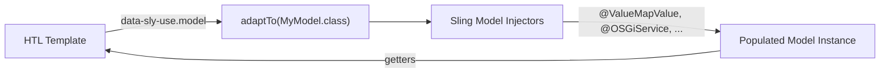

# Sling Models and Services

Sling Models are annotation-driven Java classes that automatically map AEM content (JCR properties,
child resources, OSGi services) to Java objects. They are the **standard approach** for implementing
component logic in AEM and replace the older `WCMUsePojo` and JavaScript Use-API patterns.

This page covers how to build, use, and test Sling Models, as well as the common AEM service APIs
you'll use alongside them.

## How Sling Models Work



1. The HTL template triggers `adaptTo()` via `data-sly-use`
2. Sling locates the model class by matching the `resourceType` or class name
3. The injector framework populates all annotated fields
4. `@PostConstruct` runs any initialisation logic
5. The model instance is returned to HTL for rendering

## Defining a Sling Model

### Minimal model

```java title="core/.../models/GreetingModel.java"
package com.myproject.core.models;

import org.apache.sling.api.SlingHttpServletRequest;
import org.apache.sling.models.annotations.DefaultInjectionStrategy;
import org.apache.sling.models.annotations.Model;
import org.apache.sling.models.annotations.injectorspecific.ValueMapValue;

@Model(
    adaptables = SlingHttpServletRequest.class,
    defaultInjectionStrategy = DefaultInjectionStrategy.OPTIONAL
)
public class GreetingModel {

    @ValueMapValue
    private String title;

    public String getTitle() {
        return title != null ? title : "Hello, World!";
    }
}
```

```html title="greeting.html"
<sly data-sly-use.model="com.myproject.core.models.GreetingModel"/>
<h1>${model.title}</h1>
```

### Full model with all common features

```java title="core/.../models/ArticleModel.java"
package com.myproject.core.models;

import com.adobe.cq.export.json.ComponentExporter;
import com.day.cq.wcm.api.Page;
import com.fasterxml.jackson.annotation.JsonProperty;
import com.myproject.core.services.DateFormatterService;

import org.apache.commons.lang3.StringUtils;
import org.apache.sling.api.SlingHttpServletRequest;
import org.apache.sling.api.resource.Resource;
import org.apache.sling.models.annotations.Default;
import org.apache.sling.models.annotations.DefaultInjectionStrategy;
import org.apache.sling.models.annotations.Exporter;
import org.apache.sling.models.annotations.Model;
import org.apache.sling.models.annotations.injectorspecific.*;

import javax.annotation.PostConstruct;
import java.util.Calendar;
import java.util.Collections;
import java.util.List;

@Model(
    adaptables = SlingHttpServletRequest.class,
    adapters = {ArticleModel.class, ComponentExporter.class},
    resourceType = ArticleModel.RESOURCE_TYPE,
    defaultInjectionStrategy = DefaultInjectionStrategy.OPTIONAL
)
@Exporter(name = "jackson", extensions = "json")
public class ArticleModel implements ComponentExporter {

    static final String RESOURCE_TYPE = "myproject/components/article";

    // --- JCR Properties ---
    @ValueMapValue
    private String title;

    @ValueMapValue
    private String description;

    @ValueMapValue
    private Calendar publishDate;

    @ValueMapValue
    @Default(values = "general")
    private String category;

    // --- Child Resources (multifield) ---
    @ChildResource
    private List<Resource> relatedLinks;

    // --- Sling Objects ---
    @SlingObject
    private Resource resource;

    // --- Script Variables ---
    @ScriptVariable
    private Page currentPage;

    // --- OSGi Services ---
    @OSGiService
    private DateFormatterService dateFormatter;

    // --- Computed fields ---
    private String formattedDate;

    @PostConstruct
    protected void init() {
        if (publishDate != null && dateFormatter != null) {
            formattedDate = dateFormatter.format(publishDate);
        }
    }

    // --- Getters ---

    @JsonProperty("title")
    public String getTitle() {
        return StringUtils.defaultIfBlank(title, currentPage != null
            ? currentPage.getTitle() : "Untitled");
    }

    public String getDescription() { return description; }
    public String getFormattedDate() { return formattedDate; }
    public String getCategory() { return category; }

    public List<Resource> getRelatedLinks() {
        return relatedLinks != null
            ? Collections.unmodifiableList(relatedLinks)
            : Collections.emptyList();
    }

    public boolean isEmpty() {
        return StringUtils.isBlank(title) && StringUtils.isBlank(description);
    }

    @Override
    public String getExportedType() {
        return RESOURCE_TYPE;
    }
}
```

### Adaptables: Request vs Resource

| Adaptable | When to use | Available injections |
|-----------|------------|---------------------|
| `SlingHttpServletRequest.class` | **Default for components** -- HTL rendering, servlets | Everything: resource, request, session, script variables, WCM mode |
| `Resource.class` | Utility models, child models for `@ChildResource`, unit tests | Resource properties, child resources, OSGi services |
| Both (`{Request.class, Resource.class}`) | Models used from both contexts | Use `@Via("resource")` when adapting from request to access resource properties |

:::tip
Always prefer `SlingHttpServletRequest.class` for component models. Use `Resource.class` only for
child models (e.g. multifield items via `@ChildResource`) or utility models that don't need
request context.
:::

### Binding to a resource type

When you specify `resourceType` in the `@Model` annotation, Sling automatically selects this model
when HTL uses `data-sly-use` without a fully qualified class name:

```java
@Model(adaptables = SlingHttpServletRequest.class,
       resourceType = "myproject/components/teaser")
public class TeaserModel { ... }
```

```html
<!-- Sling resolves the model automatically via the component's sling:resourceType -->
<sly data-sly-use.model="com.myproject.core.models.TeaserModel"/>

<!-- Or even shorter if resourceType is set: -->
<sly data-sly-use.model="myproject/components/teaser"/>
```

## Injection Annotations

For a complete reference of all Sling Model annotations (`@ValueMapValue`, `@OSGiService`, `@Self`,
`@ChildResource`, `@ScriptVariable`, `@RequestAttribute`, `@Via`, `@Default`, etc.), see the
dedicated [Sling Model Annotations Reference](../components/annotations/sling-model-annotations.mdx).

### Quick cheat sheet

| Annotation | Injects |
|-----------|---------|
| `@ValueMapValue` | JCR property from the resource's ValueMap |
| `@ChildResource` | Child JCR nodes as models or resources |
| `@OSGiService` | OSGi services |
| `@SlingObject` | Resource, ResourceResolver, Request, Response |
| `@ScriptVariable` | HTL bindings: `currentPage`, `properties`, `pageManager`, etc. |
| `@Self` | The adaptable itself or another model adapted from it |
| `@RequestAttribute` | Request attributes (e.g. from `data-sly-use` parameters) |
| `@PostConstruct` | Runs initialisation after all injections |

---

## JSON Export (Sling Model Exporter)

The Sling Model Exporter framework lets you serialize a model as JSON via a `.model.json` URL.
This is essential for headless AEM, SPA Editor, and Content as a Service scenarios.

### Setup

```java title="core/.../models/TitleModel.java"
@Model(
    adaptables = SlingHttpServletRequest.class,
    adapters = {TitleModel.class, ComponentExporter.class},
    resourceType = TitleModel.RESOURCE_TYPE,
    defaultInjectionStrategy = DefaultInjectionStrategy.OPTIONAL
)
@Exporter(name = "jackson", extensions = "json")
public class TitleModel implements ComponentExporter {

    static final String RESOURCE_TYPE = "myproject/components/title";

    @JsonProperty("title")  // optional: customise the JSON key name
    @ValueMapValue
    private String title;

    public String getTitle() {
        return title;
    }

    @Override
    public String getExportedType() {
        return RESOURCE_TYPE;
    }
}
```

### JCR component definition

```xml title="ui.apps/.../components/title/.content.xml"
<?xml version="1.0" encoding="UTF-8"?>
<jcr:root xmlns:cq="http://www.day.com/jcr/cq/1.0"
          xmlns:jcr="http://www.jcp.org/jcr/1.0"
    cq:icon="textLeft"
    jcr:description="Displays a title."
    jcr:primaryType="cq:Component"
    jcr:title="Title"
    componentGroup="My Project"/>
```

### Usage

Request:
```text
GET /content/my-site/en/home/jcr:content/root/container/title.model.json
```

Response:
```json
{
    ":type": "myproject/components/title",
    "title": "Welcome to My Site"
}
```

### Controlling JSON output

| Annotation | Purpose |
|-----------|---------|
| `@JsonProperty("name")` | Rename a field in JSON output |
| `@JsonIgnore` | Exclude a getter from JSON output |
| `@JsonInclude(NON_NULL)` | Omit null values |
| `@JsonRootName("article")` | Wrap output in a root element |

---

## Accessing Template Policies

Editable template policies let template authors configure component settings (e.g. allowed heading
levels, default variants) via the template editor. These settings are stored as content policies
and can be read in your Sling Model.

### Design dialog

Define the policy fields in a `_cq_design_dialog`:

```xml title="ui.apps/.../components/mycomponent/_cq_design_dialog/.content.xml"
<someSelectProperty
    jcr:primaryType="nt:unstructured"
    sling:resourceType="granite/ui/components/coral/foundation/form/select"
    fieldLabel="Size"
    required="{Boolean}true"
    name="./size">
    <items jcr:primaryType="nt:unstructured">
        <small jcr:primaryType="nt:unstructured" text="Small" selected="{Boolean}true" value="small"/>
        <medium jcr:primaryType="nt:unstructured" text="Medium" value="medium"/>
        <large jcr:primaryType="nt:unstructured" text="Large" value="large"/>
    </items>
</someSelectProperty>
```

### Reading policy values

**Option 1: Utility methods** (reusable across models)

```java title="core/.../utilities/PolicyUtils.java"
public final class PolicyUtils {

    private PolicyUtils() {}

    /**
     * Retrieves the ContentPolicy for the given resource.
     */
    public static ContentPolicy getContentPolicy(Resource resource) {
        ContentPolicyManager cpm = resource.getResourceResolver()
            .adaptTo(ContentPolicyManager.class);
        return cpm != null ? cpm.getPolicy(resource) : null;
    }

    /**
     * Reads a typed property from a content policy.
     */
    public static <T> T getPolicyProperty(ContentPolicy policy,
            String property, Class<T> type) {
        if (policy != null) {
            return policy.getProperties().get(property, type);
        }
        return null;
    }

    /**
     * Reads a typed property with a default fallback.
     */
    public static <T> T getPolicyProperty(ContentPolicy policy,
            String property, T defaultValue) {
        if (policy != null) {
            return policy.getProperties().get(property, defaultValue);
        }
        return defaultValue;
    }
}
```

**Usage in a Sling Model:**

```java
@SlingObject
private Resource resource;

private String size;

@PostConstruct
protected void init() {
    ContentPolicy policy = PolicyUtils.getContentPolicy(resource);
    size = PolicyUtils.getPolicyProperty(policy, "size", "small");
}
```

**Option 2: Using `@ScriptVariable` with `currentStyle`**

For simpler cases, access policy values directly via the `currentStyle` binding:

```java
@ScriptVariable
private Style currentStyle;

public String getSize() {
    return currentStyle != null
        ? currentStyle.get("size", "small")
        : "small";
}
```

---

## Common AEM Service APIs

### WCM Mode (Author vs Publish)

Determine the current WCM mode to conditionally render content or enable/disable features:

```java
import com.day.cq.wcm.api.WCMMode;

public boolean isEditMode(SlingHttpServletRequest request) {
    WCMMode mode = WCMMode.fromRequest(request);
    return mode == WCMMode.EDIT || mode == WCMMode.DESIGN;
}

public boolean isAuthorEnvironment(SlingHttpServletRequest request) {
    WCMMode mode = WCMMode.fromRequest(request);
    switch (mode) {
        case EDIT:
        case DESIGN:
        case PREVIEW:
            return true;
        default:
            return false;
    }
}
```

| WCMMode | Environment | Description |
|---------|-------------|-------------|
| `EDIT` | Author | Dialog editing is active |
| `PREVIEW` | Author | Author preview mode |
| `DESIGN` | Author | Template editor / design mode |
| `ANALYTICS` | Author | Analytics overlay mode |
| `READ_ONLY` | Author | Read-only view |
| `DISABLED` | Publish | WCM is disabled (normal rendering) |

:::tip
In HTL, you can use `wcmmode.edit`, `wcmmode.preview`, and `wcmmode.disabled` directly without a
Sling Model:

```html
<div data-sly-test="${wcmmode.edit}" class="cq-placeholder">
    Click to configure this component.
</div>
```
:::

### TagManager

Resolve AEM tags to their titles and descriptions:

```java title="Reading tag metadata"
@SlingObject
private SlingHttpServletRequest request;

@ValueMapValue(name = "cq:tags")
private String[] tagIds;

public List<TagInfo> getResolvedTags() {
    TagManager tagManager = request.getResourceResolver().adaptTo(TagManager.class);
    if (tagManager == null || tagIds == null) {
        return Collections.emptyList();
    }

    List<TagInfo> tags = new ArrayList<>();
    for (String tagId : tagIds) {
        Tag tag = tagManager.resolve(tagId);
        if (tag != null) {
            tags.add(new TagInfo(
                tag.getTagID(),
                tag.getTitle(),
                tag.getDescription()
            ));
        }
    }
    return tags;
}
```

Common `TagManager` operations:

| Method | Purpose |
|--------|---------|
| `resolve(tagId)` | Resolves a tag ID to a `Tag` object |
| `createTag(tagId, title, description)` | Creates a new tag |
| `find(keyword)` | Searches tags by keyword |
| `getTags(resource)` | Gets all tags for a resource |
| `setTags(resource, tags)` | Sets tags on a resource |

### UserManager

Access user and group information via the JCR `UserManager`:

```java title="Reading user profiles"
import org.apache.jackrabbit.api.security.user.UserManager;
import org.apache.jackrabbit.api.security.user.User;
import org.apache.jackrabbit.api.security.user.Authorizable;

public String getUserDisplayName(ResourceResolver resolver, String userId) {
    try {
        Session session = resolver.adaptTo(Session.class);
        UserManager userManager = ((JackrabbitSession) session).getUserManager();
        Authorizable authorizable = userManager.getAuthorizable(userId);

        if (authorizable != null && !authorizable.isGroup()) {
            User user = (User) authorizable;
            Value[] givenName = user.getProperty("profile/givenName");
            Value[] familyName = user.getProperty("profile/familyName");

            String first = givenName != null && givenName.length > 0
                ? givenName[0].getString() : "";
            String last = familyName != null && familyName.length > 0
                ? familyName[0].getString() : "";

            return (first + " " + last).trim();
        }
    } catch (RepositoryException e) {
        LOG.error("Error reading user profile for {}", userId, e);
    }
    return userId; // fallback to userId
}
```

### PageManager

Navigate the page hierarchy and perform page operations:

```java
@ScriptVariable
private PageManager pageManager;

@ScriptVariable
private Page currentPage;

public List<Page> getChildPages() {
    List<Page> children = new ArrayList<>();
    Iterator<Page> childIterator = currentPage.listChildren();
    while (childIterator.hasNext()) {
        Page child = childIterator.next();
        if (!child.isHideInNav()) {
            children.add(child);
        }
    }
    return children;
}

public Page getParentPage(int level) {
    // Get the page at a specific depth (0 = root, 1 = site, 2 = language, etc.)
    return currentPage.getAbsoluteParent(level);
}
```

---

## ResourceResolver

The `ResourceResolver` is the central API for accessing JCR content in Sling. Understanding its
lifecycle is critical to avoiding resource leaks and session issues.

### Implicit vs explicit resolvers

| Type | Source | Who closes it? |
|------|--------|---------------|
| **Implicit** | `request.getResourceResolver()`, `@SlingObject` | The framework -- **never close it yourself** |
| **Explicit** | `resourceResolverFactory.getServiceResourceResolver(...)` | **You** -- always close it |

### Using service resource resolvers

When you need elevated permissions (e.g. in workflows, scheduled jobs, or event listeners), use
a service resource resolver:

```java title="Safe pattern with try-with-resources"
@Reference
private ResourceResolverFactory resolverFactory;

public void doPrivilegedOperation() {
    Map<String, Object> params = Map.of(
        ResourceResolverFactory.SUBSERVICE, "my-service"
    );

    try (ResourceResolver resolver = resolverFactory.getServiceResourceResolver(params)) {
        Resource resource = resolver.getResource("/content/my-site/en");
        // ... perform operations ...
        resolver.commit();
    } catch (LoginException e) {
        LOG.error("Could not obtain service resolver", e);
    } catch (PersistenceException e) {
        LOG.error("Could not persist changes", e);
    }
}
```

:::warning
**Never close an implicit ResourceResolver.** Closing the request's resolver (`request.getResourceResolver()`)
kills the underlying JCR session for the entire request, breaking all subsequent processing.

**Always close explicit ResourceResolvers.** Service resolvers opened via `ResourceResolverFactory` must be
closed, ideally using `try-with-resources`.

**Rule of thumb:** close the resolver where you opened it. If a resolver is passed as a parameter,
the caller is responsible for its lifecycle.
:::

### Common operations

```java
// Read a resource
Resource resource = resolver.getResource("/content/my-site/en/home");

// Check existence
boolean exists = resolver.getResource(path) != null;

// Create a resource
Map<String, Object> props = Map.of("jcr:primaryType", "nt:unstructured", "title", "New Page");
resolver.create(parentResource, "child-name", props);

// Delete a resource
resolver.delete(resource);

// Persist changes (required after create/delete/modify)
resolver.commit();

// Map an internal path to an external URL
String externalUrl = resolver.map(request, "/content/my-site/en/about");
// → "/en/about.html"

// Adapt to JCR Session (when you need low-level JCR API)
Session session = resolver.adaptTo(Session.class);
```

---

## OSGi Services

Business logic that is shared across components, servlets, or workflows should live in OSGi services.
Sling Models should stay focused on component rendering; complex logic belongs in services.

### Defining a service

```java title="core/.../services/DateFormatterService.java"
public interface DateFormatterService {
    String format(Calendar date);
    String format(Calendar date, String pattern);
}
```

```java title="core/.../services/impl/DateFormatterServiceImpl.java"
@Component(service = DateFormatterService.class)
public class DateFormatterServiceImpl implements DateFormatterService {

    @Activate
    private DateFormatterConfig config;

    @Override
    public String format(Calendar date) {
        return format(date, config.defaultPattern());
    }

    @Override
    public String format(Calendar date, String pattern) {
        if (date == null) return "";
        SimpleDateFormat sdf = new SimpleDateFormat(pattern);
        return sdf.format(date.getTime());
    }

    @ObjectClassDefinition(name = "Date Formatter Configuration")
    @interface DateFormatterConfig {
        @AttributeDefinition(name = "Default Pattern")
        String defaultPattern() default "MMMM d, yyyy";
    }
}
```

### Using services in Sling Models

```java
@OSGiService
private DateFormatterService dateFormatter;
```

For detailed OSGi service patterns (typed configs, factory configs, run modes, service users),
see [OSGi Configuration](./osgi-configuration.mdx).

---

## Transport Handler

A `TransportHandler` intercepts the replication pipeline and lets you route content to external
systems (CI/CD pipelines, CDNs, search indexes, etc.) during activation:

```java title="core/.../replication/ExternalCDNTransportHandler.java"
@Component(
    service = TransportHandler.class,
    immediate = true,
    property = {
        "label=External CDN Purge Handler"
    }
)
public class ExternalCDNTransportHandler implements TransportHandler {

    private static final Logger LOG = LoggerFactory.getLogger(
        ExternalCDNTransportHandler.class);

    /**
     * Return true if this handler should process the replication event.
     * Match by agent configuration (e.g. a custom transport URI scheme).
     */
    @Override
    public boolean canHandle(AgentConfig agentConfig) {
        String transportURI = agentConfig.getTransportURI();
        return transportURI != null && transportURI.startsWith("cdn://");
    }

    /**
     * Called when content is replicated through a matching agent.
     * Use this to push content or purge caches on external systems.
     */
    @Override
    public ReplicationResult deliver(TransportContext ctx,
            ReplicationTransaction tx) throws ReplicationException {
        String path = tx.getAction().getPath();
        LOG.info("Purging CDN cache for: {}", path);

        try {
            // Call external CDN API to purge the path
            purgeExternalCDN(path);
            return ReplicationResult.OK;
        } catch (Exception e) {
            LOG.error("CDN purge failed for {}", path, e);
            return new ReplicationResult(false, 0, "CDN purge failed: " + e.getMessage());
        }
    }

    private void purgeExternalCDN(String path) {
        // HTTP call to CDN invalidation API
    }
}
```

---

## JavaScript Use-API (Legacy)

:::warning
The JavaScript Use-API (server-side Rhino, ES5 only) is **legacy**. Always prefer Sling Models for
new components. It is slower, harder to test, and has limited API access. This section is included
for reference when working with legacy codebases.
:::

```text title="Component file structure"
mycomponent/
├── mycomponent.html
└── helper.js
```

```javascript title="helper.js"
use(function () {
    'use strict';

    // 'this' contains variables passed from HTL via data-sly-use
    var inputValue = this.someVar;

    // ⚠️ Runs server-side (Rhino engine) -- no console.log, no window, no DOM
    // ⚠️ Must use ES5 syntax -- arrow functions, let/const, template literals will fail

    return {
        processedValue: inputValue ? inputValue.toUpperCase() : 'DEFAULT'
    };
});
```

```html title="mycomponent.html"
<div data-sly-use.helper="${'helper.js' @ someVar=properties.title}">
    ${helper.processedValue}
</div>
```

| Feature | Sling Model (Java) | JS Use-API |
|---------|-------------------|------------|
| Language | Java (any version) | ES5 only (Rhino) |
| Performance | Fast (compiled) | Slow (interpreted per request) |
| Unit testing | Full (JUnit, AEM Mocks) | Not testable |
| API access | Full Sling/JCR/AEM API | Limited (no OSGi services) |
| IDE support | Full (autocomplete, refactoring) | Minimal |
| Recommendation | **Always use** | Avoid in new code |

---

## Unit Testing Sling Models

Use [wcm.io AEM Mocks](https://wcm.io/testing/aem-mock/) to test Sling Models without a running
AEM instance:

```java title="core/.../models/GreetingModelTest.java"
@ExtendWith(AemContextExtension.class)
class GreetingModelTest {

    private final AemContext context = new AemContext();

    @BeforeEach
    void setUp() {
        // Register the model class
        context.addModelsForClasses(GreetingModel.class);
    }

    @Test
    void shouldReturnAuthoredTitle() {
        // Create test content
        context.create().page("/content/test", "/conf/test/templates/page");
        context.create().resource("/content/test/jcr:content/mycomponent",
            Map.of("sling:resourceType", "myproject/components/greeting",
                   "title", "Welcome"));

        // Set the current resource
        context.currentResource("/content/test/jcr:content/mycomponent");

        // Adapt and assert
        GreetingModel model = context.request().adaptTo(GreetingModel.class);
        assertNotNull(model);
        assertEquals("Welcome", model.getTitle());
    }

    @Test
    void shouldReturnDefaultWhenTitleMissing() {
        context.create().page("/content/test", "/conf/test/templates/page");
        context.create().resource("/content/test/jcr:content/mycomponent",
            Map.of("sling:resourceType", "myproject/components/greeting"));

        context.currentResource("/content/test/jcr:content/mycomponent");

        GreetingModel model = context.request().adaptTo(GreetingModel.class);
        assertNotNull(model);
        assertEquals("Hello, World!", model.getTitle());
    }
}
```

### Testing with OSGi services

```java
@BeforeEach
void setUp() {
    context.addModelsForClasses(ArticleModel.class);

    // Register a mock or real service
    context.registerService(DateFormatterService.class, new DateFormatterServiceImpl());
}
```

---

## Best Practices

### Keep models thin

Sling Models should focus on **data access and simple transformations**. Complex business logic
belongs in OSGi services that the model injects via `@OSGiService`.

### Use `OPTIONAL` as default strategy

Set `defaultInjectionStrategy = DefaultInjectionStrategy.OPTIONAL` on every model. This prevents
the entire model from returning `null` when a single optional field is missing. Mark truly
required fields with `injectionStrategy = InjectionStrategy.REQUIRED`.

### Return empty collections, not null

```java
// Bad -- callers must null-check
public List<LinkItem> getLinks() {
    return links;
}

// Good -- always safe to iterate
public List<LinkItem> getLinks() {
    return links != null ? Collections.unmodifiableList(links) : Collections.emptyList();
}
```

### Avoid heavy computation in getters

Getters may be called multiple times by HTL. Compute values once in `@PostConstruct` and
return the cached result:

```java
private String slug;  // computed once

@PostConstruct
protected void init() {
    slug = title != null
        ? title.toLowerCase().replaceAll("[^a-z0-9]+", "-")
        : "";
}

public String getSlug() {
    return slug;
}
```

### Always use specific injection annotations

Prefer `@ValueMapValue`, `@OSGiService`, `@SlingObject` over the generic `@Inject`. Specific
annotations are self-documenting and avoid ambiguity.

### Don't store state between requests

Sling Models are **request-scoped** -- a new instance is created for each request. Never store
cross-request state in a model. Use OSGi services with thread-safe patterns for shared state.

## See also

- [Sling Model Annotations Reference](../components/annotations/sling-model-annotations.mdx)
- [@ChildResource](../components/annotations/child-resource.mdx)
- [@ExternalizedValueMapValue](../components/annotations/externalized-value-map-value.mdx)
- [Architecture](../architecture.mdx)
- [Custom Component Guide](../custom-component.mdx)
- [Component Dialogs](../component-dialogs.mdx)
- [HTL Templates](../htl-templates.mdx)
- [Servlets](./servlets.mdx)
- [OSGi Configuration](./osgi-configuration.mdx)
- [Java Best Practices](./java-best-practices.mdx)
- [Filters](./filter.mdx)
- [Context-Aware Configuration](./context-aware-configuration.md) -- site-specific config in Sling Models
- [Sling Jobs and Schedulers](./sling-jobs.md) -- background processing
- [Tags and Taxonomies](../content/tags-taxonomies.md) -- TagManager usage
- [Templates and Policies](../components/templates-policies.md) -- reading template policies
- [Performance](../infrastructure/performance.mdx)
- [Apache Sling Models Documentation](https://sling.apache.org/documentation/bundles/models.html)
