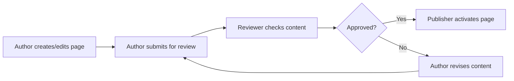
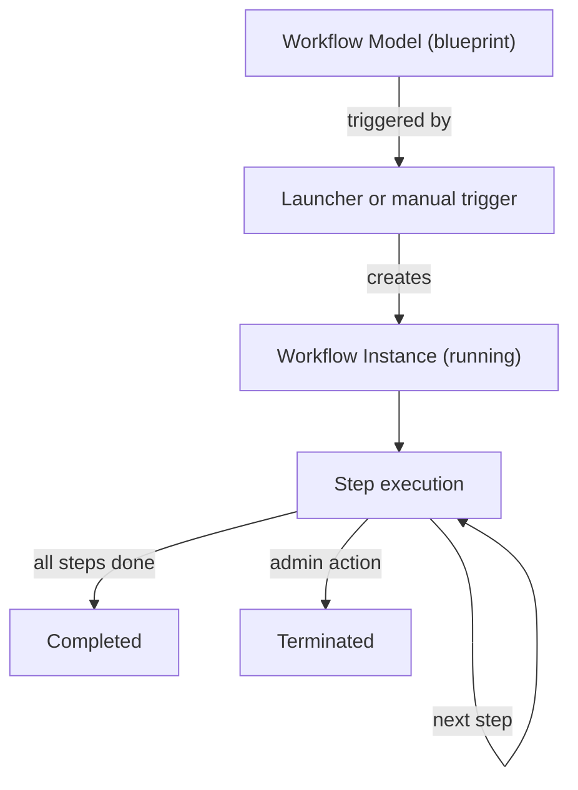

# Workflows

AEM Workflows are automated, multi-step processes that model real-world business operations inside Adobe
Experience Manager. They connect people, systems, and content by defining **who** needs to do **what**, in
**which order**, and **under which conditions**. Whether it is a simple two-step content approval or a
complex multi-department campaign launch, workflows provide a structured, auditable way to move work forward.

## Business Process Mapping

Before writing any code, it helps to think of AEM Workflows as digital versions of the processes your
organisation already follows on paper, in email chains, or in project management tools.

### Common business processes

| Business process | AEM Workflow equivalent | Typical participants |
|------------------|------------------------|---------------------|
| Content review and approval | Request for Activation | Author, Reviewer, Publisher |
| Asset ingestion and processing | DAM Update Asset | Photographer/Designer, DAM Admin |
| Translation | Translation workflow (via Translation Integration Framework) | Author, Translation Provider, Language Lead |
| Content decommission / sunset | Custom unpublish workflow | Content Owner, Legal, Webmaster |
| Campaign launch | Custom scheduled activation workflow | Marketing Manager, Content Team, QA |
| Legal / compliance sign-off | Multi-participant approval | Author, Legal, Compliance Officer |

### Example: content approval flow

A typical editorial process maps directly to an AEM Workflow:



In AEM terms:
- **Author** triggers the workflow (manually or via a launcher)
- **Reviewer** receives a task in their **AEM Inbox**
- **Approved / Rejected** is modelled as an **OR Split** with two routes
- **Publisher** activates the page via a **Process Step** that calls the Replicator service
- **Revise** loops back to the author via a **Goto Step**

### Workflow building blocks in business terms

| Building block | What it means | Example |
|----------------|--------------|---------|
| **Step** | A single unit of work | "Review the page" |
| **Participant** | A person or group responsible for a step | "content-reviewers" group |
| **Route** | The path work takes after a step completes | "Approve" or "Reject" |
| **Payload** | The content the workflow acts on | `/content/my-site/en/about` |
| **OR Split** | A decision point with multiple routes | "Is the content approved?" |
| **AND Split** | Parallel work streams that must all complete | "Legal review AND marketing review" |
| **Timeout** | An automatic action if a step isn't completed in time | "Auto-escalate after 3 days" |

---

## AEM Workflow Concepts

This section bridges the business view and the technical implementation.

### Workflow models

A workflow **model** is the blueprint -- the reusable definition of steps, routes, and logic. Models are
stored in the JCR under:

```text
/var/workflow/models/         <-- runtime (compiled) models
/conf/global/settings/workflow/models/   <-- editable model definitions
```

Each model has a unique ID (e.g. `/var/workflow/models/request_for_activation`) and can be versioned.
When you edit a model in the Workflow Editor, AEM creates a new version and syncs it to `/var/workflow/models/`.

### Workflow instances

When a workflow model is **started** against a payload, AEM creates a workflow **instance** -- a running
copy that tracks the current step, participant assignments, and metadata.

```text
/var/workflow/instances/         <-- active (running) instances
/var/workflow/instances/server0/  <-- clustered: partitioned by server
```

Completed instances are moved to an archive area and can be purged for performance.

### Workflow lifecycle



| State | Description |
|-------|-------------|
| **RUNNING** | The instance is active, waiting for a step to complete |
| **COMPLETED** | All steps finished successfully |
| **ABORTED** | The workflow was terminated by an administrator |
| **SUSPENDED** | The workflow is paused and can be resumed |
| **STALE** | The workflow instance references a model version that no longer exists |

### Workflow launchers

Launchers **automatically start** a workflow when a JCR event matches certain criteria. They are configured
at:

```text
/conf/global/settings/workflow/launcher/config/
```

A launcher watches for:

| Property | Purpose | Example |
|----------|---------|---------|
| `eventType` | JCR event type (1 = node added, 16 = node modified) | `{Long}16` |
| `nodetype` | JCR node type to match | `cq:PageContent` |
| `glob` | Path pattern to match | `/content/my-site/.*` |
| `workflow` | The workflow model to start | `/var/workflow/models/request_for_activation` |
| `runModes` | Run modes where the launcher is active | `author` |
| `condition` | Additional condition expression | `jcr:content/cq:template==/conf/.../page` |
| `excludeList` | Properties to ignore (prevents re-trigger loops) | `jcr:lastModified,cq:lastModified` |
| `enabled` | Whether the launcher is active | `{Boolean}true` |

:::warning
Without a proper `excludeList`, a workflow that modifies the payload node will re-trigger its own launcher,
creating an **infinite loop**. Always exclude metadata properties that your workflow writes.
:::

### Participants and the AEM Inbox

When a workflow reaches a **Participant Step**, AEM creates a work item in the assigned user's or group's
**Inbox** (accessible at `/aem/inbox`). The participant can:

- **Complete** the step (advance the workflow)
- **Delegate** the step to another user
- **Step back** to a previous step
- Add **comments** for audit trail

Participants can be assigned as:
- A specific **user** (`admin`, `jdoe`)
- A **group** (`content-authors`, `reviewers`)
- **Dynamic** via a `ParticipantStepChooser` (programmatic assignment at runtime)

---

## Building Workflows in the AEM UI

### Workflow Model Editor

Navigate to **Tools > Workflow > Models** to create or edit workflow models. The visual editor lets you
drag and drop steps onto a canvas and connect them with transitions.

Steps to create a new model:

1. Click **Create > Create Model**
2. Enter a title and name (the name becomes the model ID)
3. Click the model to open the editor
4. Drag steps from the side panel onto the canvas
5. Connect steps by dragging from one step's output to another step's input
6. Configure each step by double-clicking it
7. Click **Sync** to publish the model to `/var/workflow/models/`

:::tip
Always click **Sync** after editing. The workflow editor works on a draft version -- changes are not
active until you sync.
:::

### Workflow step types

| Step type | Purpose | Assignment |
|-----------|---------|-----------|
| **Participant Step** | Assigns a task to a user or group via the Inbox | Static user/group |
| **Dialog Participant Step** | Like Participant Step, but opens a dialog for the participant to fill in data | Static user/group + form |
| **Dynamic Participant Step** | Routes to a user/group determined at runtime by a `ParticipantStepChooser` | Programmatic |
| **Process Step** | Executes a Java `WorkflowProcess` implementation automatically | None (system) |
| **OR Split** | Decision point: evaluates conditions on each branch, follows the first matching route | Rule-based |
| **AND Split / AND Join** | Splits into parallel branches that all execute concurrently, then waits for all to complete | Parallel |
| **Container Step** | Groups steps into a sub-workflow for organisational clarity | N/A |
| **Goto Step** | Jumps to a previous step (creates a loop) | N/A |
| **External Process Step** | Calls an external system and waits for a callback | External |

### Configuring launchers in the UI

Navigate to **Tools > Workflow > Launchers** to manage automatic triggers:

1. Click **Create** to add a new launcher
2. Select the **Event Type** (Node Created, Node Modified, etc.)
3. Enter a **Glob** pattern for the content path
4. Select the **Workflow Model** to trigger
5. Optionally add a **Condition** and **Exclude List**
6. Set the **Run Modes** (typically `author`)

---

## Custom Workflow Steps (Java)

### Custom Process Step

A Process Step executes Java code automatically when the workflow reaches it. Implement the
`WorkflowProcess` interface:

```java title="core/.../workflow/AutoTagProcessStep.java"
package com.myproject.core.workflow;

import com.adobe.granite.workflow.WorkflowException;
import com.adobe.granite.workflow.WorkflowSession;
import com.adobe.granite.workflow.exec.WorkItem;
import com.adobe.granite.workflow.exec.WorkflowProcess;
import com.adobe.granite.workflow.metadata.MetaDataMap;
import org.apache.sling.api.resource.Resource;
import org.apache.sling.api.resource.ResourceResolver;
import org.apache.sling.api.resource.ModifiableValueMap;
import org.osgi.service.component.annotations.Component;
import org.slf4j.Logger;
import org.slf4j.LoggerFactory;

@Component(
    service = WorkflowProcess.class,
    property = {
        "process.label=My Project - Auto Tag Pages"
    }
)
public class AutoTagProcessStep implements WorkflowProcess {

    private static final Logger LOG = LoggerFactory.getLogger(AutoTagProcessStep.class);

    @Override
    public void execute(WorkItem workItem, WorkflowSession workflowSession,
                        MetaDataMap metaDataMap) throws WorkflowException {

        // 1. Get the payload path
        String payloadPath = workItem.getWorkflowData().getPayload().toString();
        LOG.info("Processing payload: {}", payloadPath);

        // 2. Read process step arguments (configured in the workflow model editor)
        String tagNamespace = metaDataMap.get("PROCESS_ARGS", "myproject:");

        // 3. Access the JCR via the workflow session's resource resolver
        ResourceResolver resolver = workflowSession.adaptTo(ResourceResolver.class);
        if (resolver == null) {
            throw new WorkflowException("Could not obtain ResourceResolver");
        }

        Resource contentResource = resolver.getResource(payloadPath + "/jcr:content");
        if (contentResource == null) {
            LOG.warn("No jcr:content found at {}", payloadPath);
            return;
        }

        // 4. Apply business logic
        ModifiableValueMap properties = contentResource.adaptTo(ModifiableValueMap.class);
        if (properties != null) {
            String title = properties.get("jcr:title", "");
            // Example: auto-tag based on title keywords
            if (title.toLowerCase().contains("news")) {
                String[] existingTags = properties.get("cq:tags", new String[0]);
                String newTag = tagNamespace + "content-type/news";
                if (!java.util.Arrays.asList(existingTags).contains(newTag)) {
                    String[] updatedTags = java.util.Arrays.copyOf(
                        existingTags, existingTags.length + 1);
                    updatedTags[existingTags.length] = newTag;
                    properties.put("cq:tags", updatedTags);
                    LOG.info("Tagged {} with {}", payloadPath, newTag);
                }
            }
            resolver.commit();
        }
    }
}
```

The `process.label` OSGi property is the name that appears in the workflow model editor's step
configuration dropdown.

:::info Process Step Arguments
You can pass arguments to a Process Step in the model editor. They are available via
`metaDataMap.get("PROCESS_ARGS", String.class)`. For multiple arguments, use a delimiter
(e.g. comma-separated) and parse them in your code.
:::

### Accessing the payload

The payload can be a page path, an asset path, or a JCR path. Here's how to access it safely:

```java
// Get the raw payload (usually a String path)
String payloadPath = workItem.getWorkflowData().getPayload().toString();

// Get the payload type
String payloadType = workItem.getWorkflowData().getPayloadType();
// Common values: "JCR_PATH", "JCR_UUID", "URL"

// Adapt to a resource
ResourceResolver resolver = workflowSession.adaptTo(ResourceResolver.class);
Resource resource = resolver.getResource(payloadPath);

// Adapt to a Page
PageManager pageManager = resolver.adaptTo(PageManager.class);
Page page = pageManager.getPage(payloadPath);

// Adapt to an Asset
Asset asset = resource.adaptTo(Asset.class);
```

### Custom Participant Chooser

A `ParticipantStepChooser` dynamically determines who should handle a workflow step at runtime. This is
used with **Dynamic Participant Steps**.

```java title="core/.../workflow/ContentOwnerChooser.java"
package com.myproject.core.workflow;

import com.adobe.granite.workflow.WorkflowException;
import com.adobe.granite.workflow.WorkflowSession;
import com.adobe.granite.workflow.exec.ParticipantStepChooser;
import com.adobe.granite.workflow.exec.WorkItem;
import com.adobe.granite.workflow.metadata.MetaDataMap;
import org.apache.sling.api.resource.Resource;
import org.apache.sling.api.resource.ResourceResolver;
import org.apache.sling.api.resource.ValueMap;
import org.osgi.service.component.annotations.Component;
import org.slf4j.Logger;
import org.slf4j.LoggerFactory;

@Component(
    service = ParticipantStepChooser.class,
    property = {
        "chooser.label=My Project - Content Owner Chooser"
    }
)
public class ContentOwnerChooser implements ParticipantStepChooser {

    private static final Logger LOG = LoggerFactory.getLogger(ContentOwnerChooser.class);
    private static final String DEFAULT_GROUP = "content-authors";

    @Override
    public String getParticipant(WorkItem workItem, WorkflowSession workflowSession,
                                  MetaDataMap metaDataMap) throws WorkflowException {

        String payloadPath = workItem.getWorkflowData().getPayload().toString();
        ResourceResolver resolver = workflowSession.adaptTo(ResourceResolver.class);

        if (resolver != null) {
            Resource jcrContent = resolver.getResource(payloadPath + "/jcr:content");
            if (jcrContent != null) {
                ValueMap props = jcrContent.getValueMap();
                // Route to the page's designated reviewer if set
                String reviewer = props.get("reviewer", String.class);
                if (reviewer != null && !reviewer.isEmpty()) {
                    LOG.info("Routing {} to designated reviewer: {}", payloadPath, reviewer);
                    return reviewer;
                }
            }
        }

        // Fallback to a default group
        LOG.info("No designated reviewer for {}, routing to {}", payloadPath, DEFAULT_GROUP);
        return DEFAULT_GROUP;
    }
}
```

The `chooser.label` appears in the Dynamic Participant Step configuration in the model editor.

### Custom OR Split logic

An OR Split evaluates conditions on each outgoing route. You can implement custom rules:

```java title="core/.../workflow/PublishReadyRule.java"
package com.myproject.core.workflow;

import com.adobe.granite.workflow.WorkflowSession;
import com.adobe.granite.workflow.exec.WorkItem;
import com.adobe.granite.workflow.metadata.MetaDataMap;
import org.apache.sling.api.resource.Resource;
import org.apache.sling.api.resource.ResourceResolver;
import org.apache.sling.api.resource.ValueMap;
import org.osgi.service.component.annotations.Component;

@Component(
    service = com.day.cq.workflow.exec.WorkflowProcess.class,
    property = {
        "process.label=My Project - Is Publish Ready"
    }
)
public class PublishReadyRule {

    /**
     * Called by the OR Split to evaluate a route condition.
     * Return true if this route should be followed.
     */
    public boolean evaluate(WorkItem workItem, WorkflowSession session, MetaDataMap args) {
        String payloadPath = workItem.getWorkflowData().getPayload().toString();
        ResourceResolver resolver = session.adaptTo(ResourceResolver.class);
        if (resolver == null) return false;

        Resource jcrContent = resolver.getResource(payloadPath + "/jcr:content");
        if (jcrContent == null) return false;

        ValueMap props = jcrContent.getValueMap();

        // Check if the page has all required fields
        boolean hasTitle = props.containsKey("jcr:title");
        boolean hasDescription = props.containsKey("jcr:description");
        boolean hasImage = props.containsKey("featuredImage");

        return hasTitle && hasDescription && hasImage;
    }
}
```

In the OR Split configuration, you reference this class as a **Rule** on one of the branches.

---

## Workflow API (Programmatic)

### Starting a workflow

```java
@Reference
private com.adobe.granite.workflow.WorkflowService workflowService;

public void startApprovalWorkflow(ResourceResolver resolver, String pagePath)
        throws WorkflowException {

    WorkflowSession wfSession = workflowService.getWorkflowSession(
        resolver.adaptTo(Session.class));

    // Load the workflow model
    WorkflowModel model = wfSession.getModel("/var/workflow/models/request_for_activation");

    // Create the workflow data (payload)
    WorkflowData data = wfSession.newWorkflowData("JCR_PATH", pagePath);

    // Optionally add metadata
    data.getMetaDataMap().put("comment", "Submitted for review");
    data.getMetaDataMap().put("urgency", "high");

    // Start the workflow
    wfSession.startWorkflow(model, data);
}
```

### Querying workflow status

```java
public List<String> getRunningWorkflowIds(ResourceResolver resolver) throws WorkflowException {
    WorkflowSession wfSession = resolver.adaptTo(WorkflowSession.class);
    Workflow[] allWorkflows = wfSession.getAllWorkflows();

    List<String> runningIds = new ArrayList<>();
    for (Workflow wf : allWorkflows) {
        if ("RUNNING".equals(wf.getState())) {
            runningIds.add(wf.getId());
        }
    }
    return runningIds;
}
```

### Terminating running workflows

```java
/**
 * Terminates all running workflow instances visible to the given resolver.
 * Use with caution -- this is typically an admin operation.
 */
public int terminateAllRunningWorkflows(ResourceResolver resolver) {
    WorkflowSession workflowSession = resolver.adaptTo(WorkflowSession.class);
    if (workflowSession == null) {
        LOG.error("Could not obtain WorkflowSession");
        return 0;
    }

    int terminated = 0;
    try {
        Workflow[] allWorkflows = workflowSession.getAllWorkflows();
        for (Workflow wf : allWorkflows) {
            if ("RUNNING".equals(wf.getState())) {
                String id = wf.getId();
                try {
                    workflowSession.terminateWorkflow(wf);
                    terminated++;
                    LOG.info("Terminated workflow: {}", id);
                } catch (WorkflowException e) {
                    LOG.error("Could not terminate workflow {}", id, e);
                }
            }
        }
    } catch (WorkflowException e) {
        LOG.error("Error retrieving workflows", e);
    }
    return terminated;
}
```

### Managing launchers programmatically

```java
/**
 * Disables all workflow launchers. Useful during bulk imports or migrations
 * to prevent unwanted workflow triggers.
 */
public void disableAllLaunchers(ResourceResolver resolver) throws LoginException {
    WorkflowLauncher launcherService = resolver.adaptTo(WorkflowLauncher.class);
    if (launcherService == null) {
        LOG.error("Could not obtain WorkflowLauncher service");
        return;
    }

    Iterator<ConfigEntry> entries = launcherService.getConfigEntries();
    while (entries.hasNext()) {
        ConfigEntry entry = entries.next();
        if (entry.isEnabled()) {
            entry.setEnabled(false);
            LOG.info("Disabled launcher: {}", entry.getId());
        }
    }
}

/**
 * Re-enables all workflow launchers.
 */
public void enableAllLaunchers(ResourceResolver resolver) {
    WorkflowLauncher launcherService = resolver.adaptTo(WorkflowLauncher.class);
    if (launcherService == null) return;

    Iterator<ConfigEntry> entries = launcherService.getConfigEntries();
    while (entries.hasNext()) {
        ConfigEntry entry = entries.next();
        if (!entry.isEnabled()) {
            entry.setEnabled(true);
            LOG.info("Enabled launcher: {}", entry.getId());
        }
    }
}
```

:::tip
A common pattern during bulk content migrations: disable launchers before the import, run the import,
then re-enable launchers. This avoids thousands of workflow instances being created for every imported node.
:::

### Disabling a launcher via overlay

Instead of programmatic toggling, you can permanently disable a built-in launcher by overlaying its
configuration. This is deployed as part of your code package and survives instance restarts.

Create an overlay at `/conf/global/settings/workflow/launcher/config/<launcher-name>/.content.xml`
with `enabled="{Boolean}false"`:

```xml title="ui.config/.../workflow/launcher/config/newsletter_bounce_check/.content.xml"
<?xml version="1.0" encoding="UTF-8"?>
<jcr:root xmlns:jcr="http://www.jcp.org/jcr/1.0"
          xmlns:cq="http://www.day.com/jcr/cq/1.0"
    jcr:primaryType="cq:WorkflowLauncher"
    comment="Disabled -- we use Adobe Campaign for newsletters"
    enabled="{Boolean}false"
    eventType="{Long}1"
    excludeList=""
    glob="/var/mailimport"
    nodetype="nt:unstructured"
    runModes="author"
    workflow="/var/workflow/models/newsletter_bounce_check"/>
```

Make sure this path is included in your package's `META-INF/vault/filter.xml`:

```xml
<filter root="/conf/global/settings/workflow/launcher/config/newsletter_bounce_check"/>
```

---

## DAM Asset Workflows

### DAM Update Asset workflow

The **DAM Update Asset** workflow is AEM's built-in pipeline for processing uploaded assets. It runs
automatically when a new asset is added or an existing asset is replaced.

Default steps include:
1. **Metadata extraction** -- reads EXIF, IPTC, XMP data from the file
2. **Rendition generation** -- creates thumbnails and web-optimized renditions
3. **Sub-asset extraction** -- extracts pages from PDFs, slides from presentations
4. **XMP writeback** -- writes AEM metadata changes back into the binary
5. **Full-text extraction** -- indexes text content for search

### Customising DAM workflows

You can add custom steps to the DAM Update Asset workflow for project-specific processing:

```java title="core/.../workflow/WatermarkRenditionStep.java"
@Component(
    service = WorkflowProcess.class,
    property = {
        "process.label=My Project - Add Watermark Rendition"
    }
)
public class WatermarkRenditionStep implements WorkflowProcess {

    @Override
    public void execute(WorkItem workItem, WorkflowSession workflowSession,
                        MetaDataMap metaDataMap) throws WorkflowException {

        String payloadPath = workItem.getWorkflowData().getPayload().toString();
        ResourceResolver resolver = workflowSession.adaptTo(ResourceResolver.class);
        Resource assetResource = resolver.getResource(payloadPath);

        if (assetResource == null) return;

        Asset asset = assetResource.adaptTo(Asset.class);
        if (asset == null) return;

        // Get the original rendition
        Rendition original = asset.getOriginal();
        if (original == null) return;

        // Example: create a watermarked rendition
        // (actual image processing code omitted for brevity)
        try (InputStream watermarked = applyWatermark(original.getStream())) {
            asset.addRendition("cq5dam.watermark.png", watermarked, "image/png");
            resolver.commit();
        } catch (Exception e) {
            throw new WorkflowException("Watermark generation failed", e);
        }
    }

    private InputStream applyWatermark(InputStream original) {
        // Image processing logic using Java2D, ImageMagick, etc.
        return original; // placeholder
    }
}
```

### AEM as a Cloud Service: Asset microservices

:::warning AEMaaCS
On AEM as a Cloud Service, the DAM Update Asset workflow has been replaced by **Asset microservices**.
Custom Java workflow steps for rendition generation **do not run** on AEMaaCS. Instead:

- Rendition generation is handled by Adobe's cloud-native microservices
- Custom processing uses **Processing Profiles** (configured in the DAM admin UI)
- For advanced custom processing, use **Asset Compute workers** (Adobe I/O Runtime)
- **Post-processing workflows** can still run custom Java steps for metadata operations, but not
  binary manipulation

If you are building for AEMaaCS, plan your DAM workflow customisations around Processing Profiles
and Asset Compute rather than custom `WorkflowProcess` steps.
:::

---

## Built-in Workflows Reference

AEM ships with several commonly used workflows:

| Workflow | Model path | Purpose |
|----------|-----------|---------|
| **Request for Activation** | `/var/workflow/models/request_for_activation` | Content approval before publish |
| **DAM Update Asset** | `/var/workflow/models/dam/update_asset` | Asset processing pipeline |
| **DAM Parse Word Documents** | `/var/workflow/models/dam/dam-parse-word-documents` | Extract content from Word files |
| **Publish Page** | `/var/workflow/models/publish_example` | Automated page publishing |
| **Unpublish Page** | `/var/workflow/models/unpublish_example` | Automated page deactivation |
| **Scheduled Activation** | `/var/workflow/models/scheduled_activation` | Time-delayed activation |
| **Scheduled Deactivation** | `/var/workflow/models/scheduled_deactivation` | Time-delayed deactivation |
| **Translation** | `/var/workflow/models/translation` | Content translation pipeline |

---

## Best Practices and Common Pitfalls

### Use transient workflows for high-volume processing

Transient workflows don't persist intermediate step data to the JCR. This dramatically improves performance
for workflows that process many items (like DAM Update Asset).

Enable transient mode by checking **Transient** in the workflow model editor's page properties.

| Mode | JCR writes | Performance | Audit trail |
|------|-----------|-------------|-------------|
| **Normal** | Every step change is persisted | Slower | Full history |
| **Transient** | Only payload and completion are persisted | Faster | Limited |

### Purge completed workflow instances

Completed workflow instances accumulate in `/var/workflow/instances/` and degrade repository performance
over time. Configure regular purging:

- **AEM UI**: Tools > Workflow > Instances > select completed > Purge
- **Maintenance tasks**: Configure the **Workflow Purge** maintenance task in the Operations Dashboard
- **Recommended retention**: 30 days or fewer for completed instances

### Prevent launcher infinite loops

If your workflow modifies the payload (e.g. sets a property), the modification can re-trigger the launcher,
creating an infinite loop. Prevent this by:

1. **`excludeList`** -- list properties that should not re-trigger the launcher:
   ```text
   jcr:lastModified,cq:lastModified,jcr:lastModifiedBy,cq:lastRolledout
   ```
2. **Conditions** -- add a condition to the launcher that checks for a "processed" flag
3. **Workflow logic** -- have your process step set a flag property, and check for it before re-processing

### Avoid long-running process steps

Workflow process steps run on the AEM server thread pool. A step that takes minutes (e.g. calling a slow
external API) blocks the thread and can starve the workflow engine.

For long-running operations:
- Use a **Sling Job** (via `JobManager`) and have the workflow step start the job, then use an
  **External Process Step** that waits for a callback
- Set timeouts on HTTP calls
- Consider asynchronous patterns with a polling step

### Use service users for workflow operations

Workflow steps that need elevated permissions should use a dedicated **service user** rather than relying
on the initiator's session:

```java
@Reference
private ResourceResolverFactory resolverFactory;

private ResourceResolver getServiceResolver() throws LoginException {
    Map<String, Object> params = new HashMap<>();
    params.put(ResourceResolverFactory.SUBSERVICE, "workflow-service");
    return resolverFactory.getServiceResourceResolver(params);
}
```

Configure the service user mapping in your OSGi configuration:

```json title="ui.config/.../org.apache.sling.serviceusermapping.impl.ServiceUserMapperImpl.amended-workflow.cfg.json"
{
    "user.mapping": [
        "com.myproject.core:workflow-service=myproject-workflow-service"
    ]
}
```

### Test workflow steps in isolation

Write unit tests for your `WorkflowProcess` implementations using mocked `WorkItem`, `WorkflowSession`,
and `MetaDataMap` objects:

```java
@ExtendWith(AemContextExtension.class)
class AutoTagProcessStepTest {

    private final AemContext context = new AemContext();

    @Test
    void shouldTagNewsPages() throws WorkflowException {
        // Setup
        context.create().page("/content/test", "/conf/template",
            Map.of("jcr:title", "Breaking News Today"));

        WorkItem workItem = mock(WorkItem.class);
        WorkflowData workflowData = mock(WorkflowData.class);
        when(workItem.getWorkflowData()).thenReturn(workflowData);
        when(workflowData.getPayload()).thenReturn("/content/test");

        WorkflowSession wfSession = mock(WorkflowSession.class);
        when(wfSession.adaptTo(ResourceResolver.class))
            .thenReturn(context.resourceResolver());

        MetaDataMap metaData = new SimpleMetaDataMap();
        metaData.put("PROCESS_ARGS", "myproject:");

        // Execute
        AutoTagProcessStep step = new AutoTagProcessStep();
        step.execute(workItem, wfSession, metaData);

        // Verify
        Resource jcrContent = context.resourceResolver()
            .getResource("/content/test/jcr:content");
        String[] tags = jcrContent.getValueMap().get("cq:tags", String[0]);
        assertTrue(Arrays.asList(tags).contains("myproject:content-type/news"));
    }
}
```

### AEMaaCS-specific considerations

| Feature | AEM 6.5 (on-prem/AMS) | AEM as a Cloud Service |
|---------|----------------------|------------------------|
| Custom DAM processing steps | Supported | Not supported -- use Asset Compute |
| Workflow model editor | Available | Available |
| Custom process steps | Supported | Supported (for non-DAM workflows) |
| Workflow launchers | File-based and UI | Same |
| Transient workflows | Supported | Supported |
| Workflow purge | Manual or scheduled | Automatic (maintenance windows) |

---

## External Resources

- [Adobe: Administering Workflows](https://experienceleague.adobe.com/docs/experience-manager-65/administering/operations/workflows.html)
- [Adobe: Developing and Extending Workflows](https://experienceleague.adobe.com/docs/experience-manager-65/developing/extending-aem/extending-workflows/workflows.html)
- [Adobe: Asset Microservices (AEMaaCS)](https://experienceleague.adobe.com/docs/experience-manager-cloud-service/content/assets/manage/asset-microservices-configure-and-use.html)
- [Granite Workflow API JavaDoc](https://developer.adobe.com/experience-manager/reference-materials/6-5/javadoc/com/adobe/granite/workflow/package-summary.html)

## See also

- [Event listener](./event-listener.mdx)
- [Sling Models](./sling-models.mdx)
- [OSGi configuration](./osgi-configuration.mdx)
- [Java best practices](./java-best-practices.mdx)
- [Replication and activation](../content/replication-activation.mdx)
- [Groovy Console](../groovy-console.mdx)
- [Security](../infrastructure/security.mdx)
- [Architecture](../architecture.mdx)
