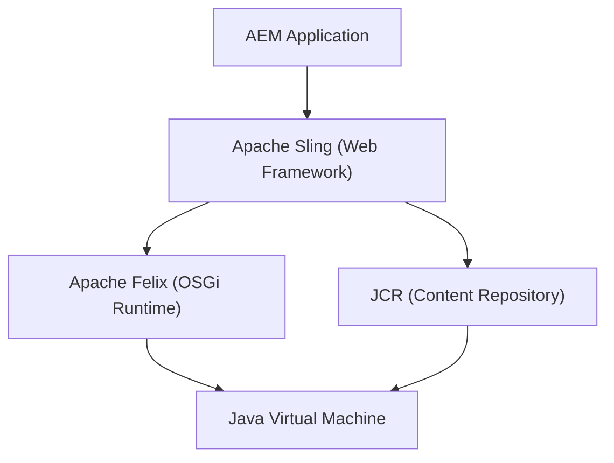
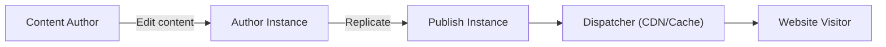
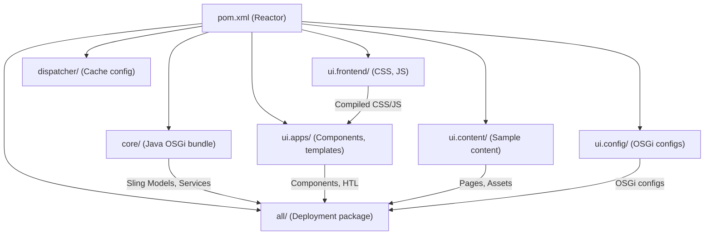

# Introduction & Setup

Adobe Experience Manager (AEM) is an enterprise content management platform for building websites, mobile apps, and forms. This guide takes you from a blank project to a deployed site on AEM as a Cloud Service -- step by step.

We assume you already know Java. If not, work through the [Java Beginners Guide](/java/beginners-guide/introduction) first.

## How this guide is structured

| Part | Chapters | What you will learn |
|------|----------|---------------------|
| **1 -- Foundation** | 1--3 | AEM architecture, JCR & Sling, OSGi fundamentals |
| **2 -- Components** | 4--7 | Build components with HTL, dialogs, and Sling Models |
| **3 -- Building a Site** | 8--10 | Templates, policies, client libraries, pages with Core Components |
| **4 -- Content & Data** | 11--12 | Content Fragments, GraphQL, Multi-Site Manager, i18n |
| **5 -- Production** | 13--14 | Dispatcher & caching, Cloud Manager deployment |

By the end you will have a corporate website with custom components, editable templates, headless content, and a production deployment pipeline.

## What is AEM?

AEM is a **content management system** (CMS) built on Java. It is used by large organizations to manage websites, digital assets, and content across channels.

Unlike simpler CMS platforms, AEM is built on a layered architecture of open standards:



| Layer | What it does |
|-------|-------------|
| **AEM** | CMS features -- authoring UI, templates, workflows, assets, sites |
| **Apache Sling** | Web framework -- maps URLs to content, handles HTTP requests |
| **JCR (Java Content Repository)** | Content storage -- a hierarchical, versioned content database |
| **OSGi (Apache Felix)** | Module system -- manages Java bundles, services, and configurations |
| **JVM** | Runtime -- everything runs on the Java Virtual Machine |

You do not need to master all of these before writing your first component. We will explore each layer as we progress through the guide.

## AEM as a Cloud Service (AEMaaCS)

AEM comes in several flavors:

| Variant | Description |
|---------|-------------|
| **AEM as a Cloud Service** | Cloud-native, managed by Adobe, auto-scaling, always up to date |
| **AEM 6.5 (Managed Services)** | Adobe-hosted but customer-managed, manual updates |
| **AEM 6.5 (On-Premise)** | Self-hosted on your own infrastructure |

This guide targets **AEM as a Cloud Service** (AEMaaCS). It is the current standard for new projects. Key differences from older versions:

- **No CRXDE Lite in production** -- content changes go through Git and Cloud Manager
- **Immutable infrastructure** -- you cannot modify the runtime at deploy time
- **Auto-updates** -- Adobe pushes updates continuously
- **Cloud Manager** -- CI/CD pipeline for deployment
- **Rapid Development Environments (RDE)** -- fast iteration during development

Many concepts transfer to AEM 6.5, but deployment and some APIs differ.

## Prerequisites

Before we start:

- **Java 11** (the JDK, not just the JRE) -- check with `java -version`
- **Maven 3.8+** -- check with `mvn -version`
- **An AEMaaCS SDK** -- download from the [Software Distribution portal](https://experience.adobe.com/#/downloads/content/software-distribution/en/aemcloud.html) (requires an Adobe ID)
- **A code editor** -- IntelliJ IDEA (recommended for Java) or VS Code
- **Git** -- for version control

> **Note:** The AEMaaCS SDK is free to download for development. You need an Adobe ID but not a paid license to get started locally.

## Installing the AEMaaCS SDK

The SDK contains a local AEM instance (author and publish) that mirrors the cloud environment.

### Step 1 -- Download the SDK

1. Log in to the [Software Distribution portal](https://experience.adobe.com/#/downloads/content/software-distribution/en/aemcloud.html)
2. Download the latest **AEM SDK** (`aem-sdk-<version>.zip`)
3. Extract the ZIP -- you will find a Quickstart JAR file (`aem-sdk-quickstart-<version>.jar`)

### Step 2 -- Start the Author instance

Create a directory for your local AEM instance and place the JAR there:

```bash
mkdir -p ~/aem/author
cp aem-sdk-quickstart-*.jar ~/aem/author/aem-author-p4502.jar
```

The filename convention tells AEM how to start:

- `aem-author` -- run in **author** mode (content editing)
- `p4502` -- use port **4502**

Start it:

```bash
cd ~/aem/author
java -jar aem-author-p4502.jar
```

On first start, AEM:

1. Extracts itself (this takes a few minutes)
2. Starts the OSGi framework
3. Installs all bundles
4. Opens the login page at `http://localhost:4502`

Default credentials: **admin / admin**.

### Step 3 -- Start the Publish instance (optional for now)

For a publish instance, use a different port:

```bash
mkdir -p ~/aem/publish
cp aem-sdk-quickstart-*.jar ~/aem/publish/aem-publish-p4503.jar
cd ~/aem/publish
java -jar aem-publish-p4503.jar
```

The publish instance runs at `http://localhost:4503`. It represents the public-facing side of AEM.

> **Tip:** For this guide, the author instance is sufficient. We will use the publish instance when we discuss Dispatcher in chapter 13.

## Author vs Publish

AEM uses a two-tier architecture:



| Instance | Purpose | Port (default) |
|----------|---------|----------------|
| **Author** | Content editing, authoring UI, workflows | 4502 |
| **Publish** | Content delivery, public-facing website | 4503 |

Content authors work on the **Author** instance. When content is ready, it is **replicated** (published) to the **Publish** instance, where visitors access it. The **Dispatcher** sits in front of Publish and caches pages for performance.

## Generate a project with the Maven Archetype

Adobe provides a Maven Archetype that scaffolds a complete AEM project:

```bash
mvn -B org.apache.maven.plugins:maven-archetype-plugin:3.2.1:generate \
  -D archetypeGroupId=com.adobe.aem \
  -D archetypeArtifactId=aem-project-archetype \
  -D archetypeVersion=49 \
  -D appTitle="My Site" \
  -D appId="mysite" \
  -D groupId="com.mysite" \
  -D aemVersion="cloud"
```

| Parameter | Value | Description |
|-----------|-------|-------------|
| `appTitle` | My Site | Display name |
| `appId` | mysite | Technical ID (used in paths and packages) |
| `groupId` | com.mysite | Maven group ID |
| `aemVersion` | cloud | Target AEMaaCS |

This generates a `mysite/` directory with the full project structure.

## Project structure walkthrough

The archetype creates a multi-module Maven project:

```
mysite/
├── pom.xml                    # Parent POM (reactor)
├── all/                       # Aggregates all packages for deployment
│   └── pom.xml
├── core/                      # Java code (Sling Models, services, servlets)
│   ├── pom.xml
│   └── src/main/java/
│       └── com/mysite/core/
├── ui.apps/                   # AEM components, templates, configs (JCR content)
│   ├── pom.xml
│   └── src/main/content/
│       └── jcr_root/
│           └── apps/mysite/
│               ├── components/
│               ├── clientlibs/
│               └── ...
├── ui.content/                # Sample content and pages
│   ├── pom.xml
│   └── src/main/content/
│       └── jcr_root/
│           └── content/mysite/
├── ui.config/                 # OSGi configurations
│   ├── pom.xml
│   └── src/main/content/
│       └── jcr_root/
│           └── apps/mysite/osgiconfig/
├── ui.frontend/               # Frontend build (webpack/clientlibs source)
│   ├── package.json
│   └── src/
├── dispatcher/                # Dispatcher configuration
│   └── src/
│       ├── conf.d/
│       └── conf.dispatcher.d/
└── it.tests/                  # Integration tests
    └── pom.xml
```

### Module responsibilities



| Module | Contains | Deployed as |
|--------|----------|-------------|
| **core** | Java code -- Sling Models, OSGi services, servlets | OSGi bundle (JAR) |
| **ui.apps** | AEM components, HTL templates, clientlibs, configs | Content package |
| **ui.content** | Sample pages, DAM assets, content structures | Content package |
| **ui.config** | OSGi configurations per run mode | Content package |
| **ui.frontend** | Frontend source (SCSS, JS) -- compiled and copied to ui.apps | Not deployed directly |
| **all** | Aggregates all packages into one deployable unit | Container package |
| **dispatcher** | Apache/Dispatcher configuration | Deployed separately |
| **it.tests** | Integration tests | Run during build |

## Build and deploy to your local instance

Build the entire project and deploy to your running author instance:

```bash
cd mysite
mvn clean install -PautoInstallSinglePackage
```

This:

1. Compiles all Java code in `core/`
2. Builds the frontend in `ui.frontend/`
3. Packages everything into content packages
4. Deploys the `all` package to `http://localhost:4502`

After deployment, log in to `http://localhost:4502` and you will see sample pages under **Sites** > **My Site**.

### Useful Maven profiles

| Profile | Command | What it does |
|---------|---------|--------------|
| `autoInstallSinglePackage` | `-PautoInstallSinglePackage` | Deploy the `all` package to author |
| `autoInstallSinglePackagePublish` | `-PautoInstallSinglePackagePublish` | Deploy to publish (port 4503) |
| `autoInstallBundle` | `-PautoInstallBundle` | Deploy only the `core` bundle (fast for Java changes) |

During development, you will use `autoInstallBundle` most often -- it recompiles and deploys only your Java code, which is much faster than rebuilding everything.

## Navigating the author instance

Once logged in at `http://localhost:4502`, explore:

### Sites Console

**Tools** > **Sites** -- manage pages, create content, publish. This is where content authors spend their time.

### CRXDE Lite

`http://localhost:4502/crx/de` -- a lightweight IDE for browsing and editing the JCR repository directly. Invaluable for debugging.

> **Note:** CRXDE Lite is available on local SDK instances and AEMaaCS development environments, but **not in production**. Never use it for production changes.

### OSGi Web Console

`http://localhost:4502/system/console` -- manage OSGi bundles, services, configurations. We will explore this in chapter 3.

### Package Manager

`http://localhost:4502/crx/packmgr` -- install, build, and download content packages.

## Key concepts to remember

| Concept | What it means in AEM |
|---------|---------------------|
| **Everything is content** | Pages, components, templates, configs -- all stored as nodes in the JCR |
| **Content vs code** | Content lives in `/content/`, code lives in `/apps/` and `/libs/` |
| **Sling resource resolution** | URLs map to JCR nodes, not files on disk |
| **Author + Publish** | Content is edited on Author, delivered from Publish |
| **Immutable + Mutable** | In AEMaaCS: `/apps` and `/libs` are immutable (code); `/content`, `/conf`, `/var` are mutable (content) |

> For a deeper dive into the architecture, see the [Architecture](/aem/architecture) reference. For a complete local setup guide (IDE configuration, debugging, etc.), see [Local Development Setup](/aem/infrastructure/aem-dev-setup).

## Summary

You now have:

- A running **AEM as a Cloud Service SDK** instance on `localhost:4502`
- A generated **Maven project** with all the modules you need
- A deployed **sample site** you can browse in the Sites console
- An understanding of the **technology stack** (Sling, JCR, OSGi) and the **author/publish** model

In the next chapter we will dive into the JCR and Sling -- the foundation everything in AEM is built on.

Next up: [The JCR & Sling](./02-jcr-and-sling.md) -- the content repository, node types, resource resolution, and how Sling maps URLs to content.
