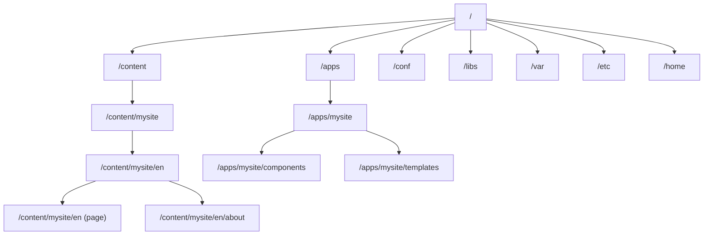
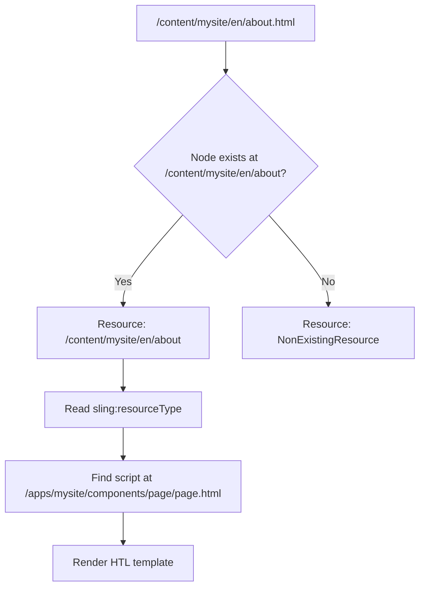

# The JCR & Sling

Everything in AEM is stored in the **JCR** (Java Content Repository) -- pages, components, templates, images, configurations, even your code definitions. Understanding the JCR and how **Sling** resolves URLs to content is essential for working with AEM.

## What is the JCR?

The JCR is a hierarchical, tree-structured content repository. Think of it as a cross between a file system and a database:



| Path | Contents |
|------|----------|
| `/apps` | Your project's code -- components, templates, clientlibs, configs |
| `/libs` | AEM's built-in code -- Core Components, platform features |
| `/content` | Authored content -- pages, assets |
| `/conf` | Configuration -- editable templates, Cloud Configurations |
| `/var` | Runtime data -- workflow instances, audit logs |
| `/etc` | Legacy config area (some items still here) |
| `/home` | Users and groups |

### Nodes and properties

The JCR is made of **nodes** and **properties**:

- A **node** is like a folder. It has a name, a type, and can contain child nodes and properties.
- A **property** is a key-value pair attached to a node. Values can be strings, numbers, dates, booleans, or binary data.

Example -- a page node:

```
/content/mysite/en/about
├── jcr:primaryType = "cq:Page"
└── jcr:content
    ├── jcr:primaryType = "cq:PageContent"
    ├── jcr:title = "About Us"
    ├── sling:resourceType = "mysite/components/page"
    ├── cq:template = "/conf/mysite/settings/wcm/templates/page"
    └── root
        ├── jcr:primaryType = "nt:unstructured"
        ├── sling:resourceType = "mysite/components/container"
        └── text
            ├── jcr:primaryType = "nt:unstructured"
            ├── sling:resourceType = "mysite/components/text"
            └── text = "<p>Welcome to our company.</p>"
```

Key observations:

- **Pages** are `cq:Page` nodes with a `jcr:content` child
- **Page content** lives under `jcr:content` -- this is where properties like `jcr:title` are stored
- **Components on a page** are child nodes under the `jcr:content` tree
- **`sling:resourceType`** tells Sling which component renders this node

### Node types

Every node has a **primary type** that defines its structure:

| Node type | Use |
|-----------|-----|
| `cq:Page` | A page in the Sites console |
| `cq:PageContent` | The content node of a page (`jcr:content`) |
| `nt:unstructured` | Generic node -- no schema constraints. Most component data nodes |
| `nt:folder` | A basic folder |
| `sling:Folder` | A Sling-aware folder |
| `sling:OrderedFolder` | Folder with ordered children |
| `cq:Component` | A component definition node |
| `cq:Template` | A template definition node |
| `dam:Asset` | A digital asset (image, document) |

Nodes can also have **mixin types** that add additional capabilities:

| Mixin | Adds |
|-------|------|
| `mix:versionable` | Version history |
| `mix:lockable` | Locking support |
| `cq:LiveRelationship` | Live Copy support (MSM) |
| `rep:AccessControllable` | ACL support |

## Exploring the JCR with CRXDE Lite

CRXDE Lite is a browser-based tool for browsing and editing the JCR. Open it at:

```
http://localhost:4502/crx/de
```

### The CRXDE Lite interface

| Area | What it shows |
|------|--------------|
| **Left panel** | Node tree browser -- navigate the hierarchy |
| **Center panel** | Node properties (key-value pairs) |
| **Bottom panel** | Query tool, access control, replication status |

### Browsing content

Try navigating to:

- `/content/mysite/en` -- your site's English root page
- `/apps/mysite/components` -- your project's component definitions
- `/libs/core/wcm/components` -- AEM Core Components source
- `/conf/mysite/settings/wcm/templates` -- your editable templates

### Editing content

You can modify properties directly in CRXDE Lite:

1. Navigate to `/content/mysite/en/jcr:content`
2. Find the `jcr:title` property
3. Change its value
4. Click **Save All** at the top

> **Warning:** Direct JCR edits in CRXDE Lite are for **debugging and exploration only**. In AEMaaCS, production content is managed through the authoring UI and code through Git + Cloud Manager.

## Apache Sling -- the web framework

Sling is the web framework that sits between HTTP and the JCR. Its core job: **resolve a URL to a JCR resource, then render it**.

### The Sling request processing pipeline


When a request like `GET /content/mysite/en/about.html` arrives:

1. **Resource resolution** -- Sling decomposes the URL and finds the JCR node at `/content/mysite/en/about`
2. **Script selection** -- Sling reads the `sling:resourceType` property (e.g., `mysite/components/page`) and finds the corresponding rendering script
3. **Rendering** -- the HTL template (or servlet) renders the content
4. **Response** -- the rendered HTML is returned

### URL decomposition

Sling breaks down URLs into parts:

```
/content/mysite/en/about.article.html/suffix?key=value
|___________________________|_____|____|______|________|
         Resource path       Selectors Ext  Suffix  Query
```

| Part | Example | Purpose |
|------|---------|---------|
| **Resource path** | `/content/mysite/en/about` | Maps to a JCR node |
| **Selectors** | `article` | Alternate rendering (e.g., `about.article.html`) |
| **Extension** | `html` | Output format |
| **Suffix** | `/suffix` | Additional path info |
| **Query string** | `key=value` | Parameters |

Selectors are powerful -- they let you render the same content in different ways without creating new endpoints:

- `/about.html` -- default rendering
- `/about.article.html` -- article rendering
- `/about.json` -- JSON export
- `/about.xml` -- XML rendering

### Resource resolution in detail

Resource resolution is how Sling finds the right JCR node for a URL:



The `sling:resourceType` on the node points to a component definition. Sling looks for a rendering script in this order:

1. `/apps/<resourceType>/<scriptName>.html` -- your project's override
2. `/libs/<resourceType>/<scriptName>.html` -- AEM's default

This is the **overlay mechanism** -- you can override any AEM component by placing your version in `/apps`.

### Script selection rules

For a resource with `sling:resourceType = "mysite/components/text"`, Sling looks for scripts in `/apps/mysite/components/text/`:

| Request | Script looked up |
|---------|-----------------|
| `GET .html` | `text.html` or `html.html` |
| `GET .json` | `text.json` or `json.html` |
| `GET .article.html` | `text.article.html` then `text.html` |
| `POST .html` | `text.POST.html` |

Script naming conventions: `<component>.<selector>.<extension>.html` or the shorthand `<extension>.html`.

## Resources and the Resource API

In Sling, everything is a **Resource**. The `Resource` is the Java abstraction over a JCR node:

```java
// Get a resource resolver
ResourceResolver resolver = request.getResourceResolver();

// Resolve a resource by path
Resource page = resolver.getResource("/content/mysite/en/about");

// Read properties
ValueMap properties = page.getChild("jcr:content").getValueMap();
String title = properties.get("jcr:title", "Untitled");

// Iterate children
for (Resource child : page.getChildren()) {
    String name = child.getName();
    String type = child.getResourceType();
}
```

Key interfaces:

| Interface | Purpose |
|-----------|---------|
| `Resource` | Represents a JCR node (or virtual resource) |
| `ResourceResolver` | Resolves paths to resources, creates/modifies resources |
| `ValueMap` | Read properties from a resource (like a type-safe Map) |
| `ModifiableValueMap` | Write properties to a resource |

### Adaptable pattern

Sling uses the **Adaptable** pattern extensively -- you convert (adapt) one object to another:

```java
// Adapt a Resource to a Page
Page page = resource.adaptTo(Page.class);

// Adapt a Resource to a Sling Model
MyModel model = resource.adaptTo(MyModel.class);

// Adapt a Resource to a ValueMap
ValueMap props = resource.adaptTo(ValueMap.class);

// Adapt a Resource to a Node (JCR API)
Node node = resource.adaptTo(Node.class);
```

This pattern is central to AEM development. Sling Models (chapter 7) are the primary way you adapt resources to custom Java objects.

## Content paths and conventions

AEM has strong conventions for where content lives:

### Code paths (immutable in AEMaaCS)

| Path | Contents |
|------|----------|
| `/apps/mysite/components/` | Your component definitions |
| `/apps/mysite/clientlibs/` | Your CSS/JS client libraries |
| `/apps/mysite/i18n/` | Your i18n dictionaries |

### Content paths (mutable)

| Path | Contents |
|------|----------|
| `/content/mysite/` | Your site's pages |
| `/content/dam/mysite/` | Your digital assets (images, PDFs) |
| `/content/experience-fragments/mysite/` | Experience Fragments |
| `/conf/mysite/` | Your site's configuration (templates, Cloud Configs) |

### System paths

| Path | Contents |
|------|----------|
| `/libs/` | AEM's built-in code -- **never modify** |
| `/var/` | Runtime data (workflow, audit) |
| `/home/users/` | User accounts |
| `/home/groups/` | Groups |

> **Rule:** Never modify `/libs`. Always overlay or extend in `/apps`. In AEMaaCS, `/libs` is read-only.

## Querying the JCR

Besides navigating the tree, you can query it. AEM supports two query languages:

### QueryBuilder

AEM's query API -- used in Java code and HTTP:

```
http://localhost:4502/bin/querybuilder.json?
  path=/content/mysite
  &type=cq:Page
  &property=jcr:content/jcr:title
  &property.operation=like
  &property.value=%25about%25
  &p.limit=10
```

### JCR-SQL2

SQL-like syntax for JCR queries:

```sql
SELECT * FROM [cq:Page] AS page
WHERE ISDESCENDANTNODE(page, '/content/mysite')
  AND page.[jcr:content/jcr:title] LIKE '%about%'
```

You can run queries in CRXDE Lite's query tool (bottom panel) or the QueryBuilder Debugger at `http://localhost:4502/libs/cq/search/content/querydebug.html`.

> **Performance warning:** Queries without proper indexes are slow and can block the repository. Always test query performance and create Oak indexes for production queries. See the [JCR reference](/aem/content/jcr) for details.

> For deeper JCR topics, see the [Modify and Query the JCR](/aem/content/jcr) and [JCR Node Operations](/aem/content/node-operations) references.

## Summary

You learned:

- The **JCR** is a hierarchical content repository -- everything in AEM is a node with properties
- **Node types** define structure (`cq:Page`, `nt:unstructured`, `cq:Component`)
- **CRXDE Lite** lets you browse and edit the JCR directly
- **Apache Sling** maps URLs to JCR resources and renders them
- **URL decomposition** -- resource path, selectors, extension, suffix
- **Resource resolution** -- how Sling finds the right node and rendering script
- The **Resource API** and the **Adaptable** pattern
- **Content path conventions** -- `/apps` for code, `/content` for content, `/libs` is read-only
- **Querying** with QueryBuilder and JCR-SQL2

The JCR stores everything, and Sling connects it to the web. The third foundational layer is OSGi -- the module system that manages your Java code.

Next up: [OSGi Fundamentals](./03-osgi-fundamentals.md) -- bundles, services, the OSGi container, the Web Console, and configuration management.
