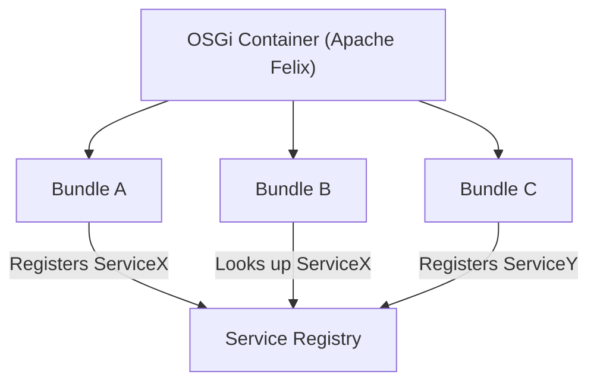
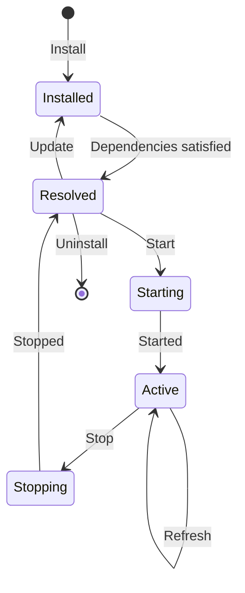
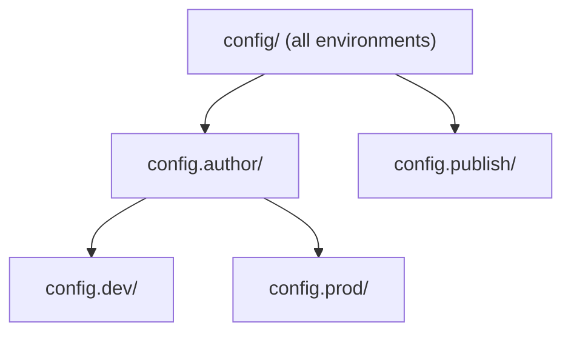

# OSGi Fundamentals

OSGi is the module system that manages all Java code in AEM. Every piece of Java -- your code, AEM's code, third-party
libraries -- runs inside an **OSGi bundle**. Understanding OSGi is essential for writing services, managing
configurations, and debugging.

## What is OSGi?

OSGi (Open Services Gateway initiative) is a specification for modular Java applications. In AEM, it is implemented by *
*Apache Felix**.

Key concepts:

| Concept           | Description                                                                       |
|-------------------|-----------------------------------------------------------------------------------|
| **Bundle**        | A JAR file with special metadata. The unit of deployment                          |
| **Service**       | A Java interface registered in the service registry. Other bundles can look it up |
| **Component**     | A managed Java class that can provide services and consume other services         |
| **Configuration** | Key-value settings that can change a component's behavior without redeployment    |



## Bundles

A bundle is a JAR file with OSGi metadata in its `MANIFEST.MF`:

```
Bundle-SymbolicName: com.mysite.core
Bundle-Version: 1.0.0
Import-Package: org.apache.sling.api, javax.inject
Export-Package: com.mysite.core.models
```

In your Maven project, the `core/` module produces an OSGi bundle. The `maven-bundle-plugin` (or `bnd-maven-plugin`)
generates the manifest automatically.

### Bundle lifecycle

Every bundle goes through these states:



| State         | Meaning                                                      |
|---------------|--------------------------------------------------------------|
| **Installed** | Bundle is in the container but dependencies are not resolved |
| **Resolved**  | All imports are satisfied; ready to start                    |
| **Active**    | Running -- services are registered                           |
| **Stopping**  | Shutting down                                                |

If a bundle stays in **Installed** instead of **Active**, it has unresolved dependencies. The Web Console shows which
packages are missing.

## Services

Services are the primary way Java components communicate in OSGi. A service is:

1. A **Java interface** defining the contract
2. An **implementation class** registered in the service registry
3. **Consumers** that look up and use the service

### Declarative Services (DS)

Modern AEM development uses **OSGi Declarative Services** with annotations:

```java
package com.mysite.core.services;

public interface GreetingService {
    String greet(String name);
}
```

```java
package com.mysite.core.services.impl;

import com.mysite.core.services.GreetingService;
import org.osgi.service.component.annotations.Component;

@Component(service = GreetingService.class)
public class GreetingServiceImpl implements GreetingService {

    @Override
    public String greet(String name) {
        return "Hello, " + name + "!";
    }
}
```

The `@Component` annotation tells OSGi:

- This class is a **managed component**
- It provides the `GreetingService` **service interface**
- OSGi should create an instance, manage its lifecycle, and register it in the service registry

### Consuming services

Other services reference services using `@Reference`:

```java
import com.mysite.core.services.GreetingService;
import org.osgi.service.component.annotations.Component;
import org.osgi.service.component.annotations.Reference;

@Component(service = SomeOtherService.class)
public class SomeOtherServiceImpl implements SomeOtherService {

    @Reference
    private GreetingService greetingService;

    public void doSomething() {
        String message = greetingService.greet("AEM");
        // "Hello, AEM!"
    }
}
```

Other components reference services using `@OSGiService`:

```java
@Model(
    adaptables = {SlingHttpServletRequest.class, Resource.class},
    adapters = {GreetingModel.class, ComponentExporter.class},
    resourceType = GreetingModel.RESOURCE_TYPE,
    defaultInjectionStrategy = DefaultInjectionStrategy.OPTIONAL)
public class GreetingModel {

    @OSGiService
    private GreetingService greetingService;
    
    // [...]

    @PostConstruct
    public void init() {
        final String message = greetingService.greet("AEM");
    }
}
```

OSGi **injects** the service automatically. If the service is not available, the component will not activate (this is
called **dependency satisfaction**).

### Service ranking

When multiple implementations of the same interface exist, OSGi uses **service ranking** to decide which one to inject:

```java
@Component(
    service = GreetingService.class,
    property = {
        "service.ranking:Integer=100"
    }
)
public class CustomGreetingServiceImpl implements GreetingService {
    // This implementation will be preferred over one with lower ranking
}
```

Higher ranking wins. This is how you override AEM's default services -- register your implementation with a higher
ranking.

## The Web Console

The OSGi Web Console is your debugging Swiss Army knife. Access it at:

```
http://localhost:4502/system/console
```

Credentials: **admin / admin**.

### Key console pages

| Console                           | URL                           | What it shows                                                      |
|-----------------------------------|-------------------------------|--------------------------------------------------------------------|
| **Bundles**                       | `/system/console/bundles`     | All installed bundles and their states                             |
| **Components**                    | `/system/console/components`  | All DS components and their state (active, satisfied, unsatisfied) |
| **Services**                      | `/system/console/services`    | All registered services                                            |
| **Configuration**                 | `/system/console/configMgr`   | All OSGi configurations                                            |
| **Sling** > **Resource Resolver** | `/system/console/jcrresolver` | Test resource resolution                                           |
| **Sling** > **Log Support**       | `/system/console/slinglog`    | Configure logging                                                  |

### Debugging a bundle that will not start

1. Go to **Bundles** (`/system/console/bundles`)
2. Find your bundle (search for your `Bundle-SymbolicName`)
3. If it is in **Installed** (not Active), click it to see **unresolved imports**
4. The missing packages tell you which dependency is not available

Common causes:

- A required third-party library is not embedded in your bundle
- A package version mismatch between your code and what is available in AEM
- A missing AEM API dependency

### Testing resource resolution

The **Sling Resource Resolver** page lets you test how URLs resolve:

1. Go to `/system/console/jcrresolver`
2. Enter a URL (e.g., `/content/mysite/en/about.html`)
3. Click **Resolve** to see which resource and rendering script Sling picks

This is invaluable for debugging "page not found" or "wrong component rendered" issues.

## OSGi Configurations

Configurations let you change service behavior without changing code. They are stored in the JCR and can vary by **run
mode** (author, publish, dev, stage, prod).

### Configuration via annotations

Define configurable properties with `@ObjectClassDefinition` and `@AttributeDefinition`:

```java
package com.mysite.core.services.impl;

import org.osgi.service.metatype.annotations.AttributeDefinition;
import org.osgi.service.metatype.annotations.ObjectClassDefinition;

@ObjectClassDefinition(name = "Greeting Service Configuration")
public @interface GreetingServiceConfig {

    @AttributeDefinition(
        name = "Default Greeting",
        description = "The greeting prefix to use"
    )
    String greeting_prefix() default "Hello";

    @AttributeDefinition(
        name = "Enabled",
        description = "Whether the service is active"
    )
    boolean enabled() default true;
}
```

### Using configuration in a service

```java
import org.osgi.service.component.annotations.Activate;
import org.osgi.service.component.annotations.Component;
import org.osgi.service.metatype.annotations.Designate;

@Component(service = GreetingService.class)
@Designate(ocd = GreetingServiceConfig.class)
public class GreetingServiceImpl implements GreetingService {

    private String prefix;
    private boolean enabled;

    @Activate
    protected void activate(GreetingServiceConfig config) {
        this.prefix = config.greeting_prefix();
        this.enabled = config.enabled();
    }

    @Override
    public String greet(String name) {
        if (!enabled) {
            return "";
        }
        return prefix + ", " + name + "!";
    }
}
```

The `@Activate` method is called when the component starts and receives the current configuration.

### Configuration files in the repository

In AEMaaCS, configurations are stored as `.cfg.json` files in the `ui.config` module:

```
ui.config/src/main/content/jcr_root/apps/mysite/osgiconfig/
├── config/                          # All environments
│   └── com.mysite.core.services.impl.GreetingServiceImpl.cfg.json
├── config.author/                   # Author only
├── config.publish/                  # Publish only
├── config.dev/                      # Dev environment
├── config.stage/                    # Stage environment
└── config.prod/                     # Production
```

A configuration file:

```json
{
    "greeting.prefix": "Welcome",
    "enabled": true
}
```

### Run modes

Run modes determine which configurations are active:

| Run mode  | When active             |
|-----------|-------------------------|
| `author`  | On author instances     |
| `publish` | On publish instances    |
| `dev`     | Development environment |
| `stage`   | Stage environment       |
| `prod`    | Production environment  |

Configurations are **cumulative** -- `config/` applies everywhere, `config.author/` adds/overrides on author,
`config.prod/` adds/overrides in production.



### Editing configurations in the Web Console

During development, you can edit configurations live:

1. Go to `/system/console/configMgr`
2. Search for your service name
3. Edit values and click **Save**

> **Important:** Changes made in the Web Console are temporary -- they are lost when the instance restarts. For
> persistent configurations, use `.cfg.json` files in the `ui.config` module.

## Component lifecycle annotations

Beyond `@Activate`, OSGi supports several lifecycle annotations:

```java
@Component(service = MyService.class)
public class MyServiceImpl implements MyService {

    @Activate
    protected void activate(MyConfig config) {
        // Called when the component starts
        // Initialize resources, read config
    }

    @Modified
    protected void modified(MyConfig config) {
        // Called when the configuration changes at runtime
        // Update internal state without restart
    }

    @Deactivate
    protected void deactivate() {
        // Called when the component stops
        // Clean up resources
    }
}
```

| Annotation    | When called                                        |
|---------------|----------------------------------------------------|
| `@Activate`   | Component starts (all dependencies satisfied)      |
| `@Modified`   | Configuration changes while component is active    |
| `@Deactivate` | Component stops (bundle stopping, dependency lost) |

## Sling Models are OSGi components too

The Sling Models you will write in chapter 7 are a special kind of OSGi component. They are registered as adaptable
types:

```java
@Model(adaptables = Resource.class, adapters = MyModel.class)
public class MyModelImpl implements MyModel {
    // ...
}
```

Under the hood, Sling Models use OSGi to register adapters. This is why your `core/` bundle needs the correct OSGi
metadata -- without it, your models will not be found.

## Common OSGi patterns in AEM

### Service interface + implementation

Always separate interface from implementation:

```
com.mysite.core.services/
├── GreetingService.java          # Interface (exported)
└── impl/
    └── GreetingServiceImpl.java  # Implementation (not exported)
```

The interface is in a package that is **exported** by your bundle. The implementation is in an `impl` sub-package that
is **not exported**. This is clean encapsulation.

### Scheduler service

Run code on a schedule:

```java
@Component(
    service = Runnable.class,
    property = {
        "scheduler.expression=0 0 2 * * ?",  // Every day at 2 AM
        "scheduler.concurrent=false"
    }
)
public class DailyCleanupJob implements Runnable {

    @Override
    public void run() {
        // Cleanup logic
    }
}
```

### Event handler

React to repository events:

```java
@Component(
    service = EventHandler.class,
    property = {
        "event.topics=com/day/cq/replication"
    }
)
public class ReplicationEventHandler implements EventHandler {

    @Override
    public void handleEvent(Event event) {
        String path = (String) event.getProperty("paths");
        // React to replication
    }
}
```

> For more advanced OSGi topics, see the [OSGi Configuration](/aem/backend/osgi-configuration) reference. For deeper
> coverage of the patterns introduced above,
> see [Sling Jobs and Schedulers](/aem/backend/sling-jobs), [Event Listeners and Handlers](/aem/backend/event-listener), [Servlets](/aem/backend/servlets),
> and [Filters](/aem/backend/filter). For environment-specific configuration beyond run modes,
> see [Context-Aware Configuration](/aem/backend/context-aware-configuration).

## Summary

You learned:

- **OSGi** is the module system managing all Java code in AEM
- **Bundles** are JARs with metadata -- they have a lifecycle (installed, resolved, active)
- **Services** are registered in a service registry and injected with `@Reference`
- **Declarative Services** annotations (`@Component`, `@Reference`, `@Activate`) are the modern way to write OSGi code
- The **Web Console** at `/system/console` is essential for debugging
- **Configurations** are managed via `.cfg.json` files with run-mode-specific folders
- **Run modes** control which configs are active (author, publish, dev, stage, prod)
- Common patterns: service interface + impl, schedulers, event handlers

With the foundation covered (JCR, Sling, OSGi), we are ready to build our first AEM component.

Next up: [Your First Component](./04-your-first-component.md) -- component anatomy, creating a simple component, placing
it on a page, and understanding the component-dialog-model triad.
