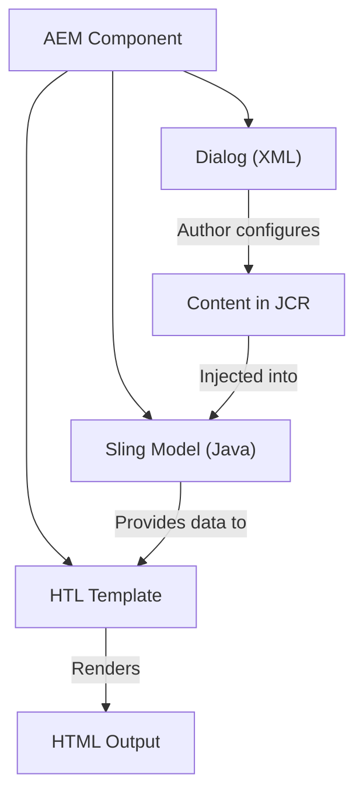
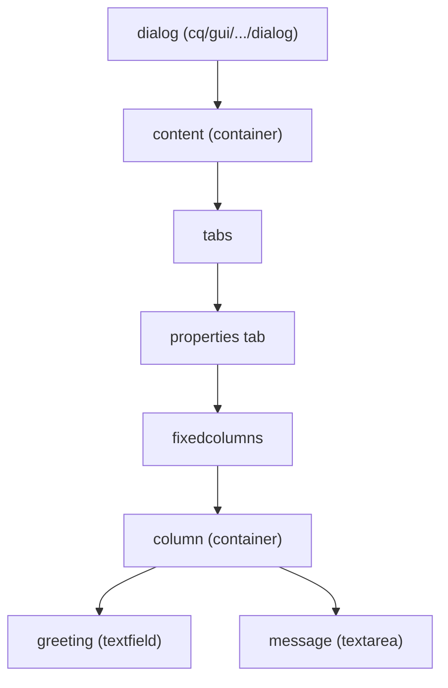
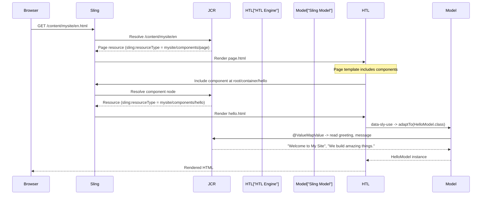

# Your First Component

Components are the building blocks of AEM pages. A button, a text block, an image carousel, a hero banner -- each is a component. In this chapter we will create a simple component from scratch and understand every file involved.

## The component triad

Every AEM component consists of up to three parts:



| Part | File type | Purpose |
|------|-----------|---------|
| **Dialog** | XML (`.content.xml`) | Defines the authoring UI -- what fields the author fills in |
| **HTL Template** | `.html` | Renders the HTML output using content from the model |
| **Sling Model** | `.java` | Reads content from the JCR and provides it to the template |

Not every component needs all three. A simple component can use just an HTL template. But most real-world components use all three.

## Component files in the project

Components live in the `ui.apps` module under `/apps/mysite/components/`:

```
ui.apps/src/main/content/jcr_root/apps/mysite/components/
└── hello/
    ├── .content.xml           # Component definition (cq:Component node)
    ├── hello.html             # HTL template
    └── _cq_dialog/
        └── .content.xml       # Author dialog
```

The Sling Model lives in the `core` module:

```
core/src/main/java/com/mysite/core/models/
└── HelloModel.java
```

## Step 1 -- Create the component definition

The `.content.xml` at the component root defines the `cq:Component` node:

```xml
<?xml version="1.0" encoding="UTF-8"?>
<jcr:root xmlns:cq="http://www.day.com/jcr/cq/1.0"
          xmlns:jcr="http://www.jcp.org/jcr/1.0"
          jcr:primaryType="cq:Component"
          jcr:title="Hello"
          jcr:description="A simple greeting component"
          componentGroup="My Site - Content"/>
```

| Property | Purpose |
|----------|---------|
| `jcr:primaryType` | Must be `cq:Component` |
| `jcr:title` | Display name in the component browser |
| `jcr:description` | Tooltip in the component browser |
| `componentGroup` | Groups related components in the authoring UI |

The `componentGroup` is important -- it determines where the component appears when an author inserts it on a page. Use a consistent group name like `"My Site - Content"` for all your content components.

## Step 2 -- Create the HTL template

The HTL template renders the component's HTML. Create `hello.html`:

```html
<div class="cmp-hello"
     data-sly-use.model="com.mysite.core.models.HelloModel">
    <h2 class="cmp-hello__title">${model.greeting}</h2>
    <p class="cmp-hello__message">${model.message}</p>
</div>
```

This template:

1. Uses `data-sly-use` to instantiate the Sling Model
2. Reads `greeting` and `message` from the model
3. Outputs them in a structured HTML block

The CSS class naming follows **BEM** (Block Element Modifier) convention with a `cmp-` prefix -- this is the AEM Core Components convention.

We will explore HTL in depth in the next chapter. For now, just know that `data-sly-use` loads a Java class and `${}` outputs its properties.

## Step 3 -- Create the Sling Model

The Sling Model reads content from the JCR node and provides it to the HTL template:

```java
package com.mysite.core.models;

import org.apache.sling.api.resource.Resource;
import org.apache.sling.models.annotations.Default;
import org.apache.sling.models.annotations.Model;
import org.apache.sling.models.annotations.injectorspecific.ValueMapValue;

@Model(adaptables = Resource.class)
public class HelloModel {

    @ValueMapValue
    @Default(values = "Hello, World!")
    private String greeting;

    @ValueMapValue
    @Default(values = "This is my first AEM component.")
    private String message;

    public String getGreeting() {
        return greeting;
    }

    public String getMessage() {
        return message;
    }
}
```

Breaking this down:

| Annotation | Purpose |
|-----------|---------|
| `@Model(adaptables = Resource.class)` | This class is a Sling Model adapted from a `Resource` |
| `@ValueMapValue` | Inject a property from the resource's `ValueMap` (JCR properties) |
| `@Default` | Provide a fallback value if the property is not set |

When an author has not configured the component yet, the default values are shown. Once the author fills in the dialog, the actual values from the JCR replace the defaults.

## Step 4 -- Create the author dialog

The dialog defines what fields the author sees when editing the component. Create `_cq_dialog/.content.xml`:

```xml
<?xml version="1.0" encoding="UTF-8"?>
<jcr:root xmlns:cq="http://www.day.com/jcr/cq/1.0"
          xmlns:jcr="http://www.jcp.org/jcr/1.0"
          xmlns:nt="http://www.jcp.org/jcr/nt/1.0"
          xmlns:granite="http://www.adobe.com/jcr/granite/1.0"
          xmlns:sling="http://sling.apache.org/jcr/sling/1.0"
          jcr:primaryType="nt:unstructured"
          jcr:title="Hello"
          sling:resourceType="cq/gui/components/authoring/dialog">
    <content jcr:primaryType="nt:unstructured"
             sling:resourceType="granite/ui/components/coral/foundation/container">
        <items jcr:primaryType="nt:unstructured">
            <tabs jcr:primaryType="nt:unstructured"
                  sling:resourceType="granite/ui/components/coral/foundation/tabs"
                  maximized="{Boolean}true">
                <items jcr:primaryType="nt:unstructured">
                    <properties jcr:primaryType="nt:unstructured"
                                jcr:title="Properties"
                                sling:resourceType="granite/ui/components/coral/foundation/container"
                                margin="{Boolean}true">
                        <items jcr:primaryType="nt:unstructured">
                            <columns jcr:primaryType="nt:unstructured"
                                     sling:resourceType="granite/ui/components/coral/foundation/fixedcolumns"
                                     margin="{Boolean}true">
                                <items jcr:primaryType="nt:unstructured">
                                    <column jcr:primaryType="nt:unstructured"
                                            sling:resourceType="granite/ui/components/coral/foundation/container">
                                        <items jcr:primaryType="nt:unstructured">
                                            <greeting jcr:primaryType="nt:unstructured"
                                                      sling:resourceType="granite/ui/components/coral/foundation/form/textfield"
                                                      fieldLabel="Greeting"
                                                      fieldDescription="The greeting text (e.g., Hello, World!)"
                                                      name="./greeting"
                                                      required="{Boolean}true"/>
                                            <message jcr:primaryType="nt:unstructured"
                                                     sling:resourceType="granite/ui/components/coral/foundation/form/textarea"
                                                     fieldLabel="Message"
                                                     fieldDescription="A message to display below the greeting"
                                                     name="./message"/>
                                        </items>
                                    </column>
                                </items>
                            </columns>
                        </items>
                    </properties>
                </items>
            </tabs>
        </items>
    </content>
</jcr:root>
```

This is verbose -- dialog XML is the most tedious part of AEM development. Let's understand the structure:



The key parts:

| Element | `sling:resourceType` | Purpose |
|---------|---------------------|---------|
| Dialog root | `cq/gui/components/authoring/dialog` | Marks this as a component dialog |
| Container | `granite/ui/components/coral/foundation/container` | Generic layout container |
| Tabs | `granite/ui/components/coral/foundation/tabs` | Tab navigation |
| Fixed Columns | `granite/ui/components/coral/foundation/fixedcolumns` | Column layout |
| Textfield | `granite/ui/components/coral/foundation/form/textfield` | Single-line text input |
| Textarea | `granite/ui/components/coral/foundation/form/textarea` | Multi-line text input |

The `name` attribute on each field (e.g., `./greeting`) maps to the JCR property name. When the author saves the dialog, the value is stored at `./greeting` relative to the component's content node.

We will explore dialogs in much more detail in chapter 6.

## Step 5 -- Deploy and test

Build and deploy to your local instance:

```bash
cd mysite
mvn clean install -PautoInstallSinglePackage
```

### Add the component to a page

1. Go to **Sites** console (`http://localhost:4502/sites.html`)
2. Navigate to **My Site** > **English** and open the homepage
3. Click **Edit** to enter edit mode
4. Open the side panel and find the **Components** tab
5. Search for "Hello" (or browse the "My Site - Content" group)
6. Drag the Hello component onto the page
7. Double-click it (or click the wrench icon) to open the dialog
8. Enter a greeting and message
9. Click the checkmark to save

You should see your component rendered on the page with the values you entered.

### Verify in CRXDE Lite

Open CRXDE Lite and navigate to the page's `jcr:content` node (e.g., `/content/mysite/en/jcr:content/root/container/hello`). You will see:

```
hello
├── jcr:primaryType = "nt:unstructured"
├── sling:resourceType = "mysite/components/hello"
├── greeting = "Welcome to My Site"
└── message = "We build amazing things."
```

The dialog values are stored as properties on the component's JCR node, and the Sling Model reads them with `@ValueMapValue`.

## The component rendering flow

Let's trace what happens when a page with our component is requested:



## Proxy components

In real projects, you rarely write everything from scratch. AEM Core Components provide ready-made, production-quality components (text, image, title, teaser, list, etc.).

Your project uses them through **proxy components** -- lightweight wrappers that point to Core Components:

```xml
<!-- apps/mysite/components/text/.content.xml -->
<jcr:root xmlns:cq="http://www.day.com/jcr/cq/1.0"
          xmlns:jcr="http://www.jcp.org/jcr/1.0"
          jcr:primaryType="cq:Component"
          jcr:title="Text"
          componentGroup="My Site - Content"
          sling:resourceSuperType="core/wcm/components/text/v2/text"/>
```

The `sling:resourceSuperType` property creates an inheritance chain -- your proxy inherits everything from the Core Component. You can then override specific files (HTL, dialog, model) in your proxy to customize behavior.

The Maven archetype generates proxy components for common Core Components automatically.

> For more on custom components and Core Components, see the [Custom Component Guide](/aem/custom-component), [Components Overview](/aem/components/overview), and [Touch UI Component Dialogs](/aem/component-dialogs) references. For Java coding standards in AEM, see [Java Best Practices](/aem/backend/java-best-practices).

## Summary

You learned:

- The **component triad**: dialog (authoring UI) + HTL template (rendering) + Sling Model (logic)
- The **file structure** of a component in `ui.apps` and `core`
- How to create a **component definition** (`.content.xml` with `cq:Component`)
- How to write a basic **HTL template** with `data-sly-use`
- How to write a **Sling Model** with `@ValueMapValue` injection
- How to create an **author dialog** with Granite UI fields
- How to **deploy and test** the component
- The **rendering flow** from HTTP request to HTML output
- **Proxy components** for reusing Core Components

This was a quick tour -- we glossed over HTL syntax, dialog field types, and Sling Model annotations. The next three chapters dive deep into each.

Next up: [HTL Templates](./05-htl-templates.md) -- the HTML Template Language in depth, including expressions, block statements, global objects, and the Use API.
