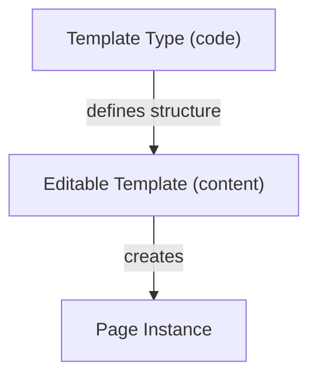
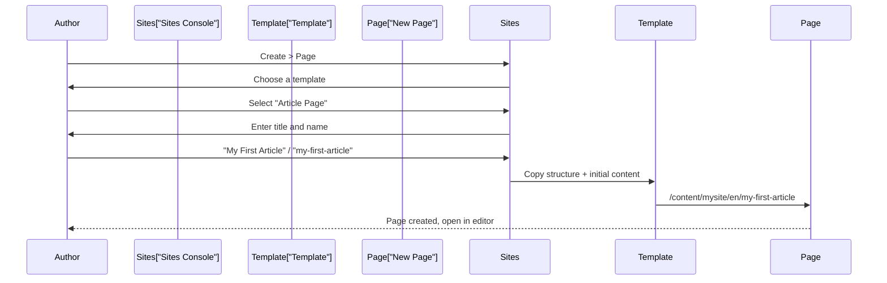

# Templates & Policies

Templates define the structure and behavior of pages. Policies control which components authors can use and how they
behave. Together, they create a governed authoring experience -- authors have freedom within boundaries.

## Editable templates

AEM uses **editable templates** -- templates that can be created and configured in the authoring UI (not just in code).
They live in `/conf/mysite/settings/wcm/templates/`.



| Concept               | Stored in                              | Managed by            |
|-----------------------|----------------------------------------|-----------------------|
| **Template Type**     | `/apps/mysite/templates/`              | Developers (code)     |
| **Editable Template** | `/conf/mysite/settings/wcm/templates/` | Template authors (UI) |
| **Page**              | `/content/mysite/`                     | Content authors (UI)  |

### Template Types

A template type is the blueprint for editable templates. It defines:

- Which **page component** renders the page
- The **initial structure** (locked components that every page gets)
- The **initial content** (default content for new pages)
- The **initial policies** (default component policies)

Template types are defined in code under `/apps/mysite/templates/`:

```
apps/mysite/templates/
└── page/
    ├── .content.xml           # Template type definition
    ├── structure/
    │   └── .content.xml       # Structure (locked layout)
    ├── initial/
    │   └── .content.xml       # Initial content
    └── policies/
        └── .content.xml       # Default policies
```

### Creating an editable template

1. Go to **Tools** > **General** > **Templates**
2. Select your configuration folder (**My Site**)
3. Click **Create**
4. Choose a template type (e.g., **Page**)
5. Enter a title (e.g., **Article Page**)

### Template editor modes

The template editor has three modes:

| Mode                | Purpose                                                                     |
|---------------------|-----------------------------------------------------------------------------|
| **Structure**       | Define locked layout containers and components. Authors cannot change these |
| **Initial Content** | Set default content for new pages. Authors can modify this                  |
| **Policies**        | Configure component policies -- allowed components, styles, behavior        |

### Structure mode

In Structure mode, you define the **skeleton** of the page:

- Add layout containers (responsive grid)
- Lock components that must appear on every page (e.g., header, footer)
- Define which areas are editable

Locked components have a **lock icon** -- authors cannot move, delete, or configure them.

### Initial content mode

In Initial Content mode, you pre-fill content for new pages. For example:

- A default title component with placeholder text
- An empty image component ready for the author to fill
- A pre-configured list component

Authors can modify all initial content after creating a page.

## The page component

Every page in AEM is rendered by a **page component**. This is the top-level component that produces the HTML document:

```html
<!-- apps/mysite/components/page/page.html -->
<!DOCTYPE html>
<html lang="${currentPage.language}"
      data-sly-use.page="com.mysite.core.models.PageModel">
<head>
    <meta charset="UTF-8"/>
    <meta name="viewport" content="width=device-width, initial-scale=1"/>
    <title>${page.title}</title>
    <sly data-sly-use.clientlib="/libs/granite/sightly/templates/clientlib.html">
        <sly data-sly-call="${clientlib.css @ categories='mysite.base'}"/>
    </sly>
</head>
<body class="page ${page.cssClass}">
    <div data-sly-resource="${'header' @ resourceType='mysite/components/header'}"></div>

    <main>
        <div data-sly-resource="${@ path='root', resourceType='wcm/foundation/components/responsivegrid'}"></div>
    </main>

    <div data-sly-resource="${'footer' @ resourceType='mysite/components/footer'}"></div>

    <sly data-sly-call="${clientlib.js @ categories='mysite.base'}"/>
</body>
</html>
```

Key elements:

- **Head** -- meta tags, CSS includes
- **Header/Footer** -- included as fixed components (using `data-sly-resource`)
- **Main content area** -- a responsive grid where authors place components
- **Client libraries** -- CSS loaded in head, JS before closing body

### Proxy page component

Your project's page component typically extends the Core Components page:

```xml
<!-- apps/mysite/components/page/.content.xml -->
<jcr:root xmlns:cq="http://www.day.com/jcr/cq/1.0"
          xmlns:jcr="http://www.jcp.org/jcr/1.0"
          xmlns:sling="http://sling.apache.org/jcr/sling/1.0"
          jcr:primaryType="cq:Component"
          jcr:title="Page"
          sling:resourceSuperType="core/wcm/components/page/v3/page"/>
```

Then you customize by overriding specific HTL files (like `customheaderlibs.html` and `customfooterlibs.html`) rather
than rewriting the entire page.

## Component policies

Policies control how components behave within a template. They are configured per template, per container.

### Setting allowed components

The most common policy setting -- which components can authors add to a container:

1. In the template editor, switch to **Structure** mode
2. Click a layout container
3. Click the **policy icon** (wrench)
4. Under **Allowed Components**, select which component groups and individual components are permitted

This prevents authors from placing inappropriate components -- for example, blocking the Hero component from appearing
inside a sidebar container.

### Design dialog policies

Some components have a **design dialog** (also called a policy dialog) that configures component-level defaults for a
specific template context:

- **Text component** -- default rich text formatting options
- **Image component** -- allowed image widths, lazy loading default
- **Container** -- layout options, background colors

These values are accessible in the component via the `currentStyle` object:

```java
@Model(adaptables = SlingHttpServletRequest.class)
public class ImageModel {

    @ScriptVariable
    private Style currentStyle;

    public int getMaxWidth() {
        return currentStyle.get("maxWidth", 1200);
    }
}
```

### Style System

The Style System lets you define CSS classes that authors can apply to components without developer intervention:

1. In the template editor, select a component
2. Open its policy
3. Under **Styles**, add style groups:

| Style group | Options              |
|-------------|----------------------|
| **Size**    | Small, Medium, Large |
| **Theme**   | Light, Dark          |
| **Spacing** | Compact, Comfortable |

Each option maps to a CSS class (e.g., `cmp-hero--large`, `cmp-hero--dark`). Authors select styles in the component
toolbar without touching code.

> Remember, any changes you make via the browser UI will need to be exported and persisted in the git repository.
> Otherwise, they will be lost on redeploy.

## Responsive grid (layout container)

The responsive grid is the main layout mechanism. It provides:

- **Drag-and-drop** component placement
- **12-column grid** for responsive layout
- **Column resizing** in the authoring UI
- **Breakpoints** for responsive behavior

Authors use the layout mode (ruler icon) to resize component columns per breakpoint:

| Breakpoint | Default width   |
|------------|-----------------|
| Phone      | < 768px         |
| Tablet     | 768px -- 1024px |
| Desktop    | > 1024px        |

Breakpoints are configured in the responsive grid's policy.

## Proxy components

In your project, most components are **proxy components** that inherit from Core Components:

```xml
<!-- apps/mysite/components/text/.content.xml -->
<jcr:root xmlns:cq="http://www.day.com/jcr/cq/1.0"
          xmlns:jcr="http://www.jcp.org/jcr/1.0"
          xmlns:sling="http://sling.apache.org/jcr/sling/1.0"
          jcr:primaryType="cq:Component"
          jcr:title="Text"
          componentGroup="My Site - Content"
          sling:resourceSuperType="core/wcm/components/text/v2/text"/>
```

The Maven archetype generates these automatically. Benefits:

- **Reuse** -- get all Core Component functionality for free
- **Customization** -- override any part (dialog, HTL, model) in your proxy
- **Versioning** -- update Core Components without breaking your overrides

## Enabling templates for a site

Templates must be enabled for a specific site configuration:

1. Go to **Tools** > **General** > **Templates**
2. Select your configuration folder
3. Templates created here are available to pages under `/content/mysite/`

The link between a site and its templates is in the site's `jcr:content`:

```
/content/mysite/jcr:content
├── cq:conf = "/conf/mysite"     # Points to the configuration
```

## Page creation flow

When an author creates a page:



> For advanced template patterns, see the [Templates and Policies](/aem/components/templates-policies) reference. For
> customizing the responsive grid layout, see [Extending the Responsive Grid](/aem/ui/extending-responsive-grid).

## Summary

You learned:

- **Editable templates** are configured in the authoring UI, backed by template types in code
- Template editor has three modes: **Structure**, **Initial Content**, and **Policies**
- The **page component** renders the HTML document (`<html>`, `<head>`, `<body>`)
- **Component policies** control allowed components, default settings, and style options
- The **Style System** lets authors apply CSS classes without code changes
- The **responsive grid** provides 12-column layout with breakpoints
- **Proxy components** inherit from Core Components for easy customization
- Templates are linked to sites via the `cq:conf` property

Next up: [Client Libraries](./09-client-libraries.md) -- CSS and JS management, clientlib categories, dependencies,
embedding, proxy serving, and integration with the page component.
