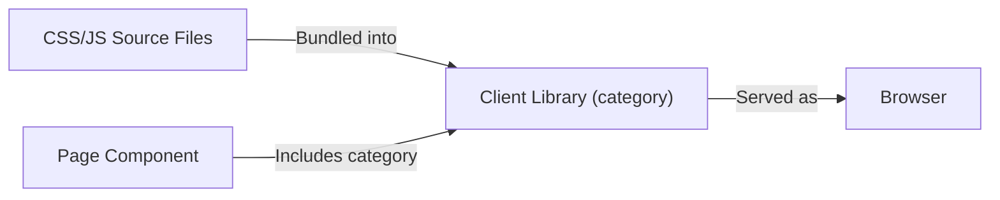

# Client Libraries

AEM uses **client libraries** (clientlibs) to manage CSS and JavaScript. Instead of linking to individual files, you reference a **category** name and AEM bundles everything together.

## How client libraries work



A client library:

1. Groups CSS and JS files under a **category name**
2. Defines **dependencies** on other clientlibs
3. Can **embed** other clientlibs for fewer HTTP requests
4. Is included in pages by category name via HTL

## Client library structure

A clientlib is a JCR node of type `cq:ClientLibraryFolder`:

```
apps/mysite/clientlibs/
└── clientlib-base/
    ├── .content.xml          # Clientlib definition
    ├── css.txt               # CSS file inclusion order
    ├── js.txt                # JS file inclusion order
    ├── css/
    │   ├── reset.css
    │   ├── variables.css
    │   └── base.css
    └── js/
        ├── utils.js
        └── main.js
```

### The .content.xml definition

```xml
<?xml version="1.0" encoding="UTF-8"?>
<jcr:root xmlns:cq="http://www.day.com/jcr/cq/1.0"
          xmlns:jcr="http://www.jcp.org/jcr/1.0"
          jcr:primaryType="cq:ClientLibraryFolder"
          categories="[mysite.base]"
          allowProxy="{Boolean}true"/>
```

| Property | Description |
|----------|-------------|
| `categories` | The category name(s) -- used to include this clientlib in pages |
| `allowProxy` | Serve via `/etc.clientlibs/` proxy (required for AEMaaCS) |
| `dependencies` | Other categories that must load **before** this one |
| `embed` | Other categories to inline **into** this one |

### css.txt and js.txt

These files define the inclusion order:

```
# css.txt
#base=css
reset.css
variables.css
base.css
```

```
# js.txt
#base=js
utils.js
main.js
```

The `#base=` directive sets the folder prefix. Files are concatenated in the listed order.

## Including clientlibs in pages

Use the clientlib HTL template in your page component:

```html
<sly data-sly-use.clientlib="/libs/granite/sightly/templates/clientlib.html">
    <!-- CSS in the <head> -->
    <sly data-sly-call="${clientlib.css @ categories='mysite.base'}"/>

    <!-- JS before </body> -->
    <sly data-sly-call="${clientlib.js @ categories='mysite.base'}"/>

    <!-- Both CSS and JS -->
    <sly data-sly-call="${clientlib.all @ categories='mysite.base'}"/>
</sly>
```

### Multiple categories

```html
<sly data-sly-call="${clientlib.css @ categories=['mysite.base', 'mysite.components']}"/>
```

## Dependencies vs embedding

### Dependencies

Dependencies ensure load order -- the dependency loads **first** as a separate request:

```xml
<!-- clientlib-components depends on clientlib-base -->
<jcr:root ...
    categories="[mysite.components]"
    dependencies="[mysite.base]"/>
```

Result: two HTTP requests (`mysite.base.css`, then `mysite.components.css`).

### Embedding

Embedding inlines another clientlib **into** this one -- a single HTTP request:

```xml
<!-- clientlib-site embeds both base and components -->
<jcr:root ...
    categories="[mysite.site]"
    embed="[mysite.base,mysite.components]"/>
```

Result: one HTTP request (`mysite.site.css` containing everything).

| Strategy | HTTP Requests | Use when |
|----------|--------------|----------|
| **Dependencies** | Multiple | Shared libs that other things also depend on |
| **Embedding** | Single | Combining project-specific libs for performance |

## Proxy serving

In AEMaaCS, clientlibs must be served through the `/etc.clientlibs/` proxy path. Set `allowProxy="{Boolean}true"` on every clientlib.

Without proxy:

```
/apps/mysite/clientlibs/clientlib-base.css  (blocked in production)
```

With proxy:

```
/etc.clientlibs/mysite/clientlibs/clientlib-base.css  (accessible)
```

The proxy path is automatically resolved by AEM when you use the clientlib HTL template.

## Component-specific clientlibs

Each component can have its own clientlib:

```
apps/mysite/components/hero/
├── .content.xml          # Component definition
├── hero.html             # HTL template
├── _cq_dialog/
│   └── .content.xml
└── clientlibs/
    └── .content.xml      # Component clientlib
    ├── css.txt
    ├── js.txt
    ├── css/
    │   └── hero.css
    └── js/
        └── hero.js
```

```xml
<!-- Component clientlib .content.xml -->
<jcr:root ...
    jcr:primaryType="cq:ClientLibraryFolder"
    categories="[mysite.components]"
    allowProxy="{Boolean}true"/>
```

By sharing the same category (`mysite.components`), all component clientlibs are bundled together.

## The ui.frontend module

Modern AEM projects use the `ui.frontend` module for frontend build tooling (webpack, Vite, etc.):

```
ui.frontend/
├── package.json
├── webpack.config.js
└── src/
    ├── main/
    │   └── webpack/
    │       ├── site/
    │       │   ├── main.ts
    │       │   └── main.scss
    │       └── components/
    │           ├── hero/
    │           │   ├── hero.ts
    │           │   └── hero.scss
    │           └── card/
    │               ├── card.ts
    │               └── card.scss
```

The build process:

1. `npm run build` in `ui.frontend/` compiles SCSS to CSS, TypeScript to JS, and bundles everything
2. The output is copied to `ui.apps/src/main/content/jcr_root/apps/mysite/clientlibs/clientlib-site/`
3. Maven deploys the clientlib to AEM

This lets you use modern frontend tooling (SCSS, TypeScript, PostCSS, autoprefixer) while AEM serves the compiled output.

### Automatic sync during development

The archetype sets up `aem-clientlib-generator` to automatically copy compiled assets to the correct clientlib folder during builds. You can also use `npx aemsync` or a similar tool for live-reload during development.

## Clientlib categories convention

A typical project has these categories:

| Category | Contains | Loaded |
|----------|----------|--------|
| `mysite.base` | Reset, fonts, CSS variables, global styles | Every page |
| `mysite.components` | Component-specific CSS/JS | Every page |
| `mysite.site` | Embeds base + components | Every page (via embed) |
| `mysite.dependencies` | Third-party libraries (if any) | Dependency of site |

## Debugging clientlibs

### Check loaded clientlibs

Add `?debugClientLibs=true` to any page URL to see which clientlibs are loaded and in what order.

### Rebuild clientlibs

If CSS/JS changes are not appearing:

```
http://localhost:4502/libs/granite/ui/content/dumplibs.rebuild.html
```

Click **Invalidate Caches** and then **Rebuild Libraries**.

### View a specific clientlib

```
http://localhost:4502/etc.clientlibs/mysite/clientlibs/clientlib-base.css
http://localhost:4502/etc.clientlibs/mysite/clientlibs/clientlib-base.js
```

> For advanced clientlib patterns, see the [Client Libraries](/aem/client-libraries) reference. For multi-brand frontend setups, see [Multi-Tenancy UI Frontend Themes](/aem/ui/multi-tenancy-support-ui-frontend).

## Summary

You learned:

- **Client libraries** bundle CSS and JS under category names
- The **structure**: `.content.xml`, `css.txt`, `js.txt`, and source folders
- **Including** clientlibs in pages with the clientlib HTL template
- **Dependencies** (separate requests, load order) vs **embedding** (single request)
- **Proxy serving** via `/etc.clientlibs/` (required for AEMaaCS)
- **Component-specific** clientlibs for modular CSS/JS
- The **ui.frontend** module for modern build tooling
- **Debugging** -- `debugClientLibs`, dump/rebuild tools

Next up: [Building Pages](./10-building-pages.md) -- using Core Components, responsive grid, navigation, header/footer, and assembling a homepage and article page.
