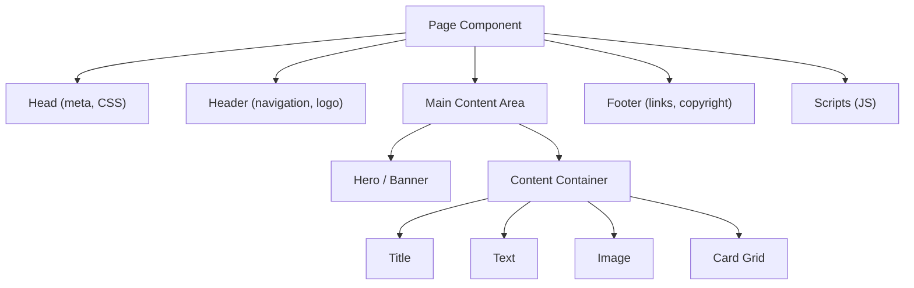

# Building Pages

With components, templates, and client libraries in place, it is time to build actual pages. In this chapter we will
assemble a homepage and an article page using Core Components and the responsive grid.

## Core Components

AEM Core Components are production-ready, accessible, and SEO-optimized components maintained by Adobe. Your project
uses them through proxy components (chapter 8).

### Commonly used Core Components

| Component               | What it does                                                 |
|-------------------------|--------------------------------------------------------------|
| **Title**               | Heading (H1-H6) with link option                            |
| **Text**                | Rich text content                                            |
| **Image**               | Responsive images with lazy loading                          |
| **Button**              | Link button with label and icon                              |
| **Teaser**              | Card with image, title, description, and CTA                 |
| **List**                | Dynamic list of child pages, tagged pages, or search results |
| **Navigation**          | Site navigation tree                                         |
| **Language Navigation** | Language switcher                                            |
| **Breadcrumb**          | Breadcrumb trail                                             |
| **Container**           | Layout container (responsive grid)                           |
| **Tabs**                | Tabbed content                                               |
| **Accordion**           | Collapsible content panels                                   |
| **Carousel**            | Rotating content panels                                      |
| **Experience Fragment** | Include an Experience Fragment                               |
| **Content Fragment**    | Render a Content Fragment                                    |
| **Embed**               | Embed external content (YouTube, etc.)                       |
| **Separator**           | Visual separator                                             |

The Maven archetype creates proxy components for all of these. They appear in the component browser under your project's
component group.

## Page anatomy

A typical AEM page has this structure:


```mermaid
flowchart TD
    Page["Page Component"]
    Head["Head (meta, CSS)"]
    Header["Header (navigation, logo)"]
    Main["Main Content Area"]
    Footer["Footer (links, copyright)"]
    Scripts["Scripts (JS)"]

    Page --> Head
    Page --> Header
    Page --> Main
    Page --> Footer
    Page --> Scripts

    Main --> Hero["Hero / Banner"]
    Main --> Content["Content Container"]
    Content --> Title["Title"]
    Content --> Text["Text"]
    Content --> Image["Image"]
    Content --> Cards["Card Grid"]
```

### Header

The header typically contains:

- **Logo** - linked to the homepage
- **Navigation** - the Navigation Core Component
- **Language switcher** - the Language Navigation component
- **Search** - optional search component

The header is defined as a **locked component** in the template structure. It reads content from a dedicated header
Experience Fragment or from page properties.

### Main content area

The main area is a **responsive grid** (layout container) where authors drop in components. Templates define which
components are allowed here.

### Footer

Like the header, the footer is typically locked in the template and reads from a shared source (Experience Fragment or
configuration).

## Working with DAM assets

Most pages reference images, videos, and documents stored in the **Digital Asset Management (DAM)**
repository under `/content/dam`. Before you can drop an image into a Teaser or Image component, the
asset has to exist in the DAM.

### Uploading assets

1. Open **Assets > Files** (`http://localhost:4502/assets.html/content/dam`).
2. Navigate to (or create) a folder such as `/content/dam/mysite`.
3. **Create > Files** and upload, or drag files from your desktop.

On upload, AEM runs **asset processing** (Asset Compute on AEMaaCS, workflows on 6.5) which generates
**renditions** - resized/cropped copies the delivery components pick from automatically:

| Rendition | Purpose |
|-----------|---------|
| `original` | The uploaded file, untouched |
| `cq5dam.thumbnail.*` | Console thumbnails |
| `cq5dam.web.*` | Web-optimized delivery rendition |
| Custom (via processing profile) | Project-specific sizes / formats (e.g. WebP) |

### Metadata

Select an asset and open **Properties** to edit metadata (title, description, `dc:*` fields, tags).
Good metadata powers search, accessibility (alt text), and dynamic lists. Metadata lives under
`jcr:content/metadata` on the `dam:Asset` node.

:::tip Alt text and accessibility
The Image Core Component can pull its `alt` text from the asset's description metadata. Encourage
authors to fill in descriptions on upload so images are accessible by default.
:::

For the full asset lifecycle (processing profiles, Smart Tags, Dynamic Media, bulk import) see Adobe's
[Assets documentation](https://experienceleague.adobe.com/en/docs/experience-manager-cloud-service/content/assets/overview).

## Building the homepage

Let's build a homepage step by step:

### 1. Create the page

1. Go to **Sites** > **My Site** > **English**
2. Click **Create** > **Page**
3. Select the **Landing Page** template (or your homepage template)
4. Title: **Home**, Name: `home`
5. Click **Create** and **Open**

### 2. Add a Hero component

1. In the editor, click the layout container
2. From the component browser (side panel), drag a **Teaser** (or your custom Hero) onto the page
3. Configure it:
    - **Title:** Welcome to My Site
    - **Description:** We build amazing digital experiences
    - **Image:** Upload or select from DAM
    - **Link:** Point to an article page
    - **CTA:** Learn More

### 3. Add content sections

Add a **Container** component to create a content section. Inside it:

1. **Title** component - "Latest Articles"
2. **List** component - configured to show child pages from `/content/mysite/en/blog`, sorted by date, limited to 3
   items
3. **Button** component - "View All Articles" linking to the blog listing page

### 4. Use layout mode for responsive design

1. Switch to **Layout** mode (ruler icon in the toolbar)
2. Select a component and drag its resize handles
3. Set column widths per breakpoint:
    - Desktop: Cards in a 3-column grid (4+4+4)
    - Tablet: 2-column grid (6+6)
    - Phone: Full width (12)

## Building an article page

### 1. Create the page

1. Navigate to **My Site** > **English** > **Blog**
2. Create a new page with the **Article Page** template
3. Title: **Getting Started with AEM Components**

### 2. Set page properties

Click the **Page Information** button (top left) > **Open Properties**:

| Tab              | Property                 | Value                                           |
|------------------|--------------------------|-------------------------------------------------|
| **Basic**        | Title                    | Getting Started with AEM Components             |
| **Basic**        | Subtitle                 | A guide for new AEM developers                  |
| **Basic**        | Description              | Learn how to create your first AEM component... |
| **Basic**        | Tags                     | Select relevant tags                            |
| **Advanced**     | Featured Image           | Select from DAM                                 |
| **Social Media** | og:title, og:description | For social sharing                              |

### 3. Add content

In the page editor:

1. **Title** - Article title (auto-populated from page title)
2. **Image** - Featured image
3. **Text** - Article body with rich text formatting
4. **Accordion** - FAQ section at the bottom
5. **Teaser** - Related articles at the bottom

### 4. Preview and publish

1. Click **Preview** to see the page without editing chrome
2. Click **Page Information** > **Publish Page** to publish to the Publish instance

## Page properties in code

Page properties are stored on the `jcr:content` node of the page. Access them in Sling Models:

```java
@Model(adaptables = SlingHttpServletRequest.class)
public class ArticlePageModel {

    @ScriptVariable
    private Page currentPage;

    public String getTitle() {
        return currentPage.getTitle();
    }

    public String getDescription() {
        return currentPage.getDescription();
    }

    public Calendar getLastModified() {
        return currentPage.getLastModified();
    }

    public String getFeaturedImage() {
        ValueMap props = currentPage.getProperties();
        return props.get("featuredImage", String.class);
    }

    public String[] getTags() {
        Tag[] tags = currentPage.getTags();
        return Arrays.stream(tags)
            .map(Tag::getTitle)
            .toArray(String[]::new);
    }
}
```

> **Note:** `currentPage.getTags()` returns resolved `Tag` objects. If you need to work with tags programmatically
> (e.g., find pages by tag, resolve tag IDs to titles in a specific locale), use the `TagManager` service:
>
> ```java
> public String getLocalizedTagTitle(String tagId, Locale locale) {
>     TagManager tagManager = resource.getResourceResolver().adaptTo(TagManager.class);
>     Tag tag = tagManager.resolve(tagId);
>     return tag != null ? tag.getTitle(locale) : tagId;
> }
> ```

## Extending page properties

Notice the **Featured Image** property used above is not a standard AEM field - it is a custom
property. Page properties are just a dialog on the **page component**, so you extend them the same way
you extend any component dialog: by overlaying or adding to the page component's
`_cq_dialog`.

A proxy page component inherits the Core Components page properties dialog. To add a field, create a
matching dialog path in your page component and add only your field (the rest is inherited via
`sling:resourceSuperType`):

```xml title="apps/mysite/components/page/_cq_dialog/.content.xml -- add a Featured Image tab/field"
<jcr:root xmlns:sling="http://sling.apache.org/jcr/sling/1.0"
          xmlns:jcr="http://www.jcp.org/jcr/1.0"
          xmlns:nt="http://www.jcp.org/jcr/nt/1.0"
          jcr:primaryType="nt:unstructured"
          sling:resourceType="cq/gui/components/authoring/dialog">
    <content jcr:primaryType="nt:unstructured"
             sling:resourceType="granite/ui/components/coral/foundation/container">
        <items jcr:primaryType="nt:unstructured">
            <tabs jcr:primaryType="nt:unstructured"
                  sling:resourceType="granite/ui/components/coral/foundation/tabs">
                <items jcr:primaryType="nt:unstructured">
                    <metadata jcr:primaryType="nt:unstructured"
                              jcr:title="Featured Image"
                              sling:resourceType="granite/ui/components/coral/foundation/container">
                        <items jcr:primaryType="nt:unstructured">
                            <featuredImage
                                jcr:primaryType="nt:unstructured"
                                sling:resourceType="granite/ui/components/coral/foundation/form/pathfield"
                                fieldLabel="Featured Image"
                                name="./featuredImage"
                                rootPath="/content/dam"/>
                        </items>
                    </metadata>
                </items>
            </tabs>
        </items>
    </content>
</jcr:root>
```

The value is stored on the page's `jcr:content` node and read back through `currentPage.getProperties()`
(see [Page properties in code](#page-properties-in-code)). For the full dialog field catalog, see the
[Touch UI Component Dialogs](../component-dialogs.mdx) reference.

## Troubleshooting - page assembly issues

| Symptom                                 | First check                                        | Typical fix                                           |
|-----------------------------------------|----------------------------------------------------|-------------------------------------------------------|
| Component not visible in side panel     | Template policy allowed components                  | Enable component in container policy                  |
| Component renders placeholder only      | Dialog values + model defaults                      | Configure required fields or add safer defaults       |
| Header/footer missing on some pages     | Template structure + locked components              | Reapply structure and verify XF/path references       |
| Navigation items missing unexpectedly   | Navigation root, depth, hide-in-nav page property   | Update nav config and page properties                 |
| Different author/publish output         | Published content + clientlibs + dispatcher cache   | Publish dependencies and invalidate relevant caches   |

## Navigation

The Navigation Core Component builds a navigation tree from the site structure:

```
/content/mysite/en
├── home
├── about
├── services
│   ├── consulting
│   └── development
├── blog
│   ├── article-1
│   └── article-2
└── contact
```

Configure the Navigation component:

| Property                    | Value                | Effect                    |
|-----------------------------|----------------------|---------------------------|
| **Navigation Root**         | `/content/mysite/en` | Start point               |
| **Exclude Root Level**      | 1                    | Skip the root page        |
| **Structure Depth**         | 2                    | Show 2 levels of pages    |
| **Collect all child pages** | No                   | Only show navigable pages |

Pages can opt out of navigation via the **Hide in Navigation** property in page properties.

## Content reuse with Experience Fragments

Experience Fragments are reusable content blocks that can appear on multiple pages:

### Create a header Experience Fragment

1. Go to **Experience Fragments** in the navigation
2. Create a new fragment under `/content/experience-fragments/mysite/en/header`
3. Add Logo, Navigation, and Language Navigation components
4. Publish the fragment

### Include on pages

In the template structure, add an **Experience Fragment** component (locked) and point it to the header fragment. Every
page using this template gets the same header.

When you update the fragment, all pages automatically reflect the change.

## Authoring tips for content authors

### Drag and drop

- Drag components from the side panel onto the page
- Drag to reorder components within a container
- Use the **component toolbar** (appears when you select a component) for edit, configure, copy, cut, delete

### Quick edit vs dialog

- **Quick edit** - click the component once to edit text inline
- **Dialog** - click the wrench icon or double-click for the full configuration dialog

### Preview vs Edit mode

Toggle between modes in the page toolbar:

| Mode          | What it shows                                   |
|---------------|-------------------------------------------------|
| **Edit**      | Full authoring chrome, component placeholders   |
| **Layout**    | Responsive column resizing                      |
| **Preview**   | Page as visitors see it                         |
| **Targeting** | Personalization targeting                       |
| **Timewarp**  | View the page as it was at a specific date/time |

A couple of these need context:

- **Targeting** drives personalization - you define audiences and serve different content/offers to
  each, typically with Adobe Target. It is an advanced topic; ignore it until you actually run
  personalization campaigns.
- **Timewarp** replays the page using version history and scheduled (on/off-time) content, so you can
  preview "what did this page look like last Tuesday" or "what will it look like when the embargo
  lifts". It is read-only and great for debugging publish issues.

> For more on Core Components, see the [Core Components](/aem/components/core-components) reference. See
> also [Experience Fragments](/aem/content/experience-fragments) for reusable content blocks
> and [Tags and Taxonomies](/aem/content/tags-taxonomies) for content classification.

## Official Documentation

- [Core Components (Experience League)](https://experienceleague.adobe.com/en/docs/experience-manager-core-components/using/introduction) - the full component library
- [Core Components live examples (Component Library)](https://www.aemcomponents.dev/) - interactive demos and markup
- [Authoring Pages (Experience League)](https://experienceleague.adobe.com/en/docs/experience-manager-cloud-service/content/sites/authoring/fundamentals/editing-content) - the page editor for content authors
- [Managing Assets (Experience League)](https://experienceleague.adobe.com/en/docs/experience-manager-cloud-service/content/assets/manage/manage-digital-assets) - DAM upload, metadata, renditions

## Summary

You learned:

- **Core Components** - the standard library of production-ready components
- **Page anatomy** - header, main content area, footer
- Building a **homepage** with Hero, Lists, and responsive layout
- Building an **article page** with content components and page properties
- Accessing **page properties** in Sling Models
- The **Navigation** component and site structure
- **Experience Fragments** for reusable content blocks
- **Authoring tips** for content editors

Your site now has pages with content. The next chapter goes deeper into the assets those pages depend
on - the DAM, metadata, renditions, and Dynamic Media.

Next up: [Assets & DAM](./11-assets-and-dam.md) - uploading and organizing assets, metadata and tagging,
renditions and processing profiles, and delivering optimized media.
