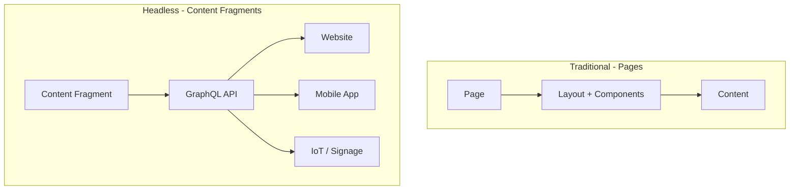
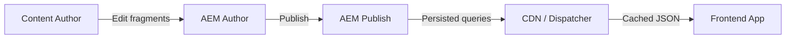

# Content Fragments & GraphQL

Content Fragments are **channel-neutral, structured content** -- text, images, data -- stored independently of any page
layout. Combined with GraphQL, they enable **headless** content delivery to any frontend: websites, mobile apps, digital
signage, or anything that speaks HTTP.

## Content Fragments vs pages



| Feature      | Pages                              | Content Fragments             |
|--------------|------------------------------------|-------------------------------|
| **Layout**   | Tied to AEM templates              | No layout -- pure data        |
| **Delivery** | AEM renders HTML                   | Client renders (any format)   |
| **Reuse**    | One page = one URL                 | One fragment = many consumers |
| **Editing**  | Page editor with components        | Content Fragment editor       |
| **API**      | Sling model export (`.model.json`) | GraphQL API                   |

## Content Fragment Models

A Content Fragment Model defines the **structure** of a fragment -- like a database schema. Models are created in the
configuration:

### Create a model

1. Go to **Tools** > **General** > **Content Fragment Models**
2. Select your configuration folder (**My Site**)
3. Click **Create**
4. Name: **Article**
5. Click **Open** to add fields

### Common field types

| Field type             | Description               | Example             |
|------------------------|---------------------------|---------------------|
| **Single line text**   | Short text                | Title, author name  |
| **Multi line text**    | Long text with formatting | Body, description   |
| **Number**             | Integer or float          | Rating, price       |
| **Boolean**            | True/false                | Featured, published |
| **Date and Time**      | Date/time picker          | Publish date        |
| **Enumeration**        | Predefined options        | Category, status    |
| **Tags**               | AEM tags                  | Topic tags          |
| **Content Reference**  | Link to other content     | Related page        |
| **Fragment Reference** | Link to another CF        | Author fragment     |
| **JSON Object**        | Arbitrary JSON            | Metadata            |
| **Tab Placeholder**    | Visual tab separator      | Organize fields     |

### Article model example

Create these fields for an Article model:

| Field          | Type               | Configuration             |
|----------------|--------------------|---------------------------|
| Title          | Single line text   | Required                  |
| Slug           | Single line text   | Required, unique          |
| Body           | Multi line text    | Rich text, required       |
| Excerpt        | Multi line text    | Plain text, max 300 chars |
| Featured Image | Content Reference  | Asset reference           |
| Publish Date   | Date and Time      | Date only                 |
| Featured       | Boolean            | Default: false            |
| Author         | Fragment Reference | References Author model   |
| Category       | Enumeration        | tech, business, design    |
| Tags           | Tags               | --                        |

### Author model example

Create a separate **Author** model:

| Field  | Type                        |
|--------|-----------------------------|
| Name   | Single line text (required) |
| Bio    | Multi line text             |
| Avatar | Content Reference           |
| Email  | Single line text            |

## Creating Content Fragments

### Via the Assets console

1. Go to **Assets** > **Files**
2. Navigate to your content folder (e.g., `/content/dam/mysite/articles`)
3. Click **Create** > **Content Fragment**
4. Select the **Article** model
5. Enter a name and fill in the fields
6. Click **Create**

### Fragment editor

The Content Fragment editor shows your model's fields in a structured form:

- **Single-line fields** appear as text inputs
- **Multi-line fields** show a rich text editor or plain text area
- **Fragment references** show a picker for other fragments
- **Tab placeholders** organize fields into tabs

### Variations

Content Fragments support **variations** -- alternate versions of the same content:

- **Master** -- the default version
- Named variations -- e.g., "Summary", "Mobile", "Newsletter"

Each variation can override specific fields while inheriting others from the master.

## The GraphQL API

AEM automatically generates a GraphQL API from your Content Fragment Models. No code needed -- install the model, and
the API is ready.

### GraphQL endpoint

```
http://localhost:4502/content/graphql/global/endpoint.json
```

Or use the GraphiQL IDE for development:

```
http://localhost:4502/content/graphiql.html
```

### Basic queries

**List all articles:**

```graphql
{
  articleList {
    items {
      _path
      title
      slug
      excerpt
      publishDate
      featured
      category
    }
  }
}
```

**Get a specific article by path:**

```graphql
{
  articleByPath(_path: "/content/dam/mysite/articles/getting-started") {
    item {
      title
      slug
      body {
        html
        plaintext
        markdown
      }
      publishDate
      author {
        name
        bio
      }
    }
  }
}
```

### Filtering

```graphql
{
  articleList(
    filter: {
      category: { _expressions: [{ value: "tech", _operator: EQUALS }] }
      featured: { _expressions: [{ value: true, _operator: EQUALS }] }
    }
  ) {
    items {
      title
      excerpt
      publishDate
    }
  }
}
```

### Sorting and pagination

```graphql
{
  articleList(
    sort: "publishDate DESC"
    limit: 10
    offset: 0
  ) {
    items {
      title
      publishDate
    }
  }
}
```

### Rich text fields

Multi-line text fields with rich text return multiple formats:

```graphql
{
  articleByPath(_path: "/content/dam/mysite/articles/example") {
    item {
      body {
        html        # Rendered HTML
        plaintext   # Plain text (stripped)
        markdown    # Markdown format
        json        # Structured JSON
      }
    }
  }
}
```

### Fragment references

When an Article references an Author:

```graphql
{
  articleList {
    items {
      title
      author {
        name
        bio
        avatar {
          ... on ImageRef {
            _path
            width
            height
          }
        }
      }
    }
  }
}
```

## Persisted queries

Persisted queries are **pre-defined, cached, server-side queries**. They are recommended for production:

### Create a persisted query

```bash
curl -X PUT \
  http://localhost:4502/graphql/execute.json/mysite/article-list \
  -H "Content-Type: application/json" \
  -u admin:admin \
  -d '{
    "query": "{ articleList(sort: \"publishDate DESC\", limit: 10) { items { _path title slug excerpt publishDate featured category author { name } } } }"
  }'
```

### Execute a persisted query

```bash
curl http://localhost:4502/graphql/execute.json/mysite/article-list
```

### Benefits of persisted queries

| Feature         | Ad-hoc queries           | Persisted queries          |
|-----------------|--------------------------|----------------------------|
| **Caching**     | Not cached by Dispatcher | Cached (GET request)       |
| **Security**    | Client defines the query | Server controls the query  |
| **Performance** | Parsed on every request  | Parsed once, executed many |
| **CDN**         | Cannot cache POST        | CDN-cacheable GET          |

> **Best practice:** Always use persisted queries in production. Ad-hoc queries are for development and the GraphiQL IDE
> only.

## Headless content delivery

The typical headless flow with AEM:



Frontends consume the GraphQL API:

```javascript
// Fetch from a React/Next.js frontend
const response = await fetch(
  "https://publish.mysite.com/graphql/execute.json/mysite/article-list"
);
const data = await response.json();
const articles = data.data.articleList.items;
```

## Content Fragments on pages

Content Fragments can also be rendered on AEM pages using the **Content Fragment** Core Component:

1. Add a **Content Fragment** component to a page
2. Select the fragment to display
3. Choose which fields to render
4. Optionally select a variation

This bridges traditional page-based and headless approaches.

> For advanced patterns, see the [Content Fragments](/aem/content/content-fragments)
> and [Headless GraphQL](/aem/content/graphql) references.

## Summary

You learned:

- **Content Fragments** are channel-neutral structured content
- **Content Fragment Models** define the schema (field types, validation)
- How to **create and edit** fragments in the Assets console
- The **GraphQL API** auto-generated from your models
- **Querying** -- filtering, sorting, pagination, rich text formats, fragment references
- **Persisted queries** for production performance and caching
- The **headless delivery flow** from author to frontend
- Using Content Fragments **on pages** with the Content Fragment component

Next up: [Multi-Site Manager & i18n](./12-multi-site-manager-and-i18n.md) -- Blueprints, Live Copies, rollout configs,
language copies, and the translation framework.
