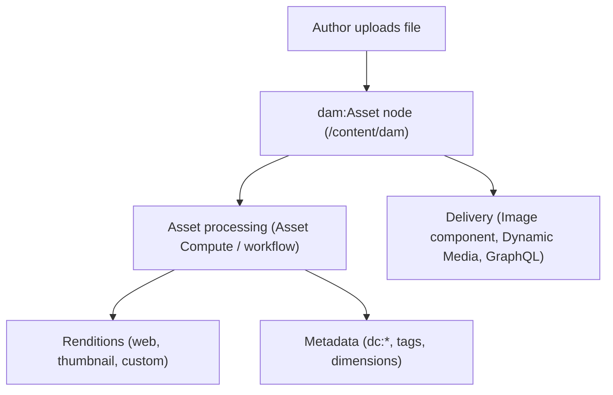

# Assets & DAM

Almost every page references images, videos, PDFs, or other binaries. In AEM those binaries live in
the **Digital Asset Management (DAM)** repository under `/content/dam`, managed through the **Assets**
console. This chapter covers how assets are stored, processed, tagged, and delivered.

## What is the DAM?

The DAM is a structured store of `dam:Asset` nodes. Each asset bundles the **original** binary, a set
of generated **renditions** (resized/reformatted copies), and **metadata** (title, description,
copyright, dimensions, tags).



### Asset node structure

```text
/content/dam/mysite/hero.jpg
├── jcr:content
│   ├── jcr:primaryType = "dam:AssetContent"
│   ├── metadata
│   │   ├── dc:title = "Hero banner"
│   │   ├── dc:description = "People collaborating in an office"
│   │   ├── tiff:ImageWidth = 1920
│   │   └── cq:tags = ["mysite:topics/marketing"]
│   └── renditions
│       ├── original          # the uploaded file
│       ├── cq5dam.thumbnail.140.100.png
│       └── cq5dam.web.1280.1280.jpeg
```

## Uploading and organizing assets

1. Open **Assets > Files** (`http://localhost:4502/assets.html/content/dam`).
2. Create a folder hierarchy that mirrors your sites or brands, e.g. `/content/dam/mysite/heroes`,
   `/content/dam/mysite/logos`.
3. **Create > Files** (or drag-and-drop) to upload. Bulk uploads and folder uploads are supported.

A clean folder structure matters: it is the unit for **permissions**, **metadata profiles**, and
**processing profiles**, and it keeps search and reuse manageable.

:::tip Folder metadata and policies
Select a folder and open **Properties** to apply a **metadata schema**, a **processing profile**, and
(on AEMaaCS) allowed Content Fragment Models. Settings applied at the folder level cascade to assets
inside it.
:::

## Metadata and metadata schemas

Metadata powers search, governance, accessibility, and dynamic content. Standard fields use the
Dublin Core (`dc:*`) and XMP namespaces; you can add custom fields with a **Metadata Schema**:

1. Go to **Tools > Assets > Metadata Schemas**.
2. Edit the default schema or create one, then drag in fields (text, dropdown, date, tags).
3. Apply the schema to a DAM folder via the folder's **Properties**.

Good metadata habits:

- Fill in **title** and **description** on upload - the Image Core Component can use the description
  as `alt` text, which is essential for accessibility.
- Capture **copyright/usage rights** (`dc:rights`) so authors know what they may publish.
- Use **tags** (see below) rather than free-text for anything you want to filter or query on.

## Tagging

Tags are a controlled vocabulary stored under `/content/cq:tags`. Apply them to assets to enable
faceted search and dynamic lists. Manage taxonomies in **Tools > General > Tagging**. For the full
model, see the [Tags & Taxonomies](../content/tags-taxonomies.md) reference.

## Renditions and processing profiles

On upload, AEM runs **asset processing**:

- **AEM as a Cloud Service** uses **Asset Compute** microservices (cloud-native, fast, supports
  modern formats like WebP and AVIF).
- **AEM 6.5** uses the **DAM Update Asset** workflow with ImageMagick/Sling.

| Rendition pattern | Purpose |
|-------------------|---------|
| `original` | The untouched uploaded file |
| `cq5dam.thumbnail.*` | Console thumbnails |
| `cq5dam.web.*` | Web-optimized delivery rendition |
| Custom (processing profile) | Project sizes/formats, e.g. a 2048px WebP hero |

Configure custom renditions in **Tools > Assets > Processing Profiles** (AEMaaCS) and apply the
profile to a folder. The Image Core Component requests the appropriate rendition (or an on-the-fly
resize via the adaptive image servlet) automatically.

## Smart Tags and AI

AEM can auto-tag images using Adobe Sensei **Smart Tags** - it predicts relevant tags from image
content, which speeds up tagging large libraries. Smart Tags require the appropriate Assets
capability to be enabled. Treat them as suggestions an author reviews, not ground truth.

## Dynamic Media

For sites with heavy image/video needs, **Dynamic Media** delivers responsive, on-the-fly transformed
media (smart crops, zoom/pan, interactive video) from Adobe's CDN. It is an opt-in capability; for
most projects the Core Components + adaptive image servlet are sufficient. See Adobe's
[Assets documentation](https://experienceleague.adobe.com/en/docs/experience-manager-cloud-service/content/assets/overview) (Dynamic Media section) when you need it.

## Using assets on pages

Authors reference assets by path from component dialogs (a `pathfield` or `fileReference`), or by
dragging an asset from the asset finder onto a drop target (see
[Component Dialogs -- drop targets](../component-dialogs.mdx#drop-target-for-assets)). The stored value
is the asset path (e.g. `/content/dam/mysite/hero.jpg`), which the component resolves at render time.

## Programmatic access

The `com.day.cq.dam.api` package exposes `Asset` and `Rendition`. Adapt a resource to `Asset`:

```java
import com.day.cq.dam.api.Asset;
import com.day.cq.dam.api.Rendition;

Resource assetResource = resolver.getResource("/content/dam/mysite/hero.jpg");
Asset asset = assetResource.adaptTo(Asset.class);

if (asset != null) {
    String mimeType = asset.getMimeType();
    Rendition web = asset.getRendition("cq5dam.web.1280.1280.jpeg");
    String title = asset.getMetadataValue("dc:title");
}
```

To create or modify assets, use the `AssetManager` service (see Adobe's
[Assets API](https://experienceleague.adobe.com/en/docs/experience-manager-65/content/assets/extending/mac-api-assets)).
For one-off bulk changes, the [Groovy Console](../groovy-console.mdx) is often the fastest route.

## Best practices

- **Organize by site/brand**, then by purpose (heroes, logos, documents). Folders are your
  permission and policy boundary.
- **Require metadata** (title, description, rights) via a metadata schema so assets are accessible and
  governable by default.
- **Let processing profiles produce delivery renditions** - never upload pre-resized "web copies"
  manually; you lose the original and the renditions drift.
- **Publish assets with their pages.** A page that references an unpublished asset renders a broken
  image on the publish tier (see [Publishing & Replication](./16-publishing-and-replication.md)).
- **Tag instead of naming conventions** for anything you need to search or list dynamically.

## Summary

You learned:

- The **DAM** stores assets as `dam:Asset` nodes with an original, renditions, and metadata
- **Uploading and organizing** assets, and why folder structure drives permissions and policies
- **Metadata schemas** and **tagging** for governance, search, and accessibility
- **Renditions and processing profiles** (Asset Compute on AEMaaCS, DAM Update Asset on 6.5)
- **Smart Tags** and **Dynamic Media** as opt-in capabilities
- **Referencing** assets from components and accessing them with the `Asset` API

## Official Documentation

- [Assets overview (Experience League)](https://experienceleague.adobe.com/en/docs/experience-manager-cloud-service/content/assets/overview)
- [Managing Digital Assets](https://experienceleague.adobe.com/en/docs/experience-manager-cloud-service/content/assets/manage/manage-digital-assets) - upload, metadata, renditions
- [Metadata Schemas](https://experienceleague.adobe.com/en/docs/experience-manager-cloud-service/content/assets/manage/metadata-schemas)
- [Processing Profiles](https://experienceleague.adobe.com/en/docs/experience-manager-learn/assets/configuring/processing-profiles)

Next up: [Content Fragments & GraphQL](./13-content-fragments-and-graphql.md) - channel-neutral
structured content, Content Fragment Models, the AEM GraphQL API, and headless delivery.
