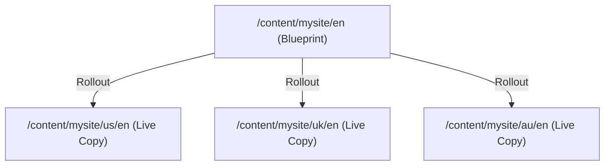
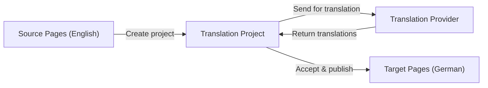

# Multi-Site Manager & i18n

Enterprise websites often span multiple countries, languages, and brands. AEM provides two complementary systems: *
*Multi-Site Manager (MSM)** for content reuse across sites, and **i18n** for language translation.

## Multi-Site Manager (MSM)

MSM lets you create **Live Copies** -- sites that inherit content from a **Blueprint** (source) site and can be
customized locally.



### When to use MSM

| Scenario                                            | Solution                      |
|-----------------------------------------------------|-------------------------------|
| Same language, different regions (US/UK/AU English) | MSM Live Copies               |
| Different languages (English/German/French)         | Language Copies + Translation |
| Different brands sharing content                    | MSM with Blueprint            |
| Franchise sites with local customization            | MSM Live Copies               |

### Key concepts

| Concept            | Description                                                |
|--------------------|------------------------------------------------------------|
| **Blueprint**      | The source site -- the "master" content                    |
| **Live Copy**      | A site that inherits from the blueprint                    |
| **Rollout**        | Push changes from blueprint to live copies                 |
| **Inheritance**    | Live copy pages/components inherit from blueprint          |
| **Detach**         | Break inheritance for a page or component (local override) |
| **Suspend**        | Temporarily pause inheritance                              |
| **Rollout Config** | Rules that define what gets rolled out and how             |

### Creating a Blueprint

1. Create your master site structure under `/content/mysite/en`
2. Go to **Tools** > **General** > **Blueprints**
3. Click **Create**
4. Select your source: `/content/mysite/en`
5. Give it a title and save

### Creating a Live Copy

1. Go to the **Sites** console
2. Click **Create** > **Live Copy**
3. Select the source (blueprint)
4. Set the destination path (e.g., `/content/mysite/us/en`)
5. Select a **Rollout Config** (see below)
6. Choose the depth (include sub-pages or not)
7. Click **Create**

### Rollout configurations

Rollout configs define the synchronization behavior:

| Config                        | Behavior                                  |
|-------------------------------|-------------------------------------------|
| **Standard Rollout Config**   | Push content on rollout trigger           |
| **Push on Modify**            | Auto-push when blueprint is modified      |
| **Push on Modify and Create** | Auto-push on modify and new page creation |

You can also create custom rollout configs that combine triggers and actions.

### Rolling out changes

After updating the blueprint:

1. Open the blueprint page
2. Click **Page Information** > **Rollout Page**
3. Select which live copies to update
4. Choose depth (this page only or including sub-pages)
5. Click **Rollout**

Or use **bulk rollout**: go to the Blueprint console, select the blueprint, and roll out to all live copies at once.

### Inheritance and local overrides

By default, live copy components inherit their content from the blueprint. When an author edits a component on a live
copy:

- The **inheritance breaks** for that component
- Future rollouts will **not** overwrite the local change
- A **broken inheritance icon** appears on the component

Authors can re-establish inheritance from the component toolbar.

### Conflict resolution

When both the blueprint and live copy have been modified:

| Blueprint changed | Live copy changed | Rollout result                                                        |
|-------------------|-------------------|-----------------------------------------------------------------------|
| Yes               | No                | Live copy updated                                                     |
| No                | Yes               | Live copy keeps local change                                          |
| Yes               | Yes               | **Conflict** -- live copy keeps local change (inheritance was broken) |

## Language copies and translation

For multi-language sites, AEM uses **Language Copies** and the **Translation Framework**.

### Site structure for multi-language

```
/content/mysite/
├── en/           # English (master)
│   ├── home
│   ├── about
│   └── blog/
├── de/           # German (translation)
│   ├── home
│   ├── about
│   └── blog/
├── fr/           # French (translation)
│   ├── home
│   ├── about
│   └── blog/
└── ja/           # Japanese (translation)
```

Each language root (`en`, `de`, `fr`, `ja`) contains a parallel site structure.

### Creating a language copy

1. Go to **Sites** console
2. Select the source language root (e.g., `/content/mysite/en`)
3. Click **Create** > **Language Copy**
4. Select target languages
5. Choose:
    - **Create structure only** -- creates empty pages with the same structure
    - **Create a new translation project** -- creates pages and a translation project

### Translation projects

Translation projects manage the workflow of translating content:



1. A translation project is created from the source content
2. Translation jobs are sent to a **translation provider** (human translator, machine translation, or a service like
   SDL, Smartling, etc.)
3. Translated content is reviewed and approved
4. Approved content is published to the target language

### Machine translation

AEM integrates with machine translation services. Configure in **Tools** > **Cloud Services** > **Translation Cloud
Configuration**:

- **Microsoft Translator**
- **Google Cloud Translation**
- Custom connectors via the Translation Integration Framework

### Translation best practices

1. **Translate structure first** -- create language copies with structure only, then fill in translations
2. **Use the translation project workflow** -- it tracks what is translated and what is not
3. **Keep master content stable** -- finalize English content before translating
4. **Tag translatable content** -- mark which components and properties need translation

## i18n dictionaries

For **UI strings** (labels, buttons, error messages), AEM uses i18n dictionaries stored in the repository.

### Dictionary structure

```
/apps/mysite/i18n/
├── en.json       # English strings
├── de.json       # German strings
├── fr.json       # French strings
└── ja.json       # Japanese strings
```

Or as Sling i18n nodes:

```
/apps/mysite/i18n/
├── en/
│   ├── jcr:primaryType = "nt:folder"
│   ├── jcr:mixinTypes = [mix:language]
│   ├── jcr:language = "en"
│   └── readMore
│       ├── jcr:primaryType = "sling:MessageEntry"
│       ├── sling:key = "readMore"
│       └── sling:message = "Read More"
├── de/
│   └── readMore
│       ├── sling:key = "readMore"
│       └── sling:message = "Mehr lesen"
```

### Using i18n in HTL

```html
<!-- Translate a string -->
<span>${'Read More' @ i18n}</span>

<!-- With locale override -->
<span>${'Read More' @ i18n, locale='de'}</span>

<!-- In attributes -->
<button aria-label="${'Close' @ i18n}">X</button>
```

HTL automatically resolves the translation based on the current page's language.

### Using i18n in Java

```java
import com.day.cq.i18n.I18n;

@Model(adaptables = SlingHttpServletRequest.class)
public class MyModel {

    @Self
    private SlingHttpServletRequest request;

    private I18n i18n;

    @PostConstruct
    protected void init() {
        i18n = new I18n(request);
    }

    public String getReadMoreLabel() {
        return i18n.get("Read More");
    }
}
```

> For more details, see
> the [Multi-Site Manager (MSM)](/aem/content/multi-site-manager-msm), [i18n and Translation](/aem/content/i18n-translation),
> and [Replication and Activation](/aem/content/replication-activation) references.

## Summary

You learned:

- **MSM** -- Blueprints and Live Copies for content reuse across regions/brands
- **Rollout** -- pushing blueprint changes to live copies
- **Inheritance** -- how live copies inherit and override content
- **Language copies** -- parallel site structures for each language
- **Translation projects** -- managed workflows for content translation
- **Machine translation** integration
- **i18n dictionaries** -- translating UI strings in HTL and Java

The content side is complete. The final two chapters cover production concerns: Dispatcher caching and Cloud Manager
deployment.

Next up: [Dispatcher & Caching](./13-dispatcher-and-caching.md) -- Dispatcher architecture, cache rules, filters,
rewrites, vanity URLs, invalidation, and local SDK testing.
