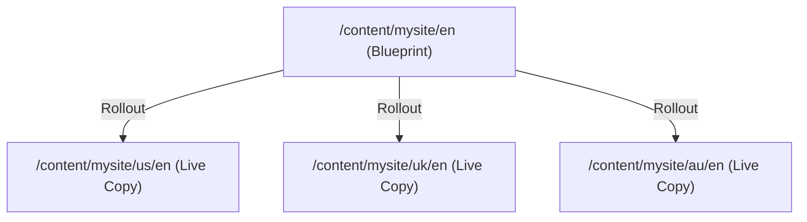
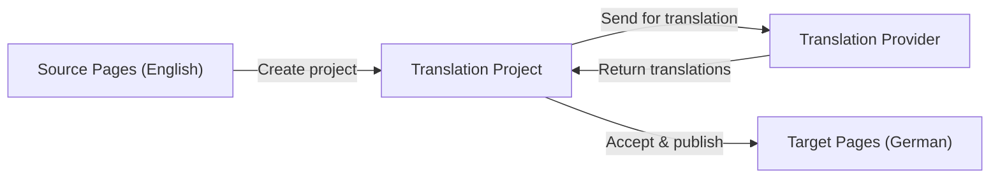

# Multi-Site Manager & i18n

Enterprise websites often span multiple countries, languages, and brands. AEM provides two complementary systems: *
*Multi-Site Manager (MSM)** for content reuse across sites, and **i18n** for language translation.

## Multi-Site Manager (MSM)

MSM lets you create **Live Copies** - sites that inherit content from a **Blueprint** (source) site and can be
customized locally.


```mermaid
flowchart TD
    Blueprint["/content/mysite/en (Blueprint)"]
    US["/content/mysite/us/en (Live Copy)"]
    UK["/content/mysite/uk/en (Live Copy)"]
    AU["/content/mysite/au/en (Live Copy)"]

    Blueprint -->|"Rollout"| US
    Blueprint -->|"Rollout"| UK
    Blueprint -->|"Rollout"| AU
```

### When to use MSM

| Scenario                                            | Solution                      |
|-----------------------------------------------------|-------------------------------|
| Same language, different regions (US/UK/AU English) | MSM Live Copies               |
| Different languages (English/German/French)         | Language Copies + Translation |
| Different brands sharing content                    | MSM with Blueprint            |
| Franchise sites with local customization            | MSM Live Copies               |

### Key concepts

| Concept            | Description                                                |
|--------------------|------------------------------------------------------------|
| **Blueprint**      | The source site - the "master" content                    |
| **Live Copy**      | A site that inherits from the blueprint                    |
| **Rollout**        | Push changes from blueprint to live copies                 |
| **Inheritance**    | Live copy pages/components inherit from blueprint          |
| **Detach**         | Break inheritance for a page or component (local override) |
| **Suspend**        | Temporarily pause inheritance                              |
| **Rollout Config** | Rules that define what gets rolled out and how             |

### Creating a Blueprint

1. Create your master site structure under `/content/mysite/en`
2. Go to **Tools** > **General** > **Blueprints**
3. Click **Create**
4. Select your source: `/content/mysite/en`
5. Give it a title and save

### Creating a Live Copy

1. Go to the **Sites** console
2. Click **Create** > **Live Copy**
3. Select the source (blueprint)
4. Set the destination path (e.g., `/content/mysite/us/en`)
5. Select a **Rollout Config** (see below)
6. Choose the depth (include sub-pages or not)
7. Click **Create**

### Rollout configurations

Rollout configs define the synchronization behavior:

| Config                        | Behavior                                  |
|-------------------------------|-------------------------------------------|
| **Standard Rollout Config**   | Push content on rollout trigger           |
| **Push on Modify**            | Auto-push when blueprint is modified      |
| **Push on Modify and Create** | Auto-push on modify and new page creation |

You can also create custom rollout configs that combine triggers and actions.

### Rolling out changes

After updating the blueprint:

1. Open the blueprint page
2. Click **Page Information** > **Rollout Page**
3. Select which live copies to update
4. Choose depth (this page only or including sub-pages)
5. Click **Rollout**

Or use **bulk rollout**: go to the Blueprint console, select the blueprint, and roll out to all live copies at once.

### Inheritance and local overrides

By default, live copy components inherit their content from the blueprint. When an author edits a component on a live
copy:

- The **inheritance breaks** for that component
- Future rollouts will **not** overwrite the local change
- A **broken inheritance icon** appears on the component

Authors can re-establish inheritance from the component toolbar.

### Conflict resolution

When both the blueprint and live copy have been modified:

| Blueprint changed | Live copy changed | Rollout result                                                        |
|-------------------|-------------------|-----------------------------------------------------------------------|
| Yes               | No                | Live copy updated                                                     |
| No                | Yes               | Live copy keeps local change                                          |
| Yes               | Yes               | **Conflict** - live copy keeps local change (inheritance was broken) |

## Language copies and translation

For multi-language sites, AEM uses **Language Copies** and the **Translation Framework**.

### Site structure for multi-language

```
/content/mysite/
├── en/           # English (master)
│   ├── home
│   ├── about
│   └── blog/
├── de/           # German (translation)
│   ├── home
│   ├── about
│   └── blog/
├── fr/           # French (translation)
│   ├── home
│   ├── about
│   └── blog/
└── ja/           # Japanese (translation)
```

Each language root (`en`, `de`, `fr`, `ja`) contains a parallel site structure.

### Creating a language copy

1. Go to **Sites** console
2. Select the source language root (e.g., `/content/mysite/en`)
3. Click **Create** > **Language Copy**
4. Select target languages
5. Choose:
    - **Create structure only** - creates empty pages with the same structure
    - **Create a new translation project** - creates pages and a translation project

### Translation projects

Translation projects manage the workflow of translating content:


```mermaid
flowchart LR
    Source["Source Pages (English)"]
    Project["Translation Project"]
    Provider["Translation Provider"]
    Target["Target Pages (German)"]

    Source -->|"Create project"| Project
    Project -->|"Send for translation"| Provider
    Provider -->|"Return translations"| Project
    Project -->|"Accept & publish"| Target
```

1. A translation project is created from the source content
2. Translation jobs are sent to a **translation provider** (human translator, machine translation, or a service like
   SDL, Smartling, etc.)
3. Translated content is reviewed and approved
4. Approved content is published to the target language

### Machine translation

AEM integrates with machine translation services. Configure in **Tools** > **Cloud Services** > **Translation Cloud
Configuration**:

- **Microsoft Translator**
- **Google Cloud Translation**
- Custom connectors via the Translation Integration Framework

### Translation rules

By default AEM only translates a known set of properties (`jcr:title`, `jcr:description`, etc.). To
translate **custom** component properties, register them in the **translation rules** configuration
(`/conf/global/settings/translation/rules/translation_rules.xml`, editable via **Tools > General >
Translation Configuration**):

```xml title="translation_rules.xml -- translate a custom property and a whole component"
<nodelist>
    <!-- Translate the custom 'subtitle' property on any node -->
    <node path="/content">
        <property name="subtitle" translate="true"/>
    </node>
    <!-- Translate all text properties of a specific component -->
    <node resourceType="mysite/components/teaser">
        <property name="pretitle" translate="true"/>
        <property name="ctaText" translate="true"/>
    </node>
</nodelist>
```

If translated content comes back missing a field, an un-registered property is the usual cause.

### hreflang and multi-language SEO

For search engines, expose the language/region alternates with `hreflang` link tags so each locale's
page is indexed correctly and duplicate-content penalties are avoided:

```html
<link rel="alternate" hreflang="en" href="https://example.com/en/"/>
<link rel="alternate" hreflang="de" href="https://example.com/de/"/>
<link rel="alternate" hreflang="x-default" href="https://example.com/en/"/>
```

Generate these in your page component's `customheaderlibs.html` by iterating the available language
copies (the Language Navigation model or `LanguageManager` API gives you the set). Keep the URL
structure locale-first (`/en/`, `/de/`) so the alternates map cleanly.

### Translation best practices

1. **Translate structure first** - create language copies with structure only, then fill in translations
2. **Use the translation project workflow** - it tracks what is translated and what is not
3. **Keep master content stable** - finalize English content before translating
4. **Tag translatable content** - register custom properties in the translation rules (above)

## i18n dictionaries

For **UI strings** (labels, buttons, error messages), AEM uses i18n dictionaries stored in the repository.

> **Important distinction:** AEM/Sling i18n dictionaries are repository resources used by HTL/Java i18n resolution.
> Frontend translation JSON files used by SPA frameworks are a separate mechanism.

### Dictionary structure (Sling i18n)

Repository node structure example:

```
/apps/mysite/i18n/
├── en/
│   ├── jcr:primaryType = "nt:folder"
│   ├── jcr:mixinTypes = [mix:language]
│   ├── jcr:language = "en"
│   └── readMore
│       ├── jcr:primaryType = "sling:MessageEntry"
│       ├── sling:key = "readMore"
│       └── sling:message = "Read More"
├── de/
│   └── readMore
│       ├── sling:key = "readMore"
│       └── sling:message = "Mehr lesen"
```

### JSON dictionaries (modern archetype default)

The node-per-message format above still works, but the current AEM Maven archetype ships **JSON
dictionaries** instead - they are far easier to maintain in Git and diff in pull requests. A JSON
dictionary is a single file per language inside a clientlib-style folder marked with the
`mix:language` mixin:

```text
ui.apps/.../jcr_root/apps/mysite/i18n/
├── .content.xml          # cq:ClientLibraryFolder, mixin mix:language is set per-language file
├── en.json
└── de.json
```

```json title="apps/mysite/i18n/en.json"
{
    "readMore": "Read More",
    "close": "Close",
    "search.placeholder": "Search the site"
}
```

```json title="apps/mysite/i18n/de.json"
{
    "readMore": "Mehr lesen",
    "close": "Schliessen",
    "search.placeholder": "Website durchsuchen"
}
```

Sling resolves either format transparently - HTL `${'readMore' @ i18n}` and the Java `I18n` API work
the same regardless of which storage you use. **Prefer JSON for new projects.**

### Using i18n in HTL

```html
<!-- Translate a string -->
<span>${'Read More' @ i18n}</span>

<!-- With explicit locale override (requires Sling i18n support for the locale option) -->
<span>${'Read More' @ i18n, locale='de'}</span>

<!-- In attributes -->
<button aria-label="${'Close' @ i18n}">X</button>
```

HTL automatically resolves the translation based on the current page's language.

### Using i18n in Java

```java
import com.day.cq.i18n.I18n;

@Model(adaptables = SlingHttpServletRequest.class)
public class MyModel {

    @Self
    private SlingHttpServletRequest request;

    private I18n i18n;

    @PostConstruct
    protected void init() {
        i18n = new I18n(request);
    }

    public String getReadMoreLabel() {
        return i18n.get("Read More");
    }
}
```

> For more details, see
> the [Multi-Site Manager (MSM)](/aem/content/multi-site-manager-msm), [i18n and Translation](/aem/content/i18n-translation),
> and [Replication and Activation](/aem/content/replication-activation) references.

## Summary

You learned:

- **MSM** - Blueprints and Live Copies for content reuse across regions/brands
- **Rollout** - pushing blueprint changes to live copies
- **Inheritance** - how live copies inherit and override content
- **Language copies** - parallel site structures for each language
- **Translation projects** - managed workflows for content translation
- **Translation rules** - registering custom properties for translation
- **Machine translation** integration
- **i18n dictionaries** - node-based and JSON formats, used in HTL and Java
- **hreflang** - multi-language SEO alternates

## Official Documentation

- [Multi Site Manager (Experience League)](https://experienceleague.adobe.com/en/docs/experience-manager-cloud-service/content/sites/administering/introduction/msm) - blueprints, live copies, rollout configs
- [Translating Content for Multilingual Sites](https://experienceleague.adobe.com/en/docs/experience-manager-cloud-service/content/sites/administering/translation/overview) - translation framework and projects
- [Configuring the Translation Integration Framework](https://experienceleague.adobe.com/en/docs/experience-manager-cloud-service/content/sites/administering/translation/integration-framework) - connectors and rules
- [Internationalizing Components (i18n)](https://experienceleague.adobe.com/en/docs/experience-manager-cloud-service/content/implementing/developing/components/i18n/i18n-dev) - dictionaries in HTL and Java

The content side is complete. The final two chapters cover production concerns: Dispatcher caching and Cloud Manager
deployment.

Next up: [Dispatcher & Caching](./13-dispatcher-and-caching.md) - Dispatcher architecture, cache rules, filters,
rewrites, vanity URLs, invalidation, and local SDK testing.
