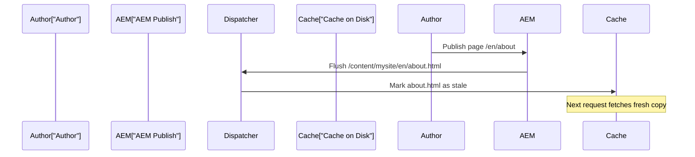

# Dispatcher & Caching

The Dispatcher is a **caching and load-balancing** layer that sits in front of AEM Publish instances. It is the first
line of defense for performance and security. In AEMaaCS, the Dispatcher runs on Apache HTTP Server with a custom
module.

## Architecture


```mermaid
flowchart LR
    User["Website Visitor"]
    CDN["Adobe-managed CDN"]
    Dispatcher["Dispatcher (Apache)"]
    Publish["AEM Publish"]

    User -->|"Request"| CDN
    CDN -->|"Cache miss"| Dispatcher
    Dispatcher -->|"Cache miss"| Publish
    Publish -->|"Response"| Dispatcher
    Dispatcher -->|"Cached"| CDN
    CDN -->|"Cached"| User
```

In AEMaaCS, the flow is:

1. **Adobe-managed CDN** - first cache layer
2. **Dispatcher** - Apache + Dispatcher module. Second cache layer
3. **AEM Publish** - renders the page if not cached

Most requests should be served from CDN or Dispatcher cache, never reaching Publish.

### What the Dispatcher does

| Function           | Description                                   |
|--------------------|-----------------------------------------------|
| **Caching**        | Stores rendered HTML, images, CSS, JS on disk |
| **Filtering**      | Blocks malicious or unnecessary requests      |
| **Load balancing** | Distributes requests across Publish instances |
| **URL rewriting**  | Maps vanity URLs and redirects                |
| **Security**       | Blocks access to sensitive paths              |

## Dispatcher configuration in your project

The Dispatcher config lives in the `dispatcher/` module:

```
dispatcher/
└── src/
    ├── conf.d/
    │   ├── available_vhosts/
    │   │   └── default.vhost         # Virtual host configuration
    │   ├── enabled_vhosts/
    │   │   └── default.vhost -> ...  # Symlink to enable
    │   ├── rewrites/
    │   │   └── rewrite.rules         # URL rewrite rules
    │   └── variables/
    │       └── custom.vars           # Custom variables
    └── conf.dispatcher.d/
        ├── available_farms/
        │   └── default.farm          # Farm configuration
        ├── enabled_farms/
        │   └── default.farm -> ...   # Symlink to enable
        ├── cache/
        │   └── rules.any             # Cache rules
        ├── clientheaders/
        │   └── clientheaders.any     # Forwarded headers
        ├── filters/
        │   └── filters.any           # Request filters
        └── renders/
            └── default_renders.any   # Publish instance addresses
```

## Cache rules

Cache rules define which responses the Dispatcher stores:

```
# cache/rules.any

# Cache HTML pages
/0000 { /type "allow" /glob "*.html" }

# Cache clientlibs (CSS, JS)
/0001 { /type "allow" /glob "/etc.clientlibs/*" }

# Cache static assets
/0002 { /type "allow" /glob "*.css" }
/0003 { /type "allow" /glob "*.js" }
/0004 { /type "allow" /glob "*.gif" }
/0005 { /type "allow" /glob "*.ico" }
/0006 { /type "allow" /glob "*.jpg" }
/0007 { /type "allow" /glob "*.jpeg" }
/0008 { /type "allow" /glob "*.png" }
/0009 { /type "allow" /glob "*.svg" }
/0010 { /type "allow" /glob "*.webp" }
/0011 { /type "allow" /glob "*.woff2" }

# Do not cache JSON API responses (dynamic)
/0100 { /type "deny" /glob "*.json" }

# Exception: cache persisted GraphQL query responses
/0101 { /type "allow" /glob "/graphql/execute.json/*" }
```

> **Tip:** In AEMaaCS, the default rules are already good. Customize only when needed. Note that the blanket JSON deny
> above would also block caching of GraphQL persisted query responses. If you use headless delivery (chapter 11), add
> an explicit allow rule for the persisted query path as shown.

### Cacheable responses

The Dispatcher only caches responses that:

1. Return **HTTP 200**
2. Are **GET requests** (POST, PUT, DELETE are never cached)
3. Do **not** have `Set-Cookie` headers
4. Do **not** have `Authorization` headers
5. Match the **cache rules** (`/cache` section)

> **Query strings:** By default, the Dispatcher ignores query parameters for caching - `/page.html?v=1` and
> `/page.html?v=2` serve the same cached file. This is configurable via the `/ignoreUrlParams` setting in the farm
> config. Only add parameters to the allow list if you genuinely need parameter-specific caching.

## Filters

Filters control which requests reach AEM:

```
# filters/filters.any

# Start from deny-by-default and allow only what is required
/0000 { /type "deny" /url "*" }

# Allow basic delivery paths
/0001 { /type "allow" /method "GET" /url "/content/*" }
/0002 { /type "allow" /method "GET" /url "/etc.clientlibs/*" }

# Allow GraphQL persisted queries
/0010 { /type "allow" /method "GET" /url "/graphql/execute.json/*" }

# Block sensitive paths explicitly
/0100 { /type "deny" /url "/system/*" }
/0101 { /type "deny" /url "/crx/*" }
/0102 { /type "deny" /url "/bin/*" }
/0103 { /type "deny" /url "*.infinity.json" }
/0104 { /type "deny" /url "*.tidy.json" }
/0105 { /type "deny" /url "*.sysview.xml" }
/0106 { /type "deny" /url "*.docview.xml" }
/0107 { /type "deny" /url "*.query.json" }

# Block selectors that expose raw content
/0200 { /type "deny" /selectors '(feed|rss|pages|languages|blueprint|infinity)' }
```

### Filter order matters

Filters are evaluated **top to bottom** and the **last matching rule wins** (not the first). This means later rules
override earlier ones. A common pattern:

1. **Deny all** baseline (`/0000`)
2. **Allow** only explicit delivery paths (`/0001`, `/0002`, ...)
3. **Deny** sensitive selectors/paths explicitly (`/0100+`) - these override the allows above because they come later

Because of last-match semantics, the position of your deny rules relative to allow rules is critical. A deny rule placed
before an allow will be overridden by that allow.

> **Security:** Always deny access to `/crx/*`, `/system/console/*`, and other admin paths on Publish.

## URL rewrites

Rewrite rules map vanity URLs and handle redirects:

```apache
# rewrites/rewrite.rules

# Remove /content/mysite/en prefix for clean URLs
RewriteRule ^/content/mysite/en/(.*)$ /$1 [PT,L]

# Redirect www to non-www
RewriteCond %{HTTP_HOST} ^www\.mysite\.com$
RewriteRule ^(.*)$ https://mysite.com$1 [R=301,L]

# Redirect old URLs
RewriteRule ^/old-page$ /new-page [R=301,L]
```

### Vanity URLs

AEM supports vanity URLs in page properties. An author can set `/products` as a vanity URL for
`/content/mysite/en/products-and-services`. The Dispatcher resolves these through a vanity URL mapping file.

## Cache invalidation

When content is published, the Dispatcher cache must be updated. AEM handles this automatically.

### Auto-invalidation

When a page is published, AEM sends an invalidation request to the Dispatcher. The Dispatcher marks the cached file (and
potentially related files) as **stale**:


```mermaid
sequenceDiagram
    participant Author["Author"]
    participant AEM["AEM Publish"]
    participant Dispatcher
    participant Cache["Cache on Disk"]

    Author->>AEM: Publish page /en/about
    AEM->>Dispatcher: Flush /content/mysite/en/about.html
    Dispatcher->>Cache: Mark about.html as stale
    Note over Cache: Next request fetches fresh copy
```

### Stat file invalidation

The Dispatcher uses a `.stat` file mechanism for age-based invalidation:

1. When a page is published, AEM's **flush agent** on the Publish instance sends an HTTP invalidation request to the
   Dispatcher (the flush agent is configured in AEM's replication settings - in AEMaaCS, Adobe manages this
   automatically)
2. The Dispatcher **touches** (updates the timestamp of) the `.stat` file in the relevant cache directory
3. On the next request, the Dispatcher compares the cached file's timestamp against the `.stat` file
4. If the cached file is **older** than `.stat`, it is considered stale and re-fetched from Publish
5. If the cached file is **newer** than `.stat`, it is served directly from cache

### Stat file level

The `statfileslevel` setting controls how broadly invalidation spreads:

| Level | Behavior                                                             |
|-------|----------------------------------------------------------------------|
| 0     | One `.stat` at the root - all content invalidated on any publish    |
| 1     | `.stat` per first-level directory - `/en/` and `/de/` independent   |
| 2     | `.stat` per second-level - `/en/blog/` and `/en/about/` independent |

Higher levels = more granular invalidation = better cache hit ratio.

```
# In the farm config
/statfileslevel "2"
```

## Local Dispatcher testing with the SDK

The AEMaaCS SDK includes a Dispatcher SDK for local testing.

### Setup

1. Download the Dispatcher SDK from the Software Distribution portal
2. Extract it alongside your AEM SDK
3. The SDK includes Docker-based tools for running the Dispatcher locally

### Validate configuration

```bash
# From the dispatcher SDK directory
./bin/validator full dispatcher/src
```

This validates your Dispatcher configuration against AEMaaCS rules. Common checks:

- No deprecated directives
- No hardcoded IPs
- All includes resolve
- Filters follow security best practices

### Run locally

```bash
# Start the local Dispatcher (Docker required)
./bin/docker_run.sh dispatcher/src host.docker.internal:4503
```

This starts an Apache + Dispatcher instance pointing to your local Publish on port 4503. Test at
`http://localhost:8080`.

### AEMaaCS Dispatcher restrictions

In AEMaaCS, the Dispatcher configuration is **partially immutable**. Adobe manages the base Apache/Dispatcher
configuration, and your project can only customize specific areas:

| Allowed                                                  | Not allowed                                                   |
|----------------------------------------------------------|---------------------------------------------------------------|
| Custom virtual hosts in `conf.d/available_vhosts/`       | Custom Apache modules (`LoadModule`)                          |
| Rewrite rules in `conf.d/rewrites/`                      | Modifying `httpd.conf` or `dispatcher.any` directly           |
| Custom filters in `conf.dispatcher.d/filters/`           | Changing the render address (managed by Adobe)                |
| Cache rules in `conf.dispatcher.d/cache/`                | Adding `AllowOverride` or `.htaccess` files                   |
| Custom variables in `conf.d/variables/`                  | Inline PHP, CGI, or other scripting modules                   |
| Client headers in `conf.dispatcher.d/clientheaders/`     | Directives that conflict with Adobe's base configuration      |

The Dispatcher SDK validator (`./bin/validator full`) enforces these restrictions locally. Always validate before
pushing to Cloud Manager - the pipeline will reject invalid configurations.

### Testing checklist

| Test              | What to verify                                      |
|-------------------|-----------------------------------------------------|
| **Page loads**    | Pages render correctly through the Dispatcher       |
| **Caching**       | Reload and check the `X-Dispatcher` response header |
| **Filters**       | Admin paths return 403 or 404                       |
| **Rewrites**      | Vanity URLs resolve correctly                       |
| **Invalidation**  | Publish a page and verify the cache is refreshed    |
| **Static assets** | CSS, JS, images served with proper cache headers    |

### Troubleshooting quick guide

| Symptom                               | First check                                | Typical fix                                                |
|---------------------------------------|--------------------------------------------|------------------------------------------------------------|
| Unexpected 403 via Dispatcher         | `filters.any` order and last-match behavior | Add explicit allow for required path before deny selectors |
| Cache never hits                      | Response headers and cache rules            | Remove non-cacheable headers where appropriate, adjust rules |
| Content stale after publish           | Invalidation logs and `statfileslevel`      | Verify flush agent flow and tune invalidation granularity  |
| Vanity URL fails                      | Rewrite/vanity mappings and vhost            | Rebuild mappings and validate rewrite conditions            |
| Works direct publish, fails on CDN    | CDN cache/headers and dispatcher response    | Align cache headers and purge strategy                      |

> For detailed configuration, see the [Dispatcher Configuration](/aem/infrastructure/dispatcher-configuration)
> reference. See also [Performance](/aem/infrastructure/performance) for broader optimization strategies
> and [Security Basics](/aem/infrastructure/security) for hardening your Publish tier.

## Summary

You learned:

- **Dispatcher architecture** - CDN > Dispatcher > Publish
- **Cache rules** - what gets cached and what does not
- **Filters** - blocking malicious requests, allowing legitimate ones
- **URL rewrites** - vanity URLs and redirects
- **Cache invalidation** - stat files, auto-invalidation on publish
- **Stat file level** - controlling invalidation granularity
- **Local testing** with the Dispatcher SDK

Next up: [Deployment & Cloud Manager](./14-deployment-and-cloud-manager.md) - Git repo structure, Cloud Manager
pipelines, environments, content transfer, and Rapid Development Environments.
