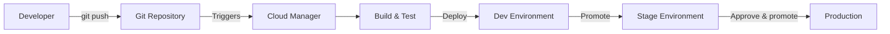
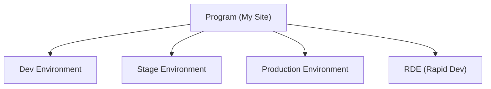
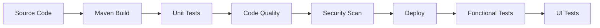
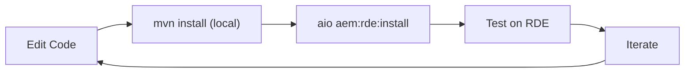
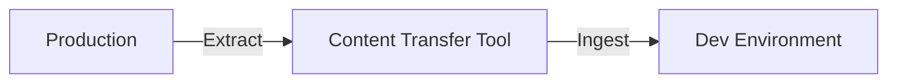

# Deployment & Cloud Manager

In AEM as a Cloud Service, you do not deploy by copying files to a server. Instead, you push code to a **Git repository
** and **Cloud Manager** builds, tests, and deploys it through a pipeline. This chapter covers the entire path from code
to production.

## The deployment model



| Step                  | What happens                                                 |
|-----------------------|--------------------------------------------------------------|
| **Push**              | Developer pushes code to the Cloud Manager Git repo          |
| **Build**             | Maven builds the project, runs tests, validates code quality |
| **Deploy to Dev**     | The `all` package is deployed to the development environment |
| **Promote to Stage**  | After dev validation, promote to staging                     |
| **Approve & go live** | Business approval, then deploy to production                 |

## Cloud Manager

Cloud Manager is Adobe's CI/CD platform for AEMaaCS. It provides:

- **Git repository** -- managed Git for your project
- **Build pipelines** -- Maven builds, code quality, security scans
- **Environments** -- dev, stage, production
- **Monitoring** -- logs, metrics, alerts

### Accessing Cloud Manager

1. Log in to [Adobe Experience Cloud](https://experience.adobe.com/)
2. Navigate to **Cloud Manager**
3. Select your program (a program maps to one AEM project)

### Programs and environments



| Environment    | Purpose                              | Access                |
|----------------|--------------------------------------|-----------------------|
| **Dev**        | Development and integration testing  | Developers            |
| **Stage**      | Pre-production testing, UAT          | QA team, stakeholders |
| **Production** | Live site                            | End users             |
| **RDE**        | Rapid iteration (no pipeline needed) | Developers            |

## Git repository

Cloud Manager provides a managed Git repository. Your project structure maps to it:

```
repository-root/
├── pom.xml
├── core/
├── ui.apps/
├── ui.content/
├── ui.config/
├── ui.frontend/
├── all/
├── dispatcher/
└── it.tests/
```

### Connecting your local project

```bash
# Add Cloud Manager as a remote
git remote add adobe https://git.cloudmanager.adobe.com/<org>/<program>/

# Push your code
git push adobe main
```

Or use Cloud Manager's Git directly as your primary repo. Many teams use GitHub/GitLab as the primary repo and sync to
Cloud Manager via CI/CD.

## Pipelines

Pipelines automate the build-test-deploy process.

### Pipeline types

| Type           | What it does                                                |
|----------------|-------------------------------------------------------------|
| **Full-stack** | Builds and deploys everything (code + content + Dispatcher) |
| **Frontend**   | Builds and deploys only `ui.frontend` (fast CSS/JS updates) |
| **Config**     | Deploys only configuration (CDN, WAF, traffic filter rules) |
| **Web Tier**   | Deploys only Dispatcher configuration                       |

### Full-stack pipeline stages



1. **Maven Build** -- compiles your project (`mvn clean install`)
2. **Unit Tests** -- runs `core/` tests
3. **Code Quality** -- SonarQube analysis (coverage, bugs, code smells)
4. **Security Scan** -- checks for known vulnerabilities
5. **Deploy** -- installs packages on the target environment
6. **Functional Tests** -- runs integration tests (`it.tests/`)
7. **UI Tests** -- runs end-to-end browser tests (if configured)

### Creating a pipeline

1. In Cloud Manager, go to **Pipelines**
2. Click **Add Pipeline**
3. Choose **Production** or **Non-Production**
4. Select the pipeline type (Full-stack)
5. Configure the trigger:
    - **On Git Changes** -- auto-trigger on push
    - **Manual** -- trigger manually
6. Select the Git branch
7. Configure quality gates (code coverage thresholds, etc.)

### Running a pipeline

1. Click **Run** on the pipeline
2. Watch the stages execute in the Cloud Manager UI
3. If a stage fails, review the logs:
    - Build logs for compilation errors
    - Test logs for test failures
    - Quality logs for SonarQube issues

### Code quality gates

Cloud Manager enforces code quality:

| Gate                   | Requirement                 |
|------------------------|-----------------------------|
| **Unit test coverage** | Minimum coverage percentage |
| **Reliability rating** | No critical bugs            |
| **Security rating**    | No critical vulnerabilities |
| **Maintainability**    | Acceptable code smell count |

Failing quality gates blocks deployment. You can override non-critical failures, but this requires manager approval.

## Rapid Development Environments (RDE)

RDEs are **fast-iteration environments** for developers. Unlike the full pipeline (which takes 30--60 minutes), RDE
deployments take **seconds**.

### Setting up an RDE

1. In Cloud Manager, create an RDE environment
2. Install the AEM RDE CLI plugin:

```bash
aio plugins:install @adobe/aio-cli-plugin-aem-rde
```

3. Connect to your RDE:

```bash
aio aem:rde:setup
```

### Deploying to RDE

```bash
# Deploy the entire project
aio aem:rde:install all/target/mysite.all-1.0-SNAPSHOT.zip

# Deploy just the core bundle (fast!)
aio aem:rde:install core/target/mysite.core-1.0-SNAPSHOT.jar

# Deploy a content package
aio aem:rde:install ui.apps/target/mysite.ui.apps-1.0-SNAPSHOT.zip

# Deploy Dispatcher config
aio aem:rde:install dispatcher/src --type dispatcher
```

### RDE workflow



The cycle time is dramatically shorter than a full pipeline. Use RDEs for:

- Trying out new features
- Debugging deployment issues
- Testing OSGi configurations
- Validating Dispatcher rules

> **Note:** RDE is for development only. Always use the full pipeline for stage and production.

## Content Transfer Tool

Moving content between environments (e.g., production content to dev for testing) uses the **Content Transfer Tool**:

### Steps

1. **Extract** -- create a content package from the source environment
2. **Ingest** -- import the package into the target environment



### What to transfer

| Content            | When to transfer                         |
|--------------------|------------------------------------------|
| **Pages**          | Copy production pages to dev for testing |
| **Assets**         | Copy DAM assets for realistic testing    |
| **Users/Groups**   | Sync permissions                         |
| **Configurations** | Templates, Cloud Configs                 |

> **Warning:** Never transfer content from dev to production. The pipeline handles code deployment.

## Environment-specific configuration

OSGi configurations vary by environment using run mode folders (chapter 3):

```
ui.config/src/main/content/jcr_root/apps/mysite/osgiconfig/
├── config/                    # All environments
├── config.author/             # Author instances
├── config.publish/            # Publish instances
├── config.dev/                # Dev environment
├── config.stage/              # Stage environment
└── config.prod/               # Production
```

### Environment variables

AEMaaCS supports environment-specific variables in Cloud Manager:

1. Go to **Environments** > select your environment
2. Click **Configuration**
3. Add variables:

| Variable       | Type     | Example        |
|----------------|----------|----------------|
| `API_KEY`      | Secret   | `sk-abc123...` |
| `ANALYTICS_ID` | Standard | `UA-12345-1`   |
| `FEATURE_FLAG` | Standard | `true`         |

Access in OSGi configs:

```json
{
    "api.key": "$[secret:API_KEY]",
    "analytics.id": "$[env:ANALYTICS_ID]"
}
```

Or in Java:

```java
@Activate
protected void activate(BundleContext ctx) {
    String analyticsId = ctx.getProperty("ANALYTICS_ID");
}
```

## Monitoring and logs

### Cloud Manager logs

Access logs from Cloud Manager:

1. Go to **Environments** > select environment
2. Click **Logs**
3. Available logs:

| Log            | Contains         |
|----------------|------------------|
| **aemerror**   | AEM error log    |
| **aemrequest** | HTTP request log |
| **aemaccess**  | Access log       |
| **dispatcher** | Dispatcher log   |
| **cdn**        | CDN log          |

### Log tailing

Use the CLI to tail logs in real time:

```bash
aio aem:log:tail --environment <env-id> --service author --name aemerror
```

### Custom logging

Configure log levels via OSGi:

```json
{
    "org.apache.sling.commons.log.names": ["com.mysite"],
    "org.apache.sling.commons.log.level": "debug",
    "org.apache.sling.commons.log.file": "logs/mysite.log"
}
```

## Going to production -- checklist

Before your first production deployment:

| Area             | Check                                          |
|------------------|------------------------------------------------|
| **Code quality** | All quality gates pass                         |
| **Tests**        | Unit, integration, and UI tests pass           |
| **Dispatcher**   | Config validated with Dispatcher SDK           |
| **Performance**  | Load testing completed                         |
| **Security**     | Security scan passes, sensitive paths blocked  |
| **SEO**          | Sitemap, robots.txt, canonical URLs, meta tags |
| **Analytics**    | Tracking configured and verified               |
| **Content**      | Content authored and reviewed                  |
| **Redirects**    | Old URL redirects configured                   |
| **DNS**          | Domain pointed to Adobe CDN                    |
| **SSL**          | Certificate provisioned via Cloud Manager      |
| **Monitoring**   | Alerts configured for errors and performance   |

> For deeper deployment patterns, see
> the [Deployment](/aem/infrastructure/deployment), [Cloud Service](/aem/infrastructure/cloud-service), [Testing](/aem/infrastructure/testing),
> and [Security Basics](/aem/infrastructure/security) references.

## Summary

You learned:

- The **deployment model** -- Git > Cloud Manager > pipeline > environments
- **Cloud Manager** -- Git, pipelines, environments, monitoring
- **Pipeline types** -- full-stack, frontend, config, web tier
- **Pipeline stages** -- build, test, code quality, security, deploy
- **Rapid Development Environments** -- fast iteration with the RDE CLI
- **Content Transfer Tool** -- moving content between environments
- **Environment-specific config** -- run modes, environment variables
- **Monitoring** -- logs, tailing, custom logging
- **Production checklist** -- what to verify before going live

## Congratulations

You have completed the AEM Beginners Guide! You now understand:

- The **AEM technology stack** (JCR, Sling, OSGi)
- How to **build components** (HTL, dialogs, Sling Models)
- How to **create pages** (templates, policies, Core Components, client libraries)
- **Headless content delivery** (Content Fragments, GraphQL)
- **Multi-site and multi-language** management (MSM, i18n)
- **Production operations** (Dispatcher, Cloud Manager, deployment)

From here, explore the [AEM reference documentation](/aem/architecture) for deep dives into specific topics, and start
building your own AEM project!
