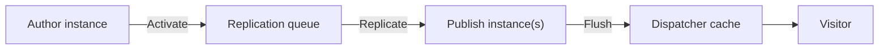

# Publishing & Replication

You have built pages and assets on the **author** instance. Visitors never see the author tier -- they
see the **publish** tier, fronted by the Dispatcher and a CDN. **Replication** (also called
*publishing* or *activation*) is the process that copies content from author to publish.



## Activation and deactivation

| Action | Effect |
|--------|--------|
| **Activate** (Publish) | Copy the page/asset to publish and make it live |
| **Deactivate** (Unpublish) | Remove the page/asset from publish |
| **Delete** | Remove from author; deactivate first so it also leaves publish |

Authors activate from the **Sites** console (select page > **Publish**), from the page editor
(**Page Information > Publish Page**), or in bulk via **Manage Publication** (which also handles
references and scheduling).

### Publishing references

A page usually depends on other content: images in the DAM, Experience Fragments, Content Fragments,
tags, and the template/policies in `/conf`. **Publish the references too**, or the page renders broken
on publish. The **Manage Publication** wizard surfaces references so you can include them; for
programmatic publishing you must enumerate and replicate them yourself.

### Scheduling (on/off time)

Use **Manage Publication > Later** to schedule activation/deactivation, or set the page's **On Time /
Off Time** properties so a page goes live (or expires) automatically.

## How replication works under the hood

On AEM 6.5, replication is driven by **replication agents** (configured at
`/etc/replication/agents.author`). The default **Agent on author** sends activated content to publish;
**Dispatcher Flush** agents invalidate the Dispatcher cache after publish.

On **AEM as a Cloud Service**, the classic agent model is replaced by **Sling Content Distribution
(SCD)** and a managed pipeline -- you do **not** configure replication agents. Content authored on the
author service is distributed to the publish service through Adobe-managed infrastructure, and cache
invalidation flows to the CDN automatically.

| | AEM 6.5 | AEM as a Cloud Service |
|---|---|---|
| Mechanism | Replication agents | Sling Content Distribution (managed) |
| Configuration | `/etc/replication/agents.*` | None -- Adobe-managed |
| Cache flush | Dispatcher Flush agent | Automatic CDN/Dispatcher invalidation |
| API | `Replicator` | `Replicator` (still works) |

:::note Terminology
"Replication agent" is 6.5/AMS vocabulary. On AEMaaCS you will hear "content distribution". The
authoring actions (Activate/Deactivate) and the `Replicator` API are the same on both.
:::

## Publishing programmatically

The `com.day.cq.replication.Replicator` service activates or deactivates a path. This works on both
6.5 and AEMaaCS:

```java
import com.day.cq.replication.ReplicationActionType;
import com.day.cq.replication.Replicator;
import org.osgi.service.component.annotations.Reference;

@Reference
private Replicator replicator;

public void publish(ResourceResolver resolver, String path) throws Exception {
    Session session = resolver.adaptTo(Session.class);
    replicator.replicate(session, ReplicationActionType.ACTIVATE, path);
}
```

For bulk or ad-hoc publishing, the [Groovy Console](../groovy-console.mdx#activate--deactivate-pages)
has a ready-made activation script. For deeper coverage -- tree activation, agents, and the full API --
see the [Replication & Activation](../content/replication-activation.mdx) reference.

## After publish: flushing the cache

Publishing updates the publish repository, but visitors hit the **Dispatcher** (and CDN) cache. A
stale cache means visitors keep seeing old content. On 6.5 a Dispatcher Flush agent invalidates the
affected paths; on AEMaaCS invalidation is automatic. See
[Dispatcher & Caching](./18-dispatcher-and-caching.md) for cache rules and `statfileslevel`.

## Troubleshooting

| Symptom | Likely cause | Fix |
|---------|--------------|-----|
| Page activated but not live | Dispatcher/CDN serving a cached copy | Flush the path; verify the flush agent (6.5) |
| Broken images on publish | Referenced asset not published | Re-publish with **Manage Publication** including references |
| Replication queue **blocked** | Publish unreachable, bad credentials, or a poison item | Open the agent (6.5), clear/retry the queue, check the publish receiver |
| Page reappears after delete | Deleted on author without deactivating | Deactivate first, then delete |
| Works on author, 404 on publish | Page or its template/policy not published | Publish `/conf` template + the page |

On 6.5 inspect queues at **Tools > Deployment > Replication** or the agent's **Test Connection** /
**View Queue**. On AEMaaCS use the **Developer Console** and the distribution logs.

## Summary

You learned:

- **Replication** copies content from author to publish; activate/deactivate are the core actions
- Always **publish references** (assets, fragments, tags, `/conf`) along with a page
- **Scheduling** with on/off time and **Manage Publication**
- AEM 6.5 uses **replication agents**; AEMaaCS uses managed **Sling Content Distribution**
- The **`Replicator` API** publishes programmatically on both platforms
- Publishing must be followed by a **cache flush** for visitors to see changes
- How to diagnose a **blocked queue** and broken references

## Official Documentation

- [Publishing Pages (Experience League)](https://experienceleague.adobe.com/en/docs/experience-manager-cloud-service/content/sites/authoring/sites-console/publishing-pages)
- [Replication (AEM 6.5)](https://experienceleague.adobe.com/en/docs/experience-manager-65/content/implementing/deploying/configuring/replication)
- [Sling Content Distribution (AEMaaCS)](https://experienceleague.adobe.com/en/docs/experience-manager-cloud-service/content/operations/replication)

Next up: [Workflows](./17-workflows.md) - automating content operations with workflow models,
launchers, and custom process steps.
