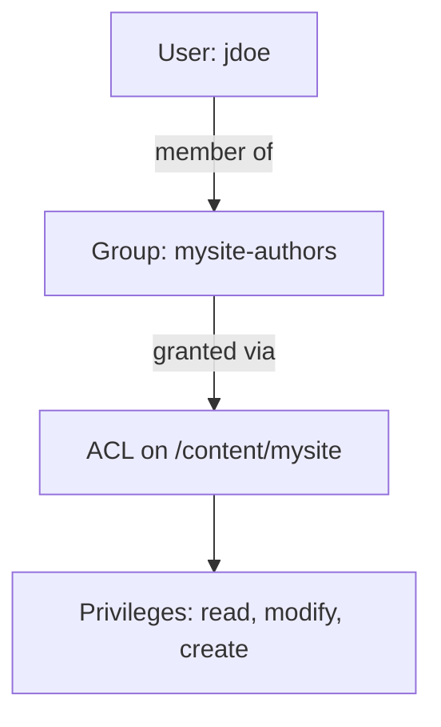

# Security & Permissions

AEM is a multi-user platform: authors, reviewers, administrators, and background services all touch
the repository with different rights. Getting permissions right keeps content safe on author and
keeps the publish tier locked down. This chapter covers the model; the
[Security](../infrastructure/security.mdx) and [ACLs & Permissions](../infrastructure/acl-permissions.md)
references go deeper.

## Users and groups

- **Users** are individual accounts (`rep:User` nodes under `/home/users`).
- **Groups** (`rep:Group` under `/home/groups`) collect users and **other groups**, and are where you
  attach permissions.

**Always assign permissions to groups, never to individual users.** Create role groups
(`mysite-authors`, `mysite-publishers`, `mysite-admins`), grant rights to the group, and add users to
the group. Manage these in **Tools > Security > Users / Groups**.



## ACLs and privileges

Permissions are **Access Control Lists (ACLs)** attached to repository paths. Each entry (ACE) grants
or denies a set of **privileges** to a principal (group/user):

| Privilege | Meaning |
|-----------|---------|
| `jcr:read` | Read nodes and properties |
| `jcr:modifyProperties` | Change property values |
| `jcr:addChildNodes` / `jcr:removeNode` | Create / delete nodes |
| `jcr:write` | Aggregate of modify/add/remove |
| `rep:write` | `jcr:write` plus node-type management |
| `jcr:readAccessControl` / `jcr:modifyAccessControl` | View / change ACLs |
| `crx:replicate` | Activate/deactivate (publish) content |

Edit ACLs in **Tools > Security > Permissions** (select a user/group, browse the tree, allow/deny per
path). The classic **useradmin**/**Permissions** UIs both work.

### Inheritance and precedence

- ACLs **inherit down** the tree: a grant on `/content/mysite` applies to everything beneath it unless
  overridden.
- **Deny entries win** over allow at the same specificity; more specific (deeper) entries override
  ancestors.
- Keep it simple: grant broadly at a high level for a role, then add narrow deny/allow only where a
  team genuinely needs an exception. Deep, conflicting ACL trees are the main source of "why can't
  this author edit?" tickets.

## Permissions as code (repoinit)

Hand-clicking ACLs does not survive environment rebuilds and drifts between Dev/Stage/Prod. Define
service users, groups, paths, and ACLs as **repoinit** statements in an OSGi configuration so they are
applied deterministically on startup:

```text title="repoinit (in a .cfg.json RepositoryInitializer config)"
create group mysite-authors
create path /content/mysite(sling:Folder)

set ACL for mysite-authors
    allow jcr:read,rep:write on /content/mysite
end
```

This is the supported way to manage permissions on AEM as a Cloud Service. See
[OSGi Fundamentals](./03-osgi-fundamentals.md) for how `.cfg.json` configs are deployed and
[Sling Models -- service users](./07-sling-models.md) for the service-user side.

## Service users

Application code must **never** use an admin session. For background reads/writes (scheduled jobs,
workflow steps, servlets that elevate), create a **service user** with the **least** privileges it
needs and map a subservice to it:

1. `create service user mysite-service-reader` (repoinit) and grant it only `jcr:read` on the paths it
   reads.
2. Map the subservice in a `ServiceUserMapper` config: `org.apache.sling...amended` ->
   `mysite.core:mysite-reader=[mysite-service-reader]`.
3. Obtain a resolver with `resolverFactory.getServiceResourceResolver(params)` and **close it**
   (try-with-resources).

This is covered with code in [Sling Models](./07-sling-models.md#service-users-and-repoinit).

## Closed User Groups (CUG)

To restrict a published section to authenticated, authorized visitors (member portals, gated content),
apply a **Closed User Group** to the content root: enable the CUG, set the allowed groups, and
configure the login page. Unauthorized visitors are redirected to login. CUGs are enforced on the
**publish** tier and are the standard way to gate delivered content.

## Hardening the publish tier

Security is defense-in-depth -- the repository ACLs are one layer; the edge is another:

- **The Dispatcher is a security layer.** Its filters should deny everything by default and allow only
  the paths/selectors/extensions your site needs (see [Dispatcher & Caching](./16-dispatcher-and-caching.md)).
- **Remove author-only tooling from publish** (CRXDE, the Groovy Console, `/system/console`).
- **Replace default passwords** (the `admin` account) and disable sample content.
- **Use HTTPS everywhere** and set security headers at the CDN/Dispatcher.
- **Principle of least privilege** for every group and service user.

On AEM as a Cloud Service, user **authentication** for authors is handled by **Adobe IMS** and the
**Admin Console** (you do not manage author passwords in AEM), while in-repository **authorization**
(ACLs, groups) is still defined as above, ideally via repoinit.

## Summary

You learned:

- Assign permissions to **groups**, not users; model groups as roles
- **ACLs** grant **privileges** on paths, and **inherit** down the tree (deny wins, deeper wins)
- Define permissions as code with **repoinit** so environments stay consistent
- Use least-privilege **service users** instead of admin sessions
- **Closed User Groups** gate published content to authorized visitors
- **Harden publish** with the Dispatcher, HTTPS, header hardening, and removal of author tooling

## Official Documentation

- [User Administration and Security (Experience League)](https://experienceleague.adobe.com/en/docs/experience-manager-cloud-service/content/security/security-overview)
- [Permissions in AEM](https://experienceleague.adobe.com/en/docs/experience-manager-65/content/security/security)
- [Repository Initialization (repoinit)](https://sling.apache.org/documentation/bundles/repository-initialization.html)
- [Closed User Groups](https://experienceleague.adobe.com/en/docs/experience-manager-cloud-service/content/sites/administering/security/cug)

Next up: [Testing & Debugging](./18-testing-and-debugging.md) - unit testing Sling Models, integration
tests, and the debugging tools that save you hours.
