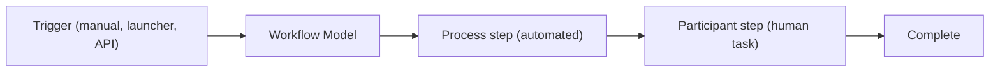

# Workflows

A **workflow** automates a sequence of steps against a piece of content -- review and approval,
publishing, asset processing, or any custom business process. AEM's **Granite Workflow** engine runs
these models, mixing automated steps with human tasks.



## Core concepts

| Concept | Description |
|---------|-------------|
| **Workflow Model** | The definition: an ordered set of steps. Stored under `/var/workflow/models` (runtime) and authored from `/conf` |
| **Workflow Instance** | A running execution of a model against a payload |
| **Payload** | The content the workflow operates on (a JCR path or JCR-backed resource) |
| **Step** | A unit of work: a **process** (automated Java), **participant** (human task), or control step |
| **Launcher** | A rule that auto-starts a workflow when content changes |
| **Inbox** | Where participant tasks land for assignees to action |

## Workflow models

Create and edit models in **Tools > Workflow > Models**. A model is a flow of steps:

- **Process step** -- runs a Java `WorkflowProcess` (e.g. "set a property", "call a service").
- **Participant step** -- assigns a task to a user/group; the workflow pauses until they complete it.
- **Dynamic Participant step** -- chooses the assignee at runtime via a `ParticipantStepChooser`.
- **OR/AND split** -- branch or parallelize the flow.
- **Goto / container** steps -- looping and reuse.

Common out-of-the-box models include **DAM Update Asset** (asset processing on 6.5), **Request for
Activation** (approval before publish), and **Publish/Unpublish Example**.

## Custom process step

A process step is an OSGi component implementing `WorkflowProcess`:

```java
import com.adobe.granite.workflow.WorkflowSession;
import com.adobe.granite.workflow.exec.WorkItem;
import com.adobe.granite.workflow.exec.WorkflowProcess;
import com.adobe.granite.workflow.metadata.MetaDataMap;
import org.osgi.service.component.annotations.Component;

@Component(
    service = WorkflowProcess.class,
    property = { "process.label=My Site - Stamp Approved Date" }
)
public class StampApprovedDateProcess implements WorkflowProcess {

    @Override
    public void execute(WorkItem workItem, WorkflowSession wfSession, MetaDataMap args) {
        String payloadPath = workItem.getWorkflowData().getPayload().toString();
        ResourceResolver resolver = wfSession.adaptTo(ResourceResolver.class);

        Resource content = resolver.getResource(payloadPath + "/jcr:content");
        if (content != null) {
            ModifiableValueMap vm = content.adaptTo(ModifiableValueMap.class);
            vm.put("approvedAt", Calendar.getInstance());
            try {
                resolver.commit();
            } catch (PersistenceException e) {
                // Fail the step so the workflow can retry / route to error handling
                throw new RuntimeException("Could not stamp approved date", e);
            }
        }
    }
}
```

The `process.label` property is what you select in the model's process-step dialog. Read step
arguments from the `MetaDataMap` (`args`).

## Launchers -- starting a workflow automatically

A **Workflow Launcher** (**Tools > Workflow > Launchers**) starts a model when a JCR change matches a
rule -- for example, "when a `dam:Asset` is created under `/content/dam`, run DAM Update Asset". A
launcher specifies:

- **Path** and **node type** to watch
- **Event type** (Created, Modified, Removed)
- An optional **condition** (e.g. `jcr:content/jcr:title` exists)
- The **workflow model** to run

Launchers are how most automated content processing is wired up without writing an event listener.

## Starting workflows manually and via API

- **Manually:** select content in the Sites/Assets console and choose **Workflow > Start Workflow**, or
  use the page **Timeline**.
- **Programmatically:** use `WorkflowSession.startWorkflow(model, data)`. There is a ready-made
  [Groovy script to start a workflow](../groovy-console.mdx#start-a-workflow-on-a-payload).

```java
WorkflowSession wfSession = resolver.adaptTo(WorkflowSession.class);
WorkflowModel model = wfSession.getModel("/var/workflow/models/request_for_activation");
WorkflowData data = wfSession.newWorkflowData("JCR_PATH", "/content/mysite/en/news");
wfSession.startWorkflow(model, data);
```

## Workflows vs Sling Jobs vs event handlers

Not everything needs a workflow. Choose the lightest tool:

| Need | Use |
|------|-----|
| Human review/approval, multi-step content process, visible in Timeline/Inbox | **Workflow** |
| Fire-and-forget background processing, guaranteed once, distributed | **Sling Job** ([Sling Jobs](../backend/sling-jobs.md)) |
| React to a repository change with simple logic | **ResourceChangeListener** / [event listener](../backend/event-listener.mdx) |
| Periodic task on a schedule | **Sling Scheduler** |

Workflows carry overhead (history, payloads, the engine's thread pool). For high-volume, non-interactive
processing, prefer Sling Jobs.

## Debugging workflows

- **Workflow > Instances** shows running/completed/failed instances; open one to see where it stopped.
- A failed step routes the instance to an **error** state -- inspect the step's exception in `error.log`.
- **Stuck workflows** are usually a process step throwing, a participant task nobody actions, or thread
  pool exhaustion from too many concurrent instances. Terminate/retry from the Instances console.
- On AEMaaCS, watch the workflow purge configuration so completed instances do not pile up.

For the full developer reference (custom steps, participant choosers, the `WorkflowSession` API), see
[Workflows](../backend/workflows.mdx).

## Summary

You learned:

- A **workflow** automates a sequence of steps against a content **payload**
- **Models** combine **process** (automated) and **participant** (human) steps
- **Launchers** auto-start workflows on JCR changes
- How to write a **custom process step** and start a workflow via the **API**
- When to choose **Sling Jobs** or **event listeners** instead of a workflow
- How to **debug** running, failed, and stuck instances

## Official Documentation

- [Workflows (Experience League)](https://experienceleague.adobe.com/en/docs/experience-manager-cloud-service/content/sites/authoring/workflows/overview)
- [Administering Workflows](https://experienceleague.adobe.com/en/docs/experience-manager-65/content/sites/administering/operations/workflows)
- [Workflows -- developer reference (this site)](../backend/workflows.mdx) - custom process steps, participant choosers, the `WorkflowSession` API

Next up: [Dispatcher & Caching](./18-dispatcher-and-caching.md) - the caching layer in front of
publish, cache rules, filters, and invalidation.
