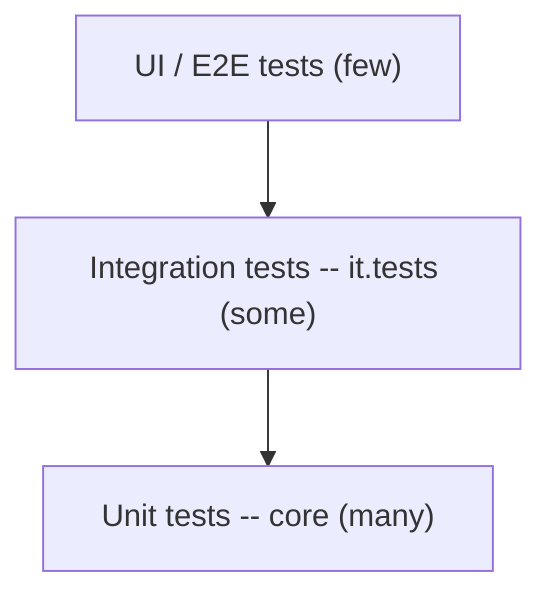

# Testing & Debugging

Shipping confidently means testing your code and knowing how to investigate when something breaks.
AEM projects test Java (Sling Models, services, servlets) with JUnit, and verify behaviour with
integration and UI tests. This chapter covers both testing and the day-to-day debugging toolkit. For
the project-level setup, see the [Testing](../infrastructure/testing.mdx) reference.

## The testing pyramid in AEM



| Layer | What it covers | Tooling |
|-------|----------------|---------|
| **Unit** | Sling Models, services, utility logic in isolation | JUnit 5, Mockito, **wcm.io AEM Mocks** (`AemContext`) |
| **Integration** | Behaviour against a running AEM (`it.tests` module) | JUnit + the AEM Testing Clients |
| **UI / E2E** | Author and publish flows in a browser | Cypress / Playwright / Selenium |

The Maven archetype scaffolds a `core` module (unit tests) and an `it.tests` module (integration
tests) out of the box.

## Unit testing Sling Models

`AemContext` from `io.wcm.testing.mock.aem.junit5` gives you an in-memory JCR + Sling + AEM context, so
you can register a model, load content, and assert on the result -- no running instance required:

```java
import io.wcm.testing.mock.aem.junit5.AemContext;
import io.wcm.testing.mock.aem.junit5.AemContextExtension;
import org.junit.jupiter.api.Test;
import org.junit.jupiter.api.extension.ExtendWith;

import static org.junit.jupiter.api.Assertions.assertEquals;

@ExtendWith(AemContextExtension.class)
class HelloModelTest {

    private final AemContext ctx = new AemContext();

    @Test
    void rendersTitle() {
        ctx.addModelsForClasses(HelloModel.class);
        ctx.load().json("/com/mysite/core/models/HelloModel.json", "/content/hello");

        Resource resource = ctx.resourceResolver().getResource("/content/hello");
        HelloModel model = resource.adaptTo(HelloModel.class);

        assertEquals("Hello, World", model.getTitle());
    }
}
```

Put the fixture JSON under `src/test/resources` mirroring the package. For a request-adaptable model,
use `ctx.request()` as the adaptable and set `ctx.currentResource(...)` first.

### Mocking OSGi services

Register mocks with Mockito and inject them into the context so your model's `@OSGiService`/`@Reference`
dependencies resolve:

```java
MyService svc = mock(MyService.class);
when(svc.compute()).thenReturn("stubbed");
ctx.registerService(MyService.class, svc);
```

### What to unit-test

- Getter logic, defaults, and null/empty handling (the bugs authors actually hit)
- Branching in `@PostConstruct`
- Anything with a business rule (formatting, filtering, validation fallbacks)

Do **not** waste tests asserting that the framework injected a value -- test *your* logic.

## Integration and UI tests

- **Integration tests** (`it.tests`) run against a real author/publish using the AEM Testing Clients --
  good for "does this page render", servlet contracts, and replication side effects. They run in the
  Cloud Manager pipeline.
- **UI tests** drive a browser through authoring or visitor flows. Adobe ships a UI-testing framework
  and Docker image for the Cloud Manager **custom UI test** step; Cypress and Playwright are common
  choices.

## Code coverage and quality gates

The Cloud Manager pipeline runs **code quality** (SonarQube rules) and reports **test coverage**.
Builds fail below the configured coverage threshold, so keep `core` unit tests meaningful. Run quality
locally before pushing (see your project's `pom.xml` and the Maven `jacoco`/`sonar` plugins).

## Debugging toolkit

When something breaks, work down from the symptom:

### Logs

- `crx-quickstart/logs/error.log` is the primary log. Tail it while reproducing.
- Add a focused logger for your package at DEBUG via an OSGi **Logger** config (or
  `/system/console/slinglog`), rather than turning the whole instance to DEBUG.
- On **AEMaaCS**, stream logs with the Cloud Manager **Developer Console** / `aio aem` CLI; there is no
  filesystem access.

### CRXDE Lite

`http://localhost:4502/crx/de` -- browse the JCR, confirm a property actually persisted, check
`sling:resourceType`, inspect ACLs. Local SDK only on AEMaaCS.

### Request progress / "Recent requests"

The Felix console **Recent Requests** (`/system/console/requests`) shows the full Sling processing of a
request: which script/servlet rendered it, included resources, and timings. Indispensable for "why is
the wrong component rendering" and resolution issues.

### Component and clientlib resolution

- Append `?debugClientLibs=true` to a page to load clientlibs unminified and see exactly which files
  are included.
- Use `/libs/granite/ui/content/dumplibs.html` to inspect clientlib categories and dependencies.
- The HTL/Sling **WCM debug filter** (`?wcmmode=disabled`) renders the page without editing chrome.

### OSGi / bundles

`/system/console/bundles` (is your bundle **Active**?) and `/system/console/components` (are your DS
components **satisfied**, or stuck on an unsatisfied `@Reference`?) are the first stop when "my code
isn't running".

### Remote debugging

Start the local SDK quickstart with the JVM debug agent and attach your IDE:

```bash
java -agentlib:jdwp=transport=dt_socket,server=y,suspend=n,address=*:5005 \
     -jar aem-author-p4502.jar
```

Then create a **Remote JVM Debug** run configuration in IntelliJ/Eclipse pointing at port `5005`, set
breakpoints in your Sling Model, and reproduce the request.

## Debugging checklist

| Symptom | First check |
|---------|-------------|
| Component renders nothing | Bundle Active? DS component satisfied? Model adapts? (`/system/console/components`) |
| Wrong script rendered | Recent Requests -- inspect resolution and `sling:resourceType` |
| Dialog value not saved | CRXDE -- did the property persist under the expected `./name`? |
| CSS/JS change not visible | Clientlib proxy cache -- `?debugClientLibs=true`, rebuild clientlibs |
| Works on author, fails on publish | Published content + ACLs + Dispatcher cache (see chapters 16, 18, 19) |
| `NullPointerException` in model | Use `DefaultInjectionStrategy.OPTIONAL` and guard nulls (see [Sling Models](./07-sling-models.md)) |

## Summary

You learned:

- The **testing pyramid**: many unit tests, some integration tests, few UI tests
- **Unit testing Sling Models** with `AemContext` and Mockito
- **Integration** (`it.tests`) and **UI** tests, and the Cloud Manager **coverage/quality** gates
- The **debugging toolkit**: logs, CRXDE, Recent Requests, clientlib debug, the OSGi consoles, and
  **remote debugging**
- A quick **checklist** mapping common symptoms to their first diagnostic

## Official Documentation

- [Testing AEM (Experience League)](https://experienceleague.adobe.com/en/docs/experience-manager-learn/cloud-service/testing/overview)
- [wcm.io AEM Mocks](https://wcm.io/testing/aem-mock/) - the `AemContext` library
- [Developer Console & debugging (AEMaaCS)](https://experienceleague.adobe.com/en/docs/experience-manager-cloud-service/content/implementing/developing/development-tools)
- [Logging in AEMaaCS](https://experienceleague.adobe.com/en/docs/experience-manager-cloud-service/content/implementing/developing/introduction/logging)

Next up: [Deployment & Cloud Manager](./21-deployment-and-cloud-manager.md) - Git, CI/CD pipelines,
environments, and Rapid Development Environments.
