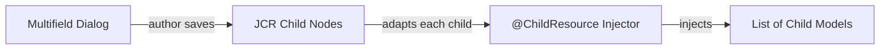

# @ChildResource

The `@ChildResource` annotation is a Sling Models injector that maps **child JCR nodes** to Java objects. It is the
standard way to read multifield dialog entries, nested configuration structures, or any child node hierarchy
into your Sling Model.

## When to Use

Use `@ChildResource` whenever your component stores data as **child nodes** rather than simple properties on the
component node itself. The most common scenario is a **composite multifield** dialog, where each entry the author
adds becomes a child node in the JCR.

| Scenario | Annotation | Storage |
|----------|-----------|---------|
| Single text value (`./title`) | `@ValueMapValue` | Property on the component node |
| Multi-value property (`./tags`) | `@ValueMapValue` with `String[]` | Multi-value property on the component node |
| Multifield with `composite=true` | `@ChildResource` | Each entry is a child node |
| Non-composite multifield | `@ValueMapValue` with `String[]` | Multi-value property (one per field) |

:::tip
Always use `composite="{Boolean}true"` on your multifield dialogs. It stores entries as structured child nodes,
which makes them easy to inject with `@ChildResource`. Without it, all values are stored as flat multi-value
properties on the same node, which is harder to work with and doesn't support multiple fields per entry.
:::

## How It Works

When an author fills in a composite multifield, AEM stores each entry as a separate child node under the
component's `jcr:content` node. `@ChildResource` tells Sling Models to look for those child nodes and adapt
each one to the target type.



### JCR Node Structure

Given a component with a multifield named `products`, the resulting JCR structure looks like this:

```text
/content/my-site/en/home/jcr:content/root/container/productlist
    jcr:primaryType = "nt:unstructured"
    sling:resourceType = "myproject/components/productlist"
    +-- products/
        +-- item0/
        |   productId = "SKU-001"
        |   originalPrice = "29.99"
        |   showStrikethroughPrice = true
        +-- item1/
        |   productId = "SKU-002"
        |   originalPrice = "49.99"
        |   showStrikethroughPrice = false
        +-- item2/
            productId = "SKU-003"
            originalPrice = "19.99"
            showStrikethroughPrice = true
```

Key points:
- The multifield creates a **container node** (`products`) named after the `name` attribute in the dialog
- Each multifield entry creates a numbered **child node** (`item0`, `item1`, `item2`, ...)
- Each child node contains the properties defined in the multifield's field configuration
- The `@ChildResource` annotation reads the container node and adapts each child to the target model

## Dialog Configuration

The dialog XML defines a composite multifield. The `name` attribute on the `field` container determines the child
node name in the JCR.

```xml title="ui.apps/.../productlist/_cq_dialog/.content.xml"
<?xml version="1.0" encoding="UTF-8"?>
<jcr:root xmlns:sling="http://sling.apache.org/jcr/sling/1.0"
          xmlns:jcr="http://www.jcp.org/jcr/1.0"
          xmlns:nt="http://www.jcp.org/jcr/nt/1.0"
          xmlns:granite="http://www.adobe.com/jcr/granite/1.0"
          jcr:primaryType="nt:unstructured"
          jcr:title="Product List"
          sling:resourceType="cq/gui/components/authoring/dialog">
    <content
        jcr:primaryType="nt:unstructured"
        sling:resourceType="granite/ui/components/coral/foundation/container">
        <items jcr:primaryType="nt:unstructured">
            <products
                jcr:primaryType="nt:unstructured"
                sling:resourceType="granite/ui/components/coral/foundation/form/multifield"
                fieldLabel="Products"
                composite="{Boolean}true">
                <granite:data
                    jcr:primaryType="nt:unstructured"
                    min-items="1"
                    max-items="10"/>
                <field
                    jcr:primaryType="nt:unstructured"
                    sling:resourceType="granite/ui/components/coral/foundation/container"
                    name="./products">
                    <items jcr:primaryType="nt:unstructured">
                        <productId
                            jcr:primaryType="nt:unstructured"
                            sling:resourceType="granite/ui/components/coral/foundation/form/textfield"
                            fieldLabel="Product ID"
                            name="./productId"
                            required="{Boolean}true"/>
                        <originalPrice
                            jcr:primaryType="nt:unstructured"
                            sling:resourceType="granite/ui/components/coral/foundation/form/textfield"
                            fieldLabel="Price"
                            name="./originalPrice"/>
                        <showStrikethroughPrice
                            jcr:primaryType="nt:unstructured"
                            sling:resourceType="granite/ui/components/coral/foundation/form/checkbox"
                            fieldDescription="Show original price with strikethrough"
                            name="./showStrikethroughPrice"
                            text="Show Strikethrough"
                            value="{Boolean}true"/>
                    </items>
                </field>
            </products>
        </items>
    </content>
</jcr:root>
```

| Attribute | Purpose |
|-----------|---------|
| `composite="{Boolean}true"` | Stores each entry as a child node (required for `@ChildResource`) |
| `name="./products"` | The JCR child node name under the component node |
| `granite:data/min-items` | Optional minimum number of entries |
| `granite:data/max-items` | Optional maximum number of entries |

:::warning
If you forget `composite="{Boolean}true"`, the multifield stores values as flat multi-value properties.
`@ChildResource` will not work, and you will get `null` injected at runtime.
:::

## Sling Model Examples

### Basic: List of child models

The most common pattern -- inject all multifield entries as a typed list.

```java title="core/.../models/ProductListModel.java"
@Model(
    adaptables = SlingHttpServletRequest.class,
    adapters = {ProductListModel.class, ComponentExporter.class},
    resourceType = ProductListModel.RESOURCE_TYPE,
    defaultInjectionStrategy = DefaultInjectionStrategy.OPTIONAL
)
@Exporter(name = ExporterConstants.SLING_MODEL_EXPORTER_NAME,
          extensions = ExporterConstants.SLING_MODEL_EXTENSION)
public class ProductListModel implements ComponentExporter {

    static final String RESOURCE_TYPE = "myproject/components/productlist";

    // Injects child nodes under "products" as a List of Product models.
    // The field name "products" must match the JCR child node name.
    @ChildResource
    private List<Product> products;

    public List<Product> getProducts() {
        return products != null ? Collections.unmodifiableList(products) : Collections.emptyList();
    }

    @Override
    public String getExportedType() {
        return RESOURCE_TYPE;
    }
}
```

The child model must be adaptable from `Resource`:

```java title="core/.../models/Product.java"
@Model(adaptables = Resource.class,
       defaultInjectionStrategy = DefaultInjectionStrategy.OPTIONAL)
public class Product {

    @ValueMapValue
    private String productId;

    @ValueMapValue
    private String originalPrice;

    @ValueMapValue
    private boolean showStrikethroughPrice;

    @ValueMapValue
    private String additionalPriceText;

    // Getters
    public String getProductId() { return productId; }
    public String getOriginalPrice() { return originalPrice; }
    public boolean isShowStrikethroughPrice() { return showStrikethroughPrice; }
    public String getAdditionalPriceText() { return additionalPriceText; }
}
```

:::info
The child model **must** use `adaptables = Resource.class`. `@ChildResource` adapts each child node as a
`Resource`, not as a `SlingHttpServletRequest`. If you use `SlingHttpServletRequest.class`, the injection will
silently return `null`.
:::

### Named child resource

If the field name in Java doesn't match the JCR node name, use the `name` attribute:

```java
// JCR child node is called "linkItems", but the Java field is "links"
@ChildResource(name = "linkItems")
private List<LinkItem> links;
```

### Single child resource (not a list)

`@ChildResource` also works for a single child node, not just multifields:

```java
// Reads the "configuration" child node directly
@ChildResource
private Resource configuration;

// Or adapt to a specific model
@ChildResource
private HeaderConfig headerConfig;
```

This is useful for design dialogs or template policies that store structured data as a single child node.

### Injection strategy

Control what happens when the child node doesn't exist:

```java
// Uses the model's defaultInjectionStrategy (OPTIONAL in our case)
@ChildResource
private List<Product> products;

// Explicitly optional -- returns null if "products" node is missing
@ChildResource(injectionStrategy = InjectionStrategy.OPTIONAL)
private List<Product> products;

// Required -- model adaptation fails if "products" node is missing
@ChildResource(injectionStrategy = InjectionStrategy.REQUIRED)
private List<Product> products;
```

:::tip
Prefer setting `defaultInjectionStrategy = DefaultInjectionStrategy.OPTIONAL` on the `@Model` annotation and
only override with `REQUIRED` on fields that truly must exist. This prevents the entire model from returning
`null` when a single optional field is missing.
:::

## Rendering in HTL

Once the Sling Model is set up, iterate over the child resources in your HTL template:

```html title="ui.apps/.../productlist/productlist.html"
<sly data-sly-use.model="com.myproject.core.models.ProductListModel"/>

<div data-sly-test="${model.products}" class="product-list">
    <ul>
        <li data-sly-list.product="${model.products}" class="product-item">
            <span class="product-id">${product.productId}</span>
            <span class="product-price"
                  data-sly-test="${product.showStrikethroughPrice}"
                  style="text-decoration: line-through;">
                ${product.originalPrice}
            </span>
            <span class="product-price"
                  data-sly-test="${!product.showStrikethroughPrice}">
                ${product.originalPrice}
            </span>
        </li>
    </ul>
</div>

<div data-sly-test="${!model.products && wcmmode.edit}" class="cq-placeholder">
    Add products to display the list.
</div>
```

## Manual Loop Alternative

Sometimes `@ChildResource` is not flexible enough. You may need manual iteration when:

- You need to **filter** or **sort** entries based on custom logic
- You need access to the `SlingHttpServletRequest` in the child processing
- The child nodes don't have a uniform structure
- You need to apply **transformations** that require services or the request context

```java title="Manual iteration with filtering"
@Model(adaptables = SlingHttpServletRequest.class,
       defaultInjectionStrategy = DefaultInjectionStrategy.OPTIONAL)
public class FilteredProductList {

    @SlingObject
    private Resource resource;

    @SlingObject
    private SlingHttpServletRequest request;

    private List<Product> activeProducts;

    @PostConstruct
    protected void init() {
        activeProducts = new ArrayList<>();
        Resource productsNode = resource.getChild("products");

        if (productsNode != null) {
            for (Resource child : productsNode.getChildren()) {
                // Adapt the child node to the Product model
                Product product = child.adaptTo(Product.class);
                if (product != null && StringUtils.isNotBlank(product.getProductId())) {
                    activeProducts.add(product);
                }
            }
        }
    }

    public List<Product> getActiveProducts() {
        return Collections.unmodifiableList(activeProducts);
    }
}
```

| Approach | Pros | Cons |
|----------|------|------|
| `@ChildResource` | Minimal code, declarative, automatic adaptation | No filtering, no request context in children |
| Manual loop | Full control, filtering, request-aware | More boilerplate, must handle null checks |

## Common Patterns

### Nested child resources

Child models can themselves contain `@ChildResource` fields for deeply nested structures:

```java
@Model(adaptables = Resource.class,
       defaultInjectionStrategy = DefaultInjectionStrategy.OPTIONAL)
public class Section {

    @ValueMapValue
    private String sectionTitle;

    // Each section has its own list of items
    @ChildResource
    private List<SectionItem> items;
}
```

### Multifield inside a tab or accordion

When a multifield lives inside a dialog tab, the JCR structure stays the same -- the multifield's `name`
attribute determines where the child nodes are stored, regardless of the dialog layout structure:

```xml
<!-- Tab structure in dialog (layout only -- doesn't affect storage) -->
<tabs sling:resourceType="granite/ui/components/coral/foundation/tabs">
    <items>
        <productTab jcr:title="Products">
            <items>
                <!-- The multifield still writes to ./products -->
                <products sling:resourceType=".../multifield"
                          composite="{Boolean}true">
                    <field name="./products">
                        <!-- ... fields ... -->
                    </field>
                </products>
            </items>
        </productTab>
    </items>
</tabs>
```

### Using `@Via` for child resources on a different path

If the child data lives under a different resource than the component node (e.g. the `jcr:content` child
of a referenced page), combine `@ChildResource` with a `@Via` annotation or resolve manually:

```java
// Read child resources from a specific sub-path
@ChildResource(name = "jcr:content/items")
private List<Resource> pageItems;
```

## Best Practices and Common Pitfalls

### Always use `composite=true`

Without `composite="{Boolean}true"`, the multifield stores values as multi-value properties. This breaks
`@ChildResource` injection and limits you to a single field per entry.

### Child model must adapt from `Resource`

The child model class **must** declare `adaptables = Resource.class`. The `@ChildResource` injector
passes a `Resource` to `adaptTo()`, not a `SlingHttpServletRequest`.

```java
// Correct -- child model adapts from Resource
@Model(adaptables = Resource.class)
public class Product { ... }

// Wrong -- @ChildResource cannot adapt a request
@Model(adaptables = SlingHttpServletRequest.class)
public class Product { ... }
```

### Handle missing child nodes

If the author hasn't added any multifield entries yet, the child node won't exist. Always null-check:

```java
public List<Product> getProducts() {
    return products != null ? Collections.unmodifiableList(products) : Collections.emptyList();
}
```

### Avoid deep nesting

Deeply nested multifields (multifield within a multifield) create complex JCR structures that are hard
to query and maintain. Prefer flat structures where possible, or consider Content Fragments for highly
structured data.

### Performance with large lists

`@ChildResource` loads all child nodes eagerly. For components with a very large number of entries (50+),
consider lazy loading or pagination. In practice, most multifield components have fewer than 20 entries,
so this is rarely an issue.

## See also

- [Sling Models](../../backend/sling-models.mdx)
- [@ExternalizedValueMapValue](./externalized-value-map-value.mdx)
- [Component Dialogs](../../component-dialogs.mdx) -- multifield dialog configuration
- [Components Overview](../overview.mdx)
- [Core Components](../core-components.mdx)
- [HTL Templates](../../htl-templates.mdx)
- [Custom Component Guide](../../custom-component.mdx)
- [JCR Node Operations](../../content/node-operations.mdx)
