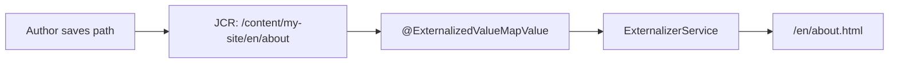

# @ExternalizedValueMapValue

`@ExternalizedValueMapValue` is a **custom Sling Models injector annotation** that reads a JCR property (like
`@ValueMapValue`) and automatically **externalizes** the value -- converting internal content paths into
proper external URLs. This is essential for SPA-based AEM projects, headless JSON exports, and any scenario
where internal JCR paths must be transformed to public-facing URLs.

## Why Externalization Matters

AEM stores content paths internally as JCR references such as `/content/my-site/en/about`. These paths are
meaningless to an end user or an external consumer. The Externalizer transforms them into proper URLs:

```text
Internal:   /content/my-site/en/about
External:   https://www.my-site.com/en/about.html
```

Without externalization, links in JSON exports, SPA frontends, or emails will contain raw JCR paths that
don't resolve to real URLs on the publish tier.



## Comparison with `@ValueMapValue`

| Feature | `@ValueMapValue` | `@ExternalizedValueMapValue` |
|---------|-------------------|------------------------------|
| Reads JCR property | Yes | Yes |
| Returns raw value | Yes | No -- externalizes it |
| Works with paths | Yes, but returns raw path | Yes, returns mapped URL |
| Use case | Simple values (text, numbers, booleans) | Path/link properties that need URL mapping |
| Built-in | Yes (Apache Sling) | No (custom annotation + injector) |

### Before and after

```java
// Without externalization -- raw JCR path
@ValueMapValue
private String linkUrl;
// Returns: /content/my-site/en/about

// With externalization -- mapped URL
@ExternalizedValueMapValue
private String linkUrl;
// Returns: /en/about.html (or full URL depending on configuration)
```

## The Externalizer Concept

AEM provides `ResourceResolver.map()` to convert internal paths to external URLs. This method applies
`/etc/map` rules and Sling mappings to shorten and transform paths:

```text
ResourceResolver.map("/content/my-site/en/about")
    → applies /etc/map rules
    → strips /content/my-site prefix
    → returns "/en/about.html"
```

For fully qualified URLs (including scheme and domain), AEM provides the
`com.day.cq.commons.Externalizer` OSGi service:

```java
// ResourceResolver.map() -- relative, context-aware
String relative = resolver.map(request, "/content/my-site/en/about");
// → "/en/about.html"

// Externalizer -- absolute URL with domain
String absolute = externalizer.publishLink(resolver, "/content/my-site/en/about");
// → "https://www.my-site.com/en/about.html"
```

| Method | Returns | Use case |
|--------|---------|----------|
| `resolver.map(path)` | Relative mapped path | Same-site links, SPA routing |
| `resolver.map(request, path)` | Context-aware mapped path | Request-scoped links |
| `externalizer.publishLink(resolver, path)` | Absolute publish URL | Emails, social sharing, sitemaps |
| `externalizer.authorLink(resolver, path)` | Absolute author URL | Admin links, internal tools |

## Use Cases

### SPA (Single Page Application) Routing

In AEM SPA Editor projects, the JSON model exporter delivers component data to the React/Angular frontend.
All internal paths must be externalized so the SPA router can resolve them:

```json
{
    "linkUrl": "/en/about.html",
    "imageUrl": "/content/dam/my-site/hero.jpg"
}
```

Without externalization, the SPA would receive `/content/my-site/en/about`, which doesn't match any
client-side route.

### Headless JSON Exports

When AEM serves as a headless CMS via the Sling Model Exporter (`.model.json`), all path properties must
be externalized for external consumers.

### Email Templates

Links in email templates need fully qualified URLs (`https://www.my-site.com/en/about.html`) since
email clients cannot resolve relative paths.

### Social Media / SEO

Open Graph tags, canonical URLs, and sitemap entries all require absolute externalized URLs.

## Practical Usage

### Sling Model with `@ExternalizedValueMapValue`

```java title="core/.../models/TeaserModel.java"
@Model(
    adaptables = SlingHttpServletRequest.class,
    adapters = {TeaserModel.class, ComponentExporter.class},
    resourceType = TeaserModel.RESOURCE_TYPE,
    defaultInjectionStrategy = DefaultInjectionStrategy.OPTIONAL
)
@Exporter(name = "jackson", extensions = "json")
public class TeaserModel implements ComponentExporter {

    static final String RESOURCE_TYPE = "myproject/components/teaser";

    // Regular property -- no path transformation needed
    @ValueMapValue
    private String title;

    @ValueMapValue
    private String description;

    // Path property -- automatically externalized
    @ExternalizedValueMapValue
    private String linkUrl;

    // Another path property
    @ExternalizedValueMapValue
    private String ctaLink;

    public String getTitle() { return title; }
    public String getDescription() { return description; }
    public String getLinkUrl() { return linkUrl; }
    public String getCtaLink() { return ctaLink; }

    @Override
    public String getExportedType() { return RESOURCE_TYPE; }
}
```

### HTL Template

```html title="ui.apps/.../teaser/teaser.html"
<sly data-sly-use.model="com.myproject.core.models.TeaserModel"/>

<div class="teaser">
    <h2>${model.title}</h2>
    <p>${model.description}</p>
    <a data-sly-test="${model.linkUrl}"
       href="${model.linkUrl}"
       class="teaser__cta">
        Read more
    </a>
</div>
```

Since `linkUrl` is already externalized by the injector, you can use it directly without further
transformation in HTL.

### JSON Export Result

Requesting the component with `.model.json`:

```json
{
    ":type": "myproject/components/teaser",
    "title": "Our Story",
    "description": "Learn about our company...",
    "linkUrl": "/en/about.html",
    "ctaLink": "/en/contact.html"
}
```

## Implementation Details

Creating `@ExternalizedValueMapValue` requires two parts: the annotation interface and the injector
OSGi service.

### The Annotation Interface

The annotation defines the contract and links to the custom Sling Models injector via `@Source`:

```java title="core/.../inject/annotations/ExternalizedValueMapValue.java"
@Target({FIELD})
@Retention(RUNTIME)
@InjectAnnotation
@Source(ExternalizedValueMapValue.ANNOTATION_NAME)
public @interface ExternalizedValueMapValue {

    String ANNOTATION_NAME = "externalized";

    /**
     * Override the JCR property name if it differs from the Java field name.
     */
    String name() default StringUtils.EMPTY;

    /**
     * Controls injection behavior: REQUIRED, OPTIONAL, or DEFAULT.
     * DEFAULT falls back to the @Model-level defaultInjectionStrategy.
     */
    InjectionStrategy injectionStrategy() default InjectionStrategy.DEFAULT;
}
```

| Attribute | Purpose |
|-----------|---------|
| `name` | Override the JCR property name (defaults to the Java field name) |
| `injectionStrategy` | Control behavior when the property is missing |

### The Injector Service

The injector is an OSGi service that implements both `Injector` and `StaticInjectAnnotationProcessorFactory`.
It reads the raw JCR property, then passes it through the ExternalizerService before injection:

```java title="core/.../inject/impl/ExternalizedValueMapValueInjector.java"
@Component(
    immediate = true,
    service = {Injector.class, StaticInjectAnnotationProcessorFactory.class}
)
public class ExternalizedValueMapValueInjector
        implements Injector, StaticInjectAnnotationProcessorFactory {

    @Reference
    private ExternalizerService externalizerService;

    @Override
    public String getName() {
        // Must match the @Source annotation name
        return ExternalizedValueMapValue.ANNOTATION_NAME;
    }

    @Override
    public Object getValue(Object adaptable, String name, Type type,
            AnnotatedElement annotatedElement,
            DisposalCallbackRegistry disposalCallbackRegistry) {

        // Only process String fields annotated with @ExternalizedValueMapValue
        if (ReflectionUtil.isAssignableFrom(type, String.class)
                && annotatedElement.isAnnotationPresent(ExternalizedValueMapValue.class)
                && adaptable instanceof SlingHttpServletRequest) {

            SlingHttpServletRequest request = (SlingHttpServletRequest) adaptable;
            ExternalizedValueMapValue annotation =
                annotatedElement.getAnnotation(ExternalizedValueMapValue.class);

            // Use the annotation's name attribute, or fall back to the field name
            String key = StringUtils.defaultIfBlank(annotation.name(), name);

            // Read the raw property value from the component's resource
            Resource resource = InjectorUtil.getResourceFromAdaptable(adaptable);
            String rawValue = resource.getValueMap().get(key, String.class);

            // Externalize the path if it has a value
            if (StringUtils.isNotBlank(rawValue)) {
                return externalizerService.externalize(request, rawValue);
            }
        }

        return null;
    }

    @Override
    public InjectAnnotationProcessor2 createAnnotationProcessor(
            AnnotatedElement annotatedElement) {
        return Optional.ofNullable(
                annotatedElement.getAnnotation(ExternalizedValueMapValue.class))
            .map(ExternalizedValueMapValueInjectorProcessor::new)
            .orElse(null);
    }

    // Processes injection strategy and optional flag from the annotation
    private static class ExternalizedValueMapValueInjectorProcessor
            extends AbstractInjectAnnotationProcessor2 {

        private final ExternalizedValueMapValue annotation;

        public ExternalizedValueMapValueInjectorProcessor(
                ExternalizedValueMapValue annotation) {
            this.annotation = annotation;
        }

        @Override
        public InjectionStrategy getInjectionStrategy() {
            return annotation.injectionStrategy();
        }
    }
}
```

### The ExternalizerService

The actual URL mapping is done by the `ExternalizerService`. A minimal implementation uses
`ResourceResolver.map()`:

```java title="core/.../externalizer/impl/ExternalizerServiceImpl.java"
@Component(service = ExternalizerService.class)
public class ExternalizerServiceImpl implements ExternalizerService {

    @Override
    public String externalize(SlingHttpServletRequest request, String path) {
        if (StringUtils.isBlank(path)) {
            return null;
        }
        // Applies /etc/map rules and Sling mappings
        return request.getResourceResolver().map(request, path);
    }
}
```

For SPA projects that need client-side routing (where `.html` extensions and `/content/` prefixes
are stripped), you would implement a specialized version:

```java
@Override
public String externalizeForSPARouter(SlingHttpServletRequest request, String path) {
    if (StringUtils.isBlank(path)) {
        return null;
    }
    String mapped = request.getResourceResolver().map(request, path);
    // Remove .html extension for SPA client-side routing
    return StringUtils.removeEnd(mapped, ".html");
}
```

## Externalizer OSGi Configuration

AEM's built-in `com.day.cq.commons.impl.ExternalizerImpl` must be configured with the correct domains
for each environment:

```json title="ui.config/.../config.author/com.day.cq.commons.impl.ExternalizerImpl.cfg.json"
{
    "externalizer.domains": [
        "local https://localhost:4502",
        "author https://author.my-site.com",
        "publish https://www.my-site.com"
    ],
    "externalizer.encodedpath": true
}
```

| Domain | Purpose | Example output |
|--------|---------|----------------|
| `local` | Local development | `https://localhost:4502/en/about.html` |
| `author` | Author instance | `https://author.my-site.com/en/about.html` |
| `publish` | Publish / public facing | `https://www.my-site.com/en/about.html` |

:::info AEMaaCS
On AEM as a Cloud Service, the Externalizer domains are configured automatically by Cloud Manager.
You typically don't need to configure them manually. Use `ResourceResolver.map()` for relative URLs
and the built-in Externalizer for absolute URLs.
:::

## Alternative Approaches

If you don't want to build a custom annotation, there are simpler ways to externalize paths:

### Manual externalization in `@PostConstruct`

```java
@ValueMapValue
private String linkUrl;

private String externalizedLinkUrl;

@PostConstruct
protected void init() {
    if (StringUtils.isNotBlank(linkUrl)) {
        externalizedLinkUrl = request.getResourceResolver().map(request, linkUrl);
    }
}

public String getLinkUrl() {
    return externalizedLinkUrl;
}
```

### Using AEM's built-in Externalizer directly

```java
@OSGiService
private com.day.cq.commons.Externalizer externalizer;

@ValueMapValue
private String linkUrl;

public String getAbsoluteUrl() {
    if (StringUtils.isBlank(linkUrl)) return null;
    return externalizer.publishLink(resourceResolver, linkUrl);
}
```

### When to use which approach

| Approach | Best for | Complexity |
|----------|----------|------------|
| `@ExternalizedValueMapValue` | Projects with many path properties across many models | High (one-time setup), then very low per-model |
| Manual `@PostConstruct` | One or two models with path properties | Low per-model, but repetitive |
| Built-in `Externalizer` | Absolute URLs (emails, sitemaps, OG tags) | Low |
| HTL `@ context='uri'` | Simple links in templates (no JSON export) | Lowest |

:::tip
The custom `@ExternalizedValueMapValue` annotation pays off in larger SPA projects where dozens of
components have path properties. For simpler projects, manual externalization in `@PostConstruct` or
using the built-in `Externalizer` directly is often sufficient.
:::

## Best Practices and Common Pitfalls

### Only externalize path properties

Don't apply `@ExternalizedValueMapValue` to non-path properties (titles, descriptions, etc.). The
externalizer will attempt to map them and may return unexpected results.

### Handle null and empty paths

The injector should return `null` for blank values. Always null-check in your getter:

```java
public String getLinkUrl() {
    return StringUtils.defaultIfBlank(linkUrl, "#");
}
```

### Be aware of author vs publish differences

`ResourceResolver.map()` returns different results depending on the environment because `/etc/map` rules
differ between author and publish. Always test externalized URLs on both tiers.

### Avoid open redirects

If externalized URLs are used in redirect logic, validate that the resulting URL belongs to your
domain. Never blindly redirect to an externalized user-provided path without validation.

### Don't double-externalize

If you use `@ExternalizedValueMapValue` in your Sling Model, don't also apply `@ context='uri'` in
HTL or call `resolver.map()` again. The path is already mapped.

### Performance

`ResourceResolver.map()` is lightweight (in-memory mapping table lookup), so externalization has
negligible performance impact. There is no need to cache externalized values.

## See also

- [Sling Models](../../backend/sling-models.mdx)
- [@ChildResource](./child-resource.mdx)
- [Component Dialogs](../../component-dialogs.mdx)
- [Components Overview](../overview.mdx)
- [Java Best Practices](../../backend/java-best-practices.mdx)
- [OSGi Configuration](../../backend/osgi-configuration.mdx) -- configuring the Externalizer
- [Architecture](../../architecture.mdx) -- Sling request processing and URL mapping
- [Security](../../infrastructure/security.mdx)
