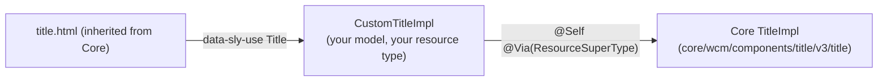

# Extending Core Components with Delegation

[Core Components](./core-components.mdx) cover most standard building blocks, but projects almost
always need to tweak something - a different default, an extra field, a formatting rule. Copying
the Core Component's Java code into your project is the wrong answer: you lose every bug fix and
feature in future Core Components releases.

The supported approach has two layers:

1. A **proxy component** in `/apps` that inherits from the Core Component.
2. Optionally, a **delegating Sling Model** that wraps the Core Component's model and overrides
   only the methods you need to change.



## 1. The proxy component

Never reference `core/wcm/components/...` directly on your pages. Create a proxy so your content
points at a resource type you own:

```xml title="ui.apps/src/main/content/jcr_root/apps/myproject/components/title/.content.xml"
<?xml version="1.0" encoding="UTF-8"?>
<jcr:root xmlns:sling="http://sling.apache.org/jcr/sling/1.0"
          xmlns:cq="http://www.day.com/jcr/cq/1.0"
          xmlns:jcr="http://www.jcp.org/jcr/1.0"
    jcr:primaryType="cq:Component"
    jcr:title="Title"
    sling:resourceSuperType="core/wcm/components/title/v3/title"
    componentGroup="My Project - Content"/>
```

The proxy inherits the dialog, the HTL, the client libraries, and the model binding. You can later
switch to a newer Core Component version (for example `v3` to `v4`) by changing one property,
without touching content.

## 2. The delegation pattern

When behaviour needs to change, register a Sling Model for **your** resource type that implements
the Core Component's interface and delegates to the original implementation:

```java title="core/src/main/java/com/myproject/core/models/impl/CustomTitleImpl.java"
package com.myproject.core.models.impl;

import org.apache.commons.lang3.StringUtils;
import org.apache.sling.api.SlingHttpServletRequest;
import org.apache.sling.models.annotations.Exporter;
import org.apache.sling.models.annotations.Model;
import org.apache.sling.models.annotations.Via;
import org.apache.sling.models.annotations.injectorspecific.Self;
import org.apache.sling.models.annotations.via.ResourceSuperType;

import com.adobe.cq.export.json.ComponentExporter;
import com.adobe.cq.export.json.ExporterConstants;
import com.adobe.cq.wcm.core.components.commons.link.Link;
import com.adobe.cq.wcm.core.components.models.Title;
import com.adobe.cq.wcm.core.components.models.datalayer.ComponentData;

@Model(
        adaptables = SlingHttpServletRequest.class,
        adapters = {Title.class, ComponentExporter.class},
        resourceType = CustomTitleImpl.RESOURCE_TYPE)
@Exporter(
        name = ExporterConstants.SLING_MODEL_EXPORTER_NAME,
        extensions = ExporterConstants.SLING_MODEL_EXTENSION)
public class CustomTitleImpl implements Title {

    static final String RESOURCE_TYPE = "myproject/components/title";

    @Self
    @Via(type = ResourceSuperType.class)
    private Title delegate;

    // --- customised ---------------------------------------------------------

    @Override
    public String getText() {
        // Avoid a single orphaned word on the last line of long headings
        String text = StringUtils.trim(delegate.getText());
        if (text == null || StringUtils.countMatches(text, ' ') < 3) {
            return text;
        }
        int lastSpace = text.lastIndexOf(' ');
        return text.substring(0, lastSpace) + '\u00A0' + text.substring(lastSpace + 1);
    }

    @Override
    public String getExportedType() {
        // The delegate would report the Core Component's resource type
        return RESOURCE_TYPE;
    }

    // --- delegated unchanged ------------------------------------------------

    @Override
    public String getType() {
        return delegate.getType();
    }

    @Override
    public Link getLink() {
        return delegate.getLink();
    }

    @Override
    @Deprecated
    public String getLinkURL() {
        return delegate.getLinkURL();
    }

    @Override
    public boolean isLinkDisabled() {
        return delegate.isLinkDisabled();
    }

    @Override
    public String getId() {
        return delegate.getId();
    }

    @Override
    public ComponentData getData() {
        return delegate.getData();
    }

    @Override
    public String getAppliedCssClasses() {
        return delegate.getAppliedCssClasses();
    }
}
```

How it works:

- The inherited `title.html` asks for `com.adobe.cq.wcm.core.components.models.Title`. Because your
  model is registered for `myproject/components/title` with `Title` as an adapter, Sling Models
  picks **your** implementation for resources of your proxy's type. No HTL change is needed.
- `@Self @Via(type = ResourceSuperType.class)` adapts the same request again, but as if the resource
  had its `sling:resourceSuperType` - so you get the Core Component's own `TitleImpl`.
- You override `getText()` and forward everything else.

:::warning[Delegate every method]
Core Components model interfaces declare their methods as `default` methods that either throw
`UnsupportedOperationException` or return `null`. If you forget to forward a method, the code still
compiles, but the first HTL expression or JSON export that calls it fails or silently renders
nothing. Forward deprecated methods (such as `getLinkURL()`) as well, and when you upgrade Core
Components, check the interface for new methods.
:::

:::tip[Lombok shortcut]
Lombok's `@Delegate` can generate the forwarding methods for you
(`@Delegate(excludes = Customised.class)` with a private interface listing the methods you
override). It saves boilerplate, but the generated methods are invisible in code review and
`@Delegate` is marked experimental by Lombok - many teams prefer the explicit version above.
:::

## 3. Adding new fields

To expose something the Core interface does not have - say a subtitle - define your own interface
that extends the Core one:

```java title="core/src/main/java/com/myproject/core/models/SubtitledTitle.java"
package com.myproject.core.models;

import com.adobe.cq.wcm.core.components.models.Title;

public interface SubtitledTitle extends Title {

    String getSubtitle();
}
```

Implement it in the delegating model and read the new property:

```java title="core/src/main/java/com/myproject/core/models/impl/CustomTitleImpl.java (excerpt)"
@Model(
        adaptables = SlingHttpServletRequest.class,
        adapters = {SubtitledTitle.class, Title.class, ComponentExporter.class},
        resourceType = CustomTitleImpl.RESOURCE_TYPE)
@Exporter(
        name = ExporterConstants.SLING_MODEL_EXPORTER_NAME,
        extensions = ExporterConstants.SLING_MODEL_EXTENSION)
public class CustomTitleImpl implements SubtitledTitle {

    @Self
    @Via(type = ResourceSuperType.class)
    private Title delegate;

    @ValueMapValue(injectionStrategy = InjectionStrategy.OPTIONAL)
    private String subtitle;

    @Override
    public String getSubtitle() {
        return subtitle;
    }

    // ... delegated methods as above
}
```

`ValueMapValue` and `InjectionStrategy` come from `org.apache.sling.models.annotations.injectorspecific`.

Because the inherited HTL knows nothing about `getSubtitle()`, you now need your own HTL. Copy the
Core Component's `title.html` into the proxy (`/apps/myproject/components/title/title.html`), point
`data-sly-use` at your interface, and add the new markup:

```html title="ui.apps/.../components/title/title.html (excerpt)"
<div data-sly-use.title="com.myproject.core.models.SubtitledTitle"
     data-sly-use.templates="core/wcm/components/commons/v1/templates.html"
     data-sly-test.text="${title.text}"
     data-cmp-data-layer="${title.data.json}"
     id="${title.id}"
     class="cmp-title">
    <h2 class="cmp-title__text" data-sly-element="${title.type}">${text}</h2>
    <p data-sly-test="${title.subtitle}" class="cmp-title__subtitle">${title.subtitle}</p>
</div>
<sly data-sly-call="${templates.placeholder @ isEmpty=!text, classAppend='cmp-title'}"></sly>
```

Add the matching field to the dialog by overlaying only the new tab or field (see
[Component Dialogs](../component-dialogs.mdx) and the dialog-reuse options in
[Core Components](./core-components.mdx)).

Copying HTL means you now maintain that file. Keep the copy as small as possible and diff it
against the Core Component's HTL when you upgrade.

## Keeping the JSON exporter working

Headless consumers, the SPA Editor, and `.model.json` requests all use the Sling Model Exporter:

- Include `ComponentExporter.class` in `adapters` and keep the `@Exporter` annotation, or your
  component disappears from `.model.json` output.
- Override `getExportedType()` to return your proxy's resource type - SPA frameworks map
  components by this value.
- New getters (like `getSubtitle()`) are exported automatically as JSON properties.

Check the result at `/content/myproject/en/page/jcr:content/root/container/title.model.json`
(adjust the path to your component).

## Dependencies

The Core Components API is needed at compile time only:

```xml title="core/pom.xml"
<dependency>
    <groupId>com.adobe.cq</groupId>
    <artifactId>core.wcm.components.core</artifactId>
    <scope>provided</scope>
</dependency>
```

On AEM as a Cloud Service, Core Components ship with the product and are updated by Adobe - keep the
dependency `provided` and do not embed `core.wcm.components.all` in your `all` package. On AEM 6.5,
the project embeds the `core.wcm.components.all` package itself; in an archetype-generated project
the version is managed in the parent POM.

## Pitfalls

| Symptom | Cause | Fix |
|---------|-------|-----|
| Your model is never used | `resourceType` in `@Model` does not match the proxy's path | Use the exact resource type (`myproject/components/title`) |
| `StackOverflowError` | `@Self` without `@Via(type = ResourceSuperType.class)` adapts to your own model again | Always combine `@Self` with the `ResourceSuperType` via |
| `UnsupportedOperationException` in HTL or `.model.json` | A default interface method was not forwarded | Delegate every method of the interface |
| `delegate` is `null` / model fails to adapt | Proxy has no `sling:resourceSuperType`, or it points to a path without a model | Check the proxy's `.content.xml` |
| Component missing from `.model.json` | `ComponentExporter` not in `adapters` or `@Exporter` missing | Add both |
| SPA component mapping broken | `getExportedType()` returns the Core resource type | Return your proxy's resource type |

## See also

- [Core Components](./core-components.mdx) - reusing Core Component dialogs
- [Sling Model annotations](./annotations/sling-model-annotations.mdx) - `@Self`, `@Via`, and injector reference
- [Sling Models](../backend/sling-models.mdx) - model basics and adaptables
- Adobe docs: [Customizing Core Components](https://experienceleague.adobe.com/en/docs/experience-manager-core-components/using/developing/customizing)
- [Core Components on GitHub](https://github.com/adobe/aem-core-wcm-components)
