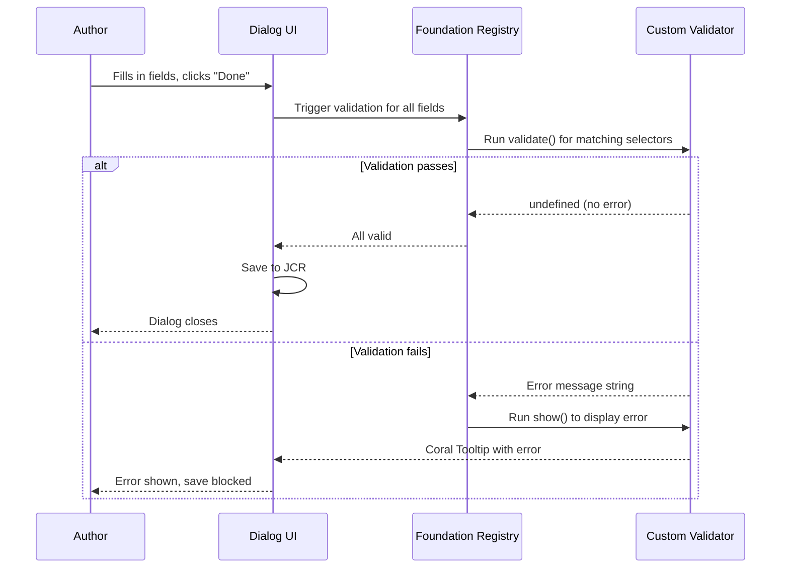

# Dialog Validation

AEM's Touch UI dialog framework includes a client-side validation system that lets you enforce business
rules **before** an author saves a dialog. This prevents invalid data from reaching the JCR, reduces
content errors, and improves the authoring experience by providing immediate, in-dialog feedback.

This guide covers the built-in validation system, how to register custom validators, and a collection
of ready-to-use validation examples.

## How Validation Works


```mermaid
sequenceDiagram
    participant Author
    participant Dialog as Dialog UI
    participant Registry as Foundation Registry
    participant Validator as Custom Validator

    Author->>Dialog: Fills in fields, clicks "Done"
    Dialog->>Registry: Trigger validation for all fields
    Registry->>Validator: Run validate() for matching selectors
    alt Validation passes
        Validator-->>Registry: undefined (no error)
        Registry-->>Dialog: All valid
        Dialog->>Dialog: Save to JCR
        Dialog-->>Author: Dialog closes
    else Validation fails
        Validator-->>Registry: Error message string
        Registry->>Validator: Run show() to display error
        Validator-->>Dialog: Coral Tooltip with error
        Dialog-->>Author: Error shown, save blocked
    end
```

The validation framework is based on the **Foundation Validation API**:

1. Validators are registered in the `foundation-registry` with a **CSS selector** that matches target fields
2. When the author submits the dialog, AEM queries all registered validators
3. Each validator's `validate()` function runs against matching fields
4. If `validate()` returns a string (the error message), the save is blocked
5. The `show()` function renders the error tooltip on the invalid field
6. The `clear()` function removes the error when the field becomes valid

### When does `validate()` fire?

Understanding the trigger points keeps the UX predictable:

| Trigger | What happens |
|---|---|
| Author clicks **Done** / submits | Every registered validator runs against every matching field. First failure blocks the save. |
| Field adapts to `foundation-field` and calls `.checkValidity()` | Only that field's validators run. Used to trigger validation imperatively from custom JS. |
| Author leaves a field (blur on most inputs) | Coral triggers revalidation on fields that have already been validated once - so the error state clears as soon as the author corrects the value. |
| Author changes a field | Coral re-runs `validate()` if the field is currently marked invalid. |

Trigger validation manually on a single field:

```javascript
var $field = $(".my-field");
var api = $field.adaptTo("foundation-field");
if (api && api.checkValidity) {
    var isValid = api.checkValidity(); // also calls show()/clear() as needed
}
```

### Two ways to declare a validator on a field

Either works; mix is fine. The registered validator's selector needs to match both.

```xml title="Shorthand -- for a single validator"
<myField ... validation="my-rule"/>
```

```xml title="granite:data node -- multiple validators and custom data attributes"
<myField ...>
    <granite:data
        jcr:primaryType="nt:unstructured"
        foundation-validation="my-rule another-rule"
        max-length="100"/>
</myField>
```

## Setup

### Client Library

Dialog validation code must be loaded in the **authoring context only**. Create a dedicated Client Library:

```xml title="ui.apps/.../clientlibs/clientlib-dialogvalidation/.content.xml"
<?xml version="1.0" encoding="UTF-8"?>
<jcr:root xmlns:cq="http://www.day.com/jcr/cq/1.0"
          xmlns:jcr="http://www.jcp.org/jcr/1.0"
    jcr:primaryType="cq:ClientLibraryFolder"
    allowProxy="{Boolean}true"
    categories="[cq.authoring.dialog]"
    dependencies="[cq.authoring.dialog.all,granite.jquery]"/>
```

| Property | Purpose |
|----------|---------|
| `categories="[cq.authoring.dialog]"` | Loads the JS only when a Touch UI dialog is open |
| `dependencies="[cq.authoring.dialog.all,granite.jquery]"` | Ensures the Foundation API and jQuery are available |
| `allowProxy="{Boolean}true"` | Serves the clientlib through the `/etc.clientlibs/` proxy |

### File structure

```text
clientlib-dialogvalidation/
├── .content.xml
├── js.txt
└── js/
    ├── urlValidation.js
    ├── extensionValidation.js
    ├── multifieldValidation.js
    ├── charCountValidation.js
    └── conditionalRequiredValidation.js
```

```text title="js.txt"
#base=js
urlValidation.js
extensionValidation.js
multifieldValidation.js
charCountValidation.js
conditionalRequiredValidation.js
```

## Validator Registration Pattern

Every custom validator follows the same structure:

```javascript title="Template -- copy and adapt"
(function ($) {
    "use strict";

    $(window)
        .adaptTo("foundation-registry")
        .register("foundation.validation.validator", {

            // CSS selector that matches the dialog fields to validate.
            // Use ~= so fields with multiple validators still match.
            selector: "[data-validation~='my-custom-rule'], [data-foundation-validation~='my-custom-rule']",

            // Runs when the dialog is submitted or `checkValidity()` is called.
            // Return undefined/nothing for valid, or an error message string for invalid.
            validate: function (el) {
                // .val() can return string, number, array (multiselect), or null.
                // Normalise first so downstream logic can assume string.
                var raw = $(el).val();
                var value = (raw == null ? "" : String(raw)).trim();
                if (value.length > 0 && !isValid(value)) {
                    return "Your custom error message here.";
                }
                // Return nothing = valid (empty fields are handled by `required` if needed)
            },

            // Renders the error indicator on the field
            show: function (el, message) {
                var $el = $(el);
                var fieldAPI = $el.adaptTo("foundation-field");
                if (fieldAPI && fieldAPI.setInvalid) {
                    fieldAPI.setInvalid(true);
                }

                var error = $el.data("foundation-validation.internal.error");
                if (error) {
                    error.content.innerHTML = message;
                    if (!error.parentNode) {
                        $el.after(error);
                        error.show();
                    }
                } else {
                    error = new Coral.Tooltip();
                    error.variant = "error";
                    error.interaction = "off";
                    error.placement = "bottom";
                    error.target = el;
                    error.content.innerHTML = message;
                    error.open = true;
                    error.id = Coral.commons.getUID();
                    $el.data("foundation-validation.internal.error", error);
                    $el.after(error);
                }
            },

            // Clears the error indicator when the field becomes valid
            clear: function (el) {
                var $el = $(el);
                var fieldAPI = $el.adaptTo("foundation-field");
                if (fieldAPI && fieldAPI.setInvalid) {
                    fieldAPI.setInvalid(false);
                }

                var error = $el.data("foundation-validation.internal.error");
                if (error) {
                    error.hide();
                    error.remove();
                    $el.removeData("foundation-validation.internal.error");
                }
            }
        });
})(Granite.$);
```

### Connecting validators to dialog fields

There are two ways to attach a validator to a dialog field:

**Option 1: `validation` attribute** (simple, single validator)

```xml
<myField
    jcr:primaryType="nt:unstructured"
    sling:resourceType="granite/ui/components/coral/foundation/form/textfield"
    fieldLabel="URL"
    name="./url"
    validation="my-custom-rule"/>
```

**Option 2: `granite:data` node** (multiple validators, custom data attributes)

```xml
<myField
    jcr:primaryType="nt:unstructured"
    sling:resourceType="granite/ui/components/coral/foundation/form/textfield"
    fieldLabel="URL"
    name="./url">
    <granite:data
        jcr:primaryType="nt:unstructured"
        validation="my-custom-rule"
        max-length="100"/>
</myField>
```

:::info Two selectors, two declaration paths
A common misconception is that `data-validation` and `data-foundation-validation` are
AEMaaCS-vs-6.5. They are not - **both attributes work on both platforms**, and they map to the
two different ways you can declare a validator on a field:

| Declaration in the dialog | Attribute that ends up on the rendered HTML |
|---|---|
| `validation="my-rule"` on the field itself | `data-validation="my-rule"` |
| `<granite:data foundation-validation="my-rule"/>` child node | `data-foundation-validation="my-rule"` |

Match both so your validator triggers regardless of how a team member declared it:

```javascript
selector: "[data-validation~='my-rule'], [data-foundation-validation~='my-rule']",
```

Note the `~=` match - Granite concatenates multiple `validation` values with spaces, so exact
`=` match can miss fields that have several validators.
:::

---

## Validation Examples

### URL Validation (Regex)

Validates that a text field contains a properly formatted URL.

```xml title="Dialog field"
<endpointUrl
    jcr:primaryType="nt:unstructured"
    sling:resourceType="granite/ui/components/coral/foundation/form/textfield"
    fieldDescription="Please provide a valid URL"
    fieldLabel="External Endpoint (URL)"
    name="./endpointUrl"
    validation="url"
    required="{Boolean}true"/>
```

```javascript title="js/urlValidation.js"
(function ($) {
    "use strict";

    var PATTERN_URL = /^https?:\/\/(www\.)?[-a-zA-Z0-9@:%._+~#=]{1,256}\.[a-zA-Z0-9()]{1,6}\b([-a-zA-Z0-9()@:%_+.~#?&/=]*)$/;

    $(window)
        .adaptTo("foundation-registry")
        .register("foundation.validation.validator", {
            selector: "[data-validation=url], [data-foundation-validation=url]",

            validate: function (el) {
                var value = $(el).val().toString().trim();
                if (value.length > 0 && !PATTERN_URL.test(value)) {
                    return "Please enter a valid URL (e.g. https://www.example.com).";
                }
            },

            show: function (el, message) {
                showError($(el), el, message);
            },

            clear: function (el) {
                clearError($(el));
            }
        });

    // Reusable show/clear helpers (shared across validators)
    function showError($el, el, message) {
        var fieldAPI = $el.adaptTo("foundation-field");
        if (fieldAPI && fieldAPI.setInvalid) {
            fieldAPI.setInvalid(true);
        }

        var error = $el.data("foundation-validation.internal.error");
        if (error) {
            error.content.innerHTML = message;
            if (!error.parentNode) {
                $el.after(error);
                error.show();
            }
        } else {
            error = new Coral.Tooltip();
            error.variant = "error";
            error.interaction = "off";
            error.placement = "bottom";
            error.target = el;
            error.content.innerHTML = message;
            error.open = true;
            error.id = Coral.commons.getUID();
            $el.data("foundation-validation.internal.error", error);
            $el.after(error);
        }
    }

    function clearError($el) {
        var fieldAPI = $el.adaptTo("foundation-field");
        if (fieldAPI && fieldAPI.setInvalid) {
            fieldAPI.setInvalid(false);
        }

        var error = $el.data("foundation-validation.internal.error");
        if (error) {
            error.hide();
            error.remove();
            $el.removeData("foundation-validation.internal.error");
        }
    }
})(Granite.$);
```

### File Extension Validation

Restricts a path field to only accept files with specific extensions (e.g. SVG icons only).

```xml title="Dialog field"
<iconPath
    jcr:primaryType="nt:unstructured"
    sling:resourceType="granite/ui/components/coral/foundation/form/pathfield"
    fieldLabel="Icon Path"
    emptyText="e.g. /content/dam/icons/home.svg"
    filter="hierarchyNotFile"
    name="./iconPath"
    validation="extension-svg"
    rootPath="/content/dam/icons"/>
```

```javascript title="js/extensionValidation.js"
(function ($) {
    "use strict";

    var PATTERN_SVG = /^.*\.(svg)$/i;

    $(window)
        .adaptTo("foundation-registry")
        .register("foundation.validation.validator", {
            selector: "[data-validation=extension-svg], [data-foundation-validation=extension-svg]",

            validate: function (el) {
                var value = $(el).val().toString().trim();
                if (value.length > 0 && !PATTERN_SVG.test(value)) {
                    return "Only .svg files are allowed.";
                }
            },

            show: function (el, message) {
                showError($(el), el, message);
            },

            clear: function (el) {
                clearError($(el));
            }
        });

    // ... showError / clearError helpers (same as above) ...
})(Granite.$);
```

:::tip Generic extension validator
For a reusable validator that works with any extension, use a `granite:data` attribute to pass the
allowed extensions:

```xml
<granite:data
    jcr:primaryType="nt:unstructured"
    validation="file-extension"
    allowed-extensions="jpg,jpeg,png,webp"/>
```

```javascript
validate: function (el) {
    var value = $(el).val().toString().trim();
    var allowed = el.getAttribute("data-allowed-extensions");
    if (value.length > 0 && allowed) {
        var pattern = new RegExp("^.*\\.(" + allowed.replace(/,/g, "|") + ")$", "i");
        if (!pattern.test(value)) {
            return "Allowed file types: " + allowed;
        }
    }
}
```
:::

### Multifield Min / Max Items

Restricts the number of items an author can add to a composite multifield.

```xml title="Dialog field"
<icons
    jcr:primaryType="nt:unstructured"
    sling:resourceType="granite/ui/components/coral/foundation/form/multifield"
    composite="{Boolean}true">
    <granite:data
        jcr:primaryType="nt:unstructured"
        max-items="5"
        min-items="1"/>
    <field
        jcr:primaryType="nt:unstructured"
        sling:resourceType="granite/ui/components/coral/foundation/container"
        name="./icons">
        <items jcr:primaryType="nt:unstructured">
            <!-- ... fields ... -->
        </items>
    </field>
</icons>
```

```javascript title="js/multifieldValidation.js"
(function ($) {
    "use strict";

    $(window)
        .adaptTo("foundation-registry")
        .register("foundation.validation.validator", {
            // Match all multifields -- the logic checks for data attributes
            selector: "coral-multifield",

            validate: function (el) {
                var totalItems = el.items.getAll().length;
                var min = el.getAttribute("data-min-items");
                var max = el.getAttribute("data-max-items");

                if (min) {
                    min = parseInt(min, 10);
                    if (min > 0 && totalItems < min) {
                        return "Minimum number of items required: " + min
                            + " (currently " + totalItems + ").";
                    }
                }

                if (max) {
                    max = parseInt(max, 10);
                    if (max > 0 && totalItems > max) {
                        return "Maximum number of items allowed: " + max
                            + " (currently " + totalItems + ").";
                    }
                }
            },

            show: function (el, message) {
                // For multifields, attach the error to the multifield element itself
                var $el = $(el);
                var error = $el.data("foundation-validation.internal.error");

                if (error) {
                    error.content.innerHTML = message;
                    if (!error.parentNode) {
                        $el.after(error);
                        error.show();
                    }
                } else {
                    error = new Coral.Tooltip();
                    error.variant = "error";
                    error.interaction = "off";
                    error.placement = "bottom";
                    error.target = el;
                    error.content.innerHTML = message;
                    error.open = true;
                    error.id = Coral.commons.getUID();
                    $el.data("foundation-validation.internal.error", error);
                    $el.after(error);
                }
            },

            clear: function (el) {
                var $el = $(el);
                var error = $el.data("foundation-validation.internal.error");
                if (error) {
                    error.hide();
                    error.remove();
                    $el.removeData("foundation-validation.internal.error");
                }
            }
        });
})(Granite.$);
```

### Character Count / Max Length

Enforces a maximum character count on a text field or textarea, showing the current count.

```xml title="Dialog field"
<description
    jcr:primaryType="nt:unstructured"
    sling:resourceType="granite/ui/components/coral/foundation/form/textarea"
    fieldLabel="Description"
    fieldDescription="Max 160 characters (SEO meta description)"
    name="./description">
    <granite:data
        jcr:primaryType="nt:unstructured"
        validation="char-count"
        max-chars="160"/>
</description>
```

```javascript title="js/charCountValidation.js"
(function ($) {
    "use strict";

    $(window)
        .adaptTo("foundation-registry")
        .register("foundation.validation.validator", {
            selector: "[data-validation=char-count], [data-foundation-validation=char-count]",

            validate: function (el) {
                var value = $(el).val().toString();
                var maxChars = parseInt(el.getAttribute("data-max-chars"), 10);

                if (maxChars && value.length > maxChars) {
                    return "Maximum " + maxChars + " characters allowed ("
                        + value.length + " entered).";
                }
            },

            show: function (el, message) {
                showError($(el), el, message);
            },

            clear: function (el) {
                clearError($(el));
            }
        });

    // ... showError / clearError helpers ...
})(Granite.$);
```

### Email Validation

Validates that a text field contains a properly formatted email address.

```xml title="Dialog field"
<contactEmail
    jcr:primaryType="nt:unstructured"
    sling:resourceType="granite/ui/components/coral/foundation/form/textfield"
    fieldLabel="Contact Email"
    name="./contactEmail"
    validation="email"/>
```

```javascript title="js/emailValidation.js"
(function ($) {
    "use strict";

    // RFC 5322 simplified pattern
    var PATTERN_EMAIL = /^[a-zA-Z0-9.!#$%&'*+/=?^_`{|}~-]+@[a-zA-Z0-9](?:[a-zA-Z0-9-]{0,61}[a-zA-Z0-9])?(?:\.[a-zA-Z0-9](?:[a-zA-Z0-9-]{0,61}[a-zA-Z0-9])?)*$/;

    $(window)
        .adaptTo("foundation-registry")
        .register("foundation.validation.validator", {
            selector: "[data-validation=email], [data-foundation-validation=email]",

            validate: function (el) {
                var value = $(el).val().toString().trim();
                if (value.length > 0 && !PATTERN_EMAIL.test(value)) {
                    return "Please enter a valid email address.";
                }
            },

            show: function (el, message) {
                showError($(el), el, message);
            },

            clear: function (el) {
                clearError($(el));
            }
        });
})(Granite.$);
```

### Phone Number Validation

Validates international phone number formats.

```xml title="Dialog field"
<phone
    jcr:primaryType="nt:unstructured"
    sling:resourceType="granite/ui/components/coral/foundation/form/textfield"
    fieldLabel="Phone Number"
    fieldDescription="International format: +49 123 456 7890"
    name="./phone"
    validation="phone"/>
```

```javascript title="js/phoneValidation.js"
(function ($) {
    "use strict";

    // Matches international phone formats: +1 234 567 8900, +49-123-456-7890, etc.
    var PATTERN_PHONE = /^\+?[\d\s\-().]{7,20}$/;

    $(window)
        .adaptTo("foundation-registry")
        .register("foundation.validation.validator", {
            selector: "[data-validation=phone], [data-foundation-validation=phone]",

            validate: function (el) {
                var value = $(el).val().toString().trim();
                if (value.length > 0 && !PATTERN_PHONE.test(value)) {
                    return "Please enter a valid phone number (e.g. +49 123 456 7890).";
                }
            },

            show: function (el, message) {
                showError($(el), el, message);
            },

            clear: function (el) {
                clearError($(el));
            }
        });
})(Granite.$);
```

### Conditional Required Field

Makes a field required only when another field has a specific value. For example, "Alt text" is
required only when an image is selected.

```xml title="Dialog fields"
<image
    jcr:primaryType="nt:unstructured"
    sling:resourceType="granite/ui/components/coral/foundation/form/pathfield"
    fieldLabel="Image"
    name="./imagePath"
    rootPath="/content/dam"/>

<altText
    jcr:primaryType="nt:unstructured"
    sling:resourceType="granite/ui/components/coral/foundation/form/textfield"
    fieldLabel="Alt Text"
    fieldDescription="Required when an image is selected"
    name="./altText">
    <granite:data
        jcr:primaryType="nt:unstructured"
        validation="conditional-required"
        depends-on="./imagePath"/>
</altText>
```

```javascript title="js/conditionalRequiredValidation.js"
(function ($) {
    "use strict";

    $(window)
        .adaptTo("foundation-registry")
        .register("foundation.validation.validator", {
            selector: "[data-validation=conditional-required]",

            validate: function (el) {
                var $el = $(el);
                var dependsOnName = el.getAttribute("data-depends-on");
                if (!dependsOnName) return;

                // Find the field this depends on (by its name attribute)
                var $dialog = $el.closest("coral-dialog");
                var $dependsOn = $dialog.find("[name='" + dependsOnName + "']");

                var dependsOnValue = $dependsOn.val();
                var thisValue = $el.val();

                // If the dependency field has a value but this field is empty
                if (dependsOnValue && dependsOnValue.toString().trim().length > 0
                    && (!thisValue || thisValue.toString().trim().length === 0)) {
                    return "This field is required when '"
                        + dependsOnName.replace("./", "") + "' is filled.";
                }
            },

            show: function (el, message) {
                showError($(el), el, message);
            },

            clear: function (el) {
                clearError($(el));
            }
        });
})(Granite.$);
```

### JSON Syntax Validation

Validates that a textarea contains valid JSON (useful for configuration fields).

```xml title="Dialog field"
<jsonConfig
    jcr:primaryType="nt:unstructured"
    sling:resourceType="granite/ui/components/coral/foundation/form/textarea"
    fieldLabel="JSON Configuration"
    fieldDescription="Must be valid JSON"
    name="./jsonConfig"
    validation="json"/>
```

```javascript title="js/jsonValidation.js"
(function ($) {
    "use strict";

    $(window)
        .adaptTo("foundation-registry")
        .register("foundation.validation.validator", {
            selector: "[data-validation=json], [data-foundation-validation=json]",

            validate: function (el) {
                var value = $(el).val().toString().trim();
                if (value.length > 0) {
                    try {
                        JSON.parse(value);
                    } catch (e) {
                        return "Invalid JSON: " + e.message;
                    }
                }
            },

            show: function (el, message) {
                showError($(el), el, message);
            },

            clear: function (el) {
                clearError($(el));
            }
        });
})(Granite.$);
```

### Per-item Multifield Validation

Validating *individual* items in a composite multifield (e.g. "each link must have both a label and
a URL") needs a different selector than the multifield itself. Target the inner input fields and
walk up to the enclosing `coral-multifield-item` to reach sibling fields.

```xml title="Dialog field -- composite multifield with two inputs per row"
<links
    jcr:primaryType="nt:unstructured"
    sling:resourceType="granite/ui/components/coral/foundation/form/multifield"
    composite="{Boolean}true">
    <field
        jcr:primaryType="nt:unstructured"
        sling:resourceType="granite/ui/components/coral/foundation/container"
        name="./links">
        <items jcr:primaryType="nt:unstructured">
            <label
                jcr:primaryType="nt:unstructured"
                sling:resourceType="granite/ui/components/coral/foundation/form/textfield"
                fieldLabel="Label"
                name="./label">
                <granite:data
                    jcr:primaryType="nt:unstructured"
                    foundation-validation="link-pair"
                    link-role="label"/>
            </label>
            <url
                jcr:primaryType="nt:unstructured"
                sling:resourceType="granite/ui/components/coral/foundation/form/textfield"
                fieldLabel="URL"
                name="./url">
                <granite:data
                    jcr:primaryType="nt:unstructured"
                    foundation-validation="link-pair"
                    link-role="url"/>
            </url>
        </items>
    </field>
</links>
```

```javascript title="js/linkPairValidation.js"
(function ($) {
    "use strict";

    $(window)
        .adaptTo("foundation-registry")
        .register("foundation.validation.validator", {
            selector: "[data-validation~='link-pair'], [data-foundation-validation~='link-pair']",

            validate: function (el) {
                var $el = $(el);
                // Scope lookups to THIS multifield row -- not the whole dialog.
                var $row = $el.closest("coral-multifield-item");
                if ($row.length === 0) return;

                var role = el.getAttribute("data-link-role");
                var value = ($el.val() || "").toString().trim();

                // The other field in the same row
                var otherRole = role === "label" ? "url" : "label";
                var $other = $row.find("[data-link-role='" + otherRole + "']");
                var otherValue = ($other.val() || "").toString().trim();

                // Both empty = OK (author hasn't filled the row yet).
                // Both filled = OK.
                // One filled, one empty = invalid.
                if (value.length === 0 && otherValue.length > 0) {
                    return "Both label and URL are required for each link.";
                }
            },

            show: function (el, message) { showError($(el), el, message); },
            clear: function (el) { clearError($(el)); }
        });
})(Granite.$);
```

:::tip Partner-field revalidation
Changing the "URL" input doesn't automatically re-run validation on the "Label" input. After the
author edits one side, trigger a `checkValidity()` on the partner so a previously-invalid state
clears:

```javascript
$(document).on("change blur", "[data-link-role]", function () {
    var $row = $(this).closest("coral-multifield-item");
    $row.find("[data-link-role]").each(function () {
        var api = $(this).adaptTo("foundation-field");
        if (api && api.checkValidity) api.checkValidity();
    });
});
```
:::

### Async / Server-side Validation

Some rules can only be checked on the server - "is this slug already taken?", "does this product
SKU exist?", "is this URL reachable?". The Foundation API is synchronous, so the pattern is:
**cache the last server result on the element, debounce fetches, and return synchronously from
`validate()`**.

```xml title="Dialog field"
<slug
    jcr:primaryType="nt:unstructured"
    sling:resourceType="granite/ui/components/coral/foundation/form/textfield"
    fieldLabel="Page Slug"
    fieldDescription="Must be unique across the site"
    name="./slug"
    required="{Boolean}true">
    <granite:data
        jcr:primaryType="nt:unstructured"
        foundation-validation="unique-slug"
        check-url="/bin/myapp/validate/slug"/>
</slug>
```

```javascript title="js/uniqueSlugValidation.js"
(function ($) {
    "use strict";

    var DEBOUNCE_MS = 350;

    $(window)
        .adaptTo("foundation-registry")
        .register("foundation.validation.validator", {
            selector: "[data-validation~='unique-slug'], [data-foundation-validation~='unique-slug']",

            validate: function (el) {
                var $el = $(el);
                var raw = $el.val();
                var value = (raw == null ? "" : String(raw)).trim();
                if (value.length === 0) return;

                // Cache the last server answer on the DOM element so we can return
                // synchronously. The async fetch (below) re-triggers validation
                // once the response arrives.
                var cached = $el.data("slugValidation");
                if (cached && cached.value === value) {
                    return cached.error; // may be undefined = valid
                }

                scheduleCheck($el, el, value);
                return; // no error yet -- optimistic pass; fetch re-validates
            },

            show: function (el, message) { showError($(el), el, message); },
            clear: function (el) { clearError($(el)); }
        });

    function scheduleCheck($el, el, value) {
        var pending = $el.data("slugValidation.timer");
        if (pending) clearTimeout(pending);

        var timer = setTimeout(function () {
            var url = el.getAttribute("data-check-url");
            $.ajax({
                url: url,
                data: { slug: value },
                dataType: "json",
                cache: false
            }).done(function (resp) {
                $el.data("slugValidation", {
                    value: value,
                    error: resp.available ? undefined : "Slug \"" + value + "\" is already in use."
                });
            }).fail(function () {
                // Network / server failure: do NOT block the author from saving.
                $el.data("slugValidation", { value: value, error: undefined });
            }).always(function () {
                // Re-trigger validation so the cached result takes effect.
                var api = $el.adaptTo("foundation-field");
                if (api && api.checkValidity) api.checkValidity();
            });
        }, DEBOUNCE_MS);

        $el.data("slugValidation.timer", timer);
    }
})(Granite.$);
```

:::warning Server-side validation is still required
Client-side async checks are a UX optimisation, not a security boundary. The servlet that handles
the save (or a `@PostConstruct` hook in the Sling Model) must re-validate uniqueness - a malicious
or stale client can submit whatever it wants. See [Server-Side Validation](#server-side-validation)
below.
:::

---

## Built-in Validation Attributes

AEM provides several built-in validations that don't require custom JavaScript.

### Field-level attributes

Set these directly on the field node:

| Attribute | Purpose | Applies to |
|-----------|---------|------------|
| `required="{Boolean}true"` | Field must not be empty | Any field |
| `max="{Long}100"` | Maximum numeric value | `numberfield` |
| `min="{Long}0"` | Minimum numeric value | `numberfield` |
| `maxlength="{Long}255"` | Maximum string length | `textfield`, `textarea` |
| `pattern="^[A-Za-z]+$"` | HTML5 regex pattern | `textfield` |
| `step="{Double}0.01"` | Numeric step / granularity | `numberfield` |

### Registered `foundation.*` validators

Use these as the value of the `validation` attribute - they are pre-registered by Granite UI:

| Validator key | Purpose |
|---------------|---------|
| `foundation.jcr.name` | Accepts characters allowed in JCR node names (no `/`, `:`, `[`, `]`, `\|`, `*`) |
| `foundation.jcr.name.path` | Same as above, but permits `/` so the value can be a relative path |
| `foundation.form.field.required` | Equivalent to `required="{Boolean}true"` declared as a validator |
| `foundation.form.field.pattern` | Reads the HTML5 `pattern` attribute and reports a friendlier error |
| `foundation.form.field.maxlength` | Reads `maxlength` and enforces it even for pasted content |
| `foundation.form.field.step` / `min` / `max` | Number-field bounds and step validation |
| `foundation.validation.number` | Value must parse as a number (for text-typed inputs) |

```xml title="Example: built-in validations combined"
<price
    jcr:primaryType="nt:unstructured"
    sling:resourceType="granite/ui/components/coral/foundation/form/numberfield"
    fieldLabel="Price"
    name="./price"
    required="{Boolean}true"
    min="{Double}0.01"
    max="{Double}99999.99"
    step="{Double}0.01"/>

<slug
    jcr:primaryType="nt:unstructured"
    sling:resourceType="granite/ui/components/coral/foundation/form/textfield"
    fieldLabel="Page Slug"
    name="./slug"
    required="{Boolean}true"
    validation="foundation.jcr.name"/>
```

:::note Validator names are not load-bearing
The exact `foundation.*` keys shipped by Granite UI are an implementation detail of the platform
and occasionally get added to or renamed between versions. If a key above doesn't exist in your
release, grep the `granite/ui/components/coral/foundation/clientlibs/foundation/js/validations`
folder (or its successor) for the current list.
:::

---

## Extracting Reusable Helpers

When you have many validators, extract the `show()` and `clear()` logic into a shared utility to
avoid code duplication across files:

```javascript title="js/validationUtils.js"
/**
 * Shared validation error display utilities.
 * Load this file BEFORE the individual validator files (list it first in js.txt).
 */
window.DialogValidation = (function () {
    "use strict";

    function showError($el, el, message) {
        var fieldAPI = $el.adaptTo("foundation-field");
        if (fieldAPI && fieldAPI.setInvalid) {
            fieldAPI.setInvalid(true);
        }

        var error = $el.data("foundation-validation.internal.error");
        if (error) {
            error.content.innerHTML = message;
            if (!error.parentNode) {
                $el.after(error);
                error.show();
            }
        } else {
            error = new Coral.Tooltip();
            error.variant = "error";
            error.interaction = "off";
            error.placement = "bottom";
            error.target = el;
            error.content.innerHTML = message;
            error.open = true;
            error.id = Coral.commons.getUID();
            $el.data("foundation-validation.internal.error", error);
            $el.after(error);
        }
    }

    function clearError($el) {
        var fieldAPI = $el.adaptTo("foundation-field");
        if (fieldAPI && fieldAPI.setInvalid) {
            fieldAPI.setInvalid(false);
        }

        var error = $el.data("foundation-validation.internal.error");
        if (error) {
            error.hide();
            error.remove();
            $el.removeData("foundation-validation.internal.error");
        }
    }

    return {
        showError: showError,
        clearError: clearError
    };
})();
```

Then in each validator file:

```javascript title="Simplified validator using shared helpers"
(function ($) {
    "use strict";

    $(window)
        .adaptTo("foundation-registry")
        .register("foundation.validation.validator", {
            selector: "[data-validation=email]",
            validate: function (el) {
                // ... validation logic ...
            },
            show: function (el, message) {
                DialogValidation.showError($(el), el, message);
            },
            clear: function (el) {
                DialogValidation.clearError($(el));
            }
        });
})(Granite.$);
```

Updated `js.txt` to load the utility first:

```text title="js.txt"
#base=js
validationUtils.js
urlValidation.js
extensionValidation.js
emailValidation.js
phoneValidation.js
charCountValidation.js
multifieldValidation.js
conditionalRequiredValidation.js
jsonValidation.js
```

---

## Server-Side Validation

Client-side validation improves the authoring experience, but should **never** be the only layer of
defence. Authors can bypass client-side checks (e.g. by editing the JCR directly, using CRXDE, or
importing content packages).

For critical business rules, add server-side validation in your Sling Model:

```java title="core/.../models/TeaserModel.java"
@PostConstruct
protected void init() {
    if (StringUtils.isNotBlank(imagePath) && StringUtils.isBlank(altText)) {
        LOG.warn("Teaser at {} has an image without alt text", resource.getPath());
        // Optionally set a flag for the HTL template to show a warning in edit mode
        hasValidationWarning = true;
    }
}
```

| Layer | Purpose | Enforcement |
|-------|---------|------------|
| **Client-side (dialog)** | Immediate feedback, guides authors | Soft - can be bypassed |
| **Server-side (Sling Model)** | Business rule enforcement | Hard - always runs |
| **Content policy** | Template-level constraints | Configurable by template authors |

---

## Best Practices and Common Pitfalls

### Always implement `clear()`

Without a `clear()` function, error tooltips remain visible even after the author corrects the field.
This confuses authors and can block saving.

### Match both declaration paths

Include both selector variants so your validator fires regardless of whether the field uses
`validation="my-rule"` or `<granite:data foundation-validation="my-rule"/>`:

```javascript
"[data-validation~='my-rule'], [data-foundation-validation~='my-rule']",
```

Use the `~=` space-separated-word selector - Granite renders multiple validators as a
space-delimited list, and `=` would miss fields with more than one validator attached.

### Don't block on empty optional fields

If a field is not `required`, your validator should allow empty values. Only validate when the field
actually has content:

```javascript
validate: function (el) {
    var value = $(el).val().toString().trim();
    // Only validate non-empty values -- empty is OK for optional fields
    if (value.length > 0 && !isValid(value)) {
        return "Error message";
    }
}
```

### Test with multifield items

Validators on fields inside multifields run for every item. Make sure your validator logic handles
the DOM structure correctly - the `el` parameter is the specific field instance, not the multifield
container.

### Keep error messages helpful

Bad: `"Invalid input"` -
Good: `"Please enter a valid URL (e.g. https://www.example.com)"`

Include the expected format, current value count, or a concrete example in the error message.

### Avoid complex cross-field validation

The Foundation Validation API is designed for single-field validation. For complex cross-field rules
(e.g. "end date must be after start date"), use the `coral-dialog` submit event instead:

```javascript
$(document).on("click", ".cq-dialog-submit", function (e) {
    var $dialog = $(this).closest("coral-dialog");
    var startDate = $dialog.find("[name='./startDate']").val();
    var endDate = $dialog.find("[name='./endDate']").val();

    if (startDate && endDate && new Date(endDate) <= new Date(startDate)) {
        e.preventDefault();
        e.stopPropagation();
        // Show a Foundation UI notification
        var ui = $(window).adaptTo("foundation-ui");
        ui.alert("Validation Error", "End date must be after start date.", "error");
    }
});
```

## Styling the Invalid State

Calling `fieldAPI.setInvalid(true)` adds the `is-invalid` class to the field element and its
surrounding `coral-Form-fieldwrapper`. Coral ships default red styling for these classes, but you
can override them in your authoring clientlib if your brand or accessibility review needs stronger
affordances.

```css title="clientlib-dialogvalidation/css/validation.css"
/* Invalid textfield / textarea */
.coral-Form-fieldwrapper.is-invalid > input.coral-Textfield,
.coral-Form-fieldwrapper.is-invalid > textarea.coral-Textfield {
    border-color: #d7373f;
    box-shadow: 0 0 0 1px #d7373f;
}

/* Invalid multifield */
coral-multifield.is-invalid {
    outline: 2px solid #d7373f;
    outline-offset: 2px;
}

/* Tighter spacing for the error tooltip */
coral-tooltip[variant="error"] {
    max-width: 320px;
}
```

Add a `css.txt` next to `js.txt` in the clientlib folder and list `css/validation.css`, then include
`css` in the `.content.xml` categories / dependencies as needed. Remember: this CSS only runs inside
dialogs, so it can't leak onto published pages.

:::tip Show which validator is failing
When debugging dialogs with many overlapping validators, surface the rule name on the wrapper -
it survives re-renders and is easy to spot in the inspector:

```javascript
show: function (el, message) {
    $(el).closest("coral-Form-fieldwrapper").attr("data-failed", "my-rule");
    /* ... */
},
clear: function (el) {
    $(el).closest("coral-Form-fieldwrapper").removeAttr("data-failed");
    /* ... */
}
```
:::

---

## Debugging Validators

Dialogs silently swallowing validation errors is a common frustration. A quick checklist before
assuming the framework is broken.

### 1. Confirm the validator is registered

Open the browser devtools on an open dialog and run:

```javascript
// All registered foundation validators
$(window).adaptTo("foundation-registry").get("foundation.validation.validator");
```

If your validator isn't in the list, the clientlib never loaded. Check:

- `categories="[cq.authoring.dialog]"` in the clientlib `.content.xml`
- `allowProxy="{Boolean}true"` (dialogs load via `/etc.clientlibs/`)
- `js.txt` actually lists your JS file
- Proxy cache - hit `/etc.clientlibs/.../clientlib.min.js` directly to confirm the JS is served

### 2. Confirm the selector matches

In the devtools console, with the dialog open:

```javascript
document.querySelectorAll("[data-validation~='my-rule'], [data-foundation-validation~='my-rule']");
```

Zero matches = your field attribute isn't what you think it is. Inspect the rendered HTML - the
`validation` property in the dialog XML becomes the `data-validation` attribute on the rendered
input, but `granite:data/foundation-validation` becomes `data-foundation-validation`.

### 3. Force a single-field validation

Instead of clicking "Done" and chasing through every validator, trigger only the one you care
about:

```javascript
var api = $("[name='./myField']").adaptTo("foundation-field");
api.checkValidity();        // runs validators, triggers show()/clear()
api.isValid();              // reads the current state
```

### 4. Inspect the Coral field API

Multiple validator paths assume `el.adaptTo("foundation-field")` returns a truthy object with
`setInvalid` and `checkValidity`. On non-form containers (fieldsets, multifields wrapped in custom
components) this can be `null`. Always guard:

```javascript
var api = $(el).adaptTo("foundation-field");
if (api && api.setInvalid) api.setInvalid(true);
```

### 5. Watch the network tab for proxy caching

Edits to dialog clientlib JS sometimes appear to do nothing because the minified bundle is cached.
During development, either:

- Append `?debugClientLibs=true` to the page URL to bypass minification, or
- Use the Clientlibs debug page: `/libs/granite/ui/content/dumplibs.html`

---

## See also

- [Custom Component Guide](../custom-component.mdx)
- [Component Dialogs](../component-dialogs.mdx) - full dialog field reference
- [Components Overview](./overview.mdx)
- [Core Components](./core-components.mdx)
- [Touch UI](../ui/touch-ui.mdx)
- [Coral UI](../ui/coral-ui.mdx)
- [Client Libraries](../client-libraries.mdx)
- [HTL Templates](../htl-templates.mdx)
- [Security](../infrastructure/security.mdx) - XSS prevention
