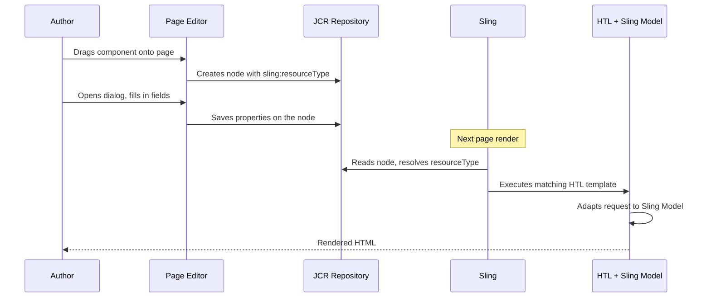

# Components Overview

An AEM component is a self-contained building block that authors drag onto a page, configure via a dialog,
and that renders HTML through an HTL template backed by a Sling Model. Every component instance is stored
as a JCR node under the page's `jcr:content` tree, and its `sling:resourceType` property tells Sling
which rendering scripts to use.

## Component Types

| Type | Purpose | Example |
|------|---------|---------|
| **Page component** | Defines the overall page structure (`<html>`, `<head>`, `<body>`) and loads global clientlibs. Usually has `sling:resourceSuperType` pointing to a Core Component page type | `myproject/components/page` |
| **Content component** | A reusable block placed inside a layout container by authors. Contains its own dialog, model, and template | Text, Image, Teaser, Article Card |
| **Container component** | Holds other components (a layout grid / parsys). Authors add child components into it | Responsive Grid, Container, Experience Fragment |
| **Structural component** | Part of the template structure, locked by the template author (header, footer, navigation). Authors cannot remove them | Header, Footer, Navigation |

## Component Anatomy

Every component consists of up to five artifacts:

```text
myproject/components/articlecard/
  .content.xml                    1. Component definition (resourceType, group, superType)
  articlecard.html                2. HTL template (view)
  _cq_dialog/.content.xml        3. Author dialog (per-instance fields)
  _cq_design_dialog/.content.xml 4. Design dialog (template policy fields)
  clientlibs/                     5. Clientlibs (CSS/JS for authoring and runtime)
```

The Sling Model (Java) lives in the `core/` module and is connected via `data-sly-use` in the HTL template.

For a complete step-by-step walkthrough of building all five artifacts, see the
[Custom Component Guide](../custom-component.mdx).

## Component Lifecycle

What happens when an author uses a component:



## Style System

The Style System allows template authors to define CSS class combinations that content authors can
apply to components without developer involvement. This enables visual variations (e.g. "Hero - Dark",
"Hero - Compact") from a single component.

### Configuring in template policies

1. Open the **Template Editor** for your template
2. Select a component and click the **policy icon**
3. Under the **Styles** tab, add style groups and options:
- Group: "Layout" -- options: "Default", "Compact", "Wide"
- Group: "Theme" -- options: "Light", "Dark"
4. Each option maps to one or more CSS classes (e.g. `cmp-hero--dark`)

When an author selects a style, AEM adds the CSS classes to the component's wrapper element.

### Reading style values in a Sling Model

If you need to vary server-side logic based on the applied style (not just CSS), you can read the
current style programmatically:

```java
import com.day.cq.wcm.api.components.ComponentStyleInfo;

// Adapt the component's resource to ComponentStyleInfo
ComponentStyleInfo styleInfo = request.getResource().adaptTo(ComponentStyleInfo.class);

if (styleInfo != null) {
    // Get the applied CSS classes as a space-separated string
    String appliedClasses = styleInfo.getAppliedCssClasses();

    // Check for a specific variation
    boolean isDark = appliedClasses != null && appliedClasses.contains("cmp-hero--dark");
}
```

`ComponentStyleInfo` provides:

| Method | Returns |
|--------|---------|
| `getAppliedCssClasses()` | The CSS classes currently selected by the author (space-separated string) |
| `getContentPolicy()` | The content policy associated with the component |

### BEM naming convention

Follow the [BEM](https://getbem.com/naming/) convention for component CSS classes. This aligns with
how AEM Core Components name their classes:

```text
.cmp-hero                    Block
.cmp-hero__image             Element
.cmp-hero--dark              Modifier (applied via Style System)
.cmp-hero__title--large      Element + Modifier
```

The `cmp-` prefix is the Core Components convention. Use your own project prefix if you prefer
(e.g. `myp-hero`), but be consistent across all components.

## Extending vs Building from Scratch

| Approach | When to use | How |
|----------|-------------|-----|
| **Extend a Core Component** (recommended) | Your component is a variant of an existing Core Component (text, image, teaser, list, etc.) | Set `sling:resourceSuperType` to the Core Component. Override only the HTL template and/or Sling Model |
| **Build from scratch** | No Core Component matches your needs | Create all artifacts yourself. See the [Custom Component Guide](../custom-component.mdx) |
| **Proxy a Core Component** | You want to use a Core Component as-is but with your own `componentGroup` and resource type | Set `sling:resourceSuperType`, don't override any files |

For extending and merging Core Component dialogs, see [Core Components](./core-components.mdx).

## Component Groups and Allowed Components

### Component groups

The `componentGroup` property in `.content.xml` controls where the component appears in the editor's
component browser:

```xml
componentGroup="My Project - Content"
```

Common group naming patterns:
- `My Project - Content` -- general content components
- `My Project - Structure` -- structural components (header, footer)
- `My Project - Commerce` -- commerce-specific components
- `.hidden` -- hides the component from the browser (still usable via policies)

### Allowed components via template policies

In the **Template Editor**, click the policy icon on any container to configure which component groups
(and individual components) are allowed in that container. This is stored under
`/conf/myproject/settings/wcm/policies/`.

## Quick Reference

| Topic | Page |
|-------|------|
| Dialog field types (textfield, select, multifield, etc.) | [Component Dialogs](../component-dialogs.mdx) |
| Extending and merging Core Component dialogs | [Core Components](./core-components.mdx) |
| Dialog validation (regex, custom validators) | [Dialog Validation](./dialog-validation.mdx) |
| Building a component end-to-end | [Custom Component Guide](../custom-component.mdx) |
| Sling Model annotations and patterns | [Sling Models](../backend/sling-models.mdx) |
| HTL syntax and block elements | [HTL Templates](../htl-templates.mdx) |
| CSS/JS management and loading | [Client Libraries](../client-libraries.mdx) |
| Component architecture and request flow | [Architecture](../architecture.mdx) |

## See also

- [Architecture](../architecture.mdx)
- [Custom Component Guide](../custom-component.mdx)
- [Component Dialogs](../component-dialogs.mdx)
- [Core Components](./core-components.mdx)
- [Dialog Validation](./dialog-validation.mdx)
- [Sling Models](../backend/sling-models.mdx)
- [HTL Templates](../htl-templates.mdx)
- [Client Libraries](../client-libraries.mdx)
- [Multi-Tenancy UI Frontend Themes](../ui/multi-tenancy-support-ui-frontend.mdx)
