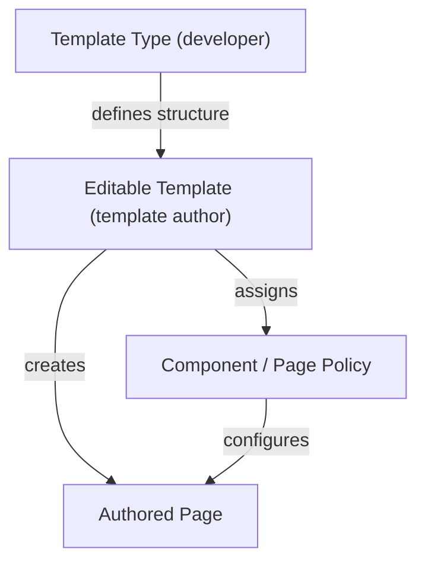
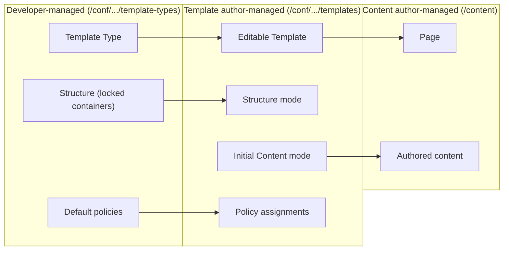

# Editable Templates and Policies

**Editable Templates** are AEM's modern template system. They let template authors define
page structure, allowed components, and default content visually -- without developer
intervention. **Policies** attach reusable configuration to components and pages within
a template context, controlling everything from allowed heading levels to loaded clientlibs.



---

## Why Editable Templates?

Editable Templates replaced the legacy **Static Templates** (`cq:Template`, design mode,
`/etc/designs/`). Key advantages:

| Feature | Editable Templates | Static Templates (legacy) |
|---------|-------------------|--------------------------|
| **Who creates templates** | Template authors (non-developers) | Developers only |
| **Structure changes** | Visual editor (no code deploy) | Code change + deploy |
| **Component configuration** | Policies (per-template) | Design mode (global) |
| **Storage** | `/conf/` (content) | `/etc/designs/` (code) |
| **Initial content** | Visual authoring | JSP/HTML in code |
| **Allowed components** | Per-container, per-template | Global or per-component-group |
| **AEMaaCS** | Fully supported | Deprecated |

---

## Architecture

### How templates, types, and pages relate



### JCR structure

```
/conf/mysite/
├── settings/
│   └── wcm/
│       ├── template-types/                  ← Developer-defined
│       │   └── content-page/
│       │       ├── jcr:content
│       │       │   └── sling:resourceType = "mysite/components/page"
│       │       ├── structure/               ← Locked structure
│       │       │   └── jcr:content/root/
│       │       │       └── responsivegrid
│       │       ├── initial/                 ← Default content
│       │       └── policies/                ← Default policy mappings
│       │
│       ├── templates/                       ← Template author-managed
│       │   ├── content-page/
│       │   │   ├── jcr:content
│       │   │   │   ├── jcr:title = "Content Page"
│       │   │   │   ├── status = "enabled"
│       │   │   │   └── allowedPaths = ["/content/mysite/.*"]
│       │   │   ├── structure/
│       │   │   ├── initial/
│       │   │   └── policies/
│       │   └── landing-page/
│       │       └── ...
│       │
│       └── policies/                        ← Policy definitions
│           └── mysite/
│               ├── components/
│               │   ├── text/
│               │   │   └── default/         ← Policy for text component
│               │   │       ├── jcr:title = "Default Text Policy"
│               │   │       └── allowedFormats = ["bold", "italic", "links"]
│               │   └── image/
│               │       └── default/
│               └── page/
│                   └── default/             ← Page policy
│                       ├── clientlibs = ["mysite.base", "mysite.theme"]
│                       └── appResourcesPath = "/etc.clientlibs/mysite"
```

---

## Template Types

Template types are the **developer-defined blueprints** that template authors use to
create templates. They define the locked structure and default policies.

### Creating a template type

```xml title="ui.content/.../template-types/content-page/.content.xml"
<?xml version="1.0" encoding="UTF-8"?>
<jcr:root xmlns:jcr="http://www.jcp.org/jcr/1.0"
          xmlns:cq="http://www.day.com/jcr/cq/1.0"
    jcr:primaryType="cq:Template"
    jcr:title="Content Page"
    jcr:description="Base template type for content pages"
    ranking="{Long}100"/>
```

```xml title="ui.content/.../template-types/content-page/structure/.content.xml"
<?xml version="1.0" encoding="UTF-8"?>
<jcr:root xmlns:sling="http://sling.apache.org/jcr/sling/1.0"
          xmlns:jcr="http://www.jcp.org/jcr/1.0"
          xmlns:cq="http://www.day.com/jcr/cq/1.0"
    jcr:primaryType="cq:Page">
    <jcr:content
        jcr:primaryType="cq:PageContent"
        sling:resourceType="mysite/components/page"
        cq:deviceGroups="[/etc/mobile/groups/responsive]">
        <root
            jcr:primaryType="nt:unstructured"
            sling:resourceType="wcm/foundation/components/responsivegrid">
            <responsivegrid
                jcr:primaryType="nt:unstructured"
                sling:resourceType="wcm/foundation/components/responsivegrid"/>
        </root>
    </jcr:content>
</jcr:root>
```

---

## Template Editor

The Template Editor (**Tools > General > Templates**) provides three modes:

### Structure Mode

Defines the **layout skeleton** of the page. Template authors can:
- Add layout containers (responsive grids)
- Lock or unlock containers (locked = authors cannot move/delete)
- Configure allowed components per container
- Set the page component (`sling:resourceType`)

### Initial Content Mode

Sets **default content** that every new page created from this template starts with.
For example:
- A hero component with placeholder text
- A breadcrumb component
- A default footer fragment

Authors can modify this initial content when they create a page.

### Policies Mode

Assigns **policies** to the page and to individual components. This is where you
configure:
- Which clientlibs the page loads
- Which RTE formats are allowed in text components
- Which image sizes are permitted
- Style System classes

---

## Page Policies

Page policies control **page-level settings** applied to all pages using a template.

### Common page policy properties

| Property | Description |
|----------|-------------|
| `clientlibs` | Clientlib categories to load on every page |
| `appResourcesPath` | Path prefix for clientlib proxy resolution |
| `htmlPageItemsConfig` | Controls `<head>` and `<body>` element ordering |
| `responsive/breakpoints` | Responsive grid breakpoint configuration |

### Setting page policy via JCR

```xml title="Policy definition"
<jcr:root xmlns:jcr="http://www.jcp.org/jcr/1.0"
    jcr:primaryType="nt:unstructured"
    jcr:title="My Site Page Policy"
    sling:resourceType="wcm/core/components/policy/policy"
    clientlibs="[mysite.base,mysite.components]"
    appResourcesPath="/etc.clientlibs/mysite"/>
```

### Reading page policies in Sling Models

```java
import com.day.cq.wcm.api.policies.ContentPolicy;
import com.day.cq.wcm.api.policies.ContentPolicyManager;
import org.apache.sling.api.resource.Resource;
import org.apache.sling.models.annotations.Model;
import org.apache.sling.models.annotations.injectorspecific.Self;
import org.apache.sling.models.annotations.injectorspecific.OSGiService;

@Model(adaptables = Resource.class)
public class PagePolicyModel {

    @Self
    private Resource resource;

    @OSGiService
    private ContentPolicyManager policyManager;

    public String[] getClientlibs() {
        ContentPolicy policy = policyManager.getPolicy(resource);
        if (policy != null) {
            return policy.getProperties().get("clientlibs", String[].class);
        }
        return new String[0];
    }
}
```

---

## Component Policies

Component policies provide **per-template configuration** for components. The same
component can behave differently depending on which template it's used in.

### Example: Text component policy

A policy that restricts the Rich Text Editor to only bold, italic, and links:

```xml title="Policy for text component"
<jcr:root xmlns:jcr="http://www.jcp.org/jcr/1.0"
    jcr:primaryType="nt:unstructured"
    jcr:title="Restricted Text"
    sling:resourceType="wcm/core/components/policy/policy"
    textIsRich="{Boolean}true"
    allowedFormats="[bold,italic,links]"/>
```

### Example: Image component policy

```xml
<jcr:root xmlns:jcr="http://www.jcp.org/jcr/1.0"
    jcr:primaryType="nt:unstructured"
    jcr:title="Standard Image Policy"
    sling:resourceType="wcm/core/components/policy/policy"
    allowedRenditionWidths="[320,640,1024,1280,1920]"
    disableLazyLoading="{Boolean}false"
    enableDmFeatures="{Boolean}false"/>
```

### Reading component policies in Sling Models

```java
import com.day.cq.wcm.api.policies.ContentPolicy;
import com.day.cq.wcm.api.policies.ContentPolicyManager;

@Model(adaptables = SlingHttpServletRequest.class)
public class ImageModel {

    @Self
    private SlingHttpServletRequest request;

    @OSGiService
    private ContentPolicyManager policyManager;

    public int[] getAllowedWidths() {
        Resource resource = request.getResource();
        ContentPolicy policy = policyManager.getPolicy(resource);

        if (policy != null) {
            String[] widths = policy.getProperties()
                .get("allowedRenditionWidths", String[].class);
            if (widths != null) {
                return Arrays.stream(widths)
                    .mapToInt(Integer::parseInt)
                    .toArray();
            }
        }

        return new int[]{ 320, 640, 1024 }; // defaults
    }
}
```

### Using `currentStyle` in HTL

The `currentStyle` binding gives direct access to the component's policy values:

```html
<sly data-sly-use.style="${'com.day.cq.wcm.foundation.model.CurrentStyle'}"/>

<!-- Or directly via the global binding -->
<div class="text ${currentStyle.cssClass}"
     data-max-length="${currentStyle.maxLength}">
    ${properties.text @ context='html'}
</div>
```

---

## Allowed Components

Template authors control which components are available per container:

### In the Template Editor

1. Open the template in Structure mode
2. Click on a layout container
3. Open the **Policy** dialog
4. Under **Allowed Components**, check the component groups or individual components

### Allowed component groups

```xml title="Policy restricting to specific groups"
<jcr:root xmlns:jcr="http://www.jcp.org/jcr/1.0"
    jcr:primaryType="nt:unstructured"
    jcr:title="Content Container Policy"
    sling:resourceType="wcm/core/components/policy/policy"
    components="group:mysite - Content,group:mysite - Media"/>
```

### Per-container configuration

Different containers on the same template can have different allowed components:

```
Template: Landing Page
├── Header container  → Only: Navigation, Logo, Search
├── Hero container    → Only: Hero, Video Hero
├── Content container → All content components
└── Footer container  → Only: Footer, Legal Text
```

---

## Style System

The **Style System** lets template authors assign CSS classes to components without
developer intervention. It builds on top of component policies:

### Defining styles in a policy

```xml title="Button component policy with styles"
<jcr:root xmlns:jcr="http://www.jcp.org/jcr/1.0"
    jcr:primaryType="nt:unstructured"
    jcr:title="Button Policy"
    sling:resourceType="wcm/core/components/policy/policy"
    cq:styleGroups="[group1,group2]">
    <cq:styleGroups jcr:primaryType="nt:unstructured">
        <group1
            jcr:primaryType="nt:unstructured"
            cq:styleGroupLabel="Size">
            <styles jcr:primaryType="nt:unstructured">
                <small
                    jcr:primaryType="nt:unstructured"
                    cq:styleId="btn-sm"
                    cq:styleLabel="Small"
                    cq:styleClasses="btn-sm"/>
                <large
                    jcr:primaryType="nt:unstructured"
                    cq:styleId="btn-lg"
                    cq:styleLabel="Large"
                    cq:styleClasses="btn-lg"/>
            </styles>
        </group1>
        <group2
            jcr:primaryType="nt:unstructured"
            cq:styleGroupLabel="Color">
            <styles jcr:primaryType="nt:unstructured">
                <primary
                    jcr:primaryType="nt:unstructured"
                    cq:styleId="btn-primary"
                    cq:styleLabel="Primary"
                    cq:styleClasses="btn-primary"/>
                <secondary
                    jcr:primaryType="nt:unstructured"
                    cq:styleId="btn-secondary"
                    cq:styleLabel="Secondary"
                    cq:styleClasses="btn-secondary"/>
            </styles>
        </group2>
    </cq:styleGroups>
</jcr:root>
```

Authors select styles via the component toolbar. The selected classes are added to the
component's wrapper element.

### Reading styles in Sling Models

```java
import com.adobe.cq.wcm.style.ComponentStyleInfo;

@Model(adaptables = SlingHttpServletRequest.class)
public class StyledComponent {

    @Self
    private SlingHttpServletRequest request;

    public String getAppliedStyles() {
        ComponentStyleInfo styleInfo = request.getResource()
            .adaptTo(ComponentStyleInfo.class);

        if (styleInfo != null) {
            return styleInfo.getAppliedCssClasses();
            // e.g., "btn-lg btn-primary"
        }
        return "";
    }
}
```

---

## Policy Mapping

Policies are mapped to components within a template via `cq:policy` references:

```
/conf/mysite/settings/wcm/templates/content-page/policies/
├── jcr:content
│   ├── cq:policy = "/conf/mysite/settings/wcm/policies/mysite/page/default"
│   └── root/
│       └── responsivegrid/
│           ├── cq:policy = "/conf/mysite/settings/wcm/policies/mysite/containers/content"
│           └── cq:policyMapping = { ... }
```

The `cq:policy` property points to the policy definition node. The template editor
manages these mappings automatically.

---

## Locking and Unlocking Structure

Template authors can **lock** containers and components in the structure:

| Lock state | Author can... |
|-----------|---------------|
| **Locked** | Cannot move, delete, or restructure (can still edit content) |
| **Unlocked (editable structure)** | Can add, move, and delete components |
| **Initial content only** | Component is in initial content but not locked in structure |

Locking is set via the `cq:editable` property on the structure node.

---

## Static Templates (Legacy)

For reference, legacy static templates use a different mechanism:

```
/apps/mysite/templates/
└── content-page/
    ├── jcr:primaryType = "cq:Template"
    ├── jcr:title = "Content Page"
    ├── allowedPaths = "/content/mysite/.*"
    └── jcr:content/
        └── sling:resourceType = "mysite/components/page"

/etc/designs/mysite/
└── jcr:content/
    └── component-config...  ← Design mode configuration
```

> Static templates are **deprecated** on AEMaaCS. All new projects should use Editable
> Templates. Existing static templates continue to work but cannot be managed in the
> Template Editor.

---

## Multi-Site Template Governance

### Shared templates

Store templates in a shared `/conf/` location for use across multiple sites:

```
/conf/global/settings/wcm/templates/    ← Available to all sites
/conf/brand-a/settings/wcm/templates/   ← Brand A only
/conf/brand-b/settings/wcm/templates/   ← Brand B only
```

### Template allowedPaths

Restrict which content paths can use a template:

```
allowedPaths = ["/content/brand-a/.*"]
```

### Inheriting policies

Policies defined at a higher `/conf/` level are inherited by child configurations,
allowing shared base policies with per-site overrides.

---

## Best Practices

### Let template authors own templates

Developers create template types; template authors create and manage templates. This
separation enables faster iteration without code deployments.

### Use policies for component configuration

Never hardcode component settings. Use policies so template authors can adjust behaviour
(allowed formats, image sizes, style options) per template.

### Keep template types minimal

A template type should define the bare structural skeleton. Template authors add the
detail (initial content, specific policies, allowed components).

### Use the Style System instead of component variants

Instead of creating `hero-dark`, `hero-light`, and `hero-centered` as separate components,
create one `hero` component with a Style System policy that adds CSS classes.

### Version `/conf/` content in code

Include your template type definitions and default policy configurations in `ui.content`
and deploy them via Cloud Manager. Template author changes live alongside this in the
content repository.

---

## Common Pitfalls

| Pitfall | Solution |
|---------|----------|
| Template not showing in "Create Page" | Check `status` is `enabled` and `allowedPaths` matches the current content path |
| Component not available in a container | Open the template in Structure mode and check the container's policy for allowed components |
| Policy values not picked up | Verify the `cq:policy` reference on the template points to the correct policy node |
| Style System classes not applied | Ensure the component's HTL wrapper includes the `data-sly-use.style` binding or uses Core Components (which include it by default) |
| Design mode settings ignored | Editable Templates do not use `/etc/designs/`; migrate to policies |
| Initial content not appearing | Check the template's Initial Content mode; verify the components have content authored |
| Template locked for editing | Only users with `template-authors` group membership can edit templates |

## See also

- [Component Dialogs](../component-dialogs.mdx) -- design dialogs and policy reading
- [Components Overview](./overview.mdx) -- component types and anatomy
- [Custom Component Guide](../custom-component.mdx) -- building components for templates
- [Client Libraries](../client-libraries.mdx) -- loading clientlibs via page policies
- [Sling Models and Services](../backend/sling-models.mdx) -- reading template policies
- [Extending the Responsive Grid](../ui/extending-responsive-grid.md) -- container components
- [SPA Editor](../ui/spa-editor.md) -- SPA page templates
- [Experience Fragments](../content/experience-fragments.md) -- XF templates
