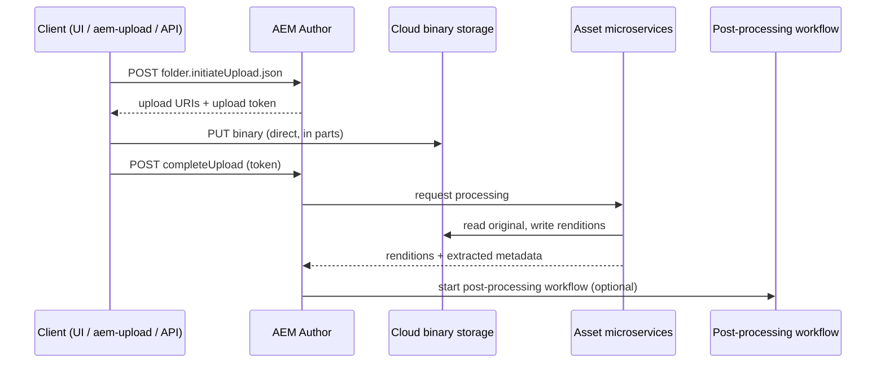

# Asset Processing on AEM as a Cloud Service

Asset processing is one of the biggest architectural differences between AEM 6.5 and AEM as a
Cloud Service. On 6.5, the **DAM Update Asset** workflow runs inside the AEM JVM and creates
renditions with Java code and command-line tools. On AEMaaCS, binaries never pass through the
AEM JVM on upload, and renditions are generated by **asset microservices** that run outside AEM.

If you migrate customisations one-to-one from DAM Update Asset, they will not run. This page
shows where each kind of customisation goes instead.

## The pipeline



1. **Direct binary upload** - the client uploads the binary straight to cloud storage.
2. **Asset microservices** - generate the standard renditions, extract metadata and text for
   search, and apply any processing profiles configured for the folder.
3. **Post-processing workflow** (optional) - your own workflow model, started after processing
   is complete.

## 1. Direct binary upload

Uploading through the Assets UI, the AEM desktop app, or Adobe's upload libraries already uses
this flow. If you write your own integration, the protocol has three steps:

1. `POST /content/dam/<folder>.initiateUpload.json` with `fileName` and `fileSize`. The response
   contains one or more `uploadURIs`, an `uploadToken`, a `completeURI`, and the allowed part
   sizes (`minPartSize`, `maxPartSize`).
2. `PUT` the binary (split into parts if needed) to the upload URIs. These go to cloud storage,
   not to AEM.
3. `POST` to the `completeURI` with `fileName`, `mimeType`, and the `uploadToken` so AEM creates
   the asset and starts processing.

In practice, use a library instead of implementing it yourself:

```javascript title="upload.js"
const DirectBinary = require('@adobe/aem-upload');

async function main() {
    const options = new DirectBinary.DirectBinaryUploadOptions()
        .withUrl('https://author-p12345-e67890.adobeaemcloud.com/content/dam/myproject/uploads')
        .withUploadFiles([
            {
                fileName: 'hero.jpg',
                fileSize: 1843200,
                filePath: '/tmp/hero.jpg',
            },
        ])
        .withHttpOptions({
            headers: {
                Authorization: `Bearer ${process.env.AEM_ACCESS_TOKEN}`,
            },
        });

    const upload = new DirectBinary.DirectBinaryUpload();
    await upload.uploadFiles(options);
}

main().catch((err) => {
    console.error('Upload failed', err);
    process.exitCode = 1;
});
```

The access token comes from a technical account (service credentials) in the Developer Console.
Never ship it to a browser.

:::warning
Legacy ingestion patterns from AEM 6.5 - posting the binary to the Assets HTTP API, or streaming
large binaries through the JVM with `AssetManager.createAsset(...)` - are not the recommended way to
ingest assets on AEMaaCS. Use direct binary upload so the binary goes straight to cloud storage
and processing is triggered correctly.
:::

## 2. Asset microservices and processing profiles

Without any configuration, every uploaded asset gets:

- The standard thumbnail renditions (`cq5dam.thumbnail.*`) and a web rendition used by the
  Assets UI
- Extracted metadata (XMP, EXIF, IPTC) written to `jcr:content/metadata`
- Extracted text for full-text search (PDF, Office documents)
- Smart Tags, if your program is licensed for them

To add project-specific renditions, create a **processing profile** under
**Tools > Assets > Processing Profiles**:

| Profile type | Use it for |
|--------------|------------|
| **Image** | Extra image renditions - width/height, format (JPEG, PNG, GIF, WebP), quality, and include/exclude MIME types |
| **Custom** | Calling your own [Asset Compute worker](#3-custom-asset-compute-workers) with parameters |
| **Video** | Video encoding renditions (Dynamic Media) |

Apply the profile to a folder (folder **Properties > Asset Processing**, or **Apply Profile to
Folders** from the profile). It applies to the folder and its subfolders, for assets that are
uploaded afterwards. For existing assets, select them and use **Reprocess Assets**.

Keep renditions purposeful: every extra rendition costs processing time and storage for every
asset in the folder. For web delivery, prefer dynamic renditions (Dynamic Media or the Core
Components image servlet with web-optimized image delivery) over a long list of static sizes.

## 3. Custom Asset Compute workers

When a standard image rendition is not enough - watermarking, a custom file format, calling a
third-party API - write an **Asset Compute worker**. Workers are Adobe I/O Runtime actions built
with [App Builder](../infrastructure/aio-app-builder.md) and the Asset Compute SDK. The SDK
downloads the source for you and uploads whatever you write to the rendition path:

```javascript title="actions/watermark/index.js"
'use strict';

const { worker } = require('@adobe/asset-compute-sdk');
const fs = require('fs').promises;

exports.main = worker(async (source, rendition) => {
    // source.path    - local copy of the original binary
    // rendition.path - where the worker must write the output
    // rendition.instructions - parameters from the processing profile
    const input = await fs.readFile(source.path);
    const output = await addWatermark(input, rendition.instructions);
    await fs.writeFile(rendition.path, output);
});
```

Deploy the App Builder project, then reference the worker's endpoint URL in a **Custom**
processing profile. Workers only produce renditions - they do not write to the repository, so
anything that needs JCR access belongs in a post-processing workflow.

Develop and test workers with the Asset Compute Development Tool from the App Builder project
before wiring them into a profile.

## 4. Post-processing workflows

Custom logic that needs the repository - setting metadata from an external system, tagging,
moving assets, notifying someone - runs in a **post-processing workflow**. It is a normal
workflow model that AEM starts after the microservices have finished.

Configure which model runs:

- **Per folder** - folder **Properties > Asset Processing > Auto-start Workflow**.
- **By path or expression** - an OSGi configuration for
  `com.adobe.cq.dam.processor.nui.impl.workflow.CustomDamWorkflowRunnerImpl`, which maps paths or
  expressions to workflow models.

Rules for post-processing models:

- End the model with the **DAM Update Asset Workflow Completed Process** step, so AEM knows the
  asset is fully processed.
- Do not generate renditions in Java steps - use processing profiles or Asset Compute.
- Do not add your own workflow launchers on `/content/dam` to start processing. Launchers that
  react to asset uploads fight with the microservices pipeline; use the post-processing
  configuration instead.
- Custom Java steps are ordinary `WorkflowProcess` implementations - see
  [Workflows](../backend/workflows.mdx) for how to write them.

## Where does my 6.5 customisation go?

| On AEM 6.5 you had... | On AEMaaCS use... |
|-----------------------|-------------------|
| Extra rendition sizes in DAM Update Asset | Image processing profile |
| ImageMagick / `CommandLineProcess` step | Asset Compute worker (Custom profile) |
| Custom Java step that sets metadata | Post-processing workflow |
| Launcher on `/content/dam` that starts a custom model | Post-processing workflow configured per folder or path |
| Upload via Assets HTTP API / `createasset.html` | Direct binary upload (`@adobe/aem-upload`) |
| Metadata extraction step | Built in - microservices extract XMP / EXIF / IPTC |
| Video transcoding with FFmpeg | Dynamic Media video profiles |

## Common pitfalls

| Symptom | Likely cause | Fix |
|---------|--------------|-----|
| Custom rendition step never runs | Step added to DAM Update Asset | Move it to a processing profile or a post-processing workflow |
| Assets stay in "Processing" | Post-processing model missing the completion step, or a step failed | Add the **DAM Update Asset Workflow Completed Process** step; check failed workflow instances |
| New profile has no effect on existing assets | Profiles apply at upload time | Use **Reprocess Assets** |
| Upload works locally, fails on AEMaaCS | Local SDK does not run asset microservices the same way | Test processing on a Cloud Service dev environment |
| Upload script returns 401/403 | Missing or expired technical account token, or missing permissions on the folder | Refresh the token; grant the technical account's user write access |

## See also

- [Assets and DAM (beginners guide)](../beginners-guide/12-assets-and-dam.md) - folders, metadata, and renditions basics
- [Workflows](../backend/workflows.mdx) - writing custom workflow steps
- [App Builder](../infrastructure/aio-app-builder.md) - the platform Asset Compute workers run on
- [AEMaaCS vs AEM 6.5](../infrastructure/aemaacs-vs-aem-65.mdx)
- Adobe docs: [Asset microservices overview](https://experienceleague.adobe.com/en/docs/experience-manager-cloud-service/content/assets/manage/asset-microservices-overview)
- Adobe docs: [Configure and use asset microservices](https://experienceleague.adobe.com/en/docs/experience-manager-cloud-service/content/assets/manage/asset-microservices-configure-and-use)
- Adobe docs: [Asset Compute Service extensibility](https://experienceleague.adobe.com/en/docs/experience-manager-cloud-service/content/assets/manage/asset-compute-extensibility)
- [@adobe/aem-upload on GitHub](https://github.com/adobe/aem-upload)
