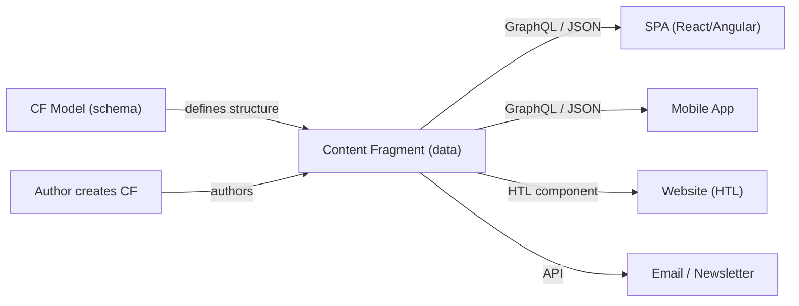

# Content Fragments

Content Fragments are **channel-neutral, structured content** in AEM. Unlike page components that mix
content with presentation, Content Fragments separate content from layout, making the same content
reusable across websites, mobile apps, SPAs, email, and any other channel via GraphQL, REST, or
direct Java API access.



## Content Fragment Models

A Content Fragment Model defines the **schema** (fields and their types) for a fragment. Models are
created in the AEM configuration space (`/conf`) and must be enabled per site configuration.

### Enabling CF Models for a site

1. Navigate to **Tools > General > Configuration Browser**
2. Select your site configuration (e.g., `myproject`)
3. Enable **Content Fragment Models**
4. Models are stored at `/conf/myproject/settings/dam/cfm/models/`

### Available field types

| Field Type | JCR Storage | Java Type | Use case |
|-----------|-------------|-----------|----------|
| Single-line text | `String` | `String` | Titles, labels, short text |
| Multi-line text | `String` | `String` | Rich text (HTML), Markdown, or plain text |
| Number | `Long` / `Double` | `Long` / `Double` | Quantities, prices, ratings |
| Boolean | `Boolean` | `Boolean` | Toggles, flags |
| Date and Time | `Calendar` | `Calendar` | Publish dates, event dates |
| Enumeration | `String` | `String` | Predefined choices (dropdown) |
| Tags | `String[]` | `String[]` | AEM tag references |
| Content Reference | `String` | `String` | Path to a page or asset |
| Fragment Reference | `String[]` | `String[]` | References to other Content Fragments |
| JSON Object | `String` (JSON) | `String` | Arbitrary structured data |
| Tab Placeholder | -- | -- | Visual grouping in the editor (no data) |

### Model JCR structure

```text
/conf/myproject/settings/dam/cfm/models/article
├── jcr:content
│   ├── jcr:title = "Article"
│   ├── jcr:description = "An article with title, body, and author"
│   └── model
│       ├── cq:fields
│       │   ├── title          (fieldType: "text-single", required: true)
│       │   ├── body           (fieldType: "text-multi", mimeType: "text/html")
│       │   ├── publishDate    (fieldType: "calendar")
│       │   ├── category       (fieldType: "enumeration", options: [...])
│       │   ├── featuredImage   (fieldType: "content-reference")
│       │   ├── author          (fieldType: "fragment-reference", modelPath: "/conf/.../author")
│       │   └── relatedArticles (fieldType: "fragment-reference", multiple: true)
```

### Model field validation

Models support built-in validation rules:

| Validation | Applies to | Effect |
|-----------|-----------|--------|
| **Required** | All types | Field must have a value |
| **Min/Max length** | Text fields | Character count limits |
| **Min/Max value** | Number fields | Numeric range |
| **Unique** | Text fields | Value must be unique across fragments of this model |
| **Pattern (Regex)** | Text fields | Value must match the regex |
| **Accept** (for references) | Content/Fragment references | Limits selectable models or paths |

---

## Content Fragment Structure in the JCR

Content Fragments are stored as `dam:Asset` nodes under `/content/dam/`. Understanding the JCR
structure is essential for programmatic access.

```text
/content/dam/myproject/articles/my-article
├── jcr:content
│   ├── jcr:primaryType = "dam:AssetContent"
│   ├── data
│   │   ├── cq:model = "/conf/myproject/settings/dam/cfm/models/article"
│   │   ├── title = "My Article Title"
│   │   ├── body = "<p>The article body in HTML...</p>"
│   │   ├── publishDate = "2025-06-15T10:00:00.000+02:00"
│   │   ├── category = "technology"
│   │   ├── featuredImage = "/content/dam/myproject/images/hero.jpg"
│   │   └── author = ["/content/dam/myproject/authors/john-doe"]
│   └── metadata
│       ├── dc:title = "My Article Title"
│       └── dc:description = "..."
```

:::info
Content Fragment data lives under `jcr:content/data`. The element names match the field names
defined in the model. Fragment references are stored as **String arrays of paths**.
:::

### Variations

Content Fragments support **variations** -- alternative versions of the same content (e.g., a short
summary, a social media version). Each variation stores its own set of field values:

```text
/content/dam/myproject/articles/my-article
├── jcr:content
│   ├── data
│   │   ├── master           (default variation)
│   │   │   ├── title = "My Article Title"
│   │   │   └── body = "<p>Full article body...</p>"
│   │   └── summary          (custom variation)
│   │       ├── title = "My Article"
│   │       └── body = "<p>Short summary...</p>"
```

---

## Reading Content Fragments (Java API)

### Adapting a resource to ContentFragment

The primary API is `com.adobe.cq.dam.cfm.ContentFragment`:

```java title="Reading a fragment in a Sling Model"
@Model(
    adaptables = SlingHttpServletRequest.class,
    defaultInjectionStrategy = DefaultInjectionStrategy.OPTIONAL
)
public class ArticleModel {

    @ValueMapValue
    private String fragmentPath;

    @SlingObject
    private ResourceResolver resolver;

    private ContentFragment fragment;

    @PostConstruct
    protected void init() {
        if (fragmentPath != null) {
            Resource cfResource = resolver.getResource(fragmentPath);
            if (cfResource != null) {
                fragment = cfResource.adaptTo(ContentFragment.class);
            }
        }
    }

    public String getTitle() {
        if (fragment == null) return null;
        return fragment.getElement("title").getContent();
    }

    public String getBody() {
        if (fragment == null) return null;
        ContentElement bodyElement = fragment.getElement("body");
        // getContent() returns the raw value; for rich text this is HTML
        return bodyElement != null ? bodyElement.getContent() : null;
    }

    public Calendar getPublishDate() {
        if (fragment == null) return null;
        FragmentData data = fragment.getElement("publishDate").getValue();
        return data != null ? data.getValue(Calendar.class) : null;
    }
}
```

### ContentFragment API reference

| Method | Returns | Description |
|--------|---------|-------------|
| `getTitle()` | `String` | Fragment title |
| `getDescription()` | `String` | Fragment description |
| `getName()` | `String` | Node name (URL-safe) |
| `getElement(name)` | `ContentElement` | Access a specific element by field name |
| `getElements()` | `Iterator<ContentElement>` | Iterate over all elements |
| `getVariations()` | `Iterator<ContentVariation>` | List available variations |
| `hasElement(name)` | `boolean` | Check if an element exists |
| `getAssociatedContent()` | `Iterator<Resource>` | Get associated content (collections) |
| `adaptTo(Resource.class)` | `Resource` | Get the underlying Sling resource |

### ContentElement API reference

| Method | Returns | Description |
|--------|---------|-------------|
| `getName()` | `String` | Element/field name |
| `getTitle()` | `String` | Display title |
| `getContent()` | `String` | String value (for text fields) |
| `setContent(content, mimeType)` | `void` | Set content with MIME type |
| `getValue()` | `FragmentData` | Typed value container |
| `setValue(FragmentData)` | `void` | Set typed value |
| `getContentType()` | `String` | MIME type (`text/plain`, `text/html`, etc.) |
| `getVariation(name)` | `ContentVariation` | Get a specific variation of this element |
| `getVariations()` | `Iterator<ContentVariation>` | List variations |

### Reading typed values

The `FragmentData` object provides type-safe access to field values:

```java
// String
String title = fragment.getElement("title").getContent();

// Number
FragmentData numberData = fragment.getElement("rating").getValue();
Long rating = numberData.getValue(Long.class);
Double price = fragment.getElement("price").getValue().getValue(Double.class);

// Boolean
Boolean featured = fragment.getElement("featured").getValue().getValue(Boolean.class);

// Date
Calendar date = fragment.getElement("publishDate").getValue().getValue(Calendar.class);

// Fragment references (stored as String array of paths)
FragmentData refData = fragment.getElement("relatedArticles").getValue();
String[] refPaths = refData.getValue(String[].class);

// Content reference (single path)
String imagePath = fragment.getElement("featuredImage").getContent();
```

### Reading variations

```java
// Read the "summary" variation of the body element
ContentElement bodyElement = fragment.getElement("body");
ContentVariation summaryVariation = bodyElement.getVariation("summary");

if (summaryVariation != null) {
    String summaryBody = summaryVariation.getContent();
}

// List all available variations
Iterator<ContentVariation> variations = bodyElement.getVariations();
while (variations.hasNext()) {
    ContentVariation variation = variations.next();
    LOG.info("Variation: {} ({})", variation.getTitle(), variation.getName());
}
```

---

## Creating Content Fragments Programmatically

### Creating a single fragment

```java title="core/.../services/impl/FragmentServiceImpl.java"
package com.myproject.core.services.impl;

import com.adobe.cq.dam.cfm.ContentFragment;
import com.adobe.cq.dam.cfm.ContentFragmentException;
import com.adobe.cq.dam.cfm.FragmentTemplate;
import org.apache.sling.api.resource.Resource;
import org.apache.sling.api.resource.ResourceResolver;
import org.apache.sling.api.resource.ResourceUtil;
import org.slf4j.Logger;
import org.slf4j.LoggerFactory;

public ContentFragment createFragment(
        ResourceResolver resolver,
        String modelPath,
        String folderPath,
        String title) throws ContentFragmentException {

    // 1. Resolve the CF model
    Resource modelResource = resolver.getResource(modelPath);
    if (modelResource == null) {
        throw new ContentFragmentException("Model not found: " + modelPath);
    }

    // 2. Adapt to FragmentTemplate
    FragmentTemplate template = modelResource.adaptTo(FragmentTemplate.class);
    if (template == null) {
        throw new ContentFragmentException("Cannot adapt model to FragmentTemplate: " + modelPath);
    }

    // 3. Resolve the target folder
    Resource folder = resolver.getResource(folderPath);
    if (folder == null) {
        throw new ContentFragmentException("Folder not found: " + folderPath);
    }

    // 4. Generate a unique node name from the title
    String nodeName = ResourceUtil.createUniqueChildName(folder, title);

    // 5. Create the fragment
    ContentFragment fragment = template.createFragment(folder, nodeName, title);

    LOG.info("Created Content Fragment: {} ({})", title, fragment.adaptTo(Resource.class).getPath());
    return fragment;
}
```

### Setting field values

```java title="Setting different field types"
/**
 * Set a text field (single-line or multi-line).
 */
public void setText(ContentFragment fragment, String fieldName, String value, String mimeType) {
    fragment.getElement(fieldName).setContent(value, mimeType);
}

/**
 * Set a typed value (number, boolean, date, etc.).
 */
public void setTypedValue(ContentFragment fragment, String fieldName, Object value) {
    FragmentData data = fragment.getElement(fieldName).getValue();
    data.setValue(value);
    fragment.getElement(fieldName).setValue(data);
}

// Usage:
setText(fragment, "title", "My Article", "text/plain");
setText(fragment, "body", "<p>Rich text content</p>", "text/html");
setTypedValue(fragment, "rating", 5L);
setTypedValue(fragment, "featured", true);
setTypedValue(fragment, "publishDate", Calendar.getInstance());
```

### Setting fragment references

```java title="Linking fragments together"
/**
 * Set a fragment reference field (single or multi-valued).
 */
public void setFragmentReferences(ContentFragment fragment, String fieldName,
        List<ContentFragment> references) {

    List<ContentFragment> validRefs = references.stream()
        .filter(Objects::nonNull)
        .collect(Collectors.toList());

    if (validRefs.isEmpty()) {
        return;
    }

    String[] paths = validRefs.stream()
        .map(ref -> ref.adaptTo(Resource.class).getPath())
        .toArray(String[]::new);

    FragmentData data = fragment.getElement(fieldName).getValue();
    data.setValue(paths);
    fragment.getElement(fieldName).setValue(data);
}
```

### Complete creation example

```java title="Creating a parent fragment with linked children"
public void createArticleWithRelated(ResourceResolver resolver) throws Exception {

    String modelPath = "/conf/myproject/settings/dam/cfm/models/article";
    String authorModelPath = "/conf/myproject/settings/dam/cfm/models/author";
    String folderPath = "/content/dam/myproject/articles";

    // 1. Create the author fragment
    ContentFragment author = createFragment(resolver, authorModelPath,
        "/content/dam/myproject/authors", "Jane Doe");
    setText(author, "name", "Jane Doe", "text/plain");
    setText(author, "bio", "Senior tech writer with 10 years of experience.", "text/plain");

    // 2. Create the main article
    ContentFragment article = createFragment(resolver, modelPath,
        folderPath, "Getting Started with Content Fragments");

    setText(article, "title", "Getting Started with Content Fragments", "text/plain");
    setText(article, "body",
        "<p>Content Fragments are a powerful way to manage structured content...</p>",
        "text/html");
    setTypedValue(article, "publishDate", Calendar.getInstance());
    setTypedValue(article, "featured", true);

    // 3. Link author to article
    setFragmentReferences(article, "author", List.of(author));

    // 4. Create related articles
    List<ContentFragment> relatedArticles = new ArrayList<>();
    for (String relatedTitle : List.of("CF Models Deep Dive", "GraphQL Queries")) {
        ContentFragment related = createFragment(resolver, modelPath,
            folderPath, relatedTitle);
        setText(related, "title", relatedTitle, "text/plain");
        relatedArticles.add(related);
    }

    // 5. Link related articles
    setFragmentReferences(article, "relatedArticles", relatedArticles);

    // 6. Commit all changes
    resolver.commit();
}
```

---

## Modifying Existing Fragments

### Updating field values

```java
Resource cfResource = resolver.getResource("/content/dam/myproject/articles/my-article");
ContentFragment fragment = cfResource.adaptTo(ContentFragment.class);

// Update a text field
fragment.getElement("title").setContent("Updated Title", "text/plain");

// Update a typed field
FragmentData ratingData = fragment.getElement("rating").getValue();
ratingData.setValue(4L);
fragment.getElement("rating").setValue(ratingData);

// Don't forget to commit
resolver.commit();
```

### Creating and editing variations

```java
ContentElement bodyElement = fragment.getElement("body");

// Create a new variation
ContentVariation socialVariation = bodyElement.createVariation("social", "Social Media", "Short version for social");

// Set variation content
socialVariation.setContent("Check out our latest article on Content Fragments!", "text/plain");

// Update an existing variation
ContentVariation existingVariation = bodyElement.getVariation("summary");
if (existingVariation != null) {
    existingVariation.setContent("Updated summary text", "text/plain");
}

resolver.commit();
```

### Deleting fragments

```java
Resource cfResource = resolver.getResource("/content/dam/myproject/articles/old-article");
if (cfResource != null) {
    resolver.delete(cfResource);
    resolver.commit();
}
```

---

## Content Fragment in HTL Components

You can render Content Fragments in HTL components using either the built-in Content Fragment
component or a custom Sling Model.

### Using the Core Component

The [AEM Core Content Fragment component](https://www.aemcomponents.dev/content/core-components-examples/library/content-fragment.html)
renders Content Fragments out of the box. Add it to your template policy and configure via dialog.

### Custom HTL rendering

```java title="core/.../models/ArticleCardModel.java"
@Model(
    adaptables = SlingHttpServletRequest.class,
    defaultInjectionStrategy = DefaultInjectionStrategy.OPTIONAL
)
public class ArticleCardModel {

    @ValueMapValue
    private String fragmentPath;

    @SlingObject
    private ResourceResolver resolver;

    private ContentFragment fragment;

    @PostConstruct
    protected void init() {
        if (fragmentPath != null) {
            Resource cfResource = resolver.getResource(fragmentPath);
            if (cfResource != null) {
                fragment = cfResource.adaptTo(ContentFragment.class);
            }
        }
    }

    public String getTitle() {
        return getElementContent("title");
    }

    public String getSummary() {
        return getElementContent("summary");
    }

    public String getImagePath() {
        return getElementContent("featuredImage");
    }

    public boolean isEmpty() {
        return fragment == null;
    }

    private String getElementContent(String name) {
        if (fragment == null || !fragment.hasElement(name)) {
            return null;
        }
        return fragment.getElement(name).getContent();
    }
}
```

```html title="article-card.html"
<sly data-sly-use.model="com.myproject.core.models.ArticleCardModel"/>
<div data-sly-test="${!model.empty}" class="article-card">
    
    <h3>${model.title}</h3>
    <p>${model.summary}</p>
</div>
<div data-sly-test="${model.empty}" class="cq-placeholder">
    Select a Content Fragment
</div>
```

---

## Querying Content Fragments

### QueryBuilder

Find Content Fragments of a specific model:

```java title="Find all articles published in 2025"
Map<String, String> predicates = new HashMap<>();
predicates.put("path", "/content/dam/myproject");
predicates.put("type", "dam:Asset");
predicates.put("1_property", "jcr:content/data/cq:model");
predicates.put("1_property.value", "/conf/myproject/settings/dam/cfm/models/article");
predicates.put("2_property", "jcr:content/data/master/featured");
predicates.put("2_property.value", "true");
predicates.put("orderby", "@jcr:content/data/master/publishDate");
predicates.put("orderby.sort", "desc");
predicates.put("p.limit", "10");

Query query = queryBuilder.createQuery(PredicateGroup.create(predicates), session);
SearchResult result = query.getResult();

List<ContentFragment> fragments = new ArrayList<>();
for (Hit hit : result.getHits()) {
    Resource resource = hit.getResource();
    ContentFragment cf = resource.adaptTo(ContentFragment.class);
    if (cf != null) {
        fragments.add(cf);
    }
}
```

### JCR-SQL2

```java title="Find fragments by model and text search"
String sql2 = "SELECT * FROM [dam:Asset] AS a "
    + "WHERE ISDESCENDANTNODE(a, '/content/dam/myproject') "
    + "AND a.[jcr:content/data/cq:model] = '/conf/myproject/settings/dam/cfm/models/article' "
    + "AND CONTAINS(a.[jcr:content/data/master/title], 'AEM') "
    + "ORDER BY a.[jcr:content/data/master/publishDate] DESC";

Session session = resolver.adaptTo(Session.class);
QueryManager qm = session.getWorkspace().getQueryManager();
javax.jcr.query.Query query = qm.createQuery(sql2, javax.jcr.query.Query.JCR_SQL2);
query.setLimit(20);

QueryResult result = query.execute();
NodeIterator nodes = result.getNodes();
while (nodes.hasNext()) {
    Node node = nodes.nextNode();
    Resource resource = resolver.getResource(node.getPath());
    ContentFragment cf = resource.adaptTo(ContentFragment.class);
    // ... process fragment ...
}
```

### GraphQL (for external consumers)

Content Fragments are the primary data source for AEM's built-in GraphQL API. See the dedicated
[Headless GraphQL](./graphql.mdx) page for endpoint setup, queries, and configuration.

Example persisted query:

```graphql
# Persisted query: /content/cq:graphql/myproject/endpoint/articles
{
    articleList(
        filter: {
            featured: { _expressions: [{ value: true }] }
        }
        _sort: "publishDate"
        _limit: 10
    ) {
        items {
            _path
            title
            body { html }
            publishDate
            featuredImage { ... on ImageRef { _path } }
            author { name bio }
        }
    }
}
```

---

## Content Fragment Folder Structure

A well-organized DAM folder structure makes Content Fragments easier to manage, query, and
maintain permissions on:

```text
/content/dam/myproject/
├── articles/             # Article fragments
│   ├── 2025/             # Organised by year (optional)
│   │   ├── getting-started
│   │   └── advanced-topics
│   └── 2026/
├── authors/              # Author fragments
│   ├── jane-doe
│   └── john-smith
├── categories/           # Category fragments (if using CF-based taxonomy)
├── config/               # Configuration fragments (feature flags, settings)
└── shared/               # Shared fragments (CTAs, disclaimers, footers)
```

### Creating folder structure programmatically

```java title="Ensuring a folder hierarchy exists"
public Resource ensureFolder(ResourceResolver resolver, String path) throws PersistenceException {
    Resource existing = resolver.getResource(path);
    if (existing != null) {
        return existing;
    }

    // Recursively create parent folders
    String parentPath = path.substring(0, path.lastIndexOf('/'));
    Resource parent = ensureFolder(resolver, parentPath);

    // Create the folder as a sling:OrderedFolder (standard for DAM)
    Map<String, Object> props = new HashMap<>();
    props.put("jcr:primaryType", "sling:OrderedFolder");
    props.put("jcr:title", path.substring(path.lastIndexOf('/') + 1));

    return resolver.create(parent, path.substring(path.lastIndexOf('/') + 1), props);
}
```

---

## Content Fragment Bulk Operations

### Bulk update with Groovy Console

```groovy title="Update a field on all fragments of a model"
import com.adobe.cq.dam.cfm.ContentFragment

def modelPath = "/conf/myproject/settings/dam/cfm/models/article"
def targetFolder = "/content/dam/myproject/articles"
def count = 0

getResource(targetFolder).listChildren().each { child ->
    def cf = child.adaptTo(ContentFragment.class)
    if (cf != null) {
        def model = child.getChild("jcr:content/data")?.valueMap?.get("cq:model", "")
        if (model == modelPath) {
            // Update a field
            cf.getElement("category").setContent("technology", "text/plain")
            count++
        }
    }
}

if (count > 0) {
    resourceResolver.commit()
}

println "Updated ${count} fragments"
```

### Bulk export to JSON

```java title="Export all fragments of a model as JSON"
public List<Map<String, Object>> exportFragments(ResourceResolver resolver,
        String folderPath, String modelPath) {

    List<Map<String, Object>> results = new ArrayList<>();

    Resource folder = resolver.getResource(folderPath);
    if (folder == null) return results;

    for (Resource child : folder.getChildren()) {
        ContentFragment cf = child.adaptTo(ContentFragment.class);
        if (cf == null) continue;

        // Check model match
        Resource dataNode = child.getChild("jcr:content/data");
        if (dataNode == null) continue;
        String cfModel = dataNode.getValueMap().get("cq:model", "");
        if (!modelPath.equals(cfModel)) continue;

        // Build export map
        Map<String, Object> entry = new LinkedHashMap<>();
        entry.put("path", child.getPath());
        entry.put("title", cf.getTitle());

        Iterator<ContentElement> elements = cf.getElements();
        while (elements.hasNext()) {
            ContentElement element = elements.next();
            entry.put(element.getName(), element.getContent());
        }

        results.add(entry);
    }

    return results;
}
```

---

## AEMaaCS Considerations

| Topic | Details |
|-------|---------|
| **Content Fragment API** | Same API as AEM 6.5; the `com.adobe.cq.dam.cfm` package is fully available |
| **GraphQL** | Built-in and enabled by default on AEMaaCS; requires Dispatcher configuration for caching |
| **Persisted queries** | Preferred over ad-hoc queries for production use; cacheable by Dispatcher/CDN |
| **Assets HTTP API** | REST API for CRUD operations on fragments without Java code |
| **CF Console** | AEMaaCS has a dedicated Content Fragments Console at `/ui#/aem/cf/admin/` |
| **OpenAPI** | AEMaaCS supports the Content Fragments OpenAPI for headless delivery |
| **Bulk imports** | Use the Content Fragment Migration tool or the Assets HTTP API for large imports |

### Assets HTTP API (REST)

For external systems that need to create or read fragments without Java:

```bash
# Read a fragment
curl -u admin:admin \
  "http://localhost:4502/api/assets/myproject/articles/my-article.json"

# Create a fragment
curl -u admin:admin \
  -X POST \
  -H "Content-Type: application/json" \
  -d '{
    "properties": {
      "cq:model": "/conf/myproject/settings/dam/cfm/models/article",
      "elements": {
        "title": { "value": "New Article" },
        "body": { "value": "<p>Content here</p>", "contentType": "text/html" }
      }
    }
  }' \
  "http://localhost:4502/api/assets/myproject/articles/new-article"
```

---

## Best Practices

### Model design

- **Keep models focused** -- one model per content type (Article, Author, FAQ). Avoid catch-all models
  with dozens of fields
- **Use fragment references** to link related content rather than duplicating data
- **Name fields consistently** -- use camelCase, match your API contract (GraphQL field names derive
  from model field names)
- **Add descriptions** to fields -- they appear as help text in the author UI
- **Version your models carefully** -- adding fields is safe; renaming or removing fields breaks
  existing fragments

### Authoring workflow

- **Organise fragments in logical folders** by type, year, or locale
- **Use variations** for channel-specific content (web, email, social) rather than creating separate
  fragments
- **Tag fragments** to enable cross-model discovery and filtering
- **Use associated content** to link DAM assets that belong to a fragment

### Performance

- **Query by model path** (`jcr:content/data/cq:model`) as the primary filter to limit results
- **Create Oak indexes** for frequently queried fragment properties
- **Cache fragment data** in Sling Models with `@PostConstruct` rather than reading on every getter
  call
- **Use persisted GraphQL queries** on Publish -- they are cacheable by Dispatcher and CDN

### Common pitfalls

| Pitfall | Solution |
|---------|----------|
| Fragment returns `null` when adapted | The resource must be a `dam:Asset` with a valid CF model reference |
| `getElement()` returns `null` | The field name must match the model exactly (case-sensitive) |
| Rich text displays raw HTML | Use `context='html'` in HTL: `${model.body @ context='html'}` |
| Fragment references not resolving | References are stored as paths; if the target is moved, the reference breaks |
| Slow fragment queries | Add an Oak index for the `cq:model` property and your custom filter properties |
| Variation content is empty | Variations inherit from `master`; only fields explicitly set on a variation are stored |
| CORS errors on GraphQL | Configure CORS and referrer filters; see [Headless GraphQL](./graphql.mdx) |

## See also

- [Headless GraphQL](./graphql.mdx) -- GraphQL endpoint setup, queries, CORS
- [Modify and Query the JCR](./jcr.md) -- QueryBuilder and JCR-SQL2
- [JCR Node Operations](./node-operations.mdx) -- low-level JCR CRUD
- [Replication and Activation](./replication-activation.mdx) -- publishing fragments
- [Multi-Site Manager](./multi-site-manager-msm.md) -- language copies and live copies
- [Sling Models](../backend/sling-models.mdx) -- reading fragment data in components
- [HTL Templates](../htl-templates.mdx) -- rendering fragment data
- [Architecture](../architecture.mdx) -- content model and resource resolution
- [Component Dialogs](../component-dialogs.mdx) -- Content Fragment picker field
- [Experience Fragments](./experience-fragments.md) -- XF vs CF comparison
- [Tags and Taxonomies](./tags-taxonomies.md) -- tagging fragments
- [AEM as a Cloud Service](../infrastructure/cloud-service.mdx) -- Content Distribution and migration
- [Groovy Console](../groovy-console.mdx) -- bulk fragment operations
