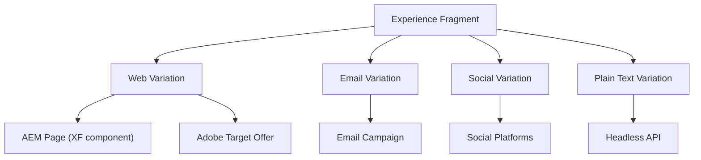
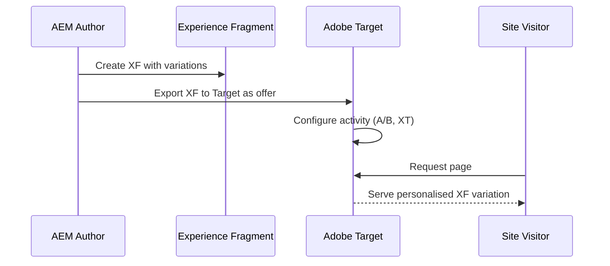

# Experience Fragments

**Experience Fragments (XFs)** are reusable, self-contained content experiences that can be
delivered across multiple channels -- web pages, email campaigns, social media, and Adobe
Target personalisation offers. Unlike Content Fragments (which store structured data), XFs
contain **fully rendered content** including layout, components, and styling.



---

## Experience Fragments vs Content Fragments

| Aspect              | Experience Fragment (XF)                       | Content Fragment (CF)                        |
|---------------------|------------------------------------------------|----------------------------------------------|
| **What it stores**  | Rendered content (components + layout)         | Structured data (fields)                     |
| **Authoring**       | Visual editor (like a page)                    | Form-based editor (model fields)             |
| **Rendering**       | Has its own HTML rendering                     | No rendering -- data only                    |
| **Variations**      | Web, email, social, plain text                 | Named content variations                     |
| **Personalisation** | Adobe Target integration                       | Not directly (via GraphQL)                   |
| **Headless**        | JSON export (limited)                          | GraphQL, Assets HTTP API                     |
| **Use case**        | Reusable page sections (headers, promos, CTAs) | Structured content (articles, products, FAQ) |
| **Storage**         | `/content/experience-fragments/`               | `/content/dam/`                              |

**Rule of thumb:** Use CFs for **data**, use XFs for **experiences**.

---

## XF Structure

### Anatomy of an Experience Fragment

```
/content/experience-fragments/mysite/en/
├── site-header/                         ← XF folder
│   ├── jcr:content
│   │   └── cq:xfVariantType = "web"
│   ├── master/                          ← "Master" variation
│   │   └── jcr:content
│   │       ├── root/
│   │       │   ├── responsivegrid/
│   │       │   │   ├── logo
│   │       │   │   ├── navigation
│   │       │   │   └── search
│   │       │   └── ...
│   │       └── sling:resourceType = "cq/experience-fragments/components/xfpage"
│   ├── email/                           ← Email variation
│   │   └── jcr:content
│   │       └── root/
│   │           └── ...
│   └── plain-text/                      ← Plain text variation
│       └── jcr:content
├── promo-banner/
│   ├── master/
│   ├── variant-a/                       ← A/B test variant
│   └── variant-b/
└── footer/
    └── master/
```

### Variations

Each XF can have multiple **variations** that represent the same content adapted for
different channels or test scenarios:

| Variation type   | Purpose                    | HTML output                     |
|------------------|----------------------------|---------------------------------|
| **Web**          | Regular web page inclusion | Full HTML with all components   |
| **Email** (HTML) | Email campaigns            | Inlined CSS, table-based layout |
| **Social**       | Social media platforms     | Simplified HTML                 |
| **Plain Text**   | Headless or fallback       | Text-only rendering             |
| **Custom**       | Any custom channel         | Developer-defined rendering     |

---

## Creating Experience Fragments

### Via the AEM UI

1. Navigate to **Experience Fragments** (`/aem/experience-fragments`)
2. Click **Create > Experience Fragment**
3. Select a template (e.g., "Web Variation", "Experience Fragment - Variation")
4. Enter a title and path
5. Author the content using the visual editor (same as a page)
6. Create variations as needed

### Programmatically

```java
import com.day.cq.wcm.api.PageManager;
import com.day.cq.wcm.api.Page;

@Reference
private PageManager pageManager;

public Page createExperienceFragment(ResourceResolver resolver,
                                      String parentPath,
                                      String name,
                                      String title) throws Exception {

    PageManager pm = resolver.adaptTo(PageManager.class);

    // Create the XF root
    Page xfRoot = pm.create(
        parentPath,
        name,
        "/conf/mysite/settings/wcm/templates/experience-fragment-web-variation",
        title
    );

    // Create the master variation
    Page master = pm.create(
        xfRoot.getPath(),
        "master",
        "/conf/mysite/settings/wcm/templates/experience-fragment-web-variation",
        "Master"
    );

    resolver.commit();
    return xfRoot;
}
```

---

## Using XFs in Pages

### The Experience Fragment component

AEM provides a built-in **Experience Fragment component** that renders an XF variation
inside a page:

```xml title="Component dialog usage"
<experienceFragment
    jcr:primaryType="nt:unstructured"
    sling:resourceType="cq/experience-fragments/components/experiencefragment"
    fragmentVariationPath="/content/experience-fragments/mysite/en/site-header/master"/>
```

Authors can also drag the XF component onto a page and select the fragment via the
component dialog.

### Localised XF references

For multi-language sites, the XF component automatically resolves the correct language
variation based on the page's language:

```
Page: /content/mysite/de/home
XF reference: /content/experience-fragments/mysite/en/site-header/master

→ AEM automatically resolves to:
  /content/experience-fragments/mysite/de/site-header/master
  (if it exists; otherwise falls back to the English version)
```

This behaviour is built into the Core Component XF wrapper.

---

## Reading XFs in Sling Models

### Accessing XF content

```java
import com.day.cq.wcm.api.Page;
import com.day.cq.wcm.api.PageManager;
import org.apache.sling.api.resource.Resource;
import org.apache.sling.models.annotations.Model;
import org.apache.sling.models.annotations.injectorspecific.Self;
import org.apache.sling.models.annotations.injectorspecific.ValueMapValue;

@Model(adaptables = Resource.class)
public class ExperienceFragmentModel {

    @Self
    private Resource resource;

    @ValueMapValue(optional = true)
    private String fragmentVariationPath;

    public String getFragmentHtml() {
        if (fragmentVariationPath == null) return "";

        Resource xfResource = resource.getResourceResolver()
            .getResource(fragmentVariationPath + "/jcr:content");

        if (xfResource == null) return "";

        // The XF's content is structured like a regular page
        // You can traverse its component tree
        PageManager pm = resource.getResourceResolver().adaptTo(PageManager.class);
        Page xfPage = pm.getContainingPage(xfResource);

        return xfPage != null ? xfPage.getTitle() : "";
    }
}
```

### Listing available XFs

```java
public List<XfInfo> listExperienceFragments(ResourceResolver resolver, String rootPath) {
    List<XfInfo> fragments = new ArrayList<>();
    PageManager pm = resolver.adaptTo(PageManager.class);
    Page root = pm.getPage(rootPath);

    if (root == null) return fragments;

    Iterator<Page> children = root.listChildren(new PageFilter(false, false), true);
    while (children.hasNext()) {
        Page child = children.next();
        String resourceType = child.getContentResource()
            .getResourceType();

        if ("cq/experience-fragments/components/xfpage".equals(resourceType)) {
            fragments.add(new XfInfo(
                child.getPath(),
                child.getTitle(),
                child.getDescription()
            ));
        }
    }

    return fragments;
}
```

---

## Building Blocks

**Building blocks** are reusable sections within an XF. They allow authors to create
an XF from pre-defined content blocks:

1. Author content in an XF variation
2. Select one or more components
3. Click **Convert to Building Block** in the toolbar
4. The building block is stored and can be reused in other XF variations

Building blocks are stored as component groups within the XF and can be dragged into
new XF variations, similar to copying a paragraph system.

---

## XF and Adobe Target

One of the most powerful XF features is the integration with **Adobe Target** for
personalisation:



### Exporting XFs to Target

1. Open the XF in the editor
2. Click **Export to Adobe Target** in the page properties or toolbar
3. Select the Target configuration and workspace
4. The XF HTML is pushed to Target as an **HTML offer**
5. Use the offer in Target activities (A/B tests, Experience Targeting)

### Offer format

When exported, the XF is rendered to a self-contained HTML snippet that Target can
inject into any page. The HTML includes inlined styles for reliable rendering.

---

## XF and Headless Delivery

### JSON export

XFs can be exported as JSON via the Sling Model Exporter (like any AEM page):

```
GET /content/experience-fragments/mysite/en/promo-banner/master.model.json
```

This returns the component tree as JSON, which a decoupled frontend can render.

### XF via Content Services

For headless consumers, you can create a **Content Services endpoint** that includes
XF content alongside other structured data.

---

## XF Templates

XFs use their own template types, separate from page templates:

| Template                                      | Purpose                            |
|-----------------------------------------------|------------------------------------|
| **Experience Fragment - Web Variation**       | Standard web content               |
| **Experience Fragment - Facebook Variation**  | Social media format                |
| **Experience Fragment - Pinterest Variation** | Pinterest-specific format          |
| **Experience Fragment - Custom**              | Custom rendering (define your own) |

Create custom XF templates under:

```
/conf/mysite/settings/wcm/templates/xf-custom-template/
```

---

## Multi-Site Experience Fragments

### Shared XFs across sites

In multi-site architectures, XFs can be shared across brands/sites:

| Strategy      | XF location                             | Use case                         |
|---------------|-----------------------------------------|----------------------------------|
| **Per-site**  | `/content/experience-fragments/mysite/` | Site-specific headers, footers   |
| **Shared**    | `/content/experience-fragments/shared/` | Global promos, legal disclaimers |
| **Live Copy** | MSM-managed XF copies                   | Same XF localised per market     |

### XF language copies

XFs support the same language copy mechanism as pages:

```
/content/experience-fragments/mysite/
├── en/
│   └── site-header/master/
├── de/
│   └── site-header/master/    ← Language copy of English
└── fr/
    └── site-header/master/
```

Create language copies via **Sites > Create > Language Copy** targeting the XF root.

---

## Groovy Console Scripts

### List all Experience Fragments

```groovy
def xfRoot = resourceResolver.getResource("/content/experience-fragments")
if (xfRoot) {
    xfRoot.listChildren().each { site ->
        site.listChildren().each { lang ->
            lang.listChildren().each { xf ->
                println "${xf.path} → ${xf.valueMap.get('jcr:content/jcr:title', '')}"
            }
        }
    }
}
```

### Find pages using a specific XF

```groovy
def targetXfPath = "/content/experience-fragments/mysite/en/site-header/master"

def query = createQuery([
    "path": "/content/mysite",
    "type": "nt:unstructured",
    "property": "fragmentVariationPath",
    "property.value": targetXfPath,
    "p.limit": "-1"
])

def result = query.result
println "Pages using XF: ${result.totalMatches}"
result.hits.each { hit ->
    println "  ${hit.path}"
}
```

---

## AEMaaCS Considerations

- XF creation and editing works the same as on AEM 6.5
- The **Export to Target** feature requires an Adobe Target cloud service configuration
- XFs are replicated to publish instances like regular pages
- For headless scenarios, consider using Content Fragments with GraphQL instead of XFs
  (GraphQL provides more flexible querying)
- XF JSON export works but does not have the same query capabilities as CF GraphQL

---

## Best Practices

### Use XFs for reusable page sections

Headers, footers, promotional banners, CTAs, legal disclaimers, and cookie consent notices
are ideal XF candidates. They are authored once and referenced across many pages.

### Keep XFs focused

An XF should represent one cohesive experience. Don't bundle unrelated content into a
single XF.

### Use variations, not duplicate XFs

If you need different renderings of the same content (web, email, social), create
variations within one XF rather than separate XFs.

### Leverage automatic language resolution

The Core Component XF wrapper resolves the correct language variation automatically.
Use consistent paths across languages to enable this.

### Version XFs before major changes

Since XFs are referenced across many pages, a change affects all pages immediately.
Create a new variation or version before making breaking changes.

---

## Common Pitfalls

| Pitfall                                        | Solution                                                                             |
|------------------------------------------------|--------------------------------------------------------------------------------------|
| XF shows empty on the page                     | Check that `fragmentVariationPath` points to the correct variation (not the XF root) |
| Language fallback not working                  | Ensure the XF language structure mirrors the site structure; check `jcr:language`    |
| XF changes not reflected on publish            | XFs need to be activated/replicated independently from the pages that reference them |
| Target export fails                            | Verify the Adobe Target cloud service configuration and IMS credentials              |
| XF renders differently in email                | Email clients have limited CSS support; use the email variation with inlined styles  |
| Performance degradation with many XFs per page | Each XF reference is a Sling include; consider caching strategies                    |

## See also

- [Content Fragments](./content-fragments.md) -- structured content (data vs experience)
- [Component Dialogs](../component-dialogs.mdx) -- XF picker dialog field
- [Multi-Site Manager](./multi-site-manager-msm.md) -- Live Copies of XFs
- [i18n and Translation](./i18n-translation.md) -- translating XFs
- [Headless GraphQL](./graphql.mdx) -- headless content delivery
- [Templates and Policies](../components/templates-policies.md) -- XF templates
- [AEM as a Cloud Service](../infrastructure/cloud-service.mdx) -- Content Distribution replaces replication
- [Replication and Activation](./replication-activation.mdx) -- publishing XFs
