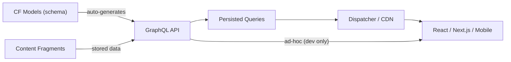
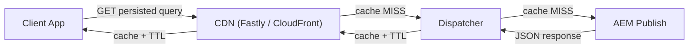

# AEM Headless GraphQL

AEM provides a built-in GraphQL API that exposes [Content Fragments](./content-fragments.md) as a
headless data source. Frontend applications (SPAs, mobile apps, static sites) query Content Fragment
data via GraphQL without needing any AEM rendering pipeline.



## How It Works

AEM **auto-generates a GraphQL schema** from your Content Fragment Models. Every model becomes a
GraphQL type, every field becomes a queryable property, and fragment references become nested types.
No manual schema writing is needed.

| CF Model Field Type | GraphQL Type | Notes |
|-------------------|-------------|-------|
| Single-line text | `String` | |
| Multi-line text | `String` (with `html`, `plaintext`, `markdown` sub-fields) | Access format via sub-selection |
| Number (Integer) | `Int` | |
| Number (Float) | `Float` | |
| Boolean | `Boolean` | |
| Date and Time | `Calendar` (ISO 8601 string) | |
| Enumeration | `String` (with defined values) | |
| Tags | `[String]` | Tag IDs |
| Content Reference | `String` (path) or typed reference | |
| Fragment Reference | Nested type | Becomes a queryable relationship |
| JSON Object | `json` scalar | Returned as raw JSON |

---

## Setting Up GraphQL Endpoints

### Creating an endpoint

1. Navigate to **Tools > General > GraphQL**
2. Click **Create** and configure:
- **Name**: e.g., `myproject`
- **Configuration**: Select the site configuration that holds your CF Models (e.g., `/conf/myproject`)
3. The endpoint becomes available at:
```text
/content/cq:graphql/myproject/endpoint.json
# or (JCR-safe encoding):
/content/_cq_graphql/myproject/endpoint.json
   ```

### Global vs site-specific endpoints

| Endpoint | Path | Use case |
|----------|------|----------|
| **Global** | `/content/cq:graphql/global/endpoint.json` | Access models from all configurations |
| **Site-specific** | `/content/cq:graphql/myproject/endpoint.json` | Only models from `/conf/myproject` |

:::tip
Use site-specific endpoints in production to limit the schema scope and improve security. The global
endpoint exposes all models across all sites.
:::

---

## Querying with GraphQL

### GraphiQL IDE

AEM ships with an embedded GraphiQL IDE for testing queries:

```text
http://localhost:4502/content/graphiql.html
```

On AEMaaCS, GraphiQL is available at:

```text
http://localhost:4502/aem/graphiql.html
```

GraphiQL provides:
- Schema explorer with auto-complete
- Query history
- Variables panel
- Response viewer with formatting

### Basic queries

**List query** -- fetch multiple fragments of a type:

```graphql
{
    articleList {
        items {
            _path
            title
            body {
                html
            }
            publishDate
            featured
            category
        }
    }
}
```

**Single fragment by path**:

```graphql
{
    articleByPath(_path: "/content/dam/myproject/articles/getting-started") {
        item {
            title
            body {
                html
                plaintext
            }
            publishDate
            author {
                name
                bio {
                    plaintext
                }
            }
        }
    }
}
```

### Multi-line text sub-fields

Multi-line text fields expose content in multiple formats:

```graphql
{
    articleList {
        items {
            body {
                html         # HTML-formatted content
                plaintext    # Plain text (tags stripped)
                markdown     # Markdown (if authored as Markdown)
                json         # Structured JSON representation
            }
        }
    }
}
```

### Fragment references (nested queries)

Fragment references are resolved automatically as nested types:

```graphql
{
    articleList {
        items {
            title
            # Single fragment reference
            author {
                name
                bio { html }
                profileImage {
                    ... on ImageRef {
                        _path
                        width
                        height
                    }
                }
            }
            # Multi-valued fragment reference
            relatedArticles {
                title
                _path
            }
        }
    }
}
```

### Content references and image references

Content references to DAM assets can be queried with metadata:

```graphql
{
    articleList {
        items {
            title
            featuredImage {
                ... on ImageRef {
                    _path
                    _authorUrl
                    _publishUrl
                    mimeType
                    width
                    height
                }
            }
        }
    }
}
```

---

## Filtering, Sorting, and Pagination

### Filtering

Use the `filter` argument on list queries. Each field supports type-specific operators:

```graphql
{
    articleList(
        filter: {
            featured: { _expressions: [{ value: true }] }
            category: { _expressions: [{ value: "technology" }] }
        }
    ) {
        items {
            title
            category
        }
    }
}
```

### Filter operators

| Operator | Applies to | Example |
|----------|-----------|---------|
| `value` | All types | Exact match |
| `_operator: EQUALS` | All | Default; exact match |
| `_operator: EQUALS_NOT` | All | Not equal |
| `_operator: CONTAINS` | String | Substring match (case-sensitive) |
| `_operator: CONTAINS_NOT` | String | Does not contain substring |
| `_operator: STARTS_WITH` | String | Prefix match |
| `_operator: LOWER` | Number, Date | Less than |
| `_operator: LOWER_EQUAL` | Number, Date | Less than or equal |
| `_operator: GREATER` | Number, Date | Greater than |
| `_operator: GREATER_EQUAL` | Number, Date | Greater than or equal |
| `_operator: AT` | Date | Exact date match |
| `_operator: BEFORE` | Date | Before date |
| `_operator: AFTER` | Date | After date |

**String filtering:**

```graphql
{
    articleList(
        filter: {
            title: {
                _expressions: [{
                    value: "AEM"
                    _operator: CONTAINS
                }]
            }
        }
    ) {
        items { title }
    }
}
```

**Date range filtering:**

```graphql
{
    articleList(
        filter: {
            publishDate: {
                _expressions: [
                    { value: "2025-01-01T00:00:00Z", _operator: AFTER },
                    { value: "2025-12-31T23:59:59Z", _operator: BEFORE }
                ]
            }
        }
    ) {
        items { title publishDate }
    }
}
```

**Combining filters** (AND logic -- all conditions must match):

```graphql
{
    articleList(
        filter: {
            category: { _expressions: [{ value: "technology" }] }
            featured: { _expressions: [{ value: true }] }
            title: { _expressions: [{ value: "AEM", _operator: CONTAINS }] }
        }
    ) {
        items { title category featured }
    }
}
```

### Sorting

```graphql
{
    articleList(
        sort: "publishDate DESC"
    ) {
        items {
            title
            publishDate
        }
    }
}
```

Sort by multiple fields:

```graphql
{
    articleList(
        sort: "category ASC, publishDate DESC"
    ) {
        items { title category publishDate }
    }
}
```

### Pagination (offset-based)

```graphql
{
    articleList(
        offset: 0
        limit: 10
    ) {
        items {
            title
        }
    }
}
```

**Cursor-based pagination** (for large datasets):

```graphql
{
    articlePaginated(
        first: 10
        after: "eyJjdXJzb3IiOiIxMCJ9"
    ) {
        edges {
            node {
                title
                publishDate
            }
            cursor
        }
        pageInfo {
            hasNextPage
            hasPreviousPage
            startCursor
            endCursor
        }
    }
}
```

---

## Variations

Query a specific Content Fragment variation instead of the `master`:

```graphql
{
    articleList(variation: "summary") {
        items {
            title
            body {
                html
            }
        }
    }
}
```

If a field has no value in the requested variation, it falls back to the `master` variation.

---

## Persisted Queries

Persisted queries are **pre-stored, named queries** on the server. They are the **recommended approach
for production** because they are:
- Cacheable by Dispatcher and CDN (served as GET requests with a stable URL)
- Protected from arbitrary query injection
- Faster (no query parsing on each request)

### Creating a persisted query

```bash
# PUT a persisted query
curl -u admin:admin \
  -X PUT \
  -H "Content-Type: application/json" \
  -d '{ "query": "{ articleList(sort: \"publishDate DESC\", limit: 10) { items { _path title body { html } publishDate category } } }" }' \
  "http://localhost:4502/graphql/persist.json/myproject/latest-articles"
```

### Executing a persisted query

```bash
# GET request (cacheable)
curl "http://localhost:4502/graphql/execute.json/myproject/latest-articles"

# With variables
curl "http://localhost:4502/graphql/execute.json/myproject/articles-by-category;category=technology;limit=5"
```

### Persisted queries with variables

```bash
# Create a parameterised persisted query
curl -u admin:admin \
  -X PUT \
  -H "Content-Type: application/json" \
  -d '{
    "query": "query ArticlesByCategory($category: String!, $limit: Int = 10) { articleList(filter: { category: { _expressions: [{ value: $category }] } }, limit: $limit, sort: \"publishDate DESC\") { items { _path title publishDate category } } }",
    "variables": {}
  }' \
  "http://localhost:4502/graphql/persist.json/myproject/articles-by-category"

# Execute with variables in the URL path
curl "http://localhost:4502/graphql/execute.json/myproject/articles-by-category;category=technology;limit=5"
```

### Persisted query URLs

| URL Pattern | Description |
|------------|-------------|
| `/graphql/persist.json/{config}/{query-name}` | Create/update a persisted query (PUT) |
| `/graphql/execute.json/{config}/{query-name}` | Execute a persisted query (GET) |
| `/graphql/execute.json/{config}/{query-name};var1=val1;var2=val2` | Execute with variables |
| `/graphql/list.json/{config}` | List all persisted queries for a config |

---

## Fetching from Frontend Applications

### JavaScript / TypeScript

```typescript title="lib/graphql.ts"
const AEM_HOST = process.env.NEXT_PUBLIC_AEM_HOST || 'https://publish-pXXXXX-eXXXXXX.adobeaemcloud.com';

/**
 * Execute a persisted query against AEM GraphQL.
 */
export async function fetchPersistedQuery<T>(
    queryPath: string,
    variables?: Record<string, string | number>
): Promise<T> {
    // Build URL with variables
    let url = `${AEM_HOST}/graphql/execute.json/${queryPath}`;
    if (variables) {
        const params = Object.entries(variables)
            .map(([key, value]) => `${key}=${encodeURIComponent(value)}`)
            .join(';');
        url += `;${params}`;
    }

    const response = await fetch(url, {
        method: 'GET',
        headers: {
            'Content-Type': 'application/json',
            // Add auth token for Author queries (not needed for Publish)
            // 'Authorization': `Bearer ${token}`,
        },
    });

    if (!response.ok) {
        throw new Error(`GraphQL request failed: ${response.status} ${response.statusText}`);
    }

    const json = await response.json();

    if (json.errors) {
        console.error('GraphQL errors:', json.errors);
        throw new Error(json.errors.map((e: { message: string }) => e.message).join(', '));
    }

    return json.data;
}
```

```typescript title="Usage in React / Next.js"
interface Article {
    _path: string;
    title: string;
    body: { html: string };
    publishDate: string;
}

interface ArticleListResponse {
    articleList: { items: Article[] };
}

// Fetch latest articles
const data = await fetchPersistedQuery<ArticleListResponse>(
    'myproject/latest-articles'
);
const articles = data.articleList.items;

// Fetch by category with variables
const techArticles = await fetchPersistedQuery<ArticleListResponse>(
    'myproject/articles-by-category',
    { category: 'technology', limit: 5 }
);
```

### React hook example

```typescript title="hooks/useArticles.ts"
import { useState, useEffect } from 'react';
import { fetchPersistedQuery } from '../lib/graphql';

export function useArticles(category?: string) {
    const [articles, setArticles] = useState<Article[]>([]);
    const [loading, setLoading] = useState(true);
    const [error, setError] = useState<Error | null>(null);

    useEffect(() => {
        const queryPath = category
            ? 'myproject/articles-by-category'
            : 'myproject/latest-articles';

        const variables = category ? { category } : undefined;

        fetchPersistedQuery<ArticleListResponse>(queryPath, variables)
            .then(data => setArticles(data.articleList.items))
            .catch(setError)
            .finally(() => setLoading(false));
    }, [category]);

    return { articles, loading, error };
}
```

---

## Infrastructure Configuration

### Dispatcher filters

Allow GraphQL requests through the Dispatcher:

```text title="dispatcher/src/conf.dispatcher.d/filters/filters.any"
# Allow GraphQL persisted queries (GET)
/0100 {
    /type "allow"
    /method "GET"
    /url "/graphql/execute.json/*"
}

# Allow GraphQL endpoint (GET + POST + OPTIONS preflight)
/0101 {
    /type "allow"
    /method '(GET|POST|OPTIONS)'
    /url "/content/_cq_graphql/*/endpoint.json"
}
```

### Dispatcher client headers

Forward CORS-related headers from the client through Dispatcher:

```text title="dispatcher/src/conf.dispatcher.d/clientheaders/clientheaders.any"
$include "./default_clientheaders.any"
"Origin"
"Access-Control-Request-Method"
"Access-Control-Request-Headers"
"Authorization"
```

### Dispatcher caching for persisted queries

Persisted queries are served via GET and can be cached by Dispatcher. Add cache rules:

```text title="dispatcher/src/conf.dispatcher.d/cache/rules.any"
# Cache persisted query responses
/0100 {
    /glob "*.json"
    /type "allow"
}
```

Set a TTL for GraphQL responses in the vhost:

```apache title="dispatcher/src/conf.d/available_vhosts/myproject.vhost"
<LocationMatch "^/graphql/execute.json/.*$">
    Header set Cache-Control "public, max-age=300" # 5 minutes
    Header set Surrogate-Control "max-age=600"     # CDN: 10 minutes
</LocationMatch>
```

### CORS configuration

Configure CORS to allow cross-origin GraphQL requests from your frontend domains:

```json title="ui.config/.../com.adobe.granite.cors.impl.CORSPolicyImpl~graphql.cfg.json"
{
    "supportscredentials": false,
    "supportedmethods": [
        "GET",
        "HEAD",
        "POST",
        "OPTIONS"
    ],
    "alloworigin": [
        "https://www.myproject.com",
        "https://app.myproject.com"
    ],
    "maxage:Integer": 1800,
    "alloworiginregexp": [
        "https://deploy-preview-.*\\.myproject\\.com",
        "http://localhost:.*"
    ],
    "allowedpaths": [
        "/content/cq:graphql/myproject/endpoint.json",
        "/content/_cq_graphql/myproject/endpoint.json",
        "/graphql/execute.json/.*"
    ],
    "supportedheaders": [
        "Origin",
        "Accept",
        "X-Requested-With",
        "Content-Type",
        "Access-Control-Request-Method",
        "Access-Control-Request-Headers",
        "Authorization"
    ]
}
```

:::warning
Prefer explicit domain allowlists in `alloworigin` over wildcards. On AEMaaCS, use `alloworiginregexp`
for preview/staging URLs but always enumerate production domains explicitly.
:::

### Referrer filter

Allow POST requests to GraphQL endpoints from your frontend origins:

```json title="ui.config/.../org.apache.sling.security.impl.ReferrerFilter~graphql.cfg.json"
{
    "allow.empty": false,
    "allow.hosts": [
        "www.myproject.com",
        "app.myproject.com"
    ],
    "allow.hosts.regexp": [
        "https://deploy-preview-.*\\.myproject\\.com",
        "http://localhost:.*"
    ],
    "filter.methods": [
        "POST",
        "PUT",
        "DELETE"
    ],
    "exclude.agents.regexp": []
}
```

---

## Caching Strategy



| Layer | Cache mechanism | Invalidation |
|-------|----------------|-------------|
| **Browser** | `Cache-Control` header | Time-based (TTL) |
| **CDN** | `Surrogate-Control` or `Cache-Control` | Tag-based purge, TTL, or deploy hook |
| **Dispatcher** | File-based cache (`.stat` invalidation) | Flush agent on content publish |
| **AEM Publish** | In-memory query cache | Automatic on content change |

### Cache invalidation on publish

When a Content Fragment is published, AEM sends a flush request to Dispatcher. Configure a
Dispatcher flush agent to invalidate the cached GraphQL responses:

```text title="dispatcher/src/conf.dispatcher.d/cache/invalidate.any"
/0001 {
    /glob "*.json"
    /type "allow"
}
```

For CDN-level invalidation on AEMaaCS, use **Sling Content Distribution** events to trigger CDN
purge APIs.

---

## Authentication for Author Queries

Querying the Author instance requires authentication. Use **service tokens** (AEMaaCS) or basic auth
(AEM 6.5 local development):

### AEMaaCS: Service credentials

```typescript title="Server-side only (e.g., Next.js API route)"
// Use Adobe IMS service credentials (never expose in client-side code)
async function fetchFromAuthor(queryPath: string) {
    const token = await getServiceAccessToken(); // Adobe IMS token exchange

    const response = await fetch(
        `https://author-pXXXXX-eXXXXXX.adobeaemcloud.com/graphql/execute.json/${queryPath}`,
        {
            headers: {
                'Authorization': `Bearer ${token}`,
                'Content-Type': 'application/json',
            },
        }
    );

    return response.json();
}
```

### AEM 6.5 local development

```bash
# Basic auth for local dev
curl -u admin:admin \
  "http://localhost:4502/graphql/execute.json/myproject/latest-articles"
```

:::warning
Never embed Author credentials in client-side JavaScript. Author queries should only run from
server-side code (API routes, serverless functions, build-time data fetching).
:::

---

## Error Handling

GraphQL responses include an `errors` array when queries fail:

```json title="Partial error response"
{
    "data": {
        "articleList": {
            "items": [
                { "title": "Valid Article", "body": { "html": "<p>...</p>" } }
            ]
        }
    },
    "errors": [
        {
            "message": "Cannot resolve field 'nonExistentField'",
            "locations": [{ "line": 5, "column": 13 }],
            "path": ["articleList", "items", 1, "nonExistentField"]
        }
    ]
}
```

Common error scenarios:

| Error | Cause | Fix |
|-------|-------|-----|
| `Cannot resolve field` | Field name doesn't match the model | Check the schema in GraphiQL |
| `Validation error` | Required variable missing or wrong type | Pass all required variables with correct types |
| `403 Forbidden` | CORS / referrer filter blocking | Configure CORS and referrer filter for the origin |
| `404 Not Found` | Endpoint doesn't exist or wrong path | Verify endpoint name and configuration path |
| `401 Unauthorized` | Missing or invalid auth for Author | Use service credentials or basic auth |
| Empty `items` array | No fragments match filters, or fragments not published | Check fragment status and filter values |

---

## Performance Optimisation

### Use persisted queries (always)

Ad-hoc POST queries bypass Dispatcher and CDN caches. **Always use persisted queries on Publish.**

### Limit query depth

Deeply nested fragment references can cause expensive JCR traversals:

```graphql
# ❌ Bad: deeply nested (4 levels)
{
    articleList {
        items {
            author {
                articles {
                    relatedArticles {
                        author { name }
                    }
                }
            }
        }
    }
}

# ✅ Good: flat, fetch only what you need
{
    articleList(limit: 10) {
        items {
            title
            body { html }
            author { name }
        }
    }
}
```

### Request only needed fields

GraphQL lets you select exactly what you need. Avoid fetching unused fields -- especially large
`html` bodies when you only need titles:

```graphql
# ❌ Over-fetching
{ articleList { items { title body { html plaintext markdown json } author { name bio { html } } relatedArticles { title body { html } } } } }

# ✅ Fetch only what the UI needs
{ articleList { items { title publishDate category } } }
```

### Use pagination

Never fetch unbounded lists. Always set `limit` and use `offset` or cursor-based pagination:

```graphql
{ articleList(limit: 20, offset: 0) { items { title } } }
```

### Add Oak indexes

For frequently filtered fields, ensure Oak indexes exist for the underlying JCR properties. See
[Performance](../infrastructure/performance.mdx) for index configuration.

---

## AEMaaCS vs AEM 6.5

| Feature | AEM 6.5 (SP18+) | AEMaaCS |
|---------|-----------------|---------|
| GraphQL API | Available (requires feature pack on older SPs) | Built-in, always available |
| GraphiQL IDE | `/content/graphiql.html` | `/aem/graphiql.html` |
| Persisted queries | Supported | Supported (recommended) |
| Cursor-based pagination | Not available | Available |
| JSON Object field type | Not available | Available |
| Optimised Content Fragment queries | Manual Oak index setup | Automatic index optimisation |
| CDN caching | Manual Dispatcher config | Fastly integration with automatic purge |

---

## Common Pitfalls

| Pitfall | Solution |
|---------|----------|
| Using POST queries in production | Switch to persisted queries (GET); they are cacheable |
| CORS errors in the browser | Configure the CORS OSGi factory for your domain; include `OPTIONS` method |
| GraphQL returns `null` for existing fields | The Content Fragment might not be published; check Publish instance |
| Nested references return empty | Referenced fragments must also be published to Publish |
| Slow queries | Limit depth, add pagination, create Oak indexes |
| Schema not showing new model fields | Publish the updated CF Model; the schema regenerates on Publish |
| Persisted queries not found on Publish | Persisted queries must be replicated to Publish |
| Cache not invalidating | Ensure Dispatcher flush agent is configured for `.json` files |

## External Resources

- [AEM GraphQL API Documentation](https://experienceleague.adobe.com/docs/experience-manager-cloud-service/content/headless/graphql-api/content-fragments.html)
- [CORS Configuration](https://experienceleague.adobe.com/docs/experience-manager-cloud-service/content/headless/deployment/cross-origin-resource-sharing.html)
- [Referrer Filter Configuration](https://experienceleague.adobe.com/docs/experience-manager-cloud-service/content/headless/deployment/referrer-filter.html)
- [GraphiQL IDE Tutorial](https://experienceleague.adobe.com/docs/experience-manager-learn/getting-started-with-aem-headless/graphql/multi-step/explore-graphql-api.html)
- [AEM Headless Developer Portal](https://experienceleague.adobe.com/docs/experience-manager-cloud-service/content/headless/home.html)
- [Persisted Queries Documentation](https://experienceleague.adobe.com/docs/experience-manager-cloud-service/content/headless/graphql-api/persisted-queries.html)

## See also

- [Content Fragments](./content-fragments.md) -- CF models, Java API, JCR structure
- [Modify and Query the JCR](./jcr.md) -- QueryBuilder and JCR-SQL2
- [JCR Node Operations](./node-operations.mdx)
- [Architecture](../architecture.mdx) -- Sling request pipeline
- [Dispatcher Configuration](../infrastructure/dispatcher-configuration.mdx)
- [Security](../infrastructure/security.mdx) -- CSRF, referrer filter
- [Edge Delivery Services](../infrastructure/helix.mdx)
- [AEM as a Cloud Service](../infrastructure/cloud-service.mdx)
- [Performance](../infrastructure/performance.mdx) -- Oak indexes, caching
- [Sling Models](../backend/sling-models.mdx) -- server-side CF rendering
