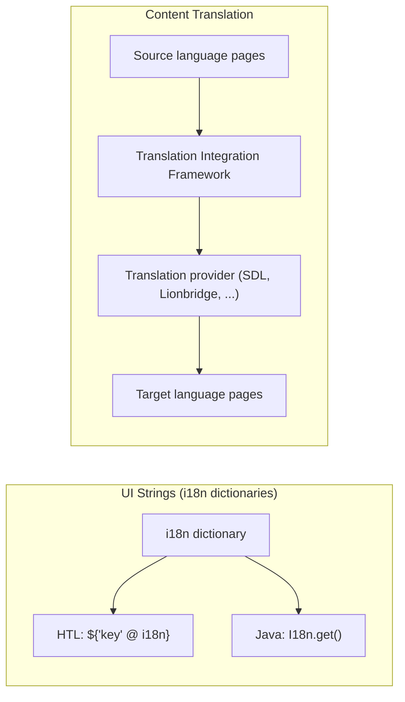
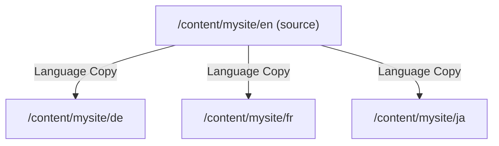
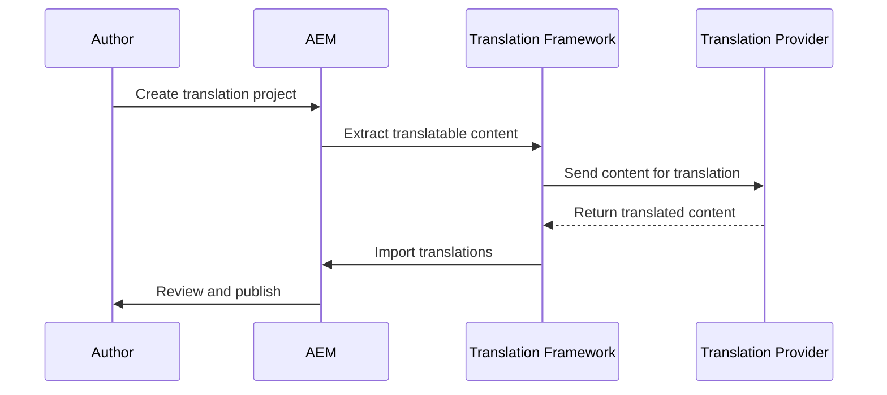

# Internationalisation (i18n) and Translation

AEM distinguishes between two types of multilingual content:

1. **UI string translation (i18n)** -- translating labels, buttons, and fixed text in
   components using dictionaries
2. **Content translation** -- translating authored page content, Content Fragments, and
   Experience Fragments via the Translation Integration Framework

Both are essential for multi-language sites. This page covers dictionaries, the HTL and
Java i18n APIs, the translation workflow, and multi-language site architecture.



---

## Part 1: UI String Translation (i18n Dictionaries)

### What are i18n dictionaries?

Dictionaries store key-value pairs mapping a string key to its translated value. AEM
uses the Sling `ResourceBundle` mechanism to resolve translations based on the page
locale.

### Dictionary structure

Dictionaries are stored in the JCR as `sling:MessageEntry` nodes:

```
/apps/myproject/i18n/
├── en.json           ← English (source language)
├── de.json           ← German
├── fr.json           ← French
└── es.json           ← Spanish
```

Or in the older node-based format:

```
/apps/myproject/i18n/
├── en/
│   ├── jcr:language = "en"
│   ├── jcr:mixinTypes = ["mix:language"]
│   └── (sling:MessageEntry nodes)
├── de/
│   ├── jcr:language = "de"
│   └── ...
```

### JSON dictionary format (recommended)

The simplest approach is JSON files:

```json title="/apps/myproject/i18n/en.json"
{
    "jcr:language": "en",
    "jcr:mixinTypes": ["mix:language"],
    "jcr:primaryType": "nt:unstructured",
    "sling:basename": "myproject",

    "readMore": { "jcr:primaryType": "sling:MessageEntry", "sling:key": "readMore", "sling:message": "Read more" },
    "backToTop": { "jcr:primaryType": "sling:MessageEntry", "sling:key": "backToTop", "sling:message": "Back to top" },
    "searchPlaceholder": { "jcr:primaryType": "sling:MessageEntry", "sling:key": "searchPlaceholder", "sling:message": "Search..." },
    "noResults": { "jcr:primaryType": "sling:MessageEntry", "sling:key": "noResults", "sling:message": "No results found" },
    "loadMore": { "jcr:primaryType": "sling:MessageEntry", "sling:key": "loadMore", "sling:message": "Load more" }
}
```

```json title="/apps/myproject/i18n/de.json"
{
    "jcr:language": "de",
    "jcr:mixinTypes": ["mix:language"],
    "jcr:primaryType": "nt:unstructured",
    "sling:basename": "myproject",

    "readMore": { "jcr:primaryType": "sling:MessageEntry", "sling:key": "readMore", "sling:message": "Weiterlesen" },
    "backToTop": { "jcr:primaryType": "sling:MessageEntry", "sling:key": "backToTop", "sling:message": "Nach oben" },
    "searchPlaceholder": { "jcr:primaryType": "sling:MessageEntry", "sling:key": "searchPlaceholder", "sling:message": "Suchen..." },
    "noResults": { "jcr:primaryType": "sling:MessageEntry", "sling:key": "noResults", "sling:message": "Keine Ergebnisse gefunden" },
    "loadMore": { "jcr:primaryType": "sling:MessageEntry", "sling:key": "loadMore", "sling:message": "Mehr laden" }
}
```

### The `sling:basename` property

If your project has multiple dictionaries (e.g., shared and site-specific), use
`sling:basename` to namespace them and avoid collisions:

```
/apps/myproject/i18n/        sling:basename = "myproject"
/apps/shared/i18n/           sling:basename = "shared"
```

Reference the basename in HTL:

```html
${'readMore' @ i18n, basename='myproject'}
```

---

### Using i18n in HTL

#### Basic translation

```html
<button>${'readMore' @ i18n}</button>
<!-- Output (English): Read more -->
<!-- Output (German):  Weiterlesen -->
```

The locale is automatically resolved from the page's `jcr:language` property (inherited
from the language root, e.g., `/content/mysite/de`).

#### With basename

```html
<span>${'searchPlaceholder' @ i18n, basename='myproject'}</span>
```

#### With explicit locale

```html
<!-- Force German regardless of page language -->
<span>${'readMore' @ i18n, locale='de'}</span>
```

#### Translation hints for translators

```html
<!-- Hint helps translators understand the context -->
<span>${'open' @ i18n, hint='As in: open a door, not the adjective'}</span>
```

#### Combining with format options

```html
<!-- Parameterised translation -->
<!-- Dictionary: "resultsFound": "Found {0} results for '{1}'" -->
<p>${'resultsFound' @ i18n, format=[resultCount, searchTerm]}</p>
```

---

### Using i18n in Java

```java
import com.day.cq.i18n.I18n;
import org.apache.sling.api.SlingHttpServletRequest;

// In a Sling Model
@Model(adaptables = SlingHttpServletRequest.class)
public class SearchResultsModel {

    @Self
    private SlingHttpServletRequest request;

    public String getNoResultsMessage() {
        I18n i18n = new I18n(request);
        return i18n.get("noResults");
    }

    public String getResultsMessage(int count, String query) {
        I18n i18n = new I18n(request);
        return i18n.get("resultsFound", null, count, query);
        // Returns: "Found 42 results for 'shoes'"
    }

    // With a specific basename
    public String getLabel(String key) {
        I18n i18n = new I18n(request);
        return i18n.get(key, "myproject");
    }
}
```

#### Using ResourceBundleProvider directly

```java
import org.apache.sling.i18n.ResourceBundleProvider;
import java.util.Locale;
import java.util.ResourceBundle;

@Reference(target = "(component.name=org.apache.sling.i18n.impl.JcrResourceBundleProvider)")
private ResourceBundleProvider resourceBundleProvider;

public String translate(String key, Locale locale) {
    ResourceBundle bundle = resourceBundleProvider.getResourceBundle(locale);
    return bundle.containsKey(key) ? bundle.getString(key) : key;
}
```

---

## Part 2: Content Translation

### Multi-language site structure

AEM follows a convention-based site structure for multi-language sites:

```
/content/mysite/
├── en/                  ← English (source language)
│   ├── jcr:language = "en"
│   ├── home/
│   ├── products/
│   └── about/
├── de/                  ← German
│   ├── jcr:language = "de"
│   ├── home/
│   └── products/
├── fr/                  ← French
│   ├── jcr:language = "fr"
│   └── ...
└── ja/                  ← Japanese
    └── ...
```

The `jcr:language` property on the language root node tells AEM (and i18n) which
language the subtree uses.

### Language copies

**Language copies** are the translated versions of a source language tree. They are
created via **Sites > Create > Language Copy** or programmatically.



Language copies can be:
- **Created manually** and translated by human editors
- **Created via translation projects** using the Translation Integration Framework

### Translation Integration Framework (TIF)

The TIF connects AEM to external translation providers (SDL, Lionbridge, Memsource,
RWS, etc.) or human translators:



#### Setting up a translation connector

1. Install the translation connector bundle (e.g., SDL, Lionbridge)
2. Configure the **Translation Integration** cloud service:
   - **Tools > Cloud Services > Translation Cloud Services**
   - Add a configuration with your provider credentials
3. Link the cloud configuration to your site:
   - On the language root (e.g., `/content/mysite/en`), set the cloud config reference

#### Creating a translation project

1. Navigate to **Projects > Translation Projects**
2. Create a new project:
   - Select the source language root
   - Select the target languages
   - Choose scope (full site or selected pages)
3. AEM creates a project with translation jobs
4. Submit jobs to the provider
5. Review returned translations
6. Approve and publish

### Translation rules

The `translation_rules.xml` file controls which properties and components are translated:

```xml title="/etc/translation/rules/translation_rules.xml"
<?xml version="1.0" encoding="UTF-8"?>
<nodelist>
    <!-- Translate text properties -->
    <node path="/content">
        <property name="jcr:title" translate="true"/>
        <property name="jcr:description" translate="true"/>
        <property name="text" translate="true"/>
        <property name="title" translate="true"/>
        <property name="alt" translate="true"/>
        <property name="placeholder" translate="true"/>

        <!-- Do NOT translate these -->
        <property name="sling:resourceType" translate="false"/>
        <property name="cq:tags" translate="false"/>
    </node>

    <!-- Translate Content Fragment fields -->
    <node path="/content/dam">
        <property name="jcr:title" translate="true"/>
        <property name="jcr:description" translate="true"/>
    </node>

    <!-- Translate Experience Fragment text -->
    <node path="/content/experience-fragments">
        <property name="jcr:title" translate="true"/>
        <property name="text" translate="true"/>
    </node>
</nodelist>
```

---

## Detecting the Current Locale

### From the page language root

AEM resolves the locale from the `jcr:language` property on the nearest ancestor with
that property set:

```java
import com.day.cq.wcm.api.Page;

@Model(adaptables = SlingHttpServletRequest.class)
public class LocaleModel {

    @ScriptVariable
    private Page currentPage;

    public Locale getPageLocale() {
        return currentPage.getLanguage(false);
    }

    public String getLanguageCode() {
        return currentPage.getLanguage(false).getLanguage();
        // "en", "de", "fr", etc.
    }
}
```

### From the request

```java
Locale requestLocale = request.getLocale();
// Based on Accept-Language header (for publish) or AEM settings (for author)
```

---

## Content Fragment and Experience Fragment Translation

### Content Fragments

Content Fragments can be translated via the TIF:

1. Create a language copy of the CF folder structure under `/content/dam`
2. The TIF extracts translatable fields (defined in the CF Model)
3. Translated CFs are stored under the target language folder

### Experience Fragments

XFs follow the same pattern as pages:

```
/content/experience-fragments/mysite/
├── en/
│   └── header/
│       └── master/
├── de/
│   └── header/
│       └── master/
```

XFs are translated as complete experiences, including all building blocks.

---

## Date, Number, and Currency Formatting

For locale-specific formatting of dates, numbers, and currencies, use Java's `DateFormat`
and `NumberFormat` classes, passing the page locale:

```java
import java.text.DateFormat;
import java.text.NumberFormat;
import java.util.Currency;
import java.util.Locale;

@Model(adaptables = SlingHttpServletRequest.class)
public class FormattingModel {

    @ScriptVariable
    private Page currentPage;

    public String formatDate(Date date) {
        Locale locale = currentPage.getLanguage(false);
        DateFormat formatter = DateFormat.getDateInstance(DateFormat.LONG, locale);
        return formatter.format(date);
        // EN: "January 15, 2025"
        // DE: "15. Januar 2025"
        // JA: "2025年1月15日"
    }

    public String formatPrice(double amount) {
        Locale locale = currentPage.getLanguage(false);
        NumberFormat formatter = NumberFormat.getCurrencyInstance(locale);
        return formatter.format(amount);
        // EN-US: "$99.99"
        // DE:    "99,99 €"
        // JA:    "￥9,999"
    }
}
```

---

## Language Switcher Pattern

A common component that links to the equivalent page in other languages:

```java
@Model(adaptables = SlingHttpServletRequest.class)
public class LanguageSwitcherModel {

    @ScriptVariable
    private Page currentPage;

    @Self
    private SlingHttpServletRequest request;

    public List<LanguageLink> getLanguages() {
        List<LanguageLink> links = new ArrayList<>();
        Page languageRoot = currentPage.getAbsoluteParent(2);
        // e.g., /content/mysite/en → level 2

        if (languageRoot == null) return links;

        Page siteRoot = languageRoot.getParent();
        // /content/mysite

        String relativePath = currentPage.getPath()
            .substring(languageRoot.getPath().length());
        // e.g., /products/shoes

        for (Page sibling : siteRoot.listChildren()) {
            String langCode = sibling.getName();
            String targetPath = sibling.getPath() + relativePath;

            Resource targetResource = request.getResourceResolver().getResource(targetPath);
            boolean exists = targetResource != null;

            links.add(new LanguageLink(
                langCode,
                sibling.getTitle(),
                exists ? targetPath + ".html" : sibling.getPath() + ".html",
                langCode.equals(languageRoot.getName()),
                exists
            ));
        }

        return links;
    }

    public static class LanguageLink {
        private final String code;
        private final String label;
        private final String url;
        private final boolean active;
        private final boolean targetExists;

        // Constructor, getters...
        public LanguageLink(String code, String label, String url,
                            boolean active, boolean targetExists) {
            this.code = code;
            this.label = label;
            this.url = url;
            this.active = active;
            this.targetExists = targetExists;
        }

        public String getCode() { return code; }
        public String getLabel() { return label; }
        public String getUrl() { return url; }
        public boolean isActive() { return active; }
        public boolean isTargetExists() { return targetExists; }
    }
}
```

```html title="HTL"
<sly data-sly-use.langSwitch="com.myproject.core.models.LanguageSwitcherModel"/>
<nav class="language-switcher" data-sly-test="${langSwitch.languages.size > 1}">
    <a data-sly-repeat="${langSwitch.languages}"
       href="${item.url}"
       class="lang-link ${item.active ? 'active' : ''}"
       lang="${item.code}"
       hreflang="${item.code}"
       data-sly-attribute.aria-current="${item.active ? 'page' : false}">
        ${item.code @ context='text'}
    </a>
</nav>
```

---

## AEMaaCS Considerations

- Translation cloud service configurations are stored under `/conf/` and deployed via `ui.content`
- The Translation Framework works the same as on AEM 6.5
- i18n dictionaries in `/apps/` are deployed via `ui.apps` and immutable
- For runtime-managed dictionaries (editable by admins), store them under `/content/`
  and reference them via `sling:basename`

---

## Best Practices

### Keep dictionary keys descriptive

Use keys that describe the purpose, not the English text:

```
// Good
"searchNoResults"
"buttonSubmitForm"
"navBackToHome"

// Bad
"No results found"
"Submit"
"Back"
```

### Use basenames to avoid collisions

Multiple projects on the same AEM instance may define the same keys. Use `sling:basename`
to namespace dictionaries.

### Provide context for translators

Use the `hint` option in HTL to give translators context:

```html
${'open' @ i18n, hint='Verb: to open a menu, not the adjective'}
```

### Set `jcr:language` on language roots

Without `jcr:language`, AEM cannot resolve the page locale, and i18n falls back to the
server default.

### Test with RTL languages

If you support Arabic, Hebrew, or other RTL languages, test layout with actual translated
content, not just placeholder text.

---

## Common Pitfalls

| Pitfall | Solution |
|---------|----------|
| Translations not showing | Check that `jcr:language` is set on the language root; verify the dictionary is deployed |
| Wrong language displayed | Ensure the `jcr:language` property matches the expected locale (e.g., `de` not `de_DE`) |
| Dictionary key returned instead of translation | The key doesn't exist in the dictionary for the current locale; check spelling and basename |
| Translation project returns empty | Verify `translation_rules.xml` includes the properties you want translated |
| i18n works on author but not publish | Ensure the dictionary under `/apps/` is included in the `ui.apps` package |
| Format options not interpolated | Use `format=[param1, param2]` in HTL; the dictionary value must contain `{0}`, `{1}` placeholders |
| Language switcher links to 404 | Check that the equivalent page exists in the target language before linking |

## See also

- [HTL Templates](../htl-templates.mdx) -- `@i18n` expression syntax
- [Multi-Site Manager](./multi-site-manager-msm.md) -- language copies and MSM
- [Content Fragments](./content-fragments.md) -- translating Content Fragments
- [Experience Fragments](./experience-fragments.md) -- translating Experience Fragments
- [Tags and Taxonomies](./tags-taxonomies.md) -- localising tag titles
- [Architecture](../architecture.mdx) -- multi-language site architecture
