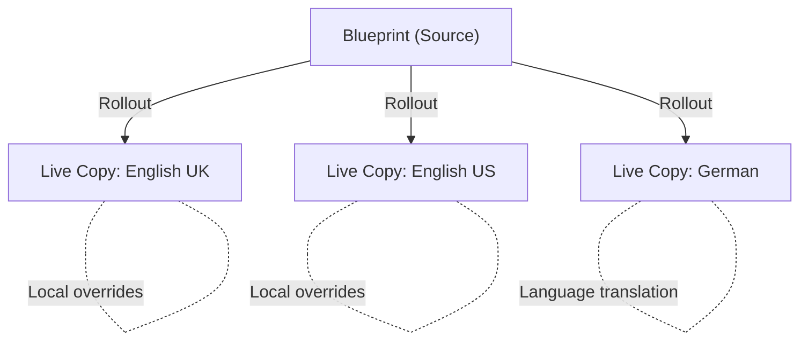
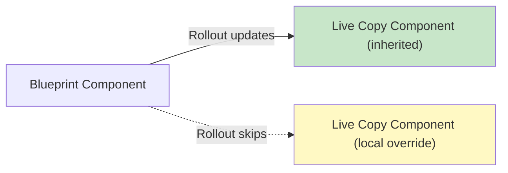

# Multi-Site Manager (MSM)

The Multi-Site Manager (MSM) lets you maintain multiple websites that share common content. You create
a **Blueprint** (the source) and derive **Live Copies** from it. Changes to the Blueprint can be
automatically or manually pushed to Live Copies via **rollout**. Authors on Live Copy sites can
override individual components or pages by **cancelling inheritance**, making content locally unique.

MSM is the foundation for multi-language sites, multi-region sites, and multi-brand sites in AEM.



## Core Concepts

### Blueprint

The **Blueprint** is the source content tree. It defines the master structure and content that all
Live Copies inherit from. A Blueprint can be any page tree; you formally register it as a Blueprint
configuration so it appears in the MSM UI.

Blueprint configuration location: `/libs/msm/wcm/blueprintconfigs/` (product) or
`/apps/msm/<your-project>/blueprintconfigs/` (custom)

```xml title="apps/msm/myproject/blueprintconfigs/myproject-blueprint/.content.xml"
<?xml version="1.0" encoding="UTF-8"?>
<jcr:root xmlns:jcr="http://www.jcp.org/jcr/1.0"
          xmlns:sling="http://sling.apache.org/jcr/sling/1.0"
          jcr:primaryType="cq:Page">
    <jcr:content
        jcr:primaryType="cq:PageContent"
        jcr:title="My Project Blueprint"
        sling:resourceType="msm/wcm/components/blueprint/configure"
        sitePath="/content/myproject/master"/>
</jcr:root>
```

### Live Copy

A **Live Copy** is a copy of a Blueprint that maintains a live relationship to its source. The
relationship is tracked per-component via `cq:LiveSyncConfig` and `cq:LiveRelationship` nodes in
the JCR.

```text title="Live Copy relationship in JCR"
/content/myproject/en-gb/jcr:content
├── cq:LiveSyncConfig
│   ├── cq:master = "/content/myproject/master"
│   ├── cq:rolloutConfigs = ["/libs/msm/wcm/rolloutconfigs/default"]
│   └── cq:isDeep = true
```

### Rollout vs Synchronize

| Action | Direction | Triggered from | When to use |
|--------|-----------|---------------|-------------|
| **Rollout** | Blueprint -> Live Copy | Blueprint page or system event | Push source changes to one or more Live Copies |
| **Synchronize** | Blueprint -> Live Copy | Live Copy page | Pull latest Blueprint changes into this Live Copy |

Both operations execute the same rollout configuration actions -- the difference is where the
operation is initiated.

### Inheritance

Every component on a Live Copy page either **inherits** from the Blueprint or has **cancelled
inheritance** (i.e., is locally customised). The inheritance state is tracked per-paragraph:



- **Green (inherited)**: Content matches the Blueprint; rollouts update this component
- **Yellow (cancelled)**: Author overrode the component; rollouts skip it
- **Re-enable inheritance**: Resets the component back to the Blueprint version (local changes are
  lost)

---

## Creating Live Copies

### Via the AEM UI

1. Navigate to **Sites > Create > Live Copy**
2. Select the **source** (Blueprint page or subtree)
3. Configure the **destination** path and site title
4. Choose a **rollout configuration** (or use the default)
5. Select whether to include sub-pages (deep copy)

### Via Java API

```java title="Programmatic Live Copy creation"
import com.day.cq.wcm.msm.api.LiveRelationshipManager;
import com.day.cq.wcm.msm.api.RolloutConfig;

@Reference
private LiveRelationshipManager liveRelationshipManager;

public void createLiveCopy(ResourceResolver resolver,
        String blueprintPath, String liveCopyPath, String title)
        throws WCMException {

    // Optionally specify rollout configs (null = use default)
    RolloutConfig[] rolloutConfigs = null;

    liveRelationshipManager.create(
        resolver.getResource(blueprintPath),  // source
        resolver.getResource(liveCopyPath).getParent(),  // parent of the live copy
        title,           // title
        true,            // deep (include sub-pages)
        rolloutConfigs   // rollout configurations
    );

    resolver.commit();
}
```

### Language copies

MSM is the mechanism behind AEM's **language copy** feature. When you create a language copy via
**Sites > Create > Language Copy**, AEM creates a Live Copy with:
- A translation-specific rollout configuration
- Integration with the AEM Translation Framework
- Language-specific `jcr:language` property

```text
/content/myproject/
├── master/          # Blueprint (source language, e.g., English)
│   ├── en/
│   └── ...
├── de/              # Live Copy (German translation)
├── fr/              # Live Copy (French translation)
└── ja/              # Live Copy (Japanese translation)
```

---

## Rollout Configurations

A rollout configuration defines **which actions** to execute and **when** (the trigger). The
product default is at `/libs/msm/wcm/rolloutconfigs/default`.

### Built-in rollout configurations

| Configuration | Location | Trigger | Actions |
|--------------|----------|---------|---------|
| **Standard Rollout Config** | `/libs/msm/wcm/rolloutconfigs/default` | `rollout` | `contentUpdate`, `contentCopy`, `contentDelete`, `referencesUpdate`, `orderChildren` |
| **Activate on Blueprint Activation** | `/libs/msm/wcm/rolloutconfigs/activate` | `activate` | `targetActivate` |
| **Deactivate on Blueprint Deactivation** | `/libs/msm/wcm/rolloutconfigs/deactivate` | `deactivate` | `targetDeactivate` |
| **Push on Modify** | `/libs/msm/wcm/rolloutconfigs/pushonmodify` | `modification` | `contentUpdate`, `contentCopy`, `contentDelete`, `orderChildren` |

### Rollout triggers (`cq:trigger`)

| Trigger | Fires when |
|---------|-----------|
| `rollout` | Author manually triggers a rollout |
| `modification` | Blueprint page is modified (saved) |
| `activate` | Blueprint page is activated (published) |
| `deactivate` | Blueprint page is deactivated (unpublished) |

### Built-in rollout actions

| Action | What it does |
|--------|-------------|
| `contentUpdate` | Updates Live Copy content from Blueprint |
| `contentCopy` | Copies new content from Blueprint to Live Copy |
| `contentDelete` | Deletes Live Copy content that was deleted in Blueprint |
| `referencesUpdate` | Updates internal references (links, images) to point to Live Copy paths |
| `orderChildren` | Syncs the order of child pages |
| `targetActivate` | Activates (publishes) the Live Copy page |
| `targetDeactivate` | Deactivates (unpublishes) the Live Copy page |
| `markLiveRelationship` | Marks the relationship as live (internal bookkeeping) |
| `PageMoveAction` | Handles Blueprint page moves (see below) |

### Custom rollout configuration

1. Copy the default rollout action from `/libs/msm/wcm/rolloutconfigs/default` to
   `/apps/msm/<your-project>/rolloutconfigs/default`
2. Add this folder to `filter.xml`: `<filter root="/apps/msm/<your-project>"/>`
3. Customise the actions as needed

```xml title="apps/msm/myproject/rolloutconfigs/custom/.content.xml"
<?xml version="1.0" encoding="UTF-8"?>
<jcr:root xmlns:jcr="http://www.jcp.org/jcr/1.0" xmlns:cq="http://www.day.com/jcr/cq/1.0"
          cq:trigger="rollout"
          jcr:primaryType="cq:RolloutConfig"
          jcr:title="My Custom Rollout Config"
          jcr:description="Standard rollout plus custom action">
    <contentUpdate jcr:primaryType="cq:LiveSyncAction"/>
    <contentCopy jcr:primaryType="cq:LiveSyncAction"/>
    <contentDelete jcr:primaryType="cq:LiveSyncAction"/>
    <referencesUpdate jcr:primaryType="cq:LiveSyncAction"/>
    <orderChildren jcr:primaryType="cq:LiveSyncAction"/>
    <CustomAction jcr:primaryType="cq:LiveSyncAction"/>
</jcr:root>
```

The `<CustomAction>` node name must match your `LiveActionFactory.LIVE_ACTION_NAME`.

### Execution order

Rollout configurations are executed in the order of their JCR node structure. Control the order via
a `sling:OrderedFolder`:

```xml title="apps/msm/myproject/rolloutconfigs/.content.xml"
<?xml version="1.0" encoding="UTF-8"?>
<jcr:root xmlns:jcr="http://www.jcp.org/jcr/1.0" xmlns:sling="http://sling.apache.org/jcr/sling/1.0"
          jcr:primaryType="sling:OrderedFolder"
          jcr:title="Rollout Configurations">
    <pageMove/>
    <default/>
    <custom/>
</jcr:root>
```

### Assigning rollout configs to a Live Copy

Set rollout configurations on a Live Copy page via:
- **Page Properties > Live Copy tab** (UI)
- JCR property `cq:rolloutConfigs` on the `cq:LiveSyncConfig` node (programmatic)

You can assign **multiple** rollout configurations to a single Live Copy. They execute in order.

---

## Page Moves and Structural Changes

The default "Standard Rollout Configuration" **does not** handle page moves. This is intentional:

> Moving pages in a blueprint will not result in corresponding pages being moved in live copies after
> rollout with standard rollout configuration. A page move implicitly includes a page delete, which
> could lead to unexpected behavior on publish.

To handle page moves, create a **separate** rollout configuration with only the `PageMoveAction`:

```xml title="apps/msm/myproject/rolloutconfigs/pageMove/.content.xml"
<?xml version="1.0" encoding="UTF-8"?>
<jcr:root xmlns:jcr="http://www.jcp.org/jcr/1.0" xmlns:cq="http://www.day.com/jcr/cq/1.0"
          cq:trigger="rollout"
          jcr:description="Handles page moves from Blueprint to Live Copy. The action copies 
(not moves) the Live Copy page to the new location."
          jcr:primaryType="cq:RolloutConfig"
          jcr:title="PageMove Rollout Config">
    <PageMoveAction jcr:primaryType="cq:LiveSyncAction"/>
</jcr:root>
```

:::warning
The `PageMoveAction` **copies** (not moves) the Live Copy page to the new location. The page at the
old location remains with a broken relationship. You should clean up orphaned pages manually or via
a custom workflow after performing page moves.
:::

---

## Custom Rollout Action (Java)

When the built-in actions don't meet your requirements, implement a custom `LiveAction`:

```java title="core/.../msm/NotificationRolloutActionFactory.java"
package com.myproject.core.msm;

import com.day.cq.wcm.api.WCMException;
import com.day.cq.wcm.msm.api.LiveAction;
import com.day.cq.wcm.msm.api.LiveActionFactory;
import com.day.cq.wcm.msm.api.LiveRelationship;
import com.myproject.core.services.NotificationService;
import org.apache.sling.api.resource.Resource;
import org.osgi.service.component.annotations.Component;
import org.osgi.service.component.annotations.Reference;
import org.slf4j.Logger;
import org.slf4j.LoggerFactory;

@Component(
    service = LiveActionFactory.class,
    immediate = true,
    property = {
        LiveActionFactory.LIVE_ACTION_NAME + "=" + NotificationRolloutActionFactory.ACTION_NAME
    }
)
public class NotificationRolloutActionFactory implements LiveActionFactory<LiveAction> {

    static final String ACTION_NAME = "NotifyOnRollout";
    private static final Logger LOG = LoggerFactory.getLogger(NotificationRolloutActionFactory.class);

    @Reference
    private NotificationService notificationService;

    @Override
    public String createsAction() {
        return ACTION_NAME;
    }

    @Override
    public LiveAction createAction(Resource resource) {
        return new NotifyAction(notificationService);
    }

    private static class NotifyAction implements LiveAction {

        private final NotificationService notificationService;

        NotifyAction(NotificationService notificationService) {
            this.notificationService = notificationService;
        }

        @Override
        public String getName() {
            return ACTION_NAME;
        }

        @Override
        public void execute(Resource source, Resource target,
                LiveRelationship relation, boolean autoSave,
                boolean isResetRollout) throws WCMException {

            if (source == null || target == null) {
                return;
            }

            String sourcePath = source.getPath();
            String targetPath = target.getPath();

            LOG.info("Rollout: {} -> {}", sourcePath, targetPath);

            try {
                notificationService.notifyRollout(sourcePath, targetPath, isResetRollout);
            } catch (Exception e) {
                LOG.error("Notification failed during rollout {} -> {}",
                    sourcePath, targetPath, e);
                // Don't rethrow -- notification failure shouldn't block rollout
            }
        }
    }
}
```

Register the action in your custom rollout configuration:

```xml
<NotifyOnRollout jcr:primaryType="cq:LiveSyncAction"/>
```

### Action with access to OSGi services

Since `LiveAction` instances are created by the factory, inject services into the **factory** and
pass them to the action via the constructor (as shown above). Do not use `@Reference` inside the
`LiveAction` class -- it is not an OSGi component.

---

## MSM Java API

### LiveRelationshipManager

The central API for programmatic MSM operations:

```java
@Reference
private LiveRelationshipManager liveRelationshipManager;
```

| Method | Purpose |
|--------|---------|
| `create(source, parent, title, deep, configs)` | Create a new Live Copy |
| `getLiveRelationship(resource, advancedStatus)` | Get the relationship for a resource |
| `getLiveRelationships(source, path, deep)` | Get all Live Copies of a Blueprint resource |
| `isSource(resource)` | Check if a resource is a Blueprint source |
| `endRelationship(resolver, relation, deep)` | Detach a Live Copy from its Blueprint |
| `reenableRelationship(resolver, relation, deep)` | Re-enable inheritance on a detached Live Copy |
| `cancelRelationship(resolver, relation, deep, triggerRollout)` | Cancel inheritance (make local) |

### Checking MSM status

```java title="Checking if a page is a Live Copy"
import com.day.cq.wcm.msm.api.LiveRelationship;
import com.day.cq.wcm.msm.api.LiveRelationshipManager;
import com.day.cq.wcm.msm.api.LiveStatus;

public boolean isLiveCopy(Resource resource) throws WCMException {
    LiveRelationship relationship = liveRelationshipManager
        .getLiveRelationship(resource, false);
    return relationship != null;
}

public String getBlueprintPath(Resource liveCopyResource) throws WCMException {
    LiveRelationship relationship = liveRelationshipManager
        .getLiveRelationship(liveCopyResource, false);
    if (relationship != null && relationship.getStatus() != null) {
        return relationship.getStatus().getSourcePath();
    }
    return null;
}
```

### Triggering rollout programmatically

```java title="Programmatic rollout"
import com.day.cq.wcm.msm.api.RolloutManager;

@Reference
private RolloutManager rolloutManager;

public void rollout(ResourceResolver resolver, String blueprintPath, boolean deep)
        throws WCMException {

    Resource blueprint = resolver.getResource(blueprintPath);
    if (blueprint == null) {
        throw new WCMException("Blueprint not found: " + blueprintPath);
    }

    // Roll out to all Live Copies
    rolloutManager.rollout(resolver, blueprint, deep);

    resolver.commit();
}
```

### Cancelling and re-enabling inheritance

```java title="Managing inheritance on a component"
// Cancel inheritance on a specific component (make local override)
LiveRelationship relationship = liveRelationshipManager
    .getLiveRelationship(componentResource, false);
if (relationship != null) {
    liveRelationshipManager.cancelRelationship(
        resolver, relationship, false, false);
    resolver.commit();
}

// Re-enable inheritance (resets to Blueprint content)
liveRelationshipManager.reenableRelationship(resolver, relationship, false);
resolver.commit();
```

### Listing all Live Copies of a Blueprint

```java title="Finding all Live Copies"
public List<String> getLiveCopyPaths(ResourceResolver resolver, String blueprintPath)
        throws WCMException {

    Resource blueprint = resolver.getResource(blueprintPath);
    if (blueprint == null) {
        return Collections.emptyList();
    }

    List<String> paths = new ArrayList<>();
    RangeIterator relationships = liveRelationshipManager
        .getLiveRelationships(blueprint, null, null);

    while (relationships.hasNext()) {
        LiveRelationship rel = (LiveRelationship) relationships.next();
        if (rel.getTargetPath() != null) {
            paths.add(rel.getTargetPath());
        }
    }
    return paths;
}
```

---

## MSM and Sling Models

### Detecting MSM context in components

```java title="core/.../models/MsmAwareComponent.java"
@Model(adaptables = SlingHttpServletRequest.class,
       defaultInjectionStrategy = DefaultInjectionStrategy.OPTIONAL)
public class MsmAwareComponent {

    @SlingObject
    private Resource resource;

    @OSGiService
    private LiveRelationshipManager liveRelationshipManager;

    private boolean isLiveCopy;
    private boolean isInheritanceCancelled;
    private String blueprintPath;

    @PostConstruct
    protected void init() {
        try {
            LiveRelationship relationship = liveRelationshipManager
                .getLiveRelationship(resource, true);

            if (relationship != null) {
                isLiveCopy = true;
                LiveStatus status = relationship.getStatus();
                if (status != null) {
                    blueprintPath = status.getSourcePath();
                    isInheritanceCancelled = status.isCancelled();
                }
            }
        } catch (WCMException e) {
            // Log and treat as non-Live-Copy
        }
    }

    public boolean isLiveCopy() { return isLiveCopy; }
    public boolean isInheritanceCancelled() { return isInheritanceCancelled; }
    public String getBlueprintPath() { return blueprintPath; }
}
```

---

## Groovy Console Scripts

### List all Live Copies for a Blueprint

```groovy title="List Live Copies"
import com.day.cq.wcm.msm.api.LiveRelationshipManager

def lrm = getService(LiveRelationshipManager.class)
def blueprintPath = "/content/myproject/master/en"
def blueprint = getResource(blueprintPath)

def relationships = lrm.getLiveRelationships(blueprint, null, null)
while (relationships.hasNext()) {
    def rel = relationships.next()
    println "Live Copy: ${rel.targetPath} -> Blueprint: ${rel.sourcePath}"
}
```

### Check inheritance status of a page

```groovy title="Inheritance status"
import com.day.cq.wcm.msm.api.LiveRelationshipManager

def lrm = getService(LiveRelationshipManager.class)
def pagePath = "/content/myproject/en-gb/products"
def resource = getResource(pagePath + "/jcr:content")

def rel = lrm.getLiveRelationship(resource, true)
if (rel != null) {
    def status = rel.status
    println "Is Live Copy: true"
    println "Source: ${status?.sourcePath}"
    println "Cancelled: ${status?.cancelled}"
    println "Last rolled out: ${status?.lastRolledOut}"
} else {
    println "Not a Live Copy"
}
```

### Force rollout of a subtree

```groovy title="Force rollout"
import com.day.cq.wcm.msm.api.RolloutManager

def rm = getService(RolloutManager.class)
def blueprintPath = "/content/myproject/master/en/products"
def blueprint = getResource(blueprintPath)

// DRY_RUN: uncomment the next line to actually roll out
// rm.rollout(resourceResolver, blueprint, true)
println "Would roll out: ${blueprintPath} (deep)"
```

---

## Multi-Site Architecture Patterns

### Pattern 1: Multi-region (same language)

```text
/content/myproject/
├── master/en/          # Blueprint: Global English
├── en-us/              # Live Copy: US English (local pricing, legal)
├── en-gb/              # Live Copy: UK English (local spelling, legal)
└── en-au/              # Live Copy: Australian English
```

Best for: Global brands with regional variations in the same language.

### Pattern 2: Multi-language

```text
/content/myproject/
├── en/                 # Blueprint: English (source language)
├── de/                 # Live Copy + Translation: German
├── fr/                 # Live Copy + Translation: French
└── ja/                 # Live Copy + Translation: Japanese
```

Best for: Multilingual sites where structure is the same but content is translated.

### Pattern 3: Multi-brand

```text
/content/
├── brand-master/       # Blueprint: Shared structure + content
├── brand-a/            # Live Copy: Brand A (custom theme, local content)
├── brand-b/            # Live Copy: Brand B (custom theme, local content)
└── brand-c/            # Live Copy: Brand C
```

Best for: Holding companies with multiple brands sharing core content.

### Pattern 4: Nested blueprints

```text
/content/
├── global-master/      # Blueprint Level 1: Global
├── region-emea/        # Live Copy of global → Blueprint Level 2 for EMEA countries
│   ├── de/             # Live Copy of region-emea
│   ├── fr/             # Live Copy of region-emea
│   └── uk/             # Live Copy of region-emea
└── region-apac/        # Live Copy of global → Blueprint Level 2 for APAC
    ├── au/
    └── jp/
```

:::info
Nested blueprints (multi-level inheritance) add complexity. Rollouts at the top level cascade
through intermediate levels. Test thoroughly before adopting this pattern.
:::

---

## Conflict Resolution

When a rollout encounters a Live Copy page that has been locally modified, AEM uses the following
rules:

| Scenario | Behaviour |
|----------|----------|
| Inherited component, Blueprint updated | Live Copy component is updated |
| Component with cancelled inheritance, Blueprint updated | Live Copy component is **not** updated (local wins) |
| Component deleted in Blueprint | Component is deleted in Live Copy (if inherited) |
| New component added in Blueprint | Component is added to Live Copy |
| Page deleted in Blueprint | Page is deleted in Live Copy |
| Page added in Blueprint | Page is added to Live Copy |
| Conflicting property changes (both sides changed) | Blueprint wins for inherited components; local wins for cancelled |

### Rollout conflict handler

AEM provides a `RolloutConflictHandler` that determines behaviour when conflicts arise. The default
handler uses the **Blueprint wins** strategy for inherited content. You can configure this via:

```text
Tools > Operations > Web Console > Day CQ WCM Rollout Conflict Handler
```

---

## Best Practices

### Keep Blueprints clean

- Blueprint content should be **generic and reusable** -- avoid region-specific content in the Blueprint
- Use **content policies** and the **Style System** for visual differences rather than Live Copy overrides
- Structure the Blueprint as the **superset** of all Live Copy pages; Live Copies can hide pages they
  don't need

### Minimise cancelled inheritance

- Every cancelled inheritance point means a component that won't receive Blueprint updates
- Prefer using **design dialogs / template policies** for regional differences over component-level
  overrides
- Track cancelled components via the **Live Copy Overview** in the Sites console

### Rollout strategy

- Use **manual rollout** for critical content changes that need review
- Use **automatic triggers** (`modification`, `activate`) only for low-risk content like navigation
  or footer
- Always test rollouts on Author before activating to Publish
- Schedule large rollouts during low-traffic periods

### Naming and structure

- Use consistent naming for Live Copy sites (`en-us`, `en-gb`, `de-de`)
- Mirror the Blueprint structure exactly; structural divergence makes future rollouts unpredictable
- Document which rollout configurations are assigned to which Live Copies

---

## Common Pitfalls

| Pitfall | Solution |
|---------|----------|
| Page moves not propagated | Create a separate rollout config with `PageMoveAction` |
| Rollout overwrites local changes | Author must cancel inheritance on components that should be local |
| "Suspended" Live Copy relationship | Re-enable inheritance or re-attach the Live Copy via the Sites console |
| Deep rollout takes very long | Reduce scope to specific pages or subtrees; run overnight for full-site rollouts |
| References point to Blueprint paths | Ensure `referencesUpdate` action is in the rollout config |
| Live Copy shows stale content | Check if rollout was triggered; synchronize from the Live Copy page |
| Nested blueprints cascade unexpectedly | Test multi-level rollouts in a staging environment first |
| Translation integration not working | Ensure language copies are created via **Sites > Create > Language Copy**, not manual Live Copy |
| AEMaaCS: Rollout performance | AEMaaCS has improved rollout performance; use the latest dispatcher cache invalidation patterns |

## External Resources

- [MSM Best Practices](https://experienceleague.adobe.com/en/docs/experience-manager-65/content/sites/administering/introduction/msm-best-practices)
- [Creating a New Rollout Configuration](https://experienceleague.adobe.com/en/docs/experience-manager-cloud-service/content/implementing/configuring-and-extending/msm#creating-a-new-rollout-configuration)
- [Rollout `cq:trigger` Enum](https://developer.adobe.com/experience-manager/reference-materials/6-5/javadoc/com/day/cq/wcm/msm/api/RolloutManager.Trigger.html)
- [Product Rollout Actions Reference](https://experienceleague.adobe.com/en/docs/experience-manager-cloud-service/content/sites/administering/reusing-content/msm/live-copy-sync-config#synchronization-actions)
- [Live Copy Overview Console](https://experienceleague.adobe.com/en/docs/experience-manager-cloud-service/content/sites/administering/reusing-content/msm/live-copy-overview)
- [MSM Structure Changes and Rollouts](https://experienceleague.adobe.com/en/docs/experience-manager-65/content/sites/administering/introduction/msm-best-practices#structure-changes-and-rollouts)

## See also

- [Architecture](../architecture.mdx) -- content model and request pipeline
- [Modify and Query the JCR](./jcr.md)
- [JCR Node Operations](./node-operations.mdx)
- [Content Fragments](./content-fragments.md)
- [Replication and Activation](./replication-activation.mdx) -- publishing Live Copies
- [Workflows](../backend/workflows.mdx) -- translation and approval workflows
- [Groovy Console](../groovy-console.mdx) -- bulk MSM operations
- [Dispatcher Configuration](../infrastructure/dispatcher-configuration.mdx)
- [Deployment](../infrastructure/deployment.mdx)
