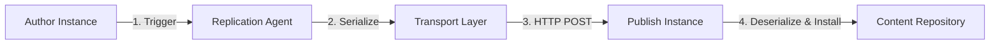

# Replication and Activation

Replication is the mechanism AEM uses to move content from the **author** environment to one or more **publish** instances. When an author clicks "Publish" (or "Activate") in the Sites console, the underlying replication framework serializes the affected content, transports it over HTTP/HTTPS, and deserializes it on the target publish instance. Understanding this pipeline is essential for debugging publish delays, configuring Dispatcher cache invalidation, and building custom publishing workflows.

## How Replication Works

At a high level, every replication operation follows the same four-stage pipeline:



1. **Trigger** — An author activates a page (manually, via workflow, or programmatically).
2. **Serialize** — The replication agent reads the affected nodes from the JCR and packages them into a serialization format.
3. **Transport** — The serialized payload is sent over HTTP(S) to the publish instance's replication receiver servlet.
4. **Deserialize & Install** — The publish instance unpacks the payload and writes the nodes into its own repository.

:::tip
AEM serializes not just the page node but also its `jcr:content` subtree. Referenced assets and components are **not** automatically included — they must be activated separately (or via a workflow that handles references).
:::

## Replication Agents

Replication agents are the configuration objects that control **where** and **how** content is replicated. Each agent defines a transport URI, authentication credentials, trigger behavior, and retry settings.

### Default Agent Location

On an author instance, agents live under:

```
/etc/replication/agents.author/
```

The default publish agent is typically named `publish` and can be accessed in the AEM Web Console at:

```
http://localhost:4502/etc/replication/agents.author/publish.html
```

### Key Properties

| Property | Path / Key | Description |
|---|---|---|
| **Transport URI** | `transportUri` | URL of the publish receiver, e.g. `https://publish:4503/bin/receive?sling:authRequestLogin=1` |
| **Transport User** | `transportUser` | User on the publish instance that writes the content |
| **Transport Password** | `transportPassword` | Encrypted password for the transport user |
| **Trigger** | `triggers` | `onModification`, `onDistribute`, `onOffTime`, or `manual` |
| **Enabled** | `enabled` | `true` or `false` — disabled agents silently drop replication requests |
| **Retry Delay** | `retryDelay` | Milliseconds between retries on transport failure (default `60000`) |
| **Max Retries** | `maxRetries` | Number of retry attempts before the item is marked as failed |
| **Log Level** | `logLevel` | `error`, `info`, or `debug` — controls verbosity in the agent log |

:::warning
Always use a **dedicated service user** with minimal write permissions for `transportUser`. Never use `admin` in production — a compromised publish instance could otherwise gain full author-level access.
:::

### Creating an Agent via CRXDE

You can create a new replication agent by adding a node of type `cq:ReplicationAgent` under `/etc/replication/agents.author/`:

```xml
<jcr:root xmlns:jcr="http://www.jcp.org/jcr/1.0"
           xmlns:cq="http://www.day.com/jcr/cq/1.0"
           jcr:primaryType="cq:Page">
    <jcr:content
        jcr:primaryType="nt:unstructured"
        jcr:title="Publish Agent – Region EU"
        sling:resourceType="cq/replication/components/agent"
        enabled="true"
        transportUri="https://publish-eu:4503/bin/receive?sling:authRequestLogin=1"
        transportUser="replication-service"
        transportPassword="{encrypted-value}"
        retryDelay="30000"
        logLevel="info"
        triggers="onDistribute"/>
</jcr:root>
```

## Flush Agents (Dispatcher Invalidation)

Flush agents are a special type of replication agent whose purpose is **not** to replicate content but to tell the Dispatcher to invalidate its cache when content changes.

### How Flush Agents Work

When content is activated, the flush agent sends an HTTP request to the Dispatcher with special headers indicating which paths should be invalidated. The Dispatcher then removes or marks stale the cached files for those paths.

### Configuration

The transport URI points to the Dispatcher's invalidation endpoint:

```
http://dispatcher:80/dispatcher/invalidate.cache
```

### Invalidation Headers

The flush agent sends the following headers:

| Header | Example Value | Description |
|---|---|---|
| `CQ-Action` | `Activate` or `Deactivate` | The type of replication action |
| `CQ-Handle` | `/content/mysite/en/page` | The path that was activated |
| `CQ-Path` | `/content/mysite/en/page` | Alias for `CQ-Handle` |
| `Content-Type` | `application/octet-stream` | Required by the Dispatcher servlet |
| `Content-Length` | `0` | No body is sent |

:::tip
You can configure the Dispatcher's `/invalidate` section to control which content types are flushed. Restrict invalidation to only the paths you need to avoid unnecessary cache misses across unrelated site trees.
:::

## Programmatic Replication

AEM exposes the `Replicator` service for triggering replication from Java code. This is useful inside workflows, servlets, or scheduled jobs.

```java
import com.day.cq.replication.ReplicationActionType;
import com.day.cq.replication.ReplicationException;
import com.day.cq.replication.Replicator;
import org.apache.sling.api.resource.ResourceResolver;

import javax.jcr.Session;

@Reference
private Replicator replicator;

public void activatePage(ResourceResolver resolver, String path) throws ReplicationException {
    Session session = resolver.adaptTo(Session.class);

    // Activate a page
    replicator.replicate(session, ReplicationActionType.ACTIVATE, path);
}

public void deactivatePage(ResourceResolver resolver, String path) throws ReplicationException {
    Session session = resolver.adaptTo(Session.class);

    // Deactivate (unpublish) a page
    replicator.replicate(session, ReplicationActionType.DEACTIVATE, path);
}
```

For replicating with specific agent options (e.g. suppressing versioning or targeting a specific agent):

```java
import com.day.cq.replication.ReplicationOptions;
import com.day.cq.replication.AgentFilter;

ReplicationOptions options = new ReplicationOptions();
options.setFilter(new AgentFilter() {
    @Override
    public boolean isIncluded(com.day.cq.replication.Agent agent) {
        return "publish-eu".equals(agent.getId());
    }
});
options.setSuppressVersions(true);

replicator.replicate(session, ReplicationActionType.ACTIVATE, "/content/mysite/en/page", options);
```

:::warning
Always wrap replication calls in proper error handling and ensure the `Session` comes from a service user with replication permissions — not from the request's session in a servlet context.
:::

## Tree Activation

Tree Activation lets you publish an entire subtree of pages in a single operation, rather than activating each page individually.

### Using the Tree Activation UI

1. Navigate to **Tools → Replication → Tree Activation**.
2. Set the **Start Path** (e.g. `/content/mysite/en`).
3. Optionally set **Modified Only** to skip pages that are already published and unchanged.
4. Optionally set **Dry Run** to preview what would be activated.
5. Click **Activate** to begin.

### Programmatic Tree Activation

```java
import com.day.cq.replication.ReplicationActionType;
import com.day.cq.replication.Replicator;
import org.apache.sling.api.resource.Resource;
import org.apache.sling.api.resource.ResourceResolver;

import javax.jcr.Session;
import java.util.Iterator;

public void activateTree(ResourceResolver resolver, Replicator replicator, String rootPath)
        throws Exception {
    Session session = resolver.adaptTo(Session.class);
    Resource root = resolver.getResource(rootPath);

    if (root == null) {
        return;
    }

    // Activate root
    replicator.replicate(session, ReplicationActionType.ACTIVATE, rootPath);

    // Recursively activate children
    Iterator<Resource> children = root.listChildren();
    while (children.hasNext()) {
        Resource child = children.next();
        if ("cq:Page".equals(child.getResourceType())
                || child.getPath().startsWith("/content/dam")) {
            activateTree(resolver, replicator, child.getPath());
        }
    }
}
```

:::tip
For large subtrees (thousands of pages), prefer the **Managed Publishing** workflow or a background Sling Job to avoid HTTP timeouts and replication queue overload.
:::

## Reverse Replication

Reverse replication moves content in the opposite direction — from **publish** back to **author**. This is used when content originates on the publish tier, such as user-generated content (UGC), form submissions, or community data.

### How It Works

1. Content is written to an **outbox** location on the publish instance (typically `/var/replication/outbox`).
2. A reverse replication agent on the author instance periodically polls the publish outbox.
3. Matching content is pulled into the author's **inbox** (`/var/replication/inbox`) for review or automatic processing.

### When to Use

- Forum posts and comments (AEM Communities)
- Form submission data that must be consolidated on author
- Analytics or feedback data generated on publish

### When to Avoid

- High-volume data flows — reverse replication is not designed for bulk data transfer
- Real-time requirements — polling introduces latency
- When a dedicated data store (e.g. an external database or API) would be more appropriate

## Content Distribution (AEM as a Cloud Service)

In **AEM as a Cloud Service (AEMaaCS)**, classic queue-based replication is replaced by **Sling Content Distribution**.

### Key Differences

| Aspect | Classic Replication | Sling Content Distribution |
|---|---|---|
| **Transport** | HTTP between author and publish | Cloud-native message queue |
| **Topology** | Author sends to each publish | Golden publish, then distributed |
| **Queue** | Per-agent queue on author | Centralized, managed queue |
| **Configuration** | Manual agent setup | Managed by Adobe infrastructure |
| **Flush** | Flush agent to Dispatcher | Automatic CDN invalidation |

### Golden Publish Topology

In AEMaaCS, content is distributed to a **golden publish** instance first, which then fans out to all other publish instances. Authors do not configure individual replication agents — the infrastructure handles distribution, retries, and ordering automatically.

:::tip
On AEMaaCS, use the **Manage Publication** wizard or `replicator.replicate()` as usual. The API remains the same; only the transport layer changes under the hood.
:::

## Replication Queue Monitoring

Monitoring replication queues is critical for maintaining a healthy publish pipeline.

### Queue UI

Access the queue for a specific agent at:

```
/etc/replication/agents.author/publish/queue
```

Or via the Touch UI at **Tools → Deployment → Replication → Agents on Author → publish → Queue**.

### Stalled Queues

Common causes of stalled queues:

| Cause | Symptom | Resolution |
|---|---|---|
| Publish instance down | Connection refused errors in agent log | Restart publish, verify network |
| Invalid credentials | `401 Unauthorized` in agent log | Update `transportUser` / `transportPassword` |
| Large binary assets | Queue item stuck with slow transfer | Increase timeout, consider async transfer |
| Serialization error | `ReplicationException` in log | Check content integrity, remove corrupt nodes |
| Queue blocked by failed item | All subsequent items stuck behind it | Clear or retry the failed item from the queue UI |

### Retry Behavior

When a replication attempt fails, the agent retries according to `retryDelay` and `maxRetries`. If all retries are exhausted, the item remains in the queue in a **failed** state. An administrator must manually retry or remove it.

:::warning
A single failed item blocks all subsequent items in the queue (FIFO ordering). Monitor queues proactively and set up alerts for queue depth thresholds.
:::

## Common Pitfalls

1. **References not activated** — Publishing a page does not automatically publish linked assets, referenced content fragments, or experience fragments. Use the "References" panel in the Sites console to check and publish dependencies.

2. **Circular replication** — Misconfiguring agents so that author replicates to publish and publish replicates back to author creates an infinite loop. Ensure reverse replication agents are configured correctly with distinct outbox/inbox paths.

3. **Queue backlog causing publish delays** — Large tree activations or bulk imports can flood the queue. Stagger activations or use off-peak scheduling.

4. **Activating unfinished content** — Without a proper workflow (e.g. review/approval), authors may accidentally publish draft pages. Enforce workflows on content paths.

5. **Forgetting dependent templates and policies** — A page will not render correctly on publish if its template, editable template policies, or client libraries have not been deployed or activated. Always verify that infrastructure content is in sync.

6. **Agent credentials expiring** — If the transport user's password changes on publish but not in the agent configuration, replication silently fails. Use service users with non-expiring credentials or automate credential rotation.

7. **Missing Dispatcher flush** — Content may be activated on publish but visitors still see the old version because the Dispatcher cache was not invalidated. Ensure flush agents are configured and healthy.

## See also

- [Modify and query the JCR](./jcr.md)
- [Node operations](./node-operations.mdx)
- [Content fragments](./content-fragments.md)
- [Workflows](../backend/workflows.mdx)
- [Event listener](../backend/event-listener.mdx)
- [Multi-Site Manager](./multi-site-manager-msm.md)
- [Deployment](../infrastructure/deployment.mdx)
- [Dispatcher configuration](../infrastructure/dispatcher-configuration.mdx)
- [Security basics](../infrastructure/security.mdx)
