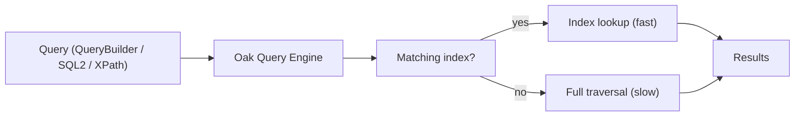

# Search & Indexing

Every non-trivial AEM feature -- navigation, lists, search results, dynamic teasers, content audits --
runs a **query** against the Oak repository. A query that is not backed by an **index** falls back to a
full repository **traversal**, which is slow on author and dangerous on publish under load. This page
covers how to query content and, more importantly, how to make those queries fast with the right Oak
index.



## Ways to query

| API | Language | When to use |
|-----|----------|-------------|
| **QueryBuilder** | Predicate map (Java/HTTP) | Most application code; readable, composable, paginated. The default choice in AEM |
| **JCR-SQL2** | SQL-like | Complex joins, precise control, scripts and the Groovy Console |
| **XPath** | XPath 2.0 | Legacy; Oak still supports it but new code should prefer the above |

All three compile down to the **same Oak query engine** and use the **same indexes** -- the choice is
ergonomic, not performance. See [Modify and Query the JCR](./jcr.md) for QueryBuilder/SQL2 syntax and
the [Groovy Console](../groovy-console.mdx) for ad-hoc querying.

```java title="QueryBuilder -- the common case"
Map<String, String> params = new HashMap<>();
params.put("path", "/content/mysite");
params.put("type", "cq:Page");
params.put("property", "jcr:content/cq:template");
params.put("property.value", "/conf/mysite/settings/wcm/templates/article");
params.put("orderby", "@jcr:content/cq:lastModified");
params.put("orderby.sort", "desc");
params.put("p.limit", "10");

Query query = queryBuilder.createQuery(PredicateGroup.create(params), session);
SearchResult result = query.getResult();
```

## Why indexes matter

Oak does **not** index every property by default. When a query has no suitable index, Oak logs a
warning and traverses the content tree node by node:

```text
Traversed 10000 nodes with filter Filter(query=...) ; consider creating an index or changing the query
```

On a large repository this can take seconds to minutes and consume heap. The fix is almost always an
index, occasionally a narrower query (tighter `path`, a `type` that is already indexed).

:::warning Never ship a traversal query to publish
A traversal that is merely slow on author can take down a publish instance under traffic. Treat the
"consider creating an index" warning as a build blocker, not a suggestion.
:::

## Index types

| Type | Backed by | Best for |
|------|-----------|----------|
| **Property index** | Oak property index | Exact-match lookups on one/few properties (e.g. `cq:template`, an `sku`) |
| **Lucene property index** | Lucene | The standard custom index in AEM -- property + full-text, ordering, aggregation |
| **Lucene full-text index** | Lucene | `CONTAINS()` / free-text search across content and binaries |

In modern AEM (and exclusively on AEMaaCS) you almost always create a **Lucene** index; pure Oak
property indexes are reserved for very simple, high-selectivity exact matches.

## Defining a property index

A minimal exact-match index on a single property, deployed as content under `/oak:index`:

```xml title="ui.apps/.../jcr_root/_oak_index/mysiteTemplate/.content.xml"
<?xml version="1.0" encoding="UTF-8"?>
<jcr:root xmlns:jcr="http://www.jcp.org/jcr/1.0" xmlns:oak="http://jackrabbit.apache.org/oak/ns/1.0"
          jcr:primaryType="oak:QueryIndexDefinition"
          type="property"
          propertyNames="[cq:template]"
          reindex="{Boolean}true"/>
```

## Defining a Lucene index

A Lucene index uses **index rules** per node type, declaring which properties are indexed and how
(`propertyIndex` for exact match, `ordered` for sortable, `analyzed` for full text):

```xml title="ui.apps/.../jcr_root/_oak_index/mysiteArticle-custom-1/.content.xml"
<?xml version="1.0" encoding="UTF-8"?>
<jcr:root xmlns:jcr="http://www.jcp.org/jcr/1.0" xmlns:nt="http://www.jcp.org/jcr/nt/1.0"
          xmlns:oak="http://jackrabbit.apache.org/oak/ns/1.0"
          jcr:primaryType="oak:QueryIndexDefinition"
          type="lucene"
          async="[async]"
          compatVersion="{Long}2"
          evaluatePathRestrictions="{Boolean}true"
          reindex="{Boolean}false">
    <indexRules jcr:primaryType="nt:unstructured">
        <cq:Page jcr:primaryType="nt:unstructured">
            <properties jcr:primaryType="nt:unstructured">
                <template
                    jcr:primaryType="nt:unstructured"
                    name="jcr:content/cq:template"
                    propertyIndex="{Boolean}true"/>
                <lastModified
                    jcr:primaryType="nt:unstructured"
                    name="jcr:content/cq:lastModified"
                    ordered="{Boolean}true"
                    type="Date"/>
                <title
                    jcr:primaryType="nt:unstructured"
                    name="jcr:content/jcr:title"
                    analyzed="{Boolean}true"
                    nodeScopeIndex="{Boolean}true"/>
            </properties>
        </cq:Page>
    </indexRules>
</jcr:root>
```

| Property | Meaning |
|----------|---------|
| `propertyIndex` | Exact-match queries on this property use the index |
| `ordered` | The property can be used in `ORDER BY` without traversal |
| `analyzed` | Tokenized for full-text (`CONTAINS`) search on this property |
| `nodeScopeIndex` | Include this property in node-level full-text search |
| `evaluatePathRestrictions` | Let Oak apply `ISDESCENDANTNODE` / `path` efficiently |

## Deploying indexes

### AEM as a Cloud Service

AEMaaCS requires a strict **naming convention** so its deployment process can merge custom indexes
with out-of-the-box (OOTB) ones without downtime:

- Customize an OOTB index: copy it and append `-custom-<N>`, e.g. `damAssetLucene-custom-1`.
- Brand-new index: name it `<indexName>-custom-<N>` and include `indexRules`.
- Deploy under `/oak:index` via your `ui.apps` package. The pipeline validates the definition and
  handles reindexing.

Validate locally with the **Index Converter / oak-run** tooling and the
[Content Search & Indexing](https://experienceleague.adobe.com/en/docs/experience-manager-cloud-service/content/operations/indexing) docs.

:::tip Skip the full copy with Simplified Index Management
On recent releases you can define just a `diff.json` delta and let the platform merge and version the
index for you, instead of copying the whole OOTB definition and tracking `-custom-<N>` by hand. See
[Simplified Index Management](./simplified-index-management.mdx).
:::

### AEM 6.5

Deploy the `/oak:index` node via a content package, set `reindex=true` (or trigger reindex), and watch
`error.log` for `Reindexing` / `Reindexed` messages. Use **oak-run** for large offline reindexing.

## Reindexing

Changing an index definition requires a **reindex** so existing content is covered:

- Set `reindex="{Boolean}true"` on the index node (Oak flips it back to `false` when done).
- Reindexing reads matching content -- it is I/O heavy; do it off-peak on large repositories.
- `async="[async]"` indexes update slightly behind writes (the norm for Lucene); pure property indexes
  are synchronous.

## Diagnosing slow queries

AEM ships tools to see whether a query is indexed and how it executes:

- **Query Performance** -- `/libs/granite/operations/content/diagnosistools/queryPerformanceTool.html`
  lists slow and popular queries.
- **Explain Query** -- `/libs/granite/operations/content/diagnosistools/queryExplainTool.html` shows
  which index a query uses (or reports a traversal) and the estimated cost. Run every new query through
  it before shipping.
- **Index Manager** -- `/libs/granite/operations/content/diagnosistools/indexManager.html` lists index
  definitions and their status.
- Watch `error.log` for `Traversed ... nodes` warnings during development.

## Best practices

- **Index for the query, not the property.** Define the index to match the exact filter + sort your
  code runs, then verify with Explain Query.
- **Constrain by `path` and `type`.** A query scoped to `/content/mysite` and `cq:Page` is cheaper and
  easier to index than an unrestricted one.
- **Prefer one well-designed Lucene index** over many tiny property indexes.
- **Reindex off-peak** and never on a whim in production -- it is expensive.
- **Commit index definitions to Git** under `ui.apps`; never hand-create them in CRXDE on a real
  environment (they will not survive deploys and will drift between tiers).
- **Paginate** (`p.limit` / `guessTotal`) -- never load an unbounded result set into memory.

## See also

- [Simplified Index Management](./simplified-index-management.mdx) - diff-based custom index management
- [Modify and Query the JCR](./jcr.md) - QueryBuilder predicates and JCR-SQL2 syntax
- [JCR Node Operations](./node-operations.mdx)
- [Content Fragments](./content-fragments.md) - querying fragments by model
- [Groovy Console](../groovy-console.mdx) - ad-hoc queries and bulk operations
- [Performance](../infrastructure/performance.mdx) - broader performance tuning
- [Content Search and Indexing (Experience League)](https://experienceleague.adobe.com/en/docs/experience-manager-cloud-service/content/operations/indexing)
- [Oak Query & Indexing (Apache Jackrabbit Oak)](https://jackrabbit.apache.org/oak/docs/query/query-engine.html)
- [Oak Lucene Index documentation](https://jackrabbit.apache.org/oak/docs/query/lucene.html)
