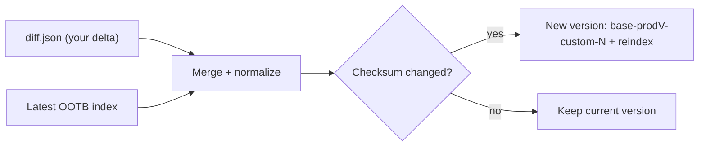

# Simplified Index Management

Customizing an Oak search index used to mean copying an entire out-of-the-box (OOTB) definition,
appending `-custom-1`, and hand-maintaining the version number every time Adobe shipped a new base
index. That approach is verbose, drifts out of date, and breaks the moment the OOTB definition changes
underneath you.

**Simplified Index Management** replaces the full copy with a single `diff.json` that describes *only*
your changes. The platform merges that delta with the latest OOTB index and creates a new, versioned
index for you -- but only when the merged result actually changes. This page walks through how it
works, how to set it up in both run modes, how to write a `diff.json`, and the merge rules that decide
what your customization is allowed to do.

If you are new to Oak indexes, read [Search & Indexing](./search-and-indexing.mdx) first -- it covers
query types, index types, and why an unindexed query falls back to a slow traversal.

## How it works

You commit a `diff.json` containing your delta. On deploy (or on save, in local mode), the merger reads
the current OOTB index, applies your delta under a strict set of rules, and computes a SHA-256 checksum
of the normalized result. A new version is created only when that checksum differs from the current one,
so repeated deploys with no real change do not trigger needless reindexing.



Each merged index is named `<baseName>-<productVersion>-custom-<customerVersion>` and carries two
marker properties: `mergeInfo` (which links back to the feature) and `mergeChecksum`. When a new merge
produces a different result, the customer version increments and the old version is removed once the new
one is ready. If you drop an index from the diff entirely, its previously merged index is removed too.

## Requirements

- **Pipeline Mode** works on all AEM as a Cloud Service releases, because the diff is processed outside
  AEM by the deployment pipeline.
- **RDE & Local Quickstart** mode needs AEM as a Cloud Service **2026.05 (release 25892)** or later, with
  **Apache Jackrabbit Oak 1.92** or later, and the AEM SDK **v2026.5** or newer.

## Pipeline mode (Dev, Stage, Prod)

This is the mode you use for real environments with a deployment pipeline. The diff lives in your Git
repository and the pipeline applies it.

### 1. Create the diff.index node

In your project's `ui.apps/src/main/content/jcr_root/_oak_index`, create a directory named `diff.index`.
Inside it, add a `.content.xml` with the content below. You will not edit this file again -- it exists
for compatibility with the existing tooling. The `type` is `lucene` (otherwise the pipeline run fails),
and `includedPaths` / `queryPaths` point at a non-existent path so the existing tooling does not build a
large index here.

```xml
<?xml version="1.0" encoding="UTF-8"?>
<jcr:root
    xmlns:jcr="http://www.jcp.org/jcr/1.0"
    xmlns:nt="http://www.jcp.org/jcr/nt/1.0"
    jcr:primaryType="nt:unstructured"
    type="lucene" includedPaths="/same" queryPaths="/same" async="async">
    <diff.json jcr:primaryType="nt:file"/>
</jcr:root>
```

### 2. Add the diff.json

In the same directory, create `diff.json` and paste your diff index content into it (see
[Writing a diff.json](#writing-a-diffjson) below).

### 3. Register it in the vault filter

In `ui.apps/src/main/content/META-INF/vault/filter.xml`, add:

```xml
<filter root="/oak:index/diff.index" />
```

### 4. Deploy

Run the pipeline. It merges your diff with the latest OOTB index and, if the result changed, creates a
new version and reindexes.

## RDE and local Quickstart mode

This mode applies changes immediately without a pipeline -- handy while you iterate locally or on a
Rapid Development Environment.

1. Open **CRX/DE**.
2. Navigate to `/oak:index`.
3. Create a node `diff.index` of type `oak:QueryIndexDefinition`, and set its `type` property to
   `disabled`.
4. Under it, create a node `diff.json` of type `nt:file`.
5. Paste your diff index content into the file and save.
6. Wait a few seconds and refresh. You should see a new version of the affected index.

:::warning Do not use immediate mode on large repositories
In this mode every edit to `diff.index` / `diff.json` immediately creates a new index version and starts
reindexing. On a large repository that is expensive and slow. Never use it for Cloud Service **DEV**
environments -- use Pipeline Mode there instead.
:::

## Writing a diff.json

A `diff.json` is a map keyed by index name. The name does not include the `/oak:index/` prefix. You can
customize an OOTB index and define fully custom indexes in the same file.

A few rules for **fully custom** indexes:

- The name must contain a dot (for example `custom.slingFolderTest`).
- It needs a non-empty `includedPaths` that is not under `/apps` or `/libs`.
- Set `queryPaths` to the same value as `includedPaths`.

The example below adds a property to the OOTB `damAssetLucene` index and defines a fully custom index:

```json
{
    "damAssetLucene": {
        "indexRules": {
            "dam:Asset": {
                "properties": {
                    "test": {
                        "name": "test",
                        "propertyIndex": true
                    }
                }
            }
        }
    },
    "custom.slingFolderTest": {
        "async": [ "async" ],
        "compatVersion": 2,
        "evaluatePathRestrictions": true,
        "includedPaths": [ "/content/dam" ],
        "queryPaths": [ "/content/dam" ],
        "tags": "custom.folderNames",
        "selectionPolicy": "tag",
        "type": "lucene",
        "indexRules": {
            "sling:Folder": {
                "properties": {
                    "test": {
                        "name": "test",
                        "propertyIndex": true
                    }
                }
            }
        }
    }
}
```

:::note
You do not need the Tika configuration of OOTB indexes in the diff. For a fully custom index, you only
need a Tika configuration when the definition contains analyzed properties or an aggregation definition.
:::

## Merge rules

The merger is deliberately conservative: a customization can add to an OOTB index but cannot silently
weaken or change how existing content is indexed. Understanding these rules saves you from surprises
when a property you added is dropped with a warning.

### Top-level properties

- `includedPaths`, `queryPaths`, and `tags` are **merged as a union** with the existing values rather
  than overwritten -- but `includedPaths` and `queryPaths` may **not be added** if they do not already
  exist, because adding them would make the index more restrictive.
- These properties may **not be added** to an existing OOTB index and are dropped with a warning:
  `selectionPolicy`, `valueRegex`, `queryFilterRegex`, `excludedPaths`.
- Other new properties that do not exist on the target are added.
- Properties that already exist are **not overwritten**.

### Indexed property rules

- When you add a child under a `properties` node, the merger first matches **by the `name` value**: if
  an existing child has the same `name`, your diff applies to that child -- even if the child node name
  differs. It matches **by `function` value** the same way for function-based properties.
- If no match is found, it creates a new child node.
- These fields may **not be added or updated** on an existing child: `isRegexp`, `index`, `function`,
  `name`. This prevents changing how an existing property is indexed.
- Existing property values are **not overwritten**, except for `boost` and `weight`.

### Normalization details

These rarely matter day to day, but explain how the merger compares definitions:

- Volatile properties are stripped before comparison: `reindex`, `reindexCount`, `refresh`, `seed`,
  `:version`, `:nameSeed`, `:mappingVersion`, `merges`, `mergeInfo`, `mergeChecksum`.
- Oak string prefixes (`str:`, `nam:`, `dat:`) are normalized away.
- `jcr:primaryType` is ignored at the top level, and all `jcr:uuid` properties are removed (new UUIDs
  are generated when needed).
- Property order is ignored (properties are sorted alphabetically), but **child node order is
  significant**.
- A SHA-256 checksum over the merged definition detects changes efficiently across runs.

## Versioning and cleanup

- Each merged index is named `<baseName>-<productVersion>-custom-<customerVersion>`.
- The customer version increments when a new merge produces a different result.
- A `mergeInfo` and `mergeChecksum` property are added to every merged index.
- Old versions of the same base index are removed after the new version is created.
- If a previously merged index (one with a `mergeInfo` property) is no longer referenced in the diff,
  the merged index is removed.

## Generating and verifying a diff

If you already run custom or customized indexes and want to migrate to this workflow, generate the diff
from your current state rather than writing it by hand.

1. In the AEM as a Cloud Service **Developer Console**, choose **Status Dump → Oak Indexes** with
   **Output Format: JSON**, click **Get Status**, then **Download**.
2. Select the whole JSON and copy it.
3. Open the **Index Definition Analyzer**
   (`https://oak-indexing.github.io/oakTools/indexDefAnalyzer.html`), paste the JSON into the
   **Index Definitions (JSON)** textarea, and click **Analyze**. The right side shows your diff index.
4. Confirm it contains only the changes you intend.
5. If you edited the diff by hand, validate it with the **Diff Index Verifier**
   (`https://oak-indexing.github.io/oakTools/diffIndexVerifier.html`).

## Troubleshooting

- **A property I added was dropped with a warning.** You hit a merge rule -- most likely you tried to
  add `includedPaths`/`queryPaths` to an OOTB index, add a blocked top-level property, or change a
  protected field (`name`, `function`, `index`, `isRegexp`) on an existing property.
- **My change did not produce a new version.** The normalized merge result was identical, so the
  checksum did not change. Confirm the diff actually alters the OOTB definition.
- **My fully custom index is rejected.** Check that the index name contains a dot, that `includedPaths`
  is non-empty and outside `/apps` and `/libs`, and that `queryPaths` matches `includedPaths`.
- **The pipeline run fails on the diff.index node.** Confirm the compatibility `.content.xml` sets
  `type="lucene"` and points `includedPaths`/`queryPaths` at a non-existent path.

After any change, verify the resulting query actually uses your index with **Explain Query** -- see
[Diagnosing slow queries](./search-and-indexing.mdx#diagnosing-slow-queries).

## See also

- [Search & Indexing](./search-and-indexing.mdx) -- query types, index types, deploying and reindexing
- [Modify and Query the JCR](./jcr.md) -- QueryBuilder predicates and JCR-SQL2 syntax
- [Cloud Service](../infrastructure/cloud-service.mdx) -- pipelines and environments
- [Content Search and Indexing](https://experienceleague.adobe.com/en/docs/experience-manager-cloud-service/content/operations/indexing) -- official Adobe documentation
- [oakTools](https://oak-indexing.github.io/oakTools/simplified.html) -- the Index Definition Analyzer and Diff Index Verifier
