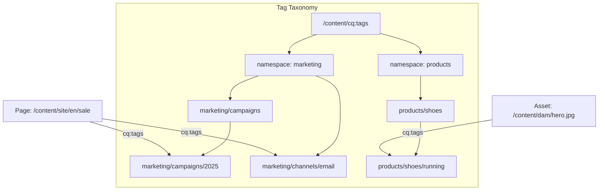

# Tags and Taxonomies

AEM's **tagging framework** provides a structured way to classify and organise content.
Tags are first-class JCR nodes stored under `/content/cq:tags/` and can be applied to
pages, assets, Content Fragments, and any resource with a `cq:tags` property. They power
navigation, search facets, analytics segmentation, and personalisation.



---

## Tag Structure

### Namespaces

Every tag belongs to a **namespace** -- a top-level container that groups related tags.
Namespaces are the direct children of `/content/cq:tags/`:

```
/content/cq:tags/
├── marketing/           ← namespace
│   ├── campaigns/
│   │   ├── 2024/
│   │   └── 2025/
│   └── channels/
│       ├── email
│       ├── social
│       └── web
├── products/            ← namespace
│   ├── shoes/
│   │   ├── running
│   │   └── hiking
│   └── clothing/
└── regions/             ← namespace
    ├── emea
    ├── americas
    └── apac
```

### Tag node type

Tags use the `cq:Tag` node type with these key properties:

| Property | Type | Description |
|----------|------|-------------|
| `jcr:title` | String | Display title (localisable) |
| `jcr:description` | String | Description |
| `sling:resourceType` | String | `cq/tagging/components/tag` |
| `jcr:title.de` | String | German title (i18n) |
| `jcr:title.fr` | String | French title (i18n) |

### Tag ID format

Tags are identified by their **tag ID**, which is the path relative to `/content/cq:tags/`
using a colon (`:`) to separate the namespace from the path:

```
marketing:campaigns/2025
products:shoes/running
regions:emea
```

The `cq:tags` property on a resource stores an array of these tag IDs:

```
cq:tags = ["marketing:campaigns/2025", "products:shoes/running"]
```

---

## Creating and Managing Tags

### Via the Tagging Console

Navigate to **Tools > General > Tagging** (`/aem/tagging`) in the AEM author instance.
From here you can:

- Create namespaces and child tags
- Edit tag titles and descriptions
- Move and merge tags
- Localise tag titles for multiple languages
- Delete unused tags

### Programmatically via TagManager

The `TagManager` API is the primary interface for working with tags in Java:

```java
import com.day.cq.tagging.Tag;
import com.day.cq.tagging.TagManager;

// Obtain TagManager from a ResourceResolver
TagManager tagManager = resourceResolver.adaptTo(TagManager.class);
```

#### Creating tags

```java
// Create a tag (creates parent tags if they don't exist)
Tag newTag = tagManager.createTag(
    "marketing:campaigns/2025/summer",   // tag ID
    "Summer 2025 Campaign",              // title
    "Tags for the summer 2025 campaign", // description
    true                                 // auto-save
);
```

#### Resolving tags

```java
// Resolve a single tag by ID
Tag tag = tagManager.resolve("marketing:campaigns/2025");

// Get the tag title (localised)
String title = tag.getTitle(Locale.GERMAN);       // "Kampagnen 2025"
String defaultTitle = tag.getTitle();              // "2025"
String localTitle = tag.getLocalizedTitle(locale); // with fallback chain

// Get the full tag path
String path = tag.getPath();          // /content/cq:tags/marketing/campaigns/2025
String tagId = tag.getTagID();        // marketing:campaigns/2025
String namespace = tag.getNamespace().getName(); // marketing
```

#### Reading tags from a resource

```java
// Get all tags on a resource
Tag[] tags = tagManager.getTags(resource);

// Or read from the property directly
String[] tagIds = resource.getValueMap().get("cq:tags", String[].class);
```

#### Setting tags on a resource

```java
// Set tags on a resource (replaces existing tags)
Tag campaignTag = tagManager.resolve("marketing:campaigns/2025");
Tag channelTag = tagManager.resolve("marketing:channels/email");
tagManager.setTags(resource, new Tag[]{ campaignTag, channelTag }, true);
```

#### Finding tagged resources

```java
// Find all resources with a specific tag (under a search root)
TagManager.FindResults results = tagManager.findByTitle("Summer 2025");

// Iterate
Iterator<Resource> resources = tagManager.find("/content/site", "marketing:campaigns/2025");
while (resources.hasNext()) {
    Resource taggedResource = resources.next();
    // ...
}
```

### TagManager API reference

| Method | Description |
|--------|-------------|
| `resolve(tagId)` | Resolve a tag by its ID |
| `createTag(tagId, title, desc, autoSave)` | Create a new tag |
| `getTags(resource)` | Get all tags on a resource |
| `setTags(resource, tags, autoSave)` | Set tags on a resource |
| `find(rootPath, tagIds...)` | Find resources with specific tags |
| `findByTitle(title)` | Find tags by title |
| `deleteTag(tag, autoSave)` | Delete a tag |
| `moveTag(tag, newPath)` | Move/rename a tag |
| `mergeTag(sourceTag, targetTag)` | Merge two tags |
| `canCreateTag(tagId)` | Check if the current user can create a tag |

---

## Tags in Sling Models

### Reading tags from a component

```java
import com.day.cq.tagging.Tag;
import com.day.cq.tagging.TagManager;
import org.apache.sling.api.resource.Resource;
import org.apache.sling.models.annotations.Model;
import org.apache.sling.models.annotations.injectorspecific.Self;
import org.apache.sling.models.annotations.injectorspecific.ValueMapValue;

import javax.annotation.PostConstruct;
import java.util.ArrayList;
import java.util.Collections;
import java.util.List;
import java.util.Locale;

@Model(adaptables = Resource.class)
public class TaggedContentModel {

    @Self
    private Resource resource;

    @ValueMapValue(optional = true)
    private String[] cqTags;

    private List<TagInfo> tags;

    @PostConstruct
    protected void init() {
        tags = new ArrayList<>();

        if (cqTags == null || cqTags.length == 0) {
            return;
        }

        TagManager tagManager = resource.getResourceResolver().adaptTo(TagManager.class);
        if (tagManager == null) {
            return;
        }

        for (String tagId : cqTags) {
            Tag tag = tagManager.resolve(tagId);
            if (tag != null) {
                tags.add(new TagInfo(
                    tag.getTagID(),
                    tag.getTitle(),
                    tag.getPath()
                ));
            }
        }
    }

    public List<TagInfo> getTags() {
        return Collections.unmodifiableList(tags);
    }

    public static class TagInfo {
        private final String id;
        private final String title;
        private final String path;

        public TagInfo(String id, String title, String path) {
            this.id = id;
            this.title = title;
            this.path = path;
        }

        public String getId() { return id; }
        public String getTitle() { return title; }
        public String getPath() { return path; }
    }
}
```

### Localised tag titles

```java
@Model(adaptables = SlingHttpServletRequest.class)
public class LocalisedTagModel {

    @Self
    private SlingHttpServletRequest request;

    @ValueMapValue(name = "cq:tags", optional = true)
    private String[] tagIds;

    public List<String> getTagTitles() {
        if (tagIds == null) return Collections.emptyList();

        Locale pageLocale = request.getLocale();
        TagManager tagManager = request.getResourceResolver().adaptTo(TagManager.class);
        List<String> titles = new ArrayList<>();

        for (String id : tagIds) {
            Tag tag = tagManager.resolve(id);
            if (tag != null) {
                // Returns the title in the page locale, with fallback to default
                titles.add(tag.getLocalizedTitle(pageLocale));
            }
        }
        return titles;
    }
}
```

---

## Tags in Dialog Fields

### Tag field

The standard Granite UI tag field provides a tag picker with autocomplete:

```xml title="_cq_dialog/.content.xml (excerpt)"
<tags
    jcr:primaryType="nt:unstructured"
    sling:resourceType="cq/gui/components/coral/common/form/tagfield"
    fieldLabel="Tags"
    fieldDescription="Select one or more tags"
    name="./cq:tags"
    multiple="{Boolean}true"/>
```

### Scoped to a namespace

Restrict the tag picker to a specific namespace:

```xml
<tags
    jcr:primaryType="nt:unstructured"
    sling:resourceType="cq/gui/components/coral/common/form/tagfield"
    fieldLabel="Product Tags"
    name="./productTags"
    multiple="{Boolean}true"
    rootPath="/content/cq:tags/products"/>
```

### Single tag selection

For a single tag (no multi-select):

```xml
<category
    jcr:primaryType="nt:unstructured"
    sling:resourceType="cq/gui/components/coral/common/form/tagfield"
    fieldLabel="Primary Category"
    name="./primaryCategory"
    multiple="{Boolean}false"/>
```

---

## Rendering Tags in HTL

### Simple tag list

```html
<sly data-sly-use.model="com.myproject.core.models.TaggedContentModel"/>
<div class="tag-list" data-sly-test="${model.tags.size > 0}">
    <ul>
        <li data-sly-repeat="${model.tags}">
            <span class="tag">${item.title}</span>
        </li>
    </ul>
</div>
```

### Tags as links (for tag-based navigation)

```html
<sly data-sly-use.model="com.myproject.core.models.TaggedContentModel"/>
<nav class="tags" data-sly-test="${model.tags.size > 0}">
    <a data-sly-repeat="${model.tags}"
       href="/content/site/en/tags.html?tag=${item.id}"
       class="tag-link">
        ${item.title}
    </a>
</nav>
```

---

## Tag-Based Search with QueryBuilder

### Find pages with a specific tag

```
path=/content/site/en
type=cq:Page
1_property=jcr:content/cq:tags
1_property.value=marketing:campaigns/2025
p.limit=20
```

### Find pages with ANY of several tags (OR)

```
path=/content/site/en
type=cq:Page
group.p.or=true
group.1_property=jcr:content/cq:tags
group.1_property.value=marketing:channels/email
group.2_property=jcr:content/cq:tags
group.2_property.value=marketing:channels/social
```

### Using the `tagid` predicate

The dedicated `tagid` predicate simplifies tag queries and supports inheritance:

```
path=/content/site/en
type=cq:Page
tagid=marketing:campaigns/2025
tagid.property=jcr:content/cq:tags
```

### Tag search with inheritance

The `tagid` predicate can match child tags automatically:

```
path=/content/site/en
type=cq:Page
tagid=marketing:campaigns
tagid.property=jcr:content/cq:tags
# This matches pages tagged with marketing:campaigns, marketing:campaigns/2024,
# marketing:campaigns/2025, etc.
```

### JCR-SQL2 query

```sql
SELECT * FROM [cq:PageContent] AS content
WHERE ISDESCENDANTNODE(content, '/content/site/en')
AND content.[cq:tags] = 'marketing:campaigns/2025'
```

---

## Taxonomy Design Patterns

### Flat vs hierarchical

| Pattern | Example | Best for |
|---------|---------|----------|
| **Flat** | `regions:emea`, `regions:americas` | Simple classification, no parent-child relationships |
| **Hierarchical** | `regions:emea/uk`, `regions:emea/de` | Faceted navigation, tag inheritance, drill-down search |

### Multi-site tag governance

In multi-site projects, decide where tags live:

| Strategy | Tags location | Use case |
|----------|--------------|----------|
| **Global shared** | `/content/cq:tags/global/` | All sites share the same taxonomy |
| **Per-site namespace** | `/content/cq:tags/brand-a/`, `/content/cq:tags/brand-b/` | Each site has its own tags |
| **Hybrid** | `/content/cq:tags/shared/` + `/content/cq:tags/brand-a/` | Shared base + site-specific extensions |

### Closed tag namespaces

To prevent authors from creating new tags (enforcing a controlled vocabulary):

1. Set the namespace to **closed** in the Tagging Console
2. Or set the property `cq:isContainer = false` on the namespace node
3. Only users with `tag-administrators` group membership can create tags in closed namespaces

---

## Localising Tag Titles

Tag titles can be translated for multi-language sites by adding locale-specific
`jcr:title` properties:

```
/content/cq:tags/products/shoes
├── jcr:title = "Shoes"
├── jcr:title.de = "Schuhe"
├── jcr:title.fr = "Chaussures"
├── jcr:title.es = "Zapatos"
└── jcr:title.ja = "靴"
```

The `tag.getLocalizedTitle(locale)` method resolves titles with a fallback chain:
1. Exact locale match (`de_DE`)
2. Language match (`de`)
3. Default title (no locale suffix)

---

## Groovy Console Scripts

### List all tags in a namespace

```groovy
import com.day.cq.tagging.TagManager

def tagManager = resourceResolver.adaptTo(TagManager.class)
def namespace = tagManager.resolve("products")

def printTag(tag, depth) {
    println "  " * depth + tag.tagID + " → " + tag.title
    tag.listChildren().each { child -> printTag(child, depth + 1) }
}

printTag(namespace, 0)
```

### Find unused tags

```groovy
import com.day.cq.tagging.TagManager

def tagManager = resourceResolver.adaptTo(TagManager.class)
def namespace = tagManager.resolve("marketing")

def checkTag(tag) {
    def count = tagManager.find("/content", tag.tagID).size()
    if (count == 0) {
        println "UNUSED: ${tag.tagID}"
    }
    tag.listChildren().each { child -> checkTag(child) }
}

checkTag(namespace)
```

### Bulk-rename tags

```groovy
// DRY_RUN = true  -- set to false to execute
def DRY_RUN = true

import com.day.cq.tagging.TagManager

def tagManager = resourceResolver.adaptTo(TagManager.class)
def oldTag = tagManager.resolve("marketing:campaigns/old-name")

if (oldTag != null) {
    if (DRY_RUN) {
        println "Would move ${oldTag.tagID} to marketing:campaigns/new-name"
    } else {
        tagManager.moveTag(oldTag, "marketing:campaigns/new-name")
        resourceResolver.commit()
        println "Tag moved successfully"
    }
}
```

---

## AEMaaCS Considerations

- Tags are stored under `/content/cq:tags/` and are part of the content package (`ui.content`)
- Tag namespaces can be created in the **project code** and deployed via Cloud Manager
- Tags created by authors at runtime need to be **replicated** to publish instances
- The Tagging Console is available on both author and publish (but authoring should happen on author)
- For headless delivery, tags can be exposed via the **Assets HTTP API** or **GraphQL**

---

## Best Practices

### Design your taxonomy before you build

Plan namespaces, hierarchy depth, and governance rules before creating tags. Restructuring
a taxonomy after content is tagged is painful.

### Use closed namespaces for controlled vocabularies

Prevent tag sprawl by closing namespaces and assigning `tag-administrators` only to
taxonomy owners.

### Keep tag hierarchies shallow

Two to three levels deep is usually sufficient. Deeply nested tags are hard to navigate
and rarely provide meaningful classification value.

### Always use tag IDs, never paths

Store and reference tags by their tag ID (`namespace:path`) not the JCR path
(`/content/cq:tags/namespace/path`). Tag IDs are stable across moves and exports.

### Localise tag titles

If your site is multi-language, add translated titles to tags. The tagging framework
handles locale resolution automatically.

---

## Common Pitfalls

| Pitfall | Solution |
|---------|----------|
| Tags not showing on publish | Tags must be activated/replicated; check the replication status in the Tagging Console |
| `TagManager` returns null | The `ResourceResolver` does not have the `com.day.cq.tagging` bundle resolved; check OSGi console |
| Tag picker shows all tags | Set `rootPath` on the tag field to restrict to a specific namespace |
| Duplicate tags across namespaces | Establish clear namespace ownership; use a shared namespace for cross-cutting concerns |
| Performance with large tag trees | Use `tagid` QueryBuilder predicate instead of property-based queries; consider Oak indexes on `cq:tags` |
| Tags lost during content copy | Include `/content/cq:tags/` in your content package filter when migrating content |
| Authors creating ad-hoc tags | Close the namespace and restrict tag creation to administrators |

## See also

- [Component Dialogs](../component-dialogs.mdx) -- tag field configuration
- [Sling Models and Services](../backend/sling-models.mdx) -- TagManager usage
- [Content Fragments](./content-fragments.md) -- tagging Content Fragments
- [JCR Queries](./jcr.md) -- QueryBuilder and JCR-SQL2
- [Custom Dialog Widgets](../ui/custom-dialog-widgets.md) -- dynamic tag DataSources
- [Groovy Console](../groovy-console.mdx) -- scripted tag management
- [i18n and Translation](./i18n-translation.md) -- localising tag titles
- [AEM as a Cloud Service](../infrastructure/cloud-service.mdx) -- tag replication via Content Distribution
- [Multi-Site Manager](./multi-site-manager-msm.md) -- multi-site tag governance
