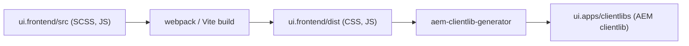

# Building a Custom AEM Component

This guide walks through creating a custom AEM component from start to finish. Every artifact is covered:
component definition, dialog, design dialog, Sling Model, OSGi service, HTL template, dialog clientlib,
runtime clientlib, and `ui.frontend` integration.

The running example is a **Featured Article Card** component that displays a title, summary, optional image,
publication date, and a call-to-action link.

## Prerequisites

- An AEM project generated from the [AEM Project Archetype](https://github.com/adobe/aem-project-archetype)
- [Core Components](https://github.com/adobe/aem-core-wcm-components) installed (bundled by the archetype)
- Familiarity with the AEM project module structure:

```text
myproject/
  core/           <-- Java code: Sling Models, OSGi services, servlets
  ui.apps/        <-- AEM components, dialogs, HTL templates, clientlibs
  ui.config/      <-- OSGi configurations (by run mode)
  ui.content/     <-- Sample content, templates, policies
  ui.frontend/    <-- Webpack/Vite build: SCSS, JS, compiled into clientlibs
  all/            <-- Container package that embeds everything
```

## Component File Structure

A complete custom component lives across `ui.apps` and `core`:

```text title="ui.apps/src/main/content/jcr_root/apps/myproject/components/articlecard/"
articlecard/
  .content.xml                          <-- Component definition
  articlecard.html                      <-- HTL template
  _cq_dialog/.content.xml              <-- Author dialog
  _cq_design_dialog/.content.xml       <-- Design dialog (template policy)
  _cq_editConfig.xml                   <-- Edit configuration (optional)
  clientlibs/
    clientlib-editor/                   <-- Dialog clientlib (authoring JS)
      .content.xml
      js.txt
      js/dialog-visibility.js
    clientlib-site/                     <-- Runtime clientlib (CSS/JS)
      .content.xml
      css.txt
      css/articlecard.css
```

```text title="core/src/main/java/com/myproject/core/"
models/
  ArticleCardModel.java                 <-- Sling Model
services/
  DateFormatterService.java             <-- OSGi service interface
  impl/
    DateFormatterServiceImpl.java       <-- OSGi service implementation
```

## Step 1: Component Definition

The `.content.xml` file registers the component with AEM. There are two approaches.

### Approach A: Extending a Core Component (Recommended)

The preferred way to build components in AEM is to **extend an existing Core Component** via
`sling:resourceSuperType`. This gives you the parent's dialog fields, rendering logic, accessibility features,
and JSON exporter for free. You only override what you need to customise.

```xml title="articlecard/.content.xml"
<?xml version="1.0" encoding="UTF-8"?>
<jcr:root xmlns:jcr="http://www.jcp.org/jcr/1.0"
          xmlns:cq="http://www.day.com/jcr/cq/1.0"
          xmlns:sling="http://sling.apache.org/jcr/sling/1.0"
          jcr:primaryType="cq:Component"
          jcr:title="Featured Article Card"
          jcr:description="Displays an article with image, title, summary, date, and CTA."
          sling:resourceSuperType="core/wcm/components/teaser/v2/teaser"
          componentGroup="My Project - Content"/>
```

**Why extend?**

- You inherit the parent's dialog, HTL, Sling Model, and export behaviour
- Your HTL template automatically overrides the parent's (same script name takes priority in `/apps`)
- You can add extra dialog fields on top of the inherited ones, or hide fields you don't need with
  `sling:hideChildren` (see [Dialog Inheritance](./component-dialogs.mdx#dialog-inheritance))
- Bug fixes and accessibility improvements from Core Component updates are inherited automatically

:::tip
Even if your component looks very different from the Core Component you extend, you still benefit from
the inherited dialog, JSON export, and data layer. Override only the HTL template and Sling Model.
:::

### Approach B: Building from Scratch

When no Core Component matches your use case (e.g. a completely custom interactive widget), build
a standalone component without a super type:

```xml title="articlecard/.content.xml (standalone)"
<?xml version="1.0" encoding="UTF-8"?>
<jcr:root xmlns:jcr="http://www.jcp.org/jcr/1.0"
          xmlns:cq="http://www.day.com/jcr/cq/1.0"
          jcr:primaryType="cq:Component"
          jcr:title="Featured Article Card"
          jcr:description="Displays an article with image, title, summary, date, and CTA."
          componentGroup="My Project - Content"/>
```

:::info
The rest of this guide builds the component **from scratch** (Approach B) so that every artifact is shown
explicitly. If you chose Approach A, you would skip or simplify many of these files because they're inherited.
:::

## Step 2: The Dialog

The `_cq_dialog` defines the author-facing form. This dialog has two tabs: **Content** and **Link Settings**.

```xml title="articlecard/_cq_dialog/.content.xml"
<?xml version="1.0" encoding="UTF-8"?>
<jcr:root xmlns:sling="http://sling.apache.org/jcr/sling/1.0"
          xmlns:granite="http://www.adobe.com/jcr/granite/1.0"
          xmlns:cq="http://www.day.com/jcr/cq/1.0"
          xmlns:jcr="http://www.jcp.org/jcr/1.0"
          xmlns:nt="http://www.jcp.org/jcr/nt/1.0"
          jcr:primaryType="nt:unstructured"
          jcr:title="Featured Article Card"
          sling:resourceType="cq/gui/components/authoring/dialog">
    <content
        jcr:primaryType="nt:unstructured"
        sling:resourceType="granite/ui/components/coral/foundation/container">
        <items jcr:primaryType="nt:unstructured">
            <tabs
                jcr:primaryType="nt:unstructured"
                sling:resourceType="granite/ui/components/coral/foundation/tabs"
                maximized="{Boolean}true">
                <items jcr:primaryType="nt:unstructured">

                    <!-- ==================== Tab 1: Content ==================== -->
                    <content
                        jcr:primaryType="nt:unstructured"
                        jcr:title="Content"
                        sling:resourceType="granite/ui/components/coral/foundation/container"
                        margin="{Boolean}true">
                        <items jcr:primaryType="nt:unstructured">
                            <columns
                                jcr:primaryType="nt:unstructured"
                                sling:resourceType="granite/ui/components/coral/foundation/fixedcolumns"
                                margin="{Boolean}true">
                                <items jcr:primaryType="nt:unstructured">
                                    <column
                                        jcr:primaryType="nt:unstructured"
                                        sling:resourceType="granite/ui/components/coral/foundation/container">
                                        <items jcr:primaryType="nt:unstructured">
                                            <title
                                                jcr:primaryType="nt:unstructured"
                                                sling:resourceType="granite/ui/components/coral/foundation/form/textfield"
                                                fieldLabel="Title"
                                                fieldDescription="The article headline"
                                                name="./title"
                                                required="{Boolean}true"/>
                                            <summary
                                                jcr:primaryType="nt:unstructured"
                                                sling:resourceType="granite/ui/components/coral/foundation/form/textarea"
                                                fieldLabel="Summary"
                                                fieldDescription="A short description of the article"
                                                name="./summary"
                                                maxlength="{Long}300"/>
                                            <image
                                                jcr:primaryType="nt:unstructured"
                                                sling:resourceType="granite/ui/components/coral/foundation/form/pathfield"
                                                fieldLabel="Image"
                                                fieldDescription="Select an image from the DAM"
                                                rootPath="/content/dam"
                                                name="./imagePath"/>
                                            <publishDate
                                                jcr:primaryType="nt:unstructured"
                                                sling:resourceType="granite/ui/components/coral/foundation/form/datepicker"
                                                fieldLabel="Publication Date"
                                                displayedFormat="YYYY-MM-DD"
                                                name="./publishDate"
                                                type="date"
                                                typeHint="Date"/>
                                        </items>
                                    </column>
                                </items>
                            </columns>
                        </items>
                    </content>

                    <!-- ==================== Tab 2: Link Settings ==================== -->
                    <linkSettings
                        jcr:primaryType="nt:unstructured"
                        jcr:title="Link Settings"
                        sling:resourceType="granite/ui/components/coral/foundation/container"
                        margin="{Boolean}true">
                        <items jcr:primaryType="nt:unstructured">
                            <columns
                                jcr:primaryType="nt:unstructured"
                                sling:resourceType="granite/ui/components/coral/foundation/fixedcolumns"
                                margin="{Boolean}true">
                                <items jcr:primaryType="nt:unstructured">
                                    <column
                                        jcr:primaryType="nt:unstructured"
                                        sling:resourceType="granite/ui/components/coral/foundation/container">
                                        <items jcr:primaryType="nt:unstructured">
                                            <enableLink
                                                jcr:primaryType="nt:unstructured"
                                                sling:resourceType="granite/ui/components/coral/foundation/form/checkbox"
                                                fieldLabel="Link"
                                                name="./enableLink"
                                                text="Enable CTA link"
                                                uncheckedValue="false"
                                                value="{Boolean}true"/>
                                            <linkUrl
                                                jcr:primaryType="nt:unstructured"
                                                sling:resourceType="granite/ui/components/coral/foundation/form/pathfield"
                                                fieldLabel="Link URL"
                                                fieldDescription="Internal page or external URL"
                                                rootPath="/content"
                                                name="./linkUrl"
                                                granite:class="cmp-articlecard__dialog-link-url"/>
                                            <linkText
                                                jcr:primaryType="nt:unstructured"
                                                sling:resourceType="granite/ui/components/coral/foundation/form/textfield"
                                                fieldLabel="Link Text"
                                                fieldDescription="The CTA button label"
                                                name="./linkText"
                                                emptyText="Read more"
                                                granite:class="cmp-articlecard__dialog-link-text"/>
                                            <openInNewTab
                                                jcr:primaryType="nt:unstructured"
                                                sling:resourceType="granite/ui/components/coral/foundation/form/checkbox"
                                                name="./openInNewTab"
                                                text="Open in new tab"
                                                uncheckedValue="false"
                                                value="{Boolean}true"
                                                granite:class="cmp-articlecard__dialog-new-tab"/>
                                        </items>
                                    </column>
                                </items>
                            </columns>
                        </items>
                    </linkSettings>

                </items>
            </tabs>
        </items>
    </content>
</jcr:root>
```

For a reference of all available field types, see [Component Dialogs](./component-dialogs.mdx).

## Step 3: The Design Dialog (Template Policy)

The `_cq_design_dialog` defines fields that appear in the **template editor** under "Edit Template > Policy".
These values apply to **all instances** of the component on pages using that template. Use it for
site-wide defaults that authors should not change per instance.

```xml title="articlecard/_cq_design_dialog/.content.xml"
<?xml version="1.0" encoding="UTF-8"?>
<jcr:root xmlns:sling="http://sling.apache.org/jcr/sling/1.0"
          xmlns:jcr="http://www.jcp.org/jcr/1.0"
          xmlns:nt="http://www.jcp.org/jcr/nt/1.0"
          jcr:primaryType="nt:unstructured"
          jcr:title="Featured Article Card - Policy"
          sling:resourceType="cq/gui/components/authoring/dialog">
    <content
        jcr:primaryType="nt:unstructured"
        sling:resourceType="granite/ui/components/coral/foundation/container">
        <items jcr:primaryType="nt:unstructured">
            <tabs
                jcr:primaryType="nt:unstructured"
                sling:resourceType="granite/ui/components/coral/foundation/tabs"
                maximized="{Boolean}true">
                <items jcr:primaryType="nt:unstructured">
                    <properties
                        jcr:primaryType="nt:unstructured"
                        jcr:title="Settings"
                        sling:resourceType="granite/ui/components/coral/foundation/container"
                        margin="{Boolean}true">
                        <items jcr:primaryType="nt:unstructured">
                            <columns
                                jcr:primaryType="nt:unstructured"
                                sling:resourceType="granite/ui/components/coral/foundation/fixedcolumns"
                                margin="{Boolean}true">
                                <items jcr:primaryType="nt:unstructured">
                                    <column
                                        jcr:primaryType="nt:unstructured"
                                        sling:resourceType="granite/ui/components/coral/foundation/container">
                                        <items jcr:primaryType="nt:unstructured">
                                            <headingLevel
                                                jcr:primaryType="nt:unstructured"
                                                sling:resourceType="granite/ui/components/coral/foundation/form/select"
                                                fieldLabel="Heading Level"
                                                fieldDescription="Applied to all article card titles on this template"
                                                name="./headingLevel">
                                                <items jcr:primaryType="nt:unstructured">
                                                    <h2 jcr:primaryType="nt:unstructured" text="H2" value="h2" selected="{Boolean}true"/>
                                                    <h3 jcr:primaryType="nt:unstructured" text="H3" value="h3"/>
                                                    <h4 jcr:primaryType="nt:unstructured" text="H4" value="h4"/>
                                                </items>
                                            </headingLevel>
                                            <maxSummaryLength
                                                jcr:primaryType="nt:unstructured"
                                                sling:resourceType="granite/ui/components/coral/foundation/form/numberfield"
                                                fieldLabel="Max Summary Length"
                                                fieldDescription="Truncate summaries to this many characters (0 = no limit)"
                                                name="./maxSummaryLength"
                                                min="{Long}0"
                                                max="{Long}500"
                                                value="{Long}150"/>
                                            <showImage
                                                jcr:primaryType="nt:unstructured"
                                                sling:resourceType="granite/ui/components/coral/foundation/form/checkbox"
                                                name="./showImage"
                                                text="Show image"
                                                checked="{Boolean}true"
                                                uncheckedValue="false"
                                                value="{Boolean}true"/>
                                        </items>
                                    </column>
                                </items>
                            </columns>
                        </items>
                    </properties>
                </items>
            </tabs>
        </items>
    </content>
</jcr:root>
```

**When to use which dialog:**

| | Regular Dialog (`_cq_dialog`) | Design Dialog (`_cq_design_dialog`) |
|---|---|---|
| **Scope** | Per component instance | Per template (all instances) |
| **Edited by** | Content author | Template author / developer |
| **Where** | Page editor > component > wrench icon | Template editor > component > policy icon |
| **Use for** | Content: title, text, links, images | Defaults: heading level, max items, feature toggles |

## Step 4: The OSGi Service

Business logic that may be shared across multiple components should live in an OSGi service.
For our article card, we create a `DateFormatterService` that formats publication dates according to
a configurable pattern and locale.

### Service interface

```java title="core/src/main/java/com/myproject/core/services/DateFormatterService.java"
package com.myproject.core.services;

import java.util.Calendar;

/**
 * Formats dates for display on the frontend.
 */
public interface DateFormatterService {

    /**
     * Formats a Calendar value into a human-readable string.
     *
     * @param date the date to format
     * @return formatted date string, or empty string if date is null
     */
    String format(Calendar date);
}
```

### Service implementation

```java title="core/src/main/java/com/myproject/core/services/impl/DateFormatterServiceImpl.java"
package com.myproject.core.services.impl;

import com.myproject.core.services.DateFormatterService;
import org.osgi.service.component.annotations.Activate;
import org.osgi.service.component.annotations.Component;
import org.osgi.service.metatype.annotations.AttributeDefinition;
import org.osgi.service.metatype.annotations.Designate;
import org.osgi.service.metatype.annotations.ObjectClassDefinition;
import org.slf4j.Logger;
import org.slf4j.LoggerFactory;

import java.text.SimpleDateFormat;
import java.util.Calendar;
import java.util.Locale;

@Component(service = DateFormatterService.class)
@Designate(ocd = DateFormatterServiceImpl.Config.class)
public class DateFormatterServiceImpl implements DateFormatterService {

    private static final Logger LOG = LoggerFactory.getLogger(DateFormatterServiceImpl.class);

    @ObjectClassDefinition(name = "Date Formatter Service Configuration")
    @interface Config {

        @AttributeDefinition(
            name = "Date Pattern",
            description = "SimpleDateFormat pattern (e.g. 'MMMM d, yyyy')"
        )
        String datePattern() default "MMMM d, yyyy";

        @AttributeDefinition(
            name = "Locale",
            description = "Locale tag for date formatting (e.g. 'en_US', 'de_DE')"
        )
        String locale() default "en_US";
    }

    private String datePattern;
    private Locale locale;

    @Activate
    protected void activate(Config config) {
        this.datePattern = config.datePattern();
        this.locale = Locale.forLanguageTag(config.locale().replace('_', '-'));
        LOG.debug("DateFormatterService activated with pattern='{}', locale='{}'", datePattern, locale);
    }

    @Override
    public String format(Calendar date) {
        if (date == null) {
            return "";
        }
        try {
            SimpleDateFormat sdf = new SimpleDateFormat(datePattern, locale);
            return sdf.format(date.getTime());
        } catch (IllegalArgumentException e) {
            LOG.warn("Invalid date pattern '{}', falling back to ISO format", datePattern, e);
            return date.toInstant().toString();
        }
    }
}
```

### OSGi configuration

```json title="ui.config/src/main/content/jcr_root/apps/myproject/osgiconfig/config/com.myproject.core.services.impl.DateFormatterServiceImpl.cfg.json"
{
    "datePattern": "MMMM d, yyyy",
    "locale": "en_US"
}
```

You can create run-mode-specific variants:

```text
ui.config/src/main/content/jcr_root/apps/myproject/osgiconfig/
  config/                                <-- all environments (fallback)
    com.myproject.core.services.impl.DateFormatterServiceImpl.cfg.json
  config.author.dev/                     <-- author + dev only
    com.myproject.core.services.impl.DateFormatterServiceImpl.cfg.json
```

## Step 5: The Sling Model

The Sling Model is the backbone of the component. It reads authored properties, calls services, reads
policy values, and exposes computed data to the HTL template.

```java title="core/src/main/java/com/myproject/core/models/ArticleCardModel.java"
package com.myproject.core.models;

import com.day.cq.wcm.api.policies.ContentPolicy;
import com.day.cq.wcm.api.policies.ContentPolicyManager;
import com.fasterxml.jackson.annotation.JsonProperty;
import com.myproject.core.services.DateFormatterService;

import org.apache.commons.lang3.StringUtils;
import org.apache.sling.api.SlingHttpServletRequest;
import org.apache.sling.api.resource.Resource;
import org.apache.sling.models.annotations.Default;
import org.apache.sling.models.annotations.DefaultInjectionStrategy;
import org.apache.sling.models.annotations.Exporter;
import org.apache.sling.models.annotations.Model;
import org.apache.sling.models.annotations.injectorspecific.OSGiService;
import org.apache.sling.models.annotations.injectorspecific.SlingObject;
import org.apache.sling.models.annotations.injectorspecific.ValueMapValue;
import com.adobe.cq.export.json.ComponentExporter;

import javax.annotation.PostConstruct;
import java.util.Calendar;

@Model(
    adaptables = SlingHttpServletRequest.class,
    adapters = {ArticleCardModel.class, ComponentExporter.class},
    resourceType = ArticleCardModel.RESOURCE_TYPE,
    defaultInjectionStrategy = DefaultInjectionStrategy.OPTIONAL
)
@Exporter(name = "jackson", extensions = "json")
public class ArticleCardModel implements ComponentExporter {

    static final String RESOURCE_TYPE = "myproject/components/articlecard";

    // ──────────────────────────── Dialog properties ────────────────────────────

    @ValueMapValue
    private String title;

    @ValueMapValue
    private String summary;

    @ValueMapValue
    private String imagePath;

    @ValueMapValue
    private Calendar publishDate;

    @ValueMapValue
    @Default(booleanValues = false)
    private boolean enableLink;

    @ValueMapValue
    private String linkUrl;

    @ValueMapValue
    private String linkText;

    @ValueMapValue
    @Default(booleanValues = false)
    private boolean openInNewTab;

    // ──────────────────────────── Injected services ────────────────────────────

    @OSGiService
    private DateFormatterService dateFormatterService;

    @SlingObject
    private Resource resource;

    // ──────────────────────────── Policy (design dialog) values ────────────────

    private String headingLevel;
    private int maxSummaryLength;
    private boolean showImage;

    @PostConstruct
    protected void init() {
        // Read template policy values
        ContentPolicyManager policyManager = resource.getResourceResolver()
            .adaptTo(ContentPolicyManager.class);
        if (policyManager != null) {
            ContentPolicy policy = policyManager.getPolicy(resource);
            if (policy != null) {
                headingLevel = policy.getProperties().get("headingLevel", "h2");
                maxSummaryLength = policy.getProperties().get("maxSummaryLength", 150);
                showImage = policy.getProperties().get("showImage", true);
            }
        }
        // Apply defaults if policy not found
        if (headingLevel == null) {
            headingLevel = "h2";
        }
    }

    // ──────────────────────────── Getters (used by HTL) ───────────────────────

    @JsonProperty("title")
    public String getTitle() {
        return title;
    }

    public String getSummary() {
        if (StringUtils.isBlank(summary)) {
            return "";
        }
        if (maxSummaryLength > 0 && summary.length() > maxSummaryLength) {
            return summary.substring(0, maxSummaryLength).trim() + "\u2026";
        }
        return summary;
    }

    public String getImagePath() {
        return imagePath;
    }

    public boolean isShowImage() {
        return showImage && StringUtils.isNotBlank(imagePath);
    }

    public String getFormattedDate() {
        return dateFormatterService != null ? dateFormatterService.format(publishDate) : "";
    }

    public boolean isEnableLink() {
        return enableLink && StringUtils.isNotBlank(linkUrl);
    }

    public String getLinkUrl() {
        return linkUrl;
    }

    public String getLinkText() {
        return StringUtils.defaultIfBlank(linkText, "Read more");
    }

    public boolean isOpenInNewTab() {
        return openInNewTab;
    }

    public String getHeadingLevel() {
        return headingLevel;
    }

    public boolean isEmpty() {
        return StringUtils.isBlank(title);
    }

    @Override
    public String getExportedType() {
        return RESOURCE_TYPE;
    }
}
```

**Key patterns used:**

| Pattern | Annotation / API | Purpose |
|---------|------------------|---------|
| Dialog values | `@ValueMapValue` | Reads properties from the component's `jcr:content` node |
| Default values | `@Default(booleanValues = false)` | Fallback when property is missing |
| OSGi service | `@OSGiService` | Injects the `DateFormatterService` |
| Policy values | `ContentPolicyManager` | Reads design dialog values from the template policy |
| JSON export | `@Exporter` + `ComponentExporter` | Enables `.model.json` output |

## Step 6: The HTL Template

The HTL template renders the Sling Model's data into HTML. It follows
[BEM naming](https://getbem.com/naming/) for CSS classes.

```html title="articlecard/articlecard.html"
<sly data-sly-use.model="com.myproject.core.models.ArticleCardModel"/>
<sly data-sly-use.clientlib="/libs/granite/sightly/templates/clientlib.html"/>

<sly data-sly-test.hasContent="${!model.empty}">
    <article class="cmp-articlecard">

        <!-- Image -->
        <div data-sly-test="${model.showImage}" class="cmp-articlecard__image">
            
        </div>

        <!-- Content -->
        <div class="cmp-articlecard__content">

            <!-- Title with configurable heading level from design dialog -->
            <h2 data-sly-element="${model.headingLevel}"
                class="cmp-articlecard__title">
                ${model.title}
            </h2>

            <!-- Publication date -->
            <time data-sly-test="${model.formattedDate}"
                  class="cmp-articlecard__date">
                ${model.formattedDate}
            </time>

            <!-- Summary -->
            <p data-sly-test="${model.summary}"
               class="cmp-articlecard__summary">
                ${model.summary}
            </p>

            <!-- CTA link -->
            <a data-sly-test="${model.enableLink}"
               class="cmp-articlecard__cta"
               href="${model.linkUrl @ context='uri'}"
               target="${model.openInNewTab ? '_blank' : ''}"
               rel="${model.openInNewTab ? 'noopener noreferrer' : ''}">
                ${model.linkText}
            </a>
        </div>

    </article>
</sly>

<!-- Author-mode placeholder when component is empty -->
<sly data-sly-test="${!hasContent && wcmmode.edit}">
    <div class="cq-placeholder" data-emptytext="Featured Article Card: click to configure"></div>
</sly>

<!-- Load component clientlib -->
<sly data-sly-call="${clientlib.css @ categories='myproject.components.articlecard'}"/>
```

**Key techniques used:**

- `data-sly-element="${model.headingLevel}"` -- dynamic heading level from design dialog
- `@ context='uri'` -- XSS-safe URL rendering
- `@ context='attribute'` -- XSS-safe attribute rendering
- `data-sly-test` -- conditional rendering (image, date, link)
- `wcmmode.edit` -- author-mode placeholder for empty components
- `clientlib.css` -- loads the component's runtime CSS

## Step 7: The Dialog Clientlib

A dialog clientlib contains JavaScript that runs **inside the Touch UI dialog** (not on the published page).
Use it for show/hide logic, custom validation, or dynamic behaviour in the authoring form.

```xml title="articlecard/clientlibs/clientlib-editor/.content.xml"
<?xml version="1.0" encoding="UTF-8"?>
<jcr:root xmlns:cq="http://www.day.com/jcr/cq/1.0"
          xmlns:jcr="http://www.jcp.org/jcr/1.0"
          jcr:primaryType="cq:ClientLibraryFolder"
          categories="[cq.authoring.dialog]"
          allowProxy="{Boolean}true"/>
```

```text title="articlecard/clientlibs/clientlib-editor/js.txt"
#base=js
dialog-visibility.js
```

This JS toggles the visibility of link URL, link text, and new-tab checkbox based on the "Enable CTA link"
checkbox:

```js title="articlecard/clientlibs/clientlib-editor/js/dialog-visibility.js"
(function ($document) {
    'use strict';

    var CHECKBOX_SELECTOR = '[name="./enableLink"]';
    var LINK_FIELDS_SELECTORS = [
        '.cmp-articlecard__dialog-link-url',
        '.cmp-articlecard__dialog-link-text',
        '.cmp-articlecard__dialog-new-tab'
    ].join(',');

    function toggleLinkFields() {
        var checkbox = document.querySelector(CHECKBOX_SELECTOR);
        if (!checkbox) return;

        var isChecked = checkbox.checked;
        document.querySelectorAll(LINK_FIELDS_SELECTORS).forEach(function (el) {
            el.hidden = !isChecked;
        });
    }

    // Run on dialog open and when the checkbox changes
    $document.on('dialog-ready', toggleLinkFields);
    $document.on('change', CHECKBOX_SELECTOR, toggleLinkFields);

})(jQuery(document));
```

:::info
The `cq.authoring.dialog` category is automatically loaded by AEM when any Touch UI dialog is opened.
This means your JS runs for **all** dialogs on the instance. Use specific selectors (like the
`granite:class` values set in the dialog XML) to scope your logic to this component only.
:::

For more show/hide patterns, see [Component Dialogs -- Dynamic show/hide](./component-dialogs.mdx#dynamic-showhide-based-on-a-selection).

## Step 8: The Component Clientlib (Runtime CSS/JS)

This clientlib is loaded on the published page and contains the component's styles and optional JavaScript.

```xml title="articlecard/clientlibs/clientlib-site/.content.xml"
<?xml version="1.0" encoding="UTF-8"?>
<jcr:root xmlns:cq="http://www.day.com/jcr/cq/1.0"
          xmlns:jcr="http://www.jcp.org/jcr/1.0"
          jcr:primaryType="cq:ClientLibraryFolder"
          categories="[myproject.components.articlecard]"
          allowProxy="{Boolean}true"/>
```

```text title="articlecard/clientlibs/clientlib-site/css.txt"
#base=css
articlecard.css
```

```css title="articlecard/clientlibs/clientlib-site/css/articlecard.css"
.cmp-articlecard {
    display: flex;
    flex-direction: column;
    border: 1px solid #e0e0e0;
    border-radius: 8px;
    overflow: hidden;
    transition: box-shadow 0.2s ease;
}

.cmp-articlecard:hover {
    box-shadow: 0 4px 12px rgba(0, 0, 0, 0.1);
}

.cmp-articlecard__image img {
    width: 100%;
    height: 200px;
    object-fit: cover;
    display: block;
}

.cmp-articlecard__content {
    padding: 1.25rem;
    display: flex;
    flex-direction: column;
    gap: 0.5rem;
}

.cmp-articlecard__title {
    margin: 0;
    font-size: 1.25rem;
    line-height: 1.3;
}

.cmp-articlecard__date {
    font-size: 0.85rem;
    color: #666;
}

.cmp-articlecard__summary {
    margin: 0;
    color: #333;
    line-height: 1.5;
}

.cmp-articlecard__cta {
    display: inline-block;
    margin-top: 0.5rem;
    padding: 0.5rem 1rem;
    background-color: #0055ff;
    color: #fff;
    text-decoration: none;
    border-radius: 4px;
    font-weight: 600;
    align-self: flex-start;
    transition: background-color 0.2s ease;
}

.cmp-articlecard__cta:hover {
    background-color: #003ecb;
}
```

:::tip
**Inline clientlibs vs `ui.frontend`**: For small components with minimal CSS, inline clientlibs
(like above) are simple and self-contained. For larger projects with SCSS, TypeScript, or shared design
tokens, use the `ui.frontend` module (see next section). Both approaches can coexist.
:::

## Frontend via ui.frontend Module

The `ui.frontend` module provides a modern build pipeline (webpack or Vite) that compiles SCSS, TypeScript/ES6+,
and other assets into production-ready clientlibs. This is the recommended approach for projects with a dedicated
frontend team or complex design system requirements.

### How it works



1. Source files (SCSS, JS/TS) live in `ui.frontend/src/`
2. The build tool (webpack by default) compiles and bundles them into `ui.frontend/dist/`
3. `aem-clientlib-generator` copies the output into `ui.apps/src/main/content/jcr_root/apps/myproject/clientlibs/`
4. Maven packages everything into the content package for deployment

### Directory structure

```text title="ui.frontend/src/main/webpack/"
components/
  _articlecard.scss                <-- Component-specific SCSS
  articlecard.js                   <-- Component-specific JS (optional)
site/
  main.scss                        <-- Main SCSS entry (imports all components)
  main.js                          <-- Main JS entry (imports all components)
```

### Component SCSS

```scss title="ui.frontend/src/main/webpack/components/_articlecard.scss"
.cmp-articlecard {
    display: flex;
    flex-direction: column;
    border: 1px solid $color-border;       // shared design token
    border-radius: $border-radius-md;
    overflow: hidden;
    transition: box-shadow 0.2s ease;

    &:hover {
        box-shadow: 0 4px 12px rgba(0, 0, 0, 0.1);
    }

    &__image img {
        width: 100%;
        height: 200px;
        object-fit: cover;
        display: block;
    }

    &__content {
        padding: $spacing-md;
        display: flex;
        flex-direction: column;
        gap: $spacing-sm;
    }

    &__title {
        margin: 0;
        font-size: $font-size-lg;
        line-height: 1.3;
    }

    &__date {
        font-size: $font-size-sm;
        color: $color-text-muted;
    }

    &__summary {
        margin: 0;
        line-height: 1.5;
    }

    &__cta {
        @include button-primary;            // shared mixin
        align-self: flex-start;
        margin-top: $spacing-sm;
    }
}
```

### Import into main entry

```scss title="ui.frontend/src/main/webpack/site/main.scss"
// Base and utilities
@import '../base/variables';
@import '../base/mixins';
@import '../base/reset';

// Components
@import '../components/articlecard';
// ... other components
```

```js title="ui.frontend/src/main/webpack/site/main.js"
// Component JS (if any interactive behaviour is needed)
import '../components/articlecard.js';
```

### Clientlib generator config

The `clientlib.config.js` in the `ui.frontend` root maps build output to AEM clientlib categories:

```js title="ui.frontend/clientlib.config.js"
module.exports = [
    {
        name: 'clientlib-site',
        categories: ['myproject.site'],
        serializationFormat: 'xml',
        cssProcessor: ['default:none', 'min:none'],    // already minified by webpack
        jsProcessor: ['default:none', 'min:none'],
        assets: {
            js: ['dist/**/*.js'],
            css: ['dist/**/*.css'],
        },
    },
    // Separate clientlib for dependencies (vendor libs) if needed
    {
        name: 'clientlib-dependencies',
        categories: ['myproject.dependencies'],
        serializationFormat: 'xml',
        assets: {
            js: ['dist/vendors~*.js'],
        },
    },
];
```

### Build commands

```bash
# Full build + deploy to local AEM
mvn clean install -PautoInstallSinglePackage

# Frontend-only build (faster iteration)
cd ui.frontend
npm run dev          # watch mode with hot-reload (if configured)
npm run build        # production build

# Deploy only ui.apps after a frontend build
cd ../ui.apps
mvn clean install -PautoInstallPackage
```

### When to use which approach

| | Inline component clientlibs | ui.frontend module |
|---|---|---|
| **Best for** | Small projects, few components, plain CSS/JS | Design systems, SCSS, TypeScript, shared tokens |
| **Build tool** | None (raw CSS/JS deployed as-is) | webpack, Vite, or similar |
| **Shared variables** | Not possible (plain CSS) | SCSS variables, mixins, design tokens |
| **Team** | Full-stack developer | Dedicated frontend developer(s) |
| **Hot reload** | No (manual deploy) | Yes (with `npm run dev`) |
| **Can coexist?** | Yes -- dialog clientlibs are always inline | Yes -- runtime clientlibs can come from either |

:::tip
For most projects, use `ui.frontend` for the main site bundle (compiled SCSS + JS shared across all
components) and inline clientlibs only for dialog-specific authoring JS. This gives you the best of both
worlds: a modern build pipeline for production CSS/JS and simple inline scripts for authoring UX.
:::

## Unit Testing the Sling Model

Test your model with [wcm.io AEM Mocks](https://wcm.io/testing/aem-mock/) or the
[AEM SDK testing utilities](https://experienceleague.adobe.com/en/docs/experience-manager-cloud-service/content/implementing/developing/aem-project-content-package-structure).

```java title="core/src/test/java/com/myproject/core/models/ArticleCardModelTest.java"
package com.myproject.core.models;

import com.myproject.core.services.DateFormatterService;
import io.wcm.testing.mock.aem.junit5.AemContext;
import io.wcm.testing.mock.aem.junit5.AemContextExtension;
import org.junit.jupiter.api.BeforeEach;
import org.junit.jupiter.api.Test;
import org.junit.jupiter.api.extension.ExtendWith;

import java.util.Calendar;
import java.util.GregorianCalendar;

import static org.junit.jupiter.api.Assertions.*;
import static org.mockito.ArgumentMatchers.any;
import static org.mockito.Mockito.mock;
import static org.mockito.Mockito.when;

@ExtendWith(AemContextExtension.class)
class ArticleCardModelTest {

    private final AemContext context = new AemContext();

    private DateFormatterService dateFormatterService;

    @BeforeEach
    void setUp() {
        // Register a mock OSGi service
        dateFormatterService = mock(DateFormatterService.class);
        when(dateFormatterService.format(any(Calendar.class))).thenReturn("March 15, 2025");
        context.registerService(DateFormatterService.class, dateFormatterService);
    }

    @Test
    void testGetTitle() {
        // Set up content
        context.create().resource("/content/page/jcr:content/articlecard",
            "sling:resourceType", ArticleCardModel.RESOURCE_TYPE,
            "title", "Test Article",
            "summary", "A short summary for testing purposes.",
            "publishDate", new GregorianCalendar(2025, Calendar.MARCH, 15)
        );

        context.currentResource("/content/page/jcr:content/articlecard");

        // Adapt to model
        ArticleCardModel model = context.request().adaptTo(ArticleCardModel.class);

        assertNotNull(model);
        assertEquals("Test Article", model.getTitle());
        assertEquals("A short summary for testing purposes.", model.getSummary());
        assertEquals("March 15, 2025", model.getFormattedDate());
        assertFalse(model.isEmpty());
    }

    @Test
    void testEmptyComponent() {
        context.create().resource("/content/page/jcr:content/empty",
            "sling:resourceType", ArticleCardModel.RESOURCE_TYPE
        );
        context.currentResource("/content/page/jcr:content/empty");

        ArticleCardModel model = context.request().adaptTo(ArticleCardModel.class);

        assertNotNull(model);
        assertTrue(model.isEmpty());
    }
}
```

## Component Registration and Allowed Components

### Component group

The `componentGroup` property in `.content.xml` determines where the component appears in the editor's
component browser:

```xml
componentGroup="My Project - Content"
```

Components without a `componentGroup` (or with the group set to `.hidden`) are not shown in the browser
but can still be used programmatically or via template policies.

### Configuring allowed components in template policies

In the **template editor**:

1. Open a template > **Structure** mode
2. Click the policy icon on a layout container
3. Under **Allowed Components**, check your component's group ("My Project - Content")
4. Save

This is stored in the repository under `/conf/myproject/settings/wcm/policies/`.

### Editable vs static templates

| | Editable templates | Static templates (legacy) |
|---|---|---|
| **Component policies** | Managed in template editor UI | Hardcoded in design mode |
| **Allowed components** | Per-container policy | `cq:allowedTemplates` / design cells |
| **Recommendation** | Always use for new projects | Only maintain for legacy projects |

## Edit Configuration (Optional)

The `_cq_editConfig.xml` lets you customise the editor behaviour (drag-and-drop, in-place editing,
action toolbars):

```xml title="articlecard/_cq_editConfig.xml"
<?xml version="1.0" encoding="UTF-8"?>
<jcr:root xmlns:cq="http://www.day.com/jcr/cq/1.0"
          xmlns:jcr="http://www.jcp.org/jcr/1.0"
          xmlns:nt="http://www.jcp.org/jcr/nt/1.0"
          cq:actions="[edit,delete,insert,copymove]"
          cq:dialogMode="floating"
          cq:layout="editbar"
          jcr:primaryType="cq:EditConfig">
    <cq:dropTargets jcr:primaryType="nt:unstructured">
        <image
            jcr:primaryType="cq:DropTargetConfig"
            accept="[image/.*]"
            groups="[media]"
            propertyName="./imagePath"/>
    </cq:dropTargets>
</jcr:root>
```

This enables drag-and-drop of images from the asset finder directly onto the component, setting the
`imagePath` property automatically.

## Complete File Reference

Here is every file created for the Featured Article Card, for quick reference:

```text
ui.apps/src/main/content/jcr_root/apps/myproject/components/articlecard/
  .content.xml                                    Component definition
  articlecard.html                                 HTL template
  _cq_dialog/.content.xml                         Author dialog (2 tabs)
  _cq_design_dialog/.content.xml                  Design dialog (template policy)
  _cq_editConfig.xml                              Drag-and-drop config
  clientlibs/
    clientlib-editor/.content.xml                  Dialog clientlib definition
    clientlib-editor/js.txt                        JS file list
    clientlib-editor/js/dialog-visibility.js       Show/hide logic for link fields
    clientlib-site/.content.xml                    Runtime clientlib definition
    clientlib-site/css.txt                         CSS file list
    clientlib-site/css/articlecard.css              Component styles

core/src/main/java/com/myproject/core/
  models/ArticleCardModel.java                     Sling Model
  services/DateFormatterService.java               OSGi service interface
  services/impl/DateFormatterServiceImpl.java      OSGi service implementation

core/src/test/java/com/myproject/core/
  models/ArticleCardModelTest.java                 Unit test

ui.config/src/main/content/jcr_root/apps/myproject/osgiconfig/
  config/
    com.myproject.core.services.impl.DateFormatterServiceImpl.cfg.json

ui.frontend/src/main/webpack/
  components/_articlecard.scss                      SCSS (if using ui.frontend)
  components/articlecard.js                         JS (if using ui.frontend)
```

## See also

- [Architecture](./architecture.mdx)
- [Components](./components.mdx)
- [Core Components](./core-components.mdx)
- [Component Dialogs](./component-dialogs.mdx)
- [Dialog Validation](./dialog-validation.mdx)
- [Sling Models](./sling-models.mdx)
- [HTL Templates](./htl-templates.mdx)
- [Client Libraries](./client-libraries.mdx)
- [OSGi Configuration](./osgi-configuration.mdx)
- [AEM Core Components (GitHub)](https://github.com/adobe/aem-core-wcm-components)
- [AEM Project Archetype](https://github.com/adobe/aem-project-archetype)
- [Granite UI Component Reference](https://developer.adobe.com/experience-manager/reference-materials/6-5/granite-ui/api/jcr_root/libs/granite/ui/components/coral/foundation/server.html)
