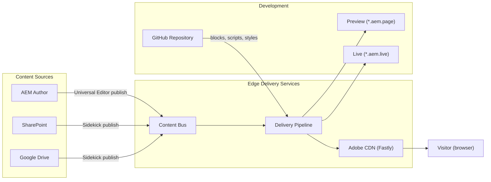

# Architecture

EDS separates **content** from **code**. Content is authored in AEM, SharePoint, or
Google Drive and stored in the **Content Bus**. Code (blocks, scripts, styles) lives in
GitHub. The **Delivery Pipeline** combines both at request time and serves the result
through the **CDN**. Each side can be deployed independently, which is why both content
publishes and code pushes propagate in seconds.

## High-level flow

## Content Bus

The **Content Bus** is the central content store. When an author publishes from AEM,
SharePoint, or Google Drive, the content is normalised into a simple HTML + metadata
representation and stored in the Content Bus. Two important properties:

- **Source-agnostic shape** -- every authoring source converges on the same structure
  before it reaches the pipeline. A `hero` block from a Word document and a `hero`
  component from Universal Editor produce the same intermediate HTML.
- **Two states per resource** -- every URL has a **preview** and a **live** copy. The
  preview is what authors see immediately; the live copy only updates when they click
  Publish.

## Delivery Pipeline

The pipeline combines content from the Content Bus with frontend code from GitHub:

1. **Content fetch** -- HTML fragments from the Content Bus
2. **Block decoration** -- each block's JavaScript / CSS is loaded on demand
3. **Optimisation** -- HTML minified, images lazy-loaded, CSS / JS inlined where useful
4. **Caching** -- aggressive CDN caching with instant purge on publish

The pipeline is stateless. There is no server state per visitor; personalisation happens
either at the edge ([experimentation](./experimentation.mdx) audiences) or in the
client.

## CDN layer

EDS uses **Fastly** as its built-in CDN (Adobe-managed). You can also bring your own CDN
(Akamai, Cloudflare, etc.) and place it in front of the `*.aem.live` origin.

Key behaviours:

- **Stale-while-revalidate** for near-zero latency on cache misses
- **Instant purge** when content or code changes (push-invalidation)
- **Edge-side personalisation** via the experimentation framework
- **Bot detection** and traffic management

## URL tiers

| Tier | URL pattern | Purpose |
|------|-------------|---------|
| **Preview** | `https://main--{repo}--{org}.aem.page/` | Author preview, not cached |
| **Live** | `https://main--{repo}--{org}.aem.live/` | Production-ready, cached, used as CDN origin |
| **Production** | `https://www.example.com/` | Custom domain via CDN (Adobe or BYO) |

The legacy `hlx.page` / `hlx.live` hostnames are still served and resolve to the same
origin -- you'll see both in older repos and tooling.

The branch in the URL matters. `main` is the default; pushing to a feature branch gives
you `https://feature--{repo}--{org}.aem.page/`, which is invaluable for review.

## push-invalidation

When content or code changes, EDS sends a purge request to the CDN. With the
Adobe-managed CDN this is automatic; with a BYO CDN you configure a webhook endpoint
that accepts EDS purge calls so pages update within seconds rather than waiting for TTL
expiry. See [Customizing](./customizing.mdx#bring-your-own-cdn) for the configuration.

## Where state lives

| State | Where it lives |
|-------|---------------|
| **Authored content** | AEM repository, SharePoint, or Google Drive |
| **Normalised content** | Content Bus (Adobe-managed) |
| **Frontend code** | GitHub repository |
| **Cached HTML** | CDN edge |
| **Visitor session** | Browser only (no per-visitor server state) |
| **Experimentation assignment** | Cookie + edge-resolved audience |

## See also

- [Authoring models](./authoring.mdx)
- [Development](./development.mdx) -- GitHub flow and local dev
- [Performance](./performance.mdx) -- how the pipeline keeps Lighthouse at 100
- [Admin API](./admin-api.mdx) -- programmatic preview / publish / purge
