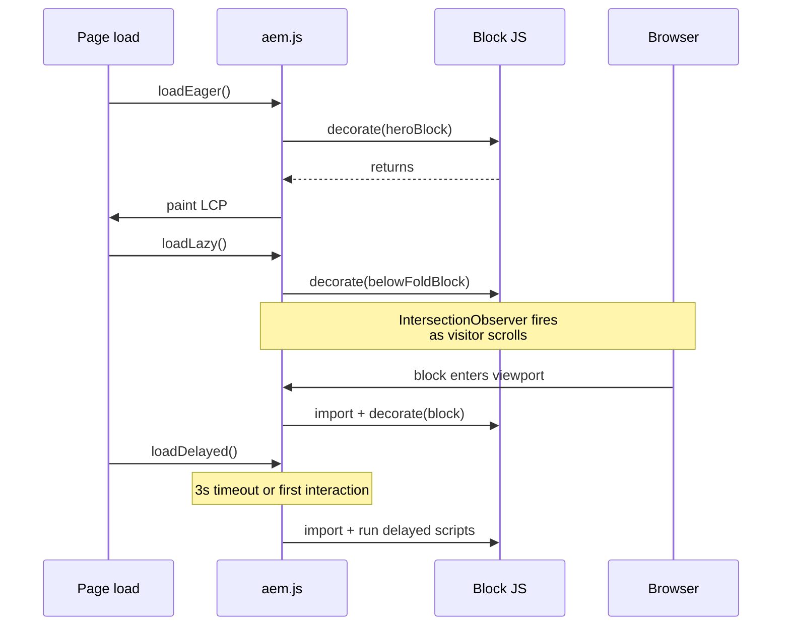

# Blocks

In EDS, **blocks** replace AEM components. A block is a folder in your GitHub repository
with a JavaScript file and a CSS file. The author types a block name into a table (or
selects one in Universal Editor) and EDS turns it into a `<div>` with the block name as
its class. Your `decorate()` function then has free rein to restructure the DOM into
whatever semantic markup the design needs.

```
/blocks/
  /hero/
    hero.js
    hero.css
  /cards/
    cards.js
    cards.css
```

## From table to DOM

A document like this:

```
| Hero                    |
|-------------------------|
|    |
| Welcome to our site     |
| [Get started](/start)   |
```

Becomes (before decoration):

```html
<div class="hero block" data-block-name="hero" data-block-status="initialized">
    <div>
        <div><picture></picture></div>
    </div>
    <div>
        <div>Welcome to our site</div>
    </div>
    <div>
        <div><a href="/start">Get started</a></div>
    </div>
</div>
```

Each row of the original table becomes a `<div>` (a row), and each cell becomes a
nested `<div>` (a cell). Heading levels, links, and images are preserved verbatim from
the source.

## Block lifecycle

Every block exports a default `decorate(block)` function. The runtime calls it once,
after the block element is in the DOM. The block goes through three phases driven by
`scripts/aem.js`:



| Phase | When | Used for |
|-------|------|----------|
| **Eager** | Before LCP | Above-the-fold blocks (hero, primary nav) |
| **Lazy** | After LCP, on viewport entry | Below-the-fold blocks |
| **Delayed** | 3s after load or first user interaction | Analytics, chat, A/B testing |

You don't usually pick the phase per block -- `aem.js` decides based on the block's
position. You can override in `scripts/scripts.js` if needed.

## Writing a block

```javascript title="/blocks/hero/hero.js"
export default function decorate(block) {
    // block is the <div class="hero block"> element
    const image = block.querySelector('picture');
    const heading = block.querySelector('h1, h2, h3');
    const cta = block.querySelector('a');

    // Restructure for semantic HTML
    block.innerHTML = '';

    const content = document.createElement('div');
    content.classList.add('hero-content');
    if (heading) content.append(heading);
    if (cta) {
        cta.classList.add('hero-cta', 'button', 'primary');
        content.append(cta);
    }

    if (image) block.append(image);
    block.append(content);
}
```

```css title="/blocks/hero/hero.css"
.hero {
    position: relative;
    min-height: 400px;
    display: flex;
    align-items: center;
}

.hero picture img {
    position: absolute;
    inset: 0;
    width: 100%;
    height: 100%;
    object-fit: cover;
}

.hero .hero-content {
    position: relative;
    z-index: 1;
    padding: 2rem;
    max-width: 600px;
}
```

## Reading rows and cells

For multi-row blocks (like cards or accordions), iterate the rows directly:

```javascript title="/blocks/cards/cards.js"
export default function decorate(block) {
    const list = document.createElement('ul');

    [...block.children].forEach((row) => {
        const li = document.createElement('li');
        const cells = [...row.children];

        // First cell: image; second cell: text content
        const [imageCell, textCell] = cells;

        if (imageCell) {
            const img = imageCell.querySelector('picture');
            if (img) li.append(img);
        }
        if (textCell) {
            const body = document.createElement('div');
            body.classList.add('cards-card-body');
            body.append(...textCell.childNodes);
            li.append(body);
        }
        list.append(li);
    });

    block.innerHTML = '';
    block.append(list);
}
```

## Content keys with `readBlockConfig`

For configuration-style blocks where each row is a `key | value` pair, use the
`readBlockConfig` helper from `aem.js`:

```
| Embed                                       |
|---------------------------------------------|
| Source | https://www.youtube.com/watch?v=.. |
| Aspect | 16:9                               |
| Lazy   | true                               |
```

```javascript title="/blocks/embed/embed.js"
import { readBlockConfig } from '../../scripts/aem.js';

export default function decorate(block) {
    const config = readBlockConfig(block);
    // config = { source: 'https://...', aspect: '16:9', lazy: 'true' }

    const iframe = document.createElement('iframe');
    iframe.src = config.source;
    iframe.loading = config.lazy === 'true' ? 'lazy' : 'eager';
    iframe.style.aspectRatio = config.aspect.replace(':', ' / ');

    block.innerHTML = '';
    block.append(iframe);
}
```

`readBlockConfig` lower-cases the keys and handles multi-line values gracefully.

## Block variations

Variations are extra class names appended in parentheses after the block name:

```
| Hero (dark, centered) |
|------------------------|
| ...                    |
```

This produces `<div class="hero block dark centered">`, allowing CSS-only variants:

```css
.hero.dark { background: #1a1a1a; color: white; }
.hero.centered .hero-content { text-align: center; margin: 0 auto; }
```

Variations are the preferred way to swap visual treatments. Avoid creating a `dark-hero`
block when `hero (dark)` will do.

## Block options (key-value)

Some blocks accept `key=value` options inside the parentheses:

```
| Carousel (autoplay=true, interval=5000) |
|------------------------------------------|
| ...                                      |
```

Read them by parsing the variation classes or, more cleanly, by storing options as
explicit `Option | value` rows and using `readBlockConfig`.

## Auto-blocks

Some blocks aren't authored as tables -- they're synthesised from page metadata or
specific markup. Examples:

- `hero` -- automatically built from the first `<h1>` plus the `<picture>` that
  precedes it
- `breadcrumb` -- built from the URL path
- `embed` -- built from a bare YouTube / Vimeo link in a paragraph

Auto-blocks are wired in `scripts/scripts.js` via the `buildAutoBlocks` decoration
hook. See [Customizing](./customizing.mdx#decoration-overrides).

## Accessing block metadata

Blocks can be enriched with metadata authored in a "Section Metadata" or "Page
Metadata" sub-table:

```
| Section Metadata |          |
|------------------|----------|
| style            | dark, hero|
| audience         | mobile   |
```

The runtime applies `style` values as classes on the section, and exposes other keys
on `document.querySelector('main > div').dataset.audience` -- handy for blocks that
adapt to surrounding context.

## Common patterns

### Decorate then progressively enhance

Start with semantic HTML that works without JS, then layer interactivity:

```javascript
export default function decorate(block) {
    // 1. Build static markup synchronously (works without further JS)
    buildStatic(block);

    // 2. Lazy-load interactive behaviour
    if (window.matchMedia('(min-width: 900px)').matches) {
        import('./carousel-slider.js').then(({ enhance }) => enhance(block));
    }
}
```

### Treat the source HTML as untrusted

Authors will surprise you. Always check that a `<picture>` or `<a>` actually exists
before reaching for it.

### Scope your CSS

Every selector should start with the block class. Nothing leaks if you keep this
discipline:

```css
/* Good */
.hero .hero-content { ... }

/* Bad -- leaks to other blocks */
.hero-content { ... }
h1 { ... }
```

### Use CSS variables, not hard-coded colours

Theme tokens live in `styles/styles.css` as CSS variables. Reference them in block
CSS so theming flows through:

```css
.hero { background: var(--background-color-dark); color: var(--text-color-on-dark); }
```

## The block library (boilerplate)

The [aem-boilerplate-blocks](https://github.com/adobe-rnd/aem-boilerplate-blocks) and
the [Block Collection](https://www.aem.live/developer/block-collection) ship
production-ready reference implementations. Copy, don't fork.

| Block | Purpose |
|-------|---------|
| `hero` | Full-width hero banner with image and CTA |
| `cards` | Card grid layout |
| `columns` | Multi-column layout |
| `tabs` | Tabbed content |
| `accordion` | Expandable sections |
| `carousel` | Image / content slider |
| `embed` | YouTube, Vimeo, or iframe embeds |
| `fragment` | Include another page as a fragment |
| `header` / `footer` | Site-wide navigation |
| `form` | Adaptive form (see [Forms](./forms.mdx)) |

## Anti-patterns

| Anti-pattern | Why it hurts | What to do instead |
|--------------|--------------|--------------------|
| One "super-block" with 10 layouts | Hard to author, hard to maintain | Split into focused blocks or use [variations](#block-variations) |
| Decorating before the block is in DOM | `block.querySelector` returns nothing | The runtime calls `decorate` after insertion -- trust it |
| Side-effects in module top-level | Runs even when the block is absent | Put work inside `decorate` |
| Bundling everything into `scripts.js` | Inflates LCP-blocking JS | Each block owns its JS / CSS |
| Global CSS rules in block files | Leaks to other blocks | Scope under the block class |
| `block.innerHTML = '...'` with author content | XSS risk | Manipulate elements, or sanitise |

## See also

- [Customizing](./customizing.mdx) -- decoration hooks (`decorateMain`,
  `buildAutoBlocks`, `decorateButtons`, `decorateIcons`)
- [Universal Editor](./universal-editor.mdx) -- registering blocks for UE
- [Performance](./performance.mdx) -- block loading phases
- aem.live: [Block Collection](https://www.aem.live/developer/block-collection)
