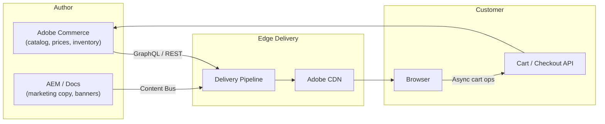

# EDS Commerce Storefront

The **EDS Commerce Storefront** is a pre-built set of blocks that turn an EDS site
into a fully functioning ecommerce storefront. The storefront is the **render and
delivery layer**; an Adobe Commerce (Magento) instance or a third-party commerce
API holds the catalog, prices, cart, and orders.

EDS gives you Lighthouse-100 product pages and instant-purge after price / inventory
changes; the commerce backend gives you SKUs, taxes, and orders. The split keeps each
side focused.

## Architecture



Two flows:

- **Render-time** -- product list and detail pages are pre-rendered from the catalog
  API and cached at the edge with surrogate keys per SKU.
- **Run-time** -- cart, checkout, and account live in the browser, talking directly
  to the commerce API. Edge caching does not apply.

## Block library

The Commerce Storefront ships a set of blocks under
[adobe-commerce/storefront-eds](https://github.com/adobe-commerce/storefront-eds):

| Block | Purpose |
|-------|---------|
| `product-list-page` | Category / search results page (PLP) |
| `product-details` | Product detail page (PDP) |
| `cart` | Mini-cart and full cart |
| `checkout` | Multi-step checkout (shipping, payment, review) |
| `account` | Customer account, addresses, orders |
| `commerce-search` | Live search bar with autocomplete |
| `recommendations` | "You may also like" widgets |

These behave like normal blocks -- folder under `/blocks/`, decorate function, scoped
CSS -- but most of them call the commerce API at decoration time.

## Talking to the catalog

Adobe Commerce exposes catalog data via **GraphQL**. The storefront blocks issue
GraphQL queries from the browser:

```javascript title="blocks/product-details/product-details.js"
const query = `
    query Product($sku: String!) {
        products(filter: { sku: { eq: $sku } }) {
            items {
                sku
                name
                price_range { minimum_price { final_price { value currency } } }
                description { html }
                media_gallery { url label }
            }
        }
    }
`;

export default async function decorate(block) {
    const sku = block.dataset.sku;
    const res = await fetch(`https://commerce.example.com/graphql`, {
        method: 'POST',
        headers: { 'Content-Type': 'application/json' },
        body: JSON.stringify({ query, variables: { sku } }),
    });
    const { data } = await res.json();
    renderProduct(block, data.products.items[0]);
}
```

For PLPs and PDPs, render server-side via the EDS pipeline by including the GraphQL
result in the source content fragment, so the catalog is **part of the cached HTML**.
The API call only fires when the block needs live state (current cart, dynamic
price overrides).

## Caching strategy

| Data | Cached where | Invalidation |
|------|--------------|--------------|
| PDP HTML | Edge (long TTL) | Surrogate key per SKU; commerce events purge on change |
| PLP HTML | Edge (medium TTL) | Surrogate key per category |
| Cart state | Browser (sessionStorage) + commerce API | Live |
| Customer account | Commerce API only (never cached) | Live |
| Recommendations | Edge (short TTL or async) | Time-based |

Surrogate keys are sent on the response and used by the [Admin API](./admin-api.mdx)
`/cache` endpoint to purge precisely when inventory or price changes.

## Authentication

Customer auth is **not** the EDS site's concern -- the commerce API issues tokens.
The storefront block stores the token in `sessionStorage` (or `localStorage` for
"remember me") and adds it to subsequent calls.

Sensitive operations (order history, address book) must run client-side against the
commerce API; never embed customer-specific data in cached HTML.

## SEO

Commerce sites live and die by SEO. The storefront blocks emit:

- Per-product `<title>`, meta description, canonical URL
- JSON-LD structured data (`Product`, `Offer`, `AggregateRating`)
- OG tags for social sharing
- A real `<h1>` per page (not built from JS)
- Sitemap entries via `helix-query.yaml`

Aim for the catalog to be fully crawlable without running JS.

## Performance

Two regressions to watch:

1. **PLP page weight** -- a list of 24 products with full image carousels can blow
   the Lighthouse budget. Use `loading="lazy"` on below-the-fold images and only
   render the first image of each product card.
2. **GraphQL waterfall** -- if a block fetches data in `decorate()` and another
   block downstream needs the same data, hoist the fetch into `scripts.js` so it
   runs once.

## Adobe Commerce vs third-party backends

The storefront blocks are written against Adobe Commerce GraphQL, but the layer is
thin enough to swap. Common substitutions:

| Backend | Adapter strategy |
|---------|------------------|
| Adobe Commerce | Use as-is |
| commercetools | Replace the GraphQL client with the commercetools SDK; map their `Product` to the Adobe shape |
| Shopify | Use the Storefront API; map `ProductVariant` to `Product` |
| Custom REST | Wrap each block's data fetch in a thin adapter |

## Common gotchas

| Symptom | Likely cause | Fix |
|---------|--------------|-----|
| PDP shows stale price | Surrogate key not configured | Set `Surrogate-Key: sku-{sku}` from the upstream and purge on price change |
| Cart icon shows wrong count | sessionStorage out of sync with API | Reconcile from API on every page load |
| PLP "out of stock" missing | Inventory not in cached HTML | Either render inventory in HTML and purge on change, or hide it client-side |
| GraphQL errors on every page | API origin not in CSP | Add the commerce origin to `Content-Security-Policy.connect-src` in `helix-config.yaml` |

## See also

- [Blocks](./blocks.mdx) -- the storefront blocks follow standard conventions
- [Customizing](./customizing.mdx) -- CSP for the commerce API origin
- [Admin API](./admin-api.mdx) -- surrogate-key purges
- Adobe docs: [Commerce Storefront on EDS](https://experienceleague.adobe.com/developer/commerce/storefront/)
