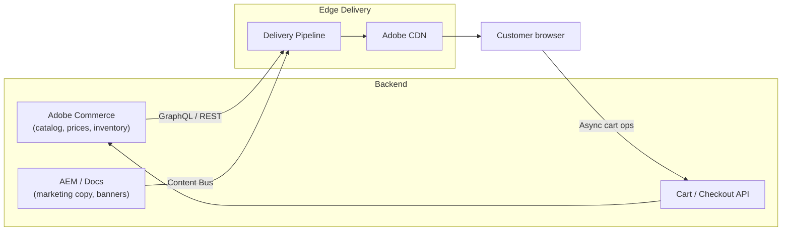

# EDS Commerce Storefront

The **EDS Commerce Storefront** is a pre-built set of blocks that turn an EDS site
into a fully functioning ecommerce storefront. The storefront is the **render and
delivery layer**; an Adobe Commerce (Magento) instance or a third-party commerce
API holds the catalog, prices, cart, and orders.

EDS gives you Lighthouse-100 product pages and instant-purge after price / inventory
changes; the commerce backend gives you SKUs, taxes, and orders. The split keeps each
side focused.

## Architecture


```mermaid
graph LR
    subgraph "Backend"
        Catalog["Adobe Commerce<br/>(catalog, prices, inventory)"]
        Content["AEM / Docs<br/>(marketing copy, banners)"]
        Cart["Cart / Checkout API"]
    end

    subgraph "Edge Delivery"
        Pipeline["Delivery Pipeline"]
        CDN["Adobe CDN"]
    end

    Browser["Customer browser"]

    Catalog -->|"GraphQL / REST"| Pipeline
    Content -->|"Content Bus"| Pipeline
    Pipeline --> CDN
    CDN --> Browser
    Browser -->|"Async cart ops"| Cart
    Cart --> Catalog
```

Two flows:

- **Catalog reads** - PLP and PDP pages are regular EDS documents (marketing copy, layout,
  a `product-details` or `product-list-page` block) served as cached HTML from the edge.
  The product data itself is fetched in the browser from the catalog API (Adobe Commerce
  Catalog Service). Because the price and stock come from the API at runtime, a price change
  does not require purging the page. If you pre-render product pages for SEO, republish
  those pages when the product data changes.
- **Cart and checkout** - the surrounding page shell (nav, footer, layout) is served from the
  same cached edge HTML as any other page. The cart/checkout state itself - items, totals,
  and provider-issued payment tokens - lives in the browser and talks directly to the commerce
  API. Raw card details should never touch your own JS or browser storage - collect them through
  provider-hosted fields (e.g. Adobe Commerce/Stripe Elements-style iframes) that tokenize directly
  with the payment provider. Any personalized cart/checkout response must be sent with
  `Cache-Control: private, no-store` and never cached at the edge.

## Blocks and drop-ins

Adobe's storefront starter is the
[aem-boilerplate-commerce](https://github.com/hlxsites/aem-boilerplate-commerce) repository.
It is a normal EDS project whose commerce blocks are thin wrappers around **drop-in
components** - prebuilt UI packages published on npm under `@dropins/storefront-*`
(for example `@dropins/storefront-cart`, `@dropins/storefront-checkout`,
`@dropins/storefront-pdp`, `@dropins/storefront-auth`, `@dropins/storefront-account`, and
`@dropins/storefront-order`).

Typical blocks in the boilerplate include:

| Block | Purpose |
|-------|---------|
| `product-list-page` | Category / search results page (PLP) |
| `product-details` | Product detail page (PDP) |
| `commerce-cart` / `commerce-mini-cart` | Full cart and mini-cart |
| `commerce-checkout` | Checkout (shipping, payment, review) |
| `commerce-login`, `commerce-create-account`, `commerce-account-*` | Customer auth and account pages |
| `product-recommendations` | "You may also like" widgets |

Block names change between boilerplate releases, so check the repository's `blocks/`
folder for the version you start from. These behave like normal blocks - folder under
`/blocks/`, decorate function, scoped CSS - but they mount a drop-in and call the commerce
APIs at decoration time. Endpoints, the environment ID, API key, and store view codes live
in the project's commerce configuration rather than in block code.

## Talking to the catalog

Adobe Commerce exposes catalog data via **GraphQL** (the Catalog Service for storefront
reads, the core Commerce GraphQL API for cart, checkout, and customer operations). The
drop-ins issue these queries from the browser. A hand-written block that refreshes live
price and stock looks like this:

```javascript title="blocks/product-details/product-details.js"
const query = `
    query Product($sku: String!) {
        products(filter: { sku: { eq: $sku } }) {
            items {
                sku
                price_range { minimum_price { final_price { value currency } } }
                stock_status
            }
        }
    }
`;

export default async function decorate(block) {
    const sku = block.dataset.sku;
    // name, description, and images are SEO-critical and already present in the
    // pre-rendered HTML (see below) - this call only refreshes genuinely dynamic
    // state: live price and stock.
    const res = await fetch(`https://commerce.example.com/graphql`, {
        method: 'POST',
        headers: { 'Content-Type': 'application/json' },
        body: JSON.stringify({ query, variables: { sku } }),
    });

    let payload;
    try {
        payload = res.ok ? await res.json() : null;
    } catch {
        payload = null;
    }

    const product = payload && !payload.errors
        ? payload.data?.products?.items?.[0]
        : null;

    if (!product) {
        renderUnavailable(block);
        return;
    }
    renderPriceAndStock(block, product);
}
```

For SEO-critical fields (title, description, canonical URL, JSON-LD), render them
into the cached HTML at author time rather than fetching client-side. Reserve the
runtime GraphQL call for genuinely dynamic state - live inventory, per-user pricing,
or personalised recommendations.

## Caching strategy

| Data | Cached where | Invalidation |
|------|--------------|--------------|
| PDP / PLP page HTML | Edge (EDS CDN) | Republish the page; with push invalidation the CDN is purged on publish |
| Product price, stock | Not in the page HTML - fetched from the Catalog Service at runtime | Live |
| Cart state | Browser storage + commerce API | Live |
| Customer account | Commerce API only (never cached) | Live |
| Recommendations | Fetched at runtime | Live / service-side |

EDS purges by **path** when content is published (or through the
[Admin API](./admin-api.mdx) `/cache` endpoint); there is no per-SKU surrogate-key purge you
drive from Commerce. Keep volatile data out of the cached HTML and fetch it at runtime
instead.

## Authentication

Customer auth is **not** the EDS site's concern - the commerce API issues tokens.
The auth drop-in stores the customer token client-side and adds it to subsequent calls.

Sensitive operations (order history, address book) must run client-side against the
commerce API; never embed customer-specific data in cached HTML.

## SEO

Commerce sites live and die by SEO. Aim for:

- Per-product `<title>`, meta description, canonical URL
- JSON-LD structured data (`Product`, `Offer`, `AggregateRating`)
- OG tags for social sharing
- A real `<h1>` per page (not built from JS)
- Sitemap entries for every product and category URL

Client-rendered PDPs are not fully crawlable without JS. If SEO matters, pre-render product
pages (Adobe provides an App Builder-based pre-rendering approach for the storefront) so the
product name, description, and structured data are in the delivered HTML.

## Performance

Two regressions to watch:

1. **PLP page weight** - a list of 24 products with full image carousels can blow
   the Lighthouse budget. Use `loading="lazy"` on below-the-fold images and only
   render the first image of each product card.
2. **GraphQL waterfall** - if a block fetches data in `decorate()` and another
   block downstream needs the same data, hoist the fetch into `scripts.js` so it
   runs once.

## Adobe Commerce vs third-party backends

The storefront blocks are written against Adobe Commerce GraphQL, but the layer is
thin enough to swap. Common substitutions:

| Backend | Adapter strategy |
|---------|------------------|
| Adobe Commerce | Use as-is |
| commercetools | Replace the GraphQL client with the commercetools SDK; map their `Product` to the Adobe shape |
| Shopify | Use the Storefront API; map `ProductVariant` to `Product` |
| Custom REST | Wrap each block's data fetch in a thin adapter |

## Common gotchas

| Symptom | Likely cause | Fix |
|---------|--------------|-----|
| PDP shows stale price | Price rendered into cached HTML | Fetch price/stock at runtime, or republish (and purge) the page when it changes |
| Cart icon shows wrong count | Client cache out of sync with API | Reconcile from API on every page load |
| PLP "out of stock" missing | Inventory not in cached HTML | Either render inventory in HTML and republish on change, or fetch it client-side |
| GraphQL errors on every page | API origin blocked by your CSP | Add the commerce origins to `connect-src` in the `Content-Security-Policy` custom header of the site configuration |

## See also

- [Blocks](./blocks.mdx) - the storefront blocks follow standard conventions
- [Customizing](./customizing.mdx) - custom response headers such as a CSP for the commerce API origins
- [Admin API](./admin-api.mdx) - publishing and cache purges
- Adobe docs: [Commerce Storefront on EDS](https://experienceleague.adobe.com/developer/commerce/storefront/)
