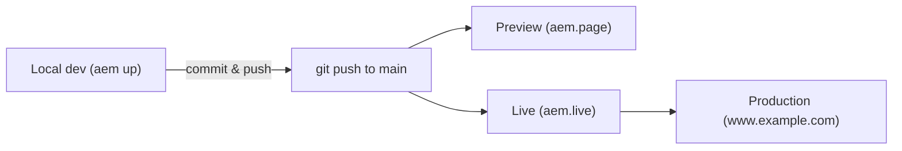

# Development workflow

EDS embraces a **GitHub-first** workflow. There are no Maven builds, no Cloud Manager
pipelines, and no OSGi bundles -- pushing to `main` updates preview and live within
seconds.

## Project structure

Most projects follow this layout (matches the [aem-boilerplate](https://github.com/adobe/aem-boilerplate)):

```
my-eds-project/
├── blocks/              # Block JS and CSS (one folder per block)
│   ├── hero/
│   ├── cards/
│   └── ...
├── scripts/             # Global scripts
│   ├── aem.js           # EDS runtime (provided)
│   ├── scripts.js       # Global initialisation
│   └── delayed.js       # Deferred scripts (analytics, etc.)
├── styles/              # Global styles
│   ├── styles.css       # Main stylesheet
│   ├── lazy-styles.css  # Below-the-fold styles
│   └── fonts.css        # Font declarations
├── tools/               # Sidekick Library, dev tools
├── icons/               # SVG icons referenced by :icon-name:
├── plugins/             # Optional shared plugins
├── head.html            # Custom <head> content
├── 404.html             # Custom 404 page
├── fstab.yaml           # Content source configuration
├── paths.yaml           # URL mapping / redirects
└── helix-query.yaml     # Indexer config (sitemap, search)
```

## Key files

| File | Purpose |
|------|---------|
| `fstab.yaml` | Maps content sources (SharePoint URL, Google Drive ID, or AEM instance) to the project |
| `paths.yaml` | URL rewriting and redirect rules |
| `helix-query.yaml` | Defines indexes that feed sitemaps, search, and dynamic pages |
| `helix-config.yaml` | helix5 site config -- response headers, redirects, CDN options |
| `head.html` | Additional `<head>` tags (meta, preload, third-party scripts) |
| `scripts/aem.js` | EDS runtime: block loading, lazy loading, LCP optimisation |
| `scripts/scripts.js` | Your global initialisation code |
| `scripts/delayed.js` | Scripts loaded after page interaction (analytics, chat widgets) |

See [Customizing](./customizing.mdx) for `head.html`, `scripts.js`, `aem.js` overrides,
and the `helix-config.yaml` response-header config.

## fstab.yaml

```yaml title="fstab.yaml"
mountpoints:
  /: https://adobe-my.sharepoint.com/:f:/g/personal/user/EaBC123...
```

For Universal Editor:

```yaml title="fstab.yaml"
mountpoints:
  /: https://author-p12345-e67890.adobeaemcloud.com/
```

You can mount different sources at different paths:

```yaml title="fstab.yaml"
mountpoints:
  /: https://adobe-my.sharepoint.com/...                  # marketing pages
  /products/: https://author-p12345-e67890.adobeaemcloud.com/  # UE-authored
  /blog/: https://drive.google.com/drive/folders/...      # blog
```

## paths.yaml

Rewrites and redirects evaluated at the edge:

```yaml title="paths.yaml"
mappings:
  - /about-us:/company/about
  - /docs/v1/(.*):/docs/legacy/$1

includes:
  - /sitemap.xml
```

`mappings` rewrites the path on the way through the pipeline; the URL in the browser
stays the same. Use `redirects.json` (an authored spreadsheet) for actual HTTP
redirects.

## Local development

```bash
# Install the AEM CLI globally
npm install -g @adobe/aem-cli

# Or with pnpm
pnpm add -g @adobe/aem-cli

# Start local dev server in the project root
aem up
```

`aem up` starts a local proxy at `http://localhost:3000` that serves blocks / scripts /
styles from the local filesystem and fetches content from the configured content
source. Live-reload is automatic on file save.

Useful flags:

- `aem up --port 4000` -- pick a different port
- `aem up --no-open` -- don't open a browser
- `aem import` -- bootstrap content for migration projects

## Deployment: git push to production



There is no build step for EDS itself. Pushing to `main` instantly updates preview and
live; the CDN picks up changes within seconds. CI may still run lint, tests, or
[Lighthouse checks](./performance.mdx), but those are convenience -- not gates that
block delivery.

Feature branches give you a self-served preview at
`https://{branch}--{repo}--{org}.aem.page/` -- ideal for PR review.

## Local block development tips

- **Edit `blocks/<name>/<name>.css`** and refresh -- styles hot-reload.
- **Edit `blocks/<name>/<name>.js`** and refresh -- decoration runs again.
- **Use `console.log(block)`** inside `decorate(block)` to inspect the table-derived DOM
  before deciding what to query.
- **Run a separate browser profile** with the [Sidekick extension](./sidekick.mdx)
  installed, pointed at the live preview, so you can compare local and live side-by-side.
- **Validate against [aem.live](https://www.aem.live/)** -- the boilerplate blocks are
  the canonical reference implementations.

## See also

- [Customizing](./customizing.mdx)
- [Blocks](./blocks.mdx)
- [Sidekick](./sidekick.mdx)
- [Admin API](./admin-api.mdx) -- automating preview / publish in CI
