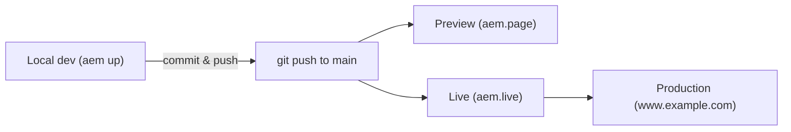

# Development workflow

EDS embraces a **GitHub-first** workflow. There are no Maven builds, no Cloud Manager
pipelines, and no OSGi bundles - pushing to `main` updates preview and live within
seconds.

## Project structure

Most projects follow this layout (matches the [aem-boilerplate](https://github.com/adobe/aem-boilerplate)):

```text
my-eds-project/
├── blocks/              # Block JS and CSS (one folder per block)
│   ├── hero/
│   ├── cards/
│   └── ...
├── scripts/             # Global scripts
│   ├── aem.js           # EDS runtime (provided)
│   ├── scripts.js       # Global initialisation
│   └── delayed.js       # Deferred scripts (analytics, etc.)
├── styles/              # Global styles
│   ├── styles.css       # Main stylesheet
│   ├── lazy-styles.css  # Below-the-fold styles
│   └── fonts.css        # Font declarations
├── tools/               # Sidekick Library, dev tools
├── icons/               # SVG icons referenced by :icon-name:
├── plugins/             # Optional shared plugins
├── head.html            # Custom <head> content
├── 404.html             # Custom 404 page
├── fstab.yaml           # Content source configuration
├── paths.json           # AEM path mappings (Universal Editor / AEM-authored sites)
├── helix-query.yaml     # Query index definitions
└── helix-sitemap.yaml   # Sitemap definitions (optional)
```

## Key files

| File | Purpose |
|------|---------|
| `fstab.yaml` | Maps the content source (SharePoint folder, Google Drive folder, or AEM author) to the project |
| `paths.json` | Maps AEM repository paths to public URLs and lists which AEM paths may be published (AEM-authored sites) |
| `helix-query.yaml` | Defines query indexes that feed search, lists, and dynamic pages |
| `helix-sitemap.yaml` | Defines generated sitemaps (optional; a default sitemap is derived from the index) |
| `head.html` | Additional `<head>` tags (meta, preload, third-party scripts) |
| `scripts/aem.js` | EDS runtime: block loading, section loading, LCP optimisation |
| `scripts/scripts.js` | Your global initialisation code |
| `scripts/delayed.js` | Scripts loaded about three seconds after page load (analytics, chat widgets) |

Site-level settings such as custom response headers, CDN configuration, access control, and
Sidekick configuration are **not** repository files. They live in the site configuration, managed
through the [Configuration Service](./admin-api.mdx#config---configuration-service) (or, in older
document-based projects, in `.helix/config` and `.helix/headers` spreadsheets). See
[Customizing](./customizing.mdx) for `head.html`, `scripts.js`, `aem.js` overrides, and response headers.

## fstab.yaml

```yaml title="fstab.yaml"
mountpoints:
  /: https://adobe-my.sharepoint.com/:f:/g/personal/user/EaBC123...
```

For Universal Editor (AEM-authored) projects, the mountpoint points at the EDS delivery servlet on
AEM author, as in the [aem-boilerplate-xwalk](https://github.com/adobe-rnd/aem-boilerplate-xwalk)
template:

```yaml title="fstab.yaml"
mountpoints:
  /:
    url: "https://author-p12345-e67890.adobeaemcloud.com/bin/franklin.delivery/{org}/{repo}/main"
    type: "markup"
    suffix: ".html"
```

Current (helix5 / aem.live) sites use a **single** `/` mountpoint - one content source per site.
If different parts of a website are authored in different sources, set them up as separate
sites (for example with the repoless setup that shares one code repository across sites) and
route between them at the CDN.

## paths.json

AEM-authored (Universal Editor) projects use `paths.json` to map AEM repository paths to public
URLs and to declare which AEM paths may be published to Edge Delivery:

```json title="paths.json"
{
    "mappings": [
        "/content/mysite/:/",
        "/content/mysite/configuration:/.helix/config.json",
        "/content/mysite/metadata:/metadata.json"
    ],
    "includes": [
        "/content/mysite/"
    ]
}
```

Each mapping is `<AEM path>:<public path>`. `paths.json` is not a runtime rewrite engine for
document-based sites - use `redirects.json` (an authored spreadsheet) for HTTP redirects.

## Local development

```bash
# Install the AEM CLI globally
npm install -g @adobe/aem-cli

# Or with pnpm
pnpm add -g @adobe/aem-cli

# Start local dev server in the project root
aem up
```

`aem up` starts a local proxy at `http://localhost:3000` that serves blocks / scripts /
styles from the local filesystem and fetches content from the configured content
source. Live-reload is automatic on file save.

Useful flags:

- `aem up --port 4000` - pick a different port
- `aem up --no-open` - don't open a browser
- `aem import` - bootstrap content for migration projects

## Deployment: git push to production


```mermaid
graph LR
    Dev["Local dev (aem up)"]
    Push["git push to main"]
    Preview["Preview (aem.page)"]
    Live["Live (aem.live)"]
    Prod["Production (www.example.com)"]

    Dev -->|commit & push| Push
    Push --> Preview
    Push --> Live
    Live --> Prod
```

There is no build step for EDS itself. Pushing to `main` instantly updates preview and
live; the CDN picks up changes within seconds. CI may still run lint, tests, or
[Lighthouse checks](./performance.mdx), but those are convenience - not gates that
block delivery.

Feature branches give you a self-served preview at
`https://{branch}--{repo}--{org}.aem.page/` - ideal for PR review.

## Local block development tips

- **Edit `blocks/<name>/<name>.css`** and refresh - styles hot-reload.
- **Edit `blocks/<name>/<name>.js`** and refresh - decoration runs again.
- **Use `console.log(block)`** inside `decorate(block)` to inspect the table-derived DOM
  before deciding what to query.
- **Run a separate browser profile** with the [Sidekick extension](./sidekick.mdx)
  installed, pointed at the live preview, so you can compare local and live side-by-side.
- **Validate against [aem.live](https://www.aem.live/)** - the boilerplate blocks are
  the canonical reference implementations.

## See also

- [Customizing](./customizing.mdx)
- [Blocks](./blocks.mdx)
- [Sidekick](./sidekick.mdx)
- [Admin API](./admin-api.mdx) - automating preview / publish in CI
